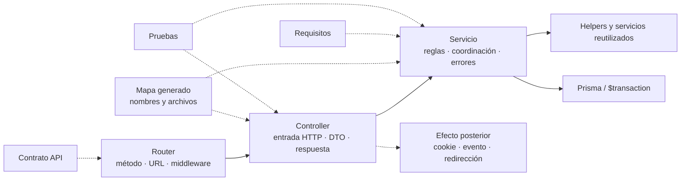
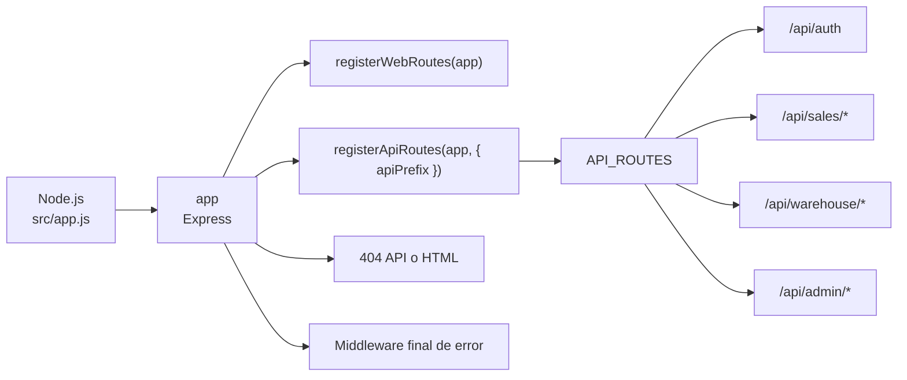
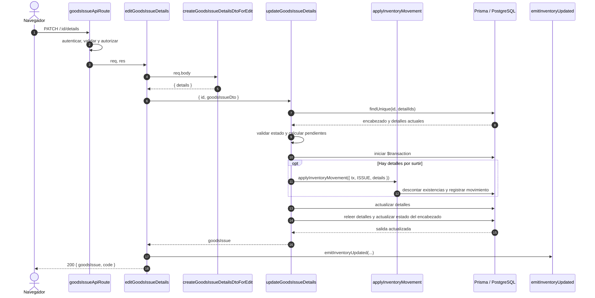
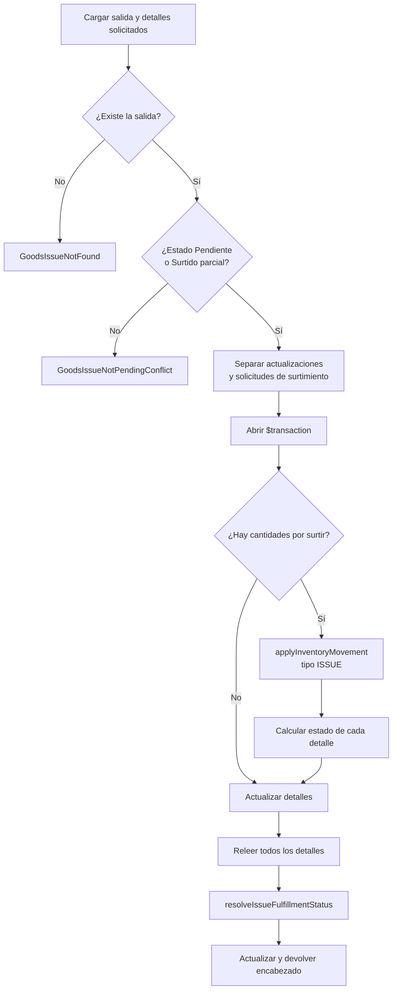

# Documentación técnica del backend

## Propósito y alcance

Este documento aplica la [guía técnica común](technical-code-documentation.md) al código
que se ejecuta en Node.js: `src/routes`, `src/middleware`, `src/controllers`, `src/dtos`,
`src/services`, `src/repository` y Prisma. El contrato consumible de cada endpoint
permanece en el [contrato API](../data/api-contract.md); aquí se explican nombres,
responsabilidades, colaboraciones y límites transaccionales de la implementación.

## Cómo documentar controladores y servicios

El mapa generado mantiene inventarios separados de símbolos exportados por
[controladores](../generated/code-map.md#símbolos-exportados-por-controladores) y
[servicios](../generated/code-map.md#símbolos-exportados-por-servicios). Esos inventarios
responden **qué existe y dónde**; esta guía define cómo explicar **qué contrato cumple y
por qué colabora con otros elementos**. No se crea una página por función ni se copia el
cuerpo completo del módulo.

### Ficha de un controlador

Un controlador se documenta cuando adapta un contrato que no resulta evidente por su
nombre, coordina más de un servicio o produce efectos posteriores. La ficha usa:

| Campo | Qué se registra |
| --- | --- |
| Nombre y archivo | Nombre exportado literal y enlace a `src/controllers/...`. |
| Ruta que lo invoca | Método, URL completa y enlace a la ficha del contrato API. |
| Entrada HTTP | Uso de `req.params`, `req.query`, `req.body`, `req.user` y archivos, sin repetir todo el esquema del validador. |
| Adaptación | DTO, normalización, paginación o transformación aplicada antes del servicio. |
| Servicio delegado | Nombre exportado del servicio y argumentos que construye el controlador. |
| Respuesta | Código HTTP y forma de éxito; los errores permanecen en el mecanismo central. |
| Efectos posteriores | Evento, cookie, redirección o cabecera que ocurre después del servicio. |
| Evidencia | Prueba del controlador o integración HTTP que verifica el contrato. |

El controlador no se presenta como propietario de una regla que vive en el servicio.
Por ejemplo, `editGoodsIssueDetails` adapta la petición, llama a
`updateGoodsIssueDetails` y después publica `inventory-updated`; el cálculo de cantidades
y estados sigue perteneciendo al servicio.

### Ficha de un servicio

Un servicio se documenta cuando contiene una regla de dominio, una transacción, efectos
en varios modelos, errores específicos o un contrato reutilizado por más de un
controlador.

| Campo | Qué se registra |
| --- | --- |
| Nombre, archivo y firma | Export literal y forma de sus argumentos; se aclaran opcionales y valores predeterminados relevantes. |
| Propósito | Resultado de dominio que produce, no una traducción palabra por palabra del nombre. |
| Precondiciones | Entidades, estados, permisos ya resueltos o datos que deben existir antes de escribir. |
| Retorno | Objeto, colección o ausencia de valor que reciben sus consumidores. |
| Errores de dominio | Clases que puede propagar y condición observable que las origina. |
| Persistencia y atomicidad | Modelos afectados, uso de `getDb()` y límite de `$transaction`; se indica qué efecto queda fuera. |
| Colaboradores | Helpers o servicios reutilizados y la razón de la colaboración. |
| Evidencia | Pruebas unitarias o de base de datos y brechas registradas. |
| Mantenimiento | Cambio de estado, firma, colaborador o transacción que obliga a revisar la ficha o diagrama. |

Una firma clara y privada no necesita ficha ni JSDoc. Para un contrato exportado
reutilizable o complejo puede añadirse JSDoc junto al código si parámetros, retorno o
errores no son deducibles por el uso. La explicación de negocio o el diagrama permanece
en Markdown para evitar comentarios extensos que se desactualicen dentro del módulo.

### Relación entre ambas capas



Las flechas continuas muestran responsabilidades de ejecución; las discontinuas enlazan
evidencia documental. El diagrama no afirma que todo controlador tenga un efecto
posterior ni que toda lectura necesite una transacción.

### Cuándo necesita un diagrama específico

Una tabla y un bloque breve son suficientes para un CRUD que sólo adapta y delega. Se
agrega una secuencia o actividad específica si el controlador coordina varios servicios,
si existen bifurcaciones relevantes, si la transacción atraviesa colaboradores o si un
efecto ocurre deliberadamente después del commit. El diagrama usa nombres exportados
reales y declara el evento que obliga a actualizarlo.

No se genera automáticamente esa semántica desde imports: el inventario puede comprobar
que `controller` y `service` existen, pero no puede determinar de forma segura quién es
propietario de una regla, qué error es contractual ni dónde debe ocurrir un efecto.

## Referencia técnica del código implementado

### Arranque y registro de rutas

Éstos son los nombres que permiten seguir desde el proceso Node.js hasta un router de
dominio. La tabla describe contratos observables en el código, no nombres conceptuales
inventados para el documento.

| Archivo y nombre | Tipo | Responsabilidad |
| --- | --- | --- |
| [`src/app.js`](../../src/app.js), `app` | Instancia Express | Configura vistas, analizadores de cuerpo, archivos públicos, logging, auditoría, rutas y manejadores finales de error. |
| [`src/app.js`](../../src/app.js), `server` | Servidor HTTP | Envuelve `app`, comparte el servidor con Socket.IO y escucha en `PORT`. |
| [`src/routes/web/index.js`](../../src/routes/web/index.js), `registerWebRoutes(app)` | Función exportada | Monta las rutas HTML antes del manejador 404 y de las rutas API. |
| [`src/routes/api/index.js`](../../src/routes/api/index.js), `API_ROUTES` | Configuración privada | Relaciona el prefijo de cada dominio con su instancia de `router`. |
| [`src/routes/api/index.js`](../../src/routes/api/index.js), `registerApiRoutes(app, options)` | Función exportada | Recorre `API_ROUTES` y monta cada router bajo `/api` o el `apiPrefix` recibido. |
| [`src/app.js`](../../src/app.js), middleware final de error | Middleware Express | Convierte `AppError` en su respuesta conocida y registra errores no controlados antes de responder `500`. |

El bloque central que evita repetir llamadas a `app.use` por dominio es:

```js
export const registerApiRoutes = (app, { apiPrefix = '/api' } = {}) => {
    API_ROUTES.forEach(([path, router]) => app.use(`${apiPrefix}${path}`, router));
};
```

Este fragmento procede de [`src/routes/api/index.js`](../../src/routes/api/index.js).
La lista completa y regenerable de métodos y URLs se consulta en el
[mapa generado del código](../generated/code-map.md); no se duplica aquí porque la
cantidad de endpoints forma parte de su título y puede cambiar.



Las flechas expresan registro durante el arranque, no una llamada por cada petición. El
diagrama se revisa si cambia el orden de montaje en `src/app.js`, el contrato de
`registerApiRoutes` o las áreas de primer nivel de `API_ROUTES`.

### Ejemplo de dominio: salidas de almacén

El router [`goodsIssueApiRoute.js`](../../src/routes/api/warehouse/goodsIssueApiRoute.js)
expone seis operaciones. Sus nombres permiten localizar de forma inequívoca el método
que adapta HTTP y el método que aplica las reglas principales.

| Método y ruta completa | Middleware específico después de autenticar | Controlador | Servicio principal |
| --- | --- | --- | --- |
| `GET /api/warehouse/goods-issues` | permiso `GOODS_ISSUES_MANAGE` | `getAllGoodsIssues` | `findAllGoodsIssues` |
| `POST /api/warehouse/goods-issues` | `goodsIssueValidation` → `validate` → permiso `GOODS_ISSUES_MANAGE` | `registerGoodsIssue` | `createGoodsIssue` |
| `PATCH /api/warehouse/goods-issues/:id` | `goodsIssueUpdateValidation` → `validate` → permiso `GOODS_ISSUES_MANAGE` | `editGoodsIssue` | `updateGoodsIssue` |
| `PATCH /api/warehouse/goods-issues/:id/header` | `goodsIssueHeaderValidation` → `validate` → permiso `GOODS_ISSUES_MANAGE` | `editGoodsIssueHeader` | `updateGoodsIssueHeader` |
| `PATCH /api/warehouse/goods-issues/:id/details` | `goodsIssueDetailsValidation` → `validate` → permiso `GOODS_ISSUE_DETAILS_MANAGE` | `editGoodsIssueDetails` | `updateGoodsIssueDetails` |
| `PATCH /api/warehouse/goods-issues/:id/details/:detailId/returns` | `goodsIssueReturnValidation` → `validate` → permiso `GOODS_ISSUE_DETAILS_MANAGE` | `registerGoodsIssueDetailReturn` | `returnGoodsIssueDetail` |

Todas comienzan con `verifyApiTokenRequired`. Los validadores viven en
[`goodsIssueValidations.js`](../../src/validators/forms/goodsIssueValidations.js), los
adaptadores HTTP en
[`goodsIssueController.js`](../../src/controllers/api/warehouse/goodsIssueController.js)
y las operaciones principales en
[`goodsIssueService.js`](../../src/services/warehouse/goodsIssues/goodsIssueService.js).
La devolución tiene su responsabilidad separada en
[`goodsIssueReturnService.js`](../../src/services/warehouse/goodsIssues/detailReturns/goodsIssueReturnService.js).

### Qué hace cada función del flujo de surtimiento

La operación de detalles es representativa porque no sólo actualiza filas: puede
descontar inventario y recalcula estados dentro de una transacción.

| Función | Entrada y salida | Efecto o decisión principal |
| --- | --- | --- |
| `goodsIssueDetailsValidation` | `req.body` → errores de `express-validator` | Declara la forma mínima de los detalles antes de entrar al controlador. |
| `validate` | resultado de validación → `next()` o respuesta de error | Interrumpe la cadena cuando la petición no cumple las reglas declaradas. |
| `editGoodsIssueDetails(req, res)` | petición HTTP → JSON `200` | Construye el DTO, normaliza strings vacíos, llama al servicio y emite `inventory-updated` sólo después de que el servicio termina. |
| `createGoodsIssueDetailsDtoForEdit(body)` | cuerpo externo → `{ details }` | Limita los campos que pasan desde transporte hacia el servicio. |
| `updateGoodsIssueDetails({ id, goodsIssueDto })` | identificador y DTO → salida actualizada | Verifica documento, estado y detalles; calcula pendientes; coordina movimiento, actualización y estado global. |
| `applyInventoryMovement({ tx, reference, details, movementType })` | cliente transaccional y cantidades → movimiento | Aplica el movimiento `ISSUE` usando la misma transacción recibida por el servicio. |
| `resolveGoodsIssueDetailFulfillmentStatusName(detail)` | cantidades del detalle → nombre de estado | Decide el estado de cumplimiento de cada detalle actualizado. |
| `resolveIssueFulfillmentStatus(details)` | resumen de detalles → nombre de estado | Decide el estado de cumplimiento del encabezado después de releer sus detalles. |
| `getDb(tx)` | cliente opcional → `tx` o Prisma global | Permite que helpers y servicios participen en la transacción existente sin crear otra conexión. |

El controlador conserva la adaptación HTTP y no replica la regla de surtimiento:

```js
const goodsIssueDto = createGoodsIssueDetailsDtoForEdit(req.body);
const sanitizedGoodsIssueDto = sanitizeEmptyStrings(goodsIssueDto);

const goodsIssue = await updateGoodsIssueDetails({
    goodsIssueDto: sanitizedGoodsIssueDto,
    id: req.params.id
});
```

Este bloque se mantiene en
[`editGoodsIssueDetails`](../../src/controllers/api/warehouse/goodsIssueController.js).
La regla transaccional permanece en el servicio; moverla al controlador rompería la
separación vigente entre transporte y dominio.

### Secuencia específica de `updateGoodsIssueDetails`



La transacción incluye el movimiento, los detalles y el estado del encabezado. La
emisión Socket ocurre después de resolverla y no forma parte de la atomicidad en base de
datos. Si no hay un detalle marcado para surtir, el bloque opcional se omite, pero se
conservan las actualizaciones de conversión solicitadas.

### Bloques de decisión dentro de la transacción



Este diagrama es específico del algoritmo observable de
`updateGoodsIssueDetails`; no reemplaza el diagrama funcional de requisitos. Debe
revisarse si cambian los estados admitidos, el cálculo de cantidades, el límite
transaccional o el orden movimiento → detalles → encabezado.

### Evidencia ejecutable localizada

Las pruebas unitarias del adaptador HTTP viven en
[`tests/unit/controllers/api/warehouse/goodsIssueControllerTest.js`](../../tests/unit/controllers/api/warehouse/goodsIssueControllerTest.js).
La cobertura global y cualquier brecha del servicio se declaran en el
[plan de pruebas](../testing/test-plan.md); la existencia de este diagrama no se toma
como prueba de atomicidad ni de comportamiento.
