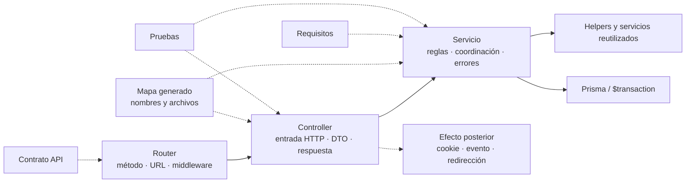

# 2. Cómo documentar controladores y servicios

El mapa generado mantiene inventarios separados de símbolos exportados por
[controladores](../../generated/code-map.md#símbolos-exportados-por-controladores) y
[servicios](../../generated/code-map.md#símbolos-exportados-por-servicios). Esos inventarios
responden **qué existe y dónde**; esta guía define cómo explicar **qué contrato cumple y
por qué colabora con otros elementos**. No se crea una página por función ni se copia el
cuerpo completo del módulo.

### Ficha de un controlador

Un controlador se documenta cuando adapta un contrato que no resulta evidente por su
nombre, coordina más de un servicio o produce efectos posteriores. La ficha usa:

| Campo | Qué se registra |
| --- | --- |
| Nombre y archivo | Nombre exportado literal y enlace a `src/controllers/...`. |
| Ruta que lo invoca | Método, URL completa y enlace a la ficha del contrato API. |
| Entrada HTTP | Uso de `req.params`, `req.query`, `req.body`, `req.user` y archivos, sin repetir todo el esquema del validador. |
| Adaptación | DTO, normalización, paginación o transformación aplicada antes del servicio. |
| Servicio delegado | Nombre exportado del servicio y argumentos que construye el controlador. |
| Respuesta | Código HTTP y forma de éxito; los errores permanecen en el mecanismo central. |
| Efectos posteriores | Evento, cookie, redirección o cabecera que ocurre después del servicio. |
| Evidencia | Prueba del controlador o integración HTTP que verifica el contrato. |

El controlador no se presenta como propietario de una regla que vive en el servicio.
Por ejemplo, `editGoodsIssueDetails` adapta la petición, llama a
`updateGoodsIssueDetails` y después publica `inventory-updated`; el cálculo de cantidades
y estados sigue perteneciendo al servicio.

### Ficha de un servicio

Un servicio se documenta cuando contiene una regla de dominio, una transacción, efectos
en varios modelos, errores específicos o un contrato reutilizado por más de un
controlador.

| Campo | Qué se registra |
| --- | --- |
| Nombre, archivo y firma | Export literal y forma de sus argumentos; se aclaran opcionales y valores predeterminados relevantes. |
| Propósito | Resultado de dominio que produce, no una traducción palabra por palabra del nombre. |
| Precondiciones | Entidades, estados, permisos ya resueltos o datos que deben existir antes de escribir. |
| Retorno | Objeto, colección o ausencia de valor que reciben sus consumidores. |
| Errores de dominio | Clases que puede propagar y condición observable que las origina. |
| Persistencia y atomicidad | Modelos afectados, uso de `getDb()` y límite de `$transaction`; se indica qué efecto queda fuera. |
| Colaboradores | Helpers o servicios reutilizados y la razón de la colaboración. |
| Evidencia | Pruebas unitarias o de base de datos y brechas registradas. |
| Mantenimiento | Cambio de estado, firma, colaborador o transacción que obliga a revisar la ficha o diagrama. |

Una firma clara y privada no necesita ficha ni JSDoc. Para un contrato exportado
reutilizable o complejo puede añadirse JSDoc junto al código si parámetros, retorno o
errores no son deducibles por el uso. La explicación de negocio o el diagrama permanece
en Markdown para evitar comentarios extensos que se desactualicen dentro del módulo.

### Relación entre ambas capas

Las flechas continuas muestran responsabilidades de ejecución; las discontinuas enlazan
evidencia documental. El diagrama no afirma que todo controlador tenga un efecto
posterior ni que toda lectura necesite una transacción.

### Cuándo necesita un diagrama específico

Una tabla y un bloque breve son suficientes para un CRUD que sólo adapta y delega. Se
agrega una secuencia o actividad específica si el controlador coordina varios servicios,
si existen bifurcaciones relevantes, si la transacción atraviesa colaboradores o si un
efecto ocurre deliberadamente después del commit. El diagrama usa nombres exportados
reales, se vincula con un solo `CU-*` y declara el evento que obliga a actualizarlo. La
reutilización de helpers o reglas no autoriza a fusionar casos: si dos operaciones
requieren vista técnica, cada una muestra sus participantes, modelos, errores y endpoint.

No se genera automáticamente esa semántica desde imports: el inventario puede comprobar
que `controller` y `service` existen, pero no puede determinar de forma segura quién es
propietario de una regla, qué error es contractual ni dónde debe ocurrir un efecto.
