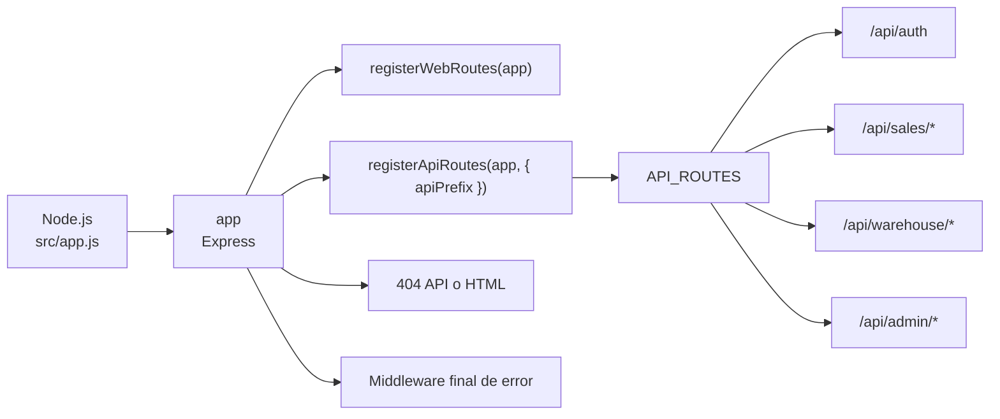
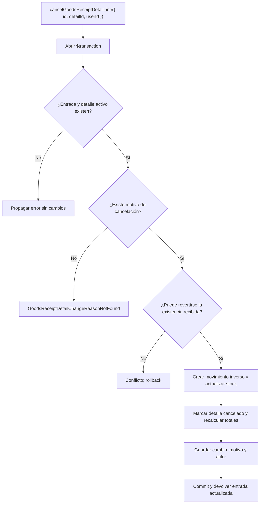
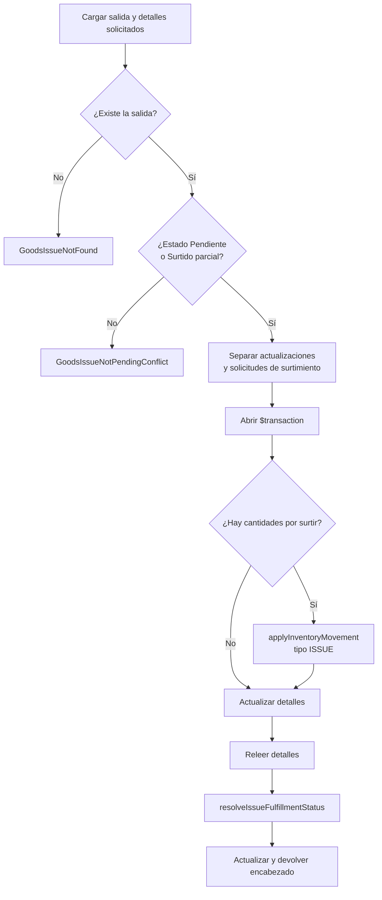
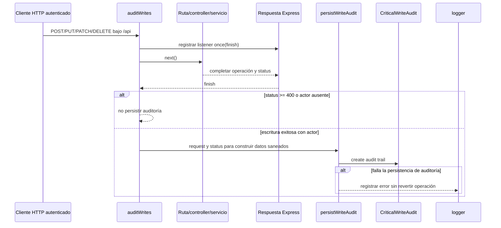
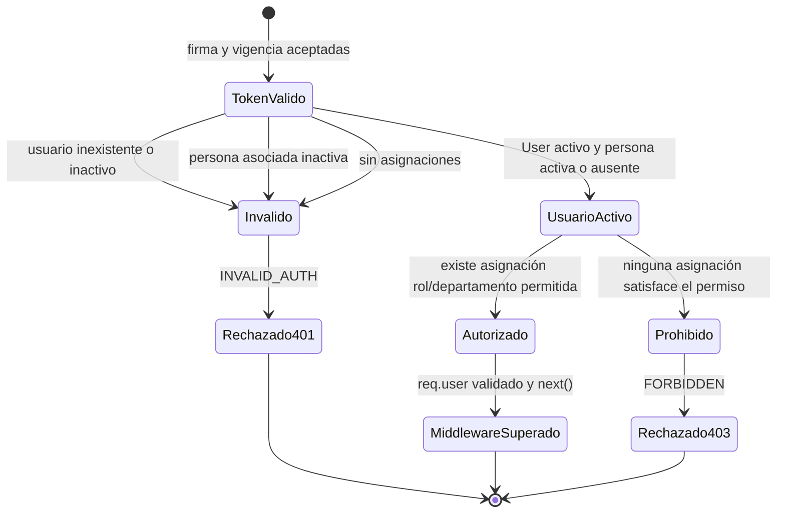
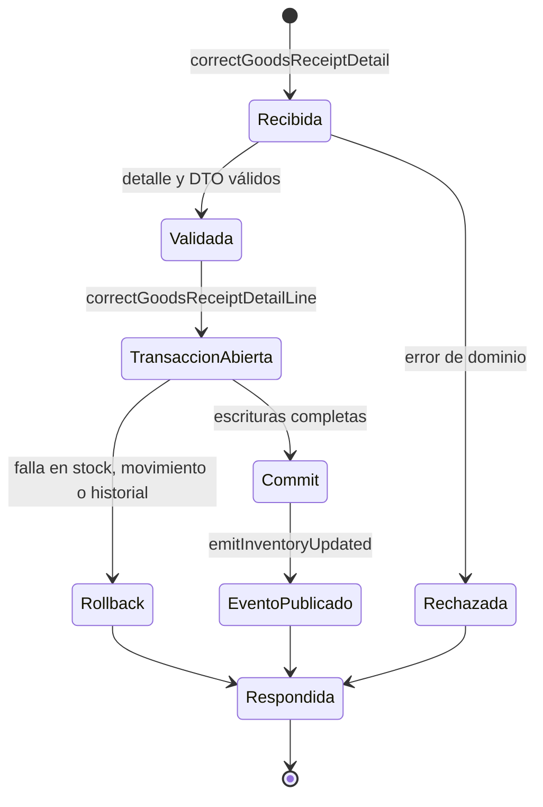

# 6. Vistas técnicas aplicadas

### Relación entre la colección canónica y las vistas adicionales

La columna **Diagrama aplicado** de la matriz anterior enlaza los 73 recorridos
`DIA-BE-CU-*` de `backend-code-sequences/index.md`. Esa colección es propietaria del
orden ruta → controller → servicio → persistencia o efecto. Este documento es propietario
de las fichas, los criterios de documentación y las vistas que contestan una pregunta
adicional. Una vista adicional complementa la secuencia enlazada; no la reemplaza, no
amplía su cobertura y no obliga a copiarla.

La revisión de las vistas existentes produjo esta decisión:

| Vista conservada aquí | Pregunta adicional y razón | Conexión e impacto |
| --- | --- | --- |
| Registro de rutas | ¿Cómo se monta la superficie Express completa? Es transversal y estructural, no el recorrido de un `CU-*`. | Se conecta con `src/app.js`, `API_ROUTES`, el mapa generado y la vista de superficie de `code-diagrams/index.md`. Si cambia el montaje se revisan las entradas de los `DIA-BE-CU-*` afectados, no sus reglas de dominio. |
| `DIA-BE-ACT-002` · `CU-ENT-05` | ¿Qué decisiones provocan rechazo, rollback o cancelación? La actividad prioriza ramas y errores que una secuencia lineal hace menos visibles. | Complementa `DIA-BE-CU-ENT-05`; comparte servicio y transacción, pero no altera el orden canónico. Un cambio de condición exige revisar ambas vistas y la máquina normativa si cambia un estado de negocio. |
| `DIA-BE-ACT-001` · `CU-SAL-05` | ¿Cómo se clasifican actualizaciones y surtimientos y qué errores impiden continuar? | Complementa `DIA-BE-CU-SAL-05` y referencia la máquina de estados de requisitos. Cambios de participantes actualizan la secuencia; cambios de ramas actualizan la actividad; cambios de estados también actualizan requisitos. |
| `DIA-BE-SEQ-006` · `RN-008` | ¿Cuándo se ejecuta la auditoría transversal y puede revertir la operación? Se conserva porque cruza todas las escrituras y establece la garantía *best effort*, no porque detalle otro caso. | Se conecta con el middleware de auditoría y con todo `DIA-BE-CU-*` de escritura mediante el evento `finish`. Un cambio en auditoría no modifica la transacción de cada caso, salvo que deje de ser posterior o pase a ser obligatoria. |
| `DIA-BE-TEC-EST-AUT-01` | ¿Qué estado efectivo debe conservar una cuenta para atravesar `authorizeUserApi` o `authorizeUserWeb`? | Complementa las secuencias autenticadas: distingue un token válido de un usuario activo y autorizado sin repetir cada ruta protegida. |
| `DIA-BE-TEC-EST-CU-ENT-04` | ¿Cuál es el ciclo técnico de la corrección entre recepción, commit/rollback, evento y respuesta? | Complementa `DIA-BE-CU-ENT-04`. No sustituye los estados funcionales de requisitos; sólo obliga a revisar la secuencia si cambia el límite transaccional o la publicación posterior. |

Las antiguas secuencias selectivas de autenticación, ajustes, entrada, corrección,
surtimientos y devoluciones no se mantienen aquí: respondían la misma pregunta que sus
`DIA-BE-CU-*`. Su detalle quedó consolidado en la colección canónica. Así, una operación
compleja puede tener más de una **vista**, pero nunca dos fuentes para el mismo recorrido.

### Registro de rutas

Se revisa si cambia el orden de montaje en `src/app.js`, el contrato de
`registerApiRoutes` o las áreas de `API_ROUTES`.

### Actividad de cancelación de un detalle de entrada

**Identificador:** `DIA-BE-ACT-002`. **Caso:** `CU-ENT-05`. Esta vista enfatiza las
decisiones exclusivas de cancelación y la ausencia de una segunda identidad corregida.

### Actividad de decisión y surtimiento de materiales

**Identificador:** `DIA-BE-ACT-001`. **Caso:** `CU-SAL-05`. Esta actividad complementa
`DIA-BE-CU-SAL-05` exclusivamente para `GoodsIssue`: hace visibles sus errores y sus
decisiones de estado sin presentarlas como equivalentes a las de `WasteIssue`.

La actividad complementa la secuencia porque hace visibles errores y bifurcaciones. La
evidencia del adaptador está en
[`goodsIssueControllerTest.js`](../../../tests/unit/controllers/api/warehouse/goodsIssueControllerTest.js);
la cobertura y brechas de servicios permanecen en el [plan de pruebas](../../testing/test-plan.md).
La aplicación por caso y su evidencia se consulta en la
[matriz de trazabilidad técnica](../traceability-matrix/index.md), y todos los identificadores
gráficos están en el [inventario de diagramas](../diagram-inventory/index.md).

### Secuencia transversal de auditoría de escrituras

**Identificador:** `DIA-BE-SEQ-006`. **Requisito:** `RN-008`. La auditoría observa la
respuesta HTTP y no forma parte de la transacción funcional actual; este diagrama hace
explícita esa garantía *best effort*.

### Estados técnicos complementarios

Estas vistas permanecen aquí porque añaden ciclos técnicos que no repite la colección
de secuencias por caso.

**Estado técnico complementario:** `DIA-BE-TEC-EST-AUT-01`. Una máquina de estados es
la vista adecuada porque la pregunta es si la cuenta conserva las condiciones para
atravesar el middleware entre peticiones; una secuencia explica el orden de una petición,
pero no expresa con igual claridad la pérdida de elegibilidad. `getLoggedUser(userId)`
vuelve a consultar estas condiciones en `authorizeUserApi` y `authorizeUserWeb`.

El estado **Usuario activo** exige `User.isActive`, una `Person.isActive` cuando la cuenta
es humana y al menos una asignación vigente. El JWT sólo conduce a **Token válido**; no
evita que una desactivación o la pérdida de asignaciones bloquee la siguiente petición.

**Estado técnico complementario:** `DIA-BE-TEC-EST-CU-ENT-04`. Muestra el ciclo de la
transacción de corrección; los estados funcionales permanecen en requisitos.

