# Diagramas de casos aplicados al código backend

Cada bloque representa un solo caso de uso con los elementos concretos documentados en
la [matriz técnica de backend](backend-technical-documentation.md#aplicación-de-todos-los-casos-al-código-backend).
La flecha significa **Ruta y controller → Servicio, persistencia o efecto**; no
representa una regla compartida ni permite sustituir participantes de otro caso. Se
conserva una vista por caso incluso cuando la estructura se repite, porque cambian
módulos, símbolos, rutas o efectos.
El orden sigue los identificadores del catálogo para facilitar la revisión técnica; no
convierte `REP` en un dominio backend independiente de los módulos que proporcionan las
consultas y exportaciones.

## Vista canónica de reutilización backend

**Identificador:** `DIA-BE-REU-001`. Las flechas discontinuas significan infraestructura o colaboradores reutilizados; la ruta, controller y servicio concretos permanecen en cada caso.

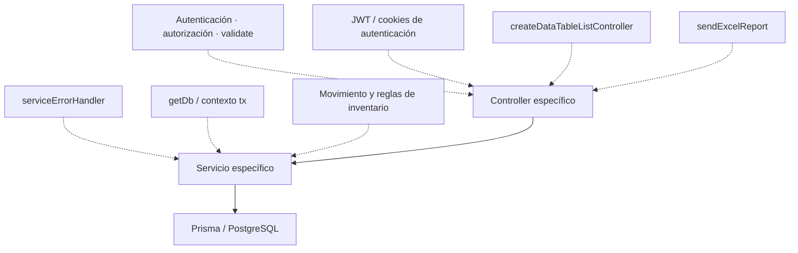

Los diagramas `DIA-BE-CU-*` referencian esta vista y nombran los colaboradores realmente usados. Así una extracción o parametrización futura puede revisarse en la vista canónica, mientras cada caso sigue demostrando su ruta, servicio y efecto propios.

## `CU-AUT-01`

**Identificador:** `DIA-BE-CU-AUT-01`. **Fuente:** fila `CU-AUT-01` de la matriz de aplicación al código backend. **Reutilización:** `DIA-BE-REU-001` · `middleware/cookies de autenticación`.

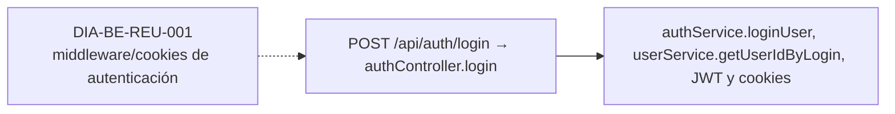

## `CU-AUT-02`

**Identificador:** `DIA-BE-CU-AUT-02`. **Fuente:** fila `CU-AUT-02` de la matriz de aplicación al código backend. **Reutilización:** `DIA-BE-REU-001` · `middleware/cookies de autenticación`.

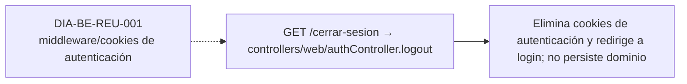

## `CU-IDA-01`

**Identificador:** `DIA-BE-CU-IDA-01`. **Fuente:** fila `CU-IDA-01` de la matriz de aplicación al código backend. **Reutilización:** `DIA-BE-REU-001` · `pipeline de middleware, controller y getDb`.

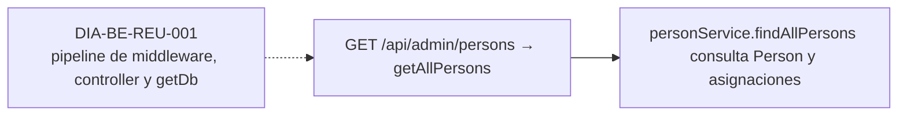

## `CU-IDA-02`

**Identificador:** `DIA-BE-CU-IDA-02`. **Fuente:** fila `CU-IDA-02` de la matriz de aplicación al código backend. **Reutilización:** `DIA-BE-REU-001` · `pipeline de middleware, controller y getDb`.

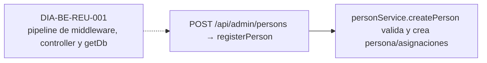

## `CU-IDA-03`

**Identificador:** `DIA-BE-CU-IDA-03`. **Fuente:** fila `CU-IDA-03` de la matriz de aplicación al código backend. **Reutilización:** `DIA-BE-REU-001` · `pipeline de middleware, controller y getDb`.

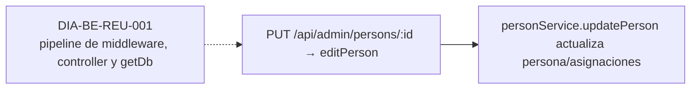

## `CU-IDA-04`

**Identificador:** `DIA-BE-CU-IDA-04`. **Fuente:** fila `CU-IDA-04` de la matriz de aplicación al código backend. **Reutilización:** `DIA-BE-REU-001` · `pipeline de middleware, controller y getDb`.

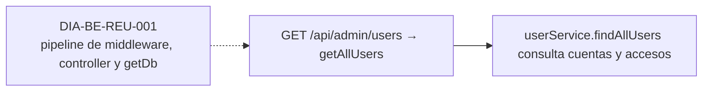

## `CU-IDA-05`

**Identificador:** `DIA-BE-CU-IDA-05`. **Fuente:** fila `CU-IDA-05` de la matriz de aplicación al código backend. **Reutilización:** `DIA-BE-REU-001` · `pipeline de middleware, controller y getDb`.

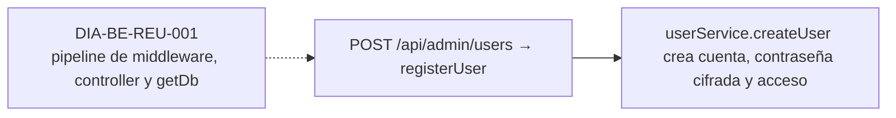

## `CU-IDA-06`

**Identificador:** `DIA-BE-CU-IDA-06`. **Fuente:** fila `CU-IDA-06` de la matriz de aplicación al código backend. **Reutilización:** `DIA-BE-REU-001` · `pipeline de middleware, controller y getDb`.

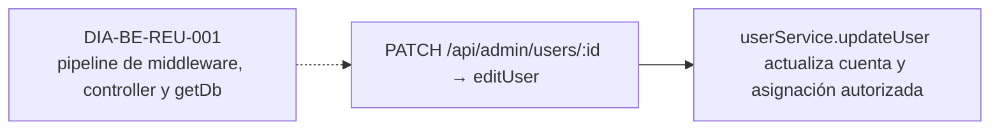

## `CU-IDA-07`

**Identificador:** `DIA-BE-CU-IDA-07`. **Fuente:** fila `CU-IDA-07` de la matriz de aplicación al código backend. **Reutilización:** `DIA-BE-REU-001` · `pipeline de middleware, controller y getDb`.

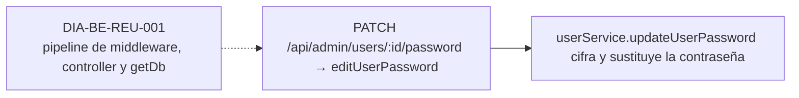

## `CU-IDA-08`

**Identificador:** `DIA-BE-CU-IDA-08`. **Fuente:** fila `CU-IDA-08` de la matriz de aplicación al código backend. **Reutilización:** `DIA-BE-REU-001` · `createDataTableListController y servicios de catálogo`.

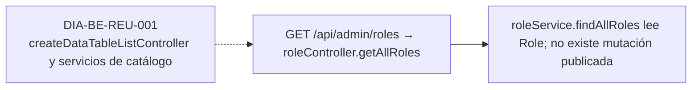

## `CU-IDA-09`

**Identificador:** `DIA-BE-CU-IDA-09`. **Fuente:** fila `CU-IDA-09` de la matriz de aplicación al código backend. **Reutilización:** `DIA-BE-REU-001` · `createDataTableListController y servicios de catálogo`.

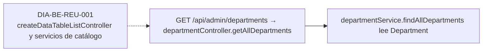

## `CU-CAT-01`

**Identificador:** `DIA-BE-CU-CAT-01`. **Fuente:** fila `CU-CAT-01` de la matriz de aplicación al código backend. **Reutilización:** `DIA-BE-REU-001` · `pipeline de middleware, controller y getDb`.

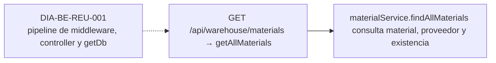

## `CU-CAT-02`

**Identificador:** `DIA-BE-CU-CAT-02`. **Fuente:** fila `CU-CAT-02` de la matriz de aplicación al código backend. **Reutilización:** `DIA-BE-REU-001` · `pipeline de middleware, controller y getDb`.

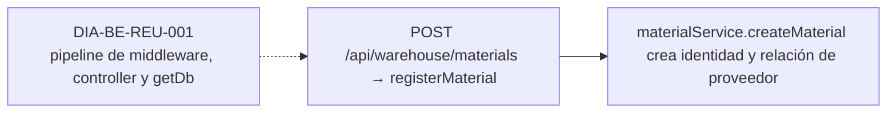

## `CU-CAT-03`

**Identificador:** `DIA-BE-CU-CAT-03`. **Fuente:** fila `CU-CAT-03` de la matriz de aplicación al código backend. **Reutilización:** `DIA-BE-REU-001` · `pipeline de middleware, controller y getDb`.

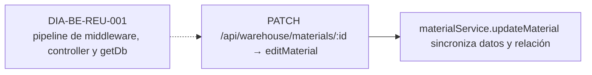

## `CU-CAT-04`

**Identificador:** `DIA-BE-CU-CAT-04`. **Fuente:** fila `CU-CAT-04` de la matriz de aplicación al código backend. **Reutilización:** `DIA-BE-REU-001` · `pipeline de middleware, controller y getDb`.

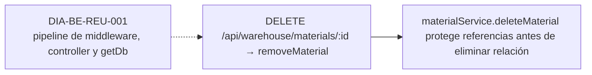

## `CU-CAT-05`

**Identificador:** `DIA-BE-CU-CAT-05`. **Fuente:** fila `CU-CAT-05` de la matriz de aplicación al código backend. **Reutilización:** `DIA-BE-REU-001` · `pipeline de middleware, controller y getDb`.

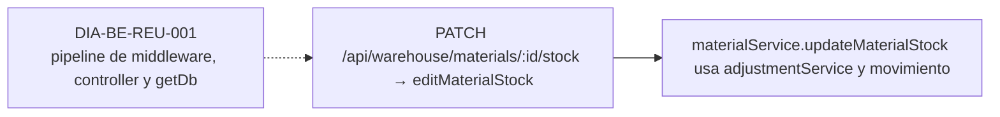

## `CU-CAT-06`

**Identificador:** `DIA-BE-CU-CAT-06`. **Fuente:** fila `CU-CAT-06` de la matriz de aplicación al código backend. **Reutilización:** `DIA-BE-REU-001` · `pipeline de middleware, controller y getDb`.

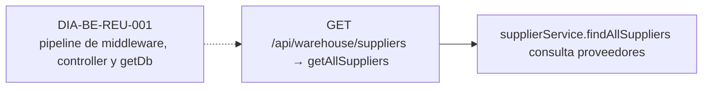

## `CU-CAT-07`

**Identificador:** `DIA-BE-CU-CAT-07`. **Fuente:** fila `CU-CAT-07` de la matriz de aplicación al código backend. **Reutilización:** `DIA-BE-REU-001` · `pipeline de middleware, controller y getDb`.

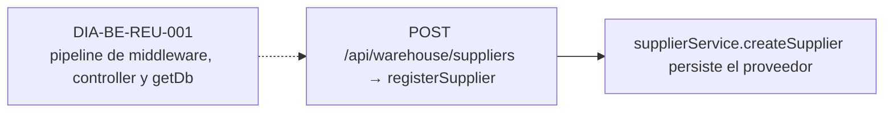

## `CU-CAT-08`

**Identificador:** `DIA-BE-CU-CAT-08`. **Fuente:** fila `CU-CAT-08` de la matriz de aplicación al código backend. **Reutilización:** `DIA-BE-REU-001` · `pipeline de middleware, controller y getDb`.

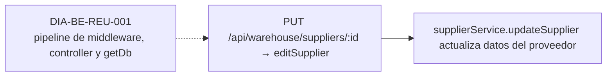

## `CU-CAT-09`

**Identificador:** `DIA-BE-CU-CAT-09`. **Fuente:** fila `CU-CAT-09` de la matriz de aplicación al código backend. **Reutilización:** `DIA-BE-REU-001` · `pipeline de middleware, controller y getDb`.

```mermaid
flowchart LR
    reuse["DIA-BE-REU-001<br/>pipeline de middleware, controller y getDb"] -.-> source
    source["PUT /api/warehouse/suppliers/:id → editSupplier"] --> target["supplierService.updateSupplier aplica el estado incluido en el DTO; no hay endpoint separado"]
```

## `CU-CAT-10`

**Identificador:** `DIA-BE-CU-CAT-10`. **Fuente:** fila `CU-CAT-10` de la matriz de aplicación al código backend. **Reutilización:** `DIA-BE-REU-001` · `pipeline de middleware, controller y getDb`.

```mermaid
flowchart LR
    reuse["DIA-BE-REU-001<br/>pipeline de middleware, controller y getDb"] -.-> source
    source["GET /api/sales/clients → getAllClients"] --> target["clientService.findAllClients consulta Client"]
```

## `CU-CAT-11`

**Identificador:** `DIA-BE-CU-CAT-11`. **Fuente:** fila `CU-CAT-11` de la matriz de aplicación al código backend. **Reutilización:** `DIA-BE-REU-001` · `pipeline de middleware, controller y getDb`.

```mermaid
flowchart LR
    reuse["DIA-BE-REU-001<br/>pipeline de middleware, controller y getDb"] -.-> source
    source["POST /api/sales/clients → registerClient"] --> target["clientService.createClient persiste Client"]
```

## `CU-CAT-12`

**Identificador:** `DIA-BE-CU-CAT-12`. **Fuente:** fila `CU-CAT-12` de la matriz de aplicación al código backend. **Reutilización:** `DIA-BE-REU-001` · `pipeline de middleware, controller y getDb`.

```mermaid
flowchart LR
    reuse["DIA-BE-REU-001<br/>pipeline de middleware, controller y getDb"] -.-> source
    source["PUT /api/sales/clients/:id → editClient"] --> target["clientService.updateClient actualiza Client"]
```

## `CU-CAT-13`

**Identificador:** `DIA-BE-CU-CAT-13`. **Fuente:** fila `CU-CAT-13` de la matriz de aplicación al código backend. **Reutilización:** `DIA-BE-REU-001` · `pipeline de middleware, controller y getDb`.

```mermaid
flowchart LR
    reuse["DIA-BE-REU-001<br/>pipeline de middleware, controller y getDb"] -.-> source
    source["GET /api/warehouse/wastes → getAllWastes"] --> target["wasteService.findAllWastes consulta merma e inventario"]
```

## `CU-CAT-14`

**Identificador:** `DIA-BE-CU-CAT-14`. **Fuente:** fila `CU-CAT-14` de la matriz de aplicación al código backend. **Reutilización:** `DIA-BE-REU-001` · `pipeline de middleware, controller y getDb`.

```mermaid
flowchart LR
    reuse["DIA-BE-REU-001<br/>pipeline de middleware, controller y getDb"] -.-> source
    source["GET /api/warehouse/wastes/material-templates y POST /api/warehouse/wastes → getWasteMaterialTemplates/registerWaste"] --> target["findWasteMaterialTemplates alimenta la selección y createWasteWithInitialStockAdjustment crea merma, ajuste y movimiento inicial"]
```

## `CU-CAT-15`

**Identificador:** `DIA-BE-CU-CAT-15`. **Fuente:** fila `CU-CAT-15` de la matriz de aplicación al código backend. **Reutilización:** `DIA-BE-REU-001` · `pipeline de middleware, controller y getDb`.

```mermaid
flowchart LR
    reuse["DIA-BE-REU-001<br/>pipeline de middleware, controller y getDb"] -.-> source
    source["PATCH /api/warehouse/wastes/:id → editWaste"] --> target["wasteService.updateWaste actualiza datos sin tratar stock como edición"]
```

## `CU-CAT-16`

**Identificador:** `DIA-BE-CU-CAT-16`. **Fuente:** fila `CU-CAT-16` de la matriz de aplicación al código backend. **Reutilización:** `DIA-BE-REU-001` · `pipeline de middleware, controller y getDb`.

```mermaid
flowchart LR
    reuse["DIA-BE-REU-001<br/>pipeline de middleware, controller y getDb"] -.-> source
    source["PATCH /api/warehouse/wastes/:id/stock → editWasteStock"] --> target["wasteService.updateWasteStock y registerWasteStockAdjustment aplican ajuste/movimiento"]
```

## `CU-CAT-17`

**Identificador:** `DIA-BE-CU-CAT-17`. **Fuente:** fila `CU-CAT-17` de la matriz de aplicación al código backend. **Reutilización:** `DIA-BE-REU-001` · `createDataTableListController y servicios de catálogo`.

```mermaid
flowchart LR
    reuse["DIA-BE-REU-001<br/>createDataTableListController y servicios de catálogo"] -.-> source
    source["GET /api/warehouse/presentations → getAllPresentations"] --> target["presentationService.findAllPresentations sirve el catálogo de sólo lectura"]
```

## `CU-CAT-18`

**Identificador:** `DIA-BE-CU-CAT-18`. **Fuente:** fila `CU-CAT-18` de la matriz de aplicación al código backend. **Reutilización:** `DIA-BE-REU-001` · `createDataTableListController y servicios de catálogo`.

```mermaid
flowchart LR
    reuse["DIA-BE-REU-001<br/>createDataTableListController y servicios de catálogo"] -.-> source
    source["GET /api/warehouse/unit-measures → getAllUnitMeasures"] --> target["unitMeasureService.findAllUnitMeasures sirve el catálogo de sólo lectura"]
```

## `CU-CAT-19`

**Identificador:** `DIA-BE-CU-CAT-19`. **Fuente:** fila `CU-CAT-19` de la matriz de aplicación al código backend. **Reutilización:** `DIA-BE-REU-001` · `createDataTableListController y servicios de catálogo`.

```mermaid
flowchart LR
    reuse["DIA-BE-REU-001<br/>createDataTableListController y servicios de catálogo"] -.-> source
    source["GET /api/warehouse/reasons → getAllReasons"] --> target["reasonService.findAllReasons sirve motivos; helpers resuelven motivos internos"]
```

## `CU-CAT-20`

**Identificador:** `DIA-BE-CU-CAT-20`. **Fuente:** fila `CU-CAT-20` de la matriz de aplicación al código backend. **Reutilización:** `DIA-BE-REU-001` · `createDataTableListController y servicios de catálogo`.

```mermaid
flowchart LR
    reuse["DIA-BE-REU-001<br/>createDataTableListController y servicios de catálogo"] -.-> source
    source["GET /api/warehouse/fulfillment-statuses → getAllFulfillmentStatuses"] --> target["fulfillmentStatusService.findAllFulfillmentStatuses sirve estados de sólo lectura"]
```

## `CU-ENT-01`

**Identificador:** `DIA-BE-CU-ENT-01`. **Fuente:** fila `CU-ENT-01` de la matriz de aplicación al código backend. **Reutilización:** `DIA-BE-REU-001` · `getDb(tx), inventario y manejo central de errores`.

```mermaid
flowchart LR
    reuse["DIA-BE-REU-001<br/>getDb(tx), inventario y manejo central de errores"] -.-> source
    source["GET /api/warehouse/goods-receipts → getAllGoodsReceipts"] --> target["goodsReceiptService.findAllGoodsReceipts consulta entradas y totales"]
```

## `CU-ENT-02`

**Identificador:** `DIA-BE-CU-ENT-02`. **Fuente:** fila `CU-ENT-02` de la matriz de aplicación al código backend. **Reutilización:** `DIA-BE-REU-001` · `getDb(tx), inventario y manejo central de errores`.

```mermaid
flowchart LR
    reuse["DIA-BE-REU-001<br/>getDb(tx), inventario y manejo central de errores"] -.-> source
    source["POST /api/warehouse/goods-receipts → registerGoodsReceipt"] --> target["goodsReceiptService.createGoodsReceipt crea documento, detalles, existencias y movimiento en transacción"]
```

## `CU-ENT-03`

**Identificador:** `DIA-BE-CU-ENT-03`. **Fuente:** fila `CU-ENT-03` de la matriz de aplicación al código backend. **Reutilización:** `DIA-BE-REU-001` · `getDb(tx), inventario y manejo central de errores`.

```mermaid
flowchart LR
    reuse["DIA-BE-REU-001<br/>getDb(tx), inventario y manejo central de errores"] -.-> source
    source["PATCH /api/warehouse/goods-receipts/:id → editGoodsReceiptHeader"] --> target["goodsReceiptService.updateGoodsReceipt conserva detalles persistidos y actualiza encabezado permitido"]
```

## `CU-ENT-04`

**Identificador:** `DIA-BE-CU-ENT-04`. **Fuente:** fila `CU-ENT-04` de la matriz de aplicación al código backend. **Reutilización:** `DIA-BE-REU-001` · `getDb(tx), inventario y manejo central de errores`.

```mermaid
flowchart LR
    reuse["DIA-BE-REU-001<br/>getDb(tx), inventario y manejo central de errores"] -.-> source
    source["PATCH /api/warehouse/goods-receipts/:id/details/:detailId/corrections → correctGoodsReceiptDetail"] --> target["correctGoodsReceiptDetailLine registra diferencia, movimiento, stock e historial atómicamente"]
```

## `CU-ENT-05`

**Identificador:** `DIA-BE-CU-ENT-05`. **Fuente:** fila `CU-ENT-05` de la matriz de aplicación al código backend. **Reutilización:** `DIA-BE-REU-001` · `getDb(tx), inventario y manejo central de errores`.

```mermaid
flowchart LR
    reuse["DIA-BE-REU-001<br/>getDb(tx), inventario y manejo central de errores"] -.-> source
    source["PATCH /api/warehouse/goods-receipts/:id/details/:detailId/cancel → cancelGoodsReceiptDetail"] --> target["cancelGoodsReceiptDetailLine revierte stock/movimiento y conserva historial"]
```

## `CU-SAL-01`

**Identificador:** `DIA-BE-CU-SAL-01`. **Fuente:** fila `CU-SAL-01` de la matriz de aplicación al código backend. **Reutilización:** `DIA-BE-REU-001` · `getDb(tx), reglas de cumplimiento e inventario compartido`.

```mermaid
flowchart LR
    reuse["DIA-BE-REU-001<br/>getDb(tx), reglas de cumplimiento e inventario compartido"] -.-> source
    source["GET /api/warehouse/goods-issues → getAllGoodsIssues"] --> target["goodsIssueService.findAllGoodsIssues consulta documentos y estados"]
```

## `CU-SAL-02`

**Identificador:** `DIA-BE-CU-SAL-02`. **Fuente:** fila `CU-SAL-02` de la matriz de aplicación al código backend. **Reutilización:** `DIA-BE-REU-001` · `getDb(tx), reglas de cumplimiento e inventario compartido`.

```mermaid
flowchart LR
    reuse["DIA-BE-REU-001<br/>getDb(tx), reglas de cumplimiento e inventario compartido"] -.-> source
    source["POST /api/warehouse/goods-issues → registerGoodsIssue"] --> target["goodsIssueService.createGoodsIssue crea encabezado y detalles solicitados"]
```

## `CU-SAL-03`

**Identificador:** `DIA-BE-CU-SAL-03`. **Fuente:** fila `CU-SAL-03` de la matriz de aplicación al código backend. **Reutilización:** `DIA-BE-REU-001` · `getDb(tx), reglas de cumplimiento e inventario compartido`.

```mermaid
flowchart LR
    reuse["DIA-BE-REU-001<br/>getDb(tx), reglas de cumplimiento e inventario compartido"] -.-> source
    source["PATCH /api/warehouse/goods-issues/:id/header → editGoodsIssueHeader"] --> target["goodsIssueService.updateGoodsIssueHeader aplica reglas del encabezado"]
```

## `CU-SAL-04`

**Identificador:** `DIA-BE-CU-SAL-04`. **Fuente:** fila `CU-SAL-04` de la matriz de aplicación al código backend. **Reutilización:** `DIA-BE-REU-001` · `getDb(tx), reglas de cumplimiento e inventario compartido`.

```mermaid
flowchart LR
    reuse["DIA-BE-REU-001<br/>getDb(tx), reglas de cumplimiento e inventario compartido"] -.-> source
    source["PATCH /api/warehouse/goods-issues/:id/details → editGoodsIssueDetails"] --> target["goodsIssueService.updateGoodsIssueDetails modifica cantidades todavía editables"]
```

## `CU-SAL-05`

**Identificador:** `DIA-BE-CU-SAL-05`. **Fuente:** fila `CU-SAL-05` de la matriz de aplicación al código backend. **Reutilización:** `DIA-BE-REU-001` · `getDb(tx), reglas de cumplimiento e inventario compartido`.

```mermaid
flowchart LR
    reuse["DIA-BE-REU-001<br/>getDb(tx), reglas de cumplimiento e inventario compartido"] -.-> source
    source["PATCH /api/warehouse/goods-issues/:id/details → editGoodsIssueDetails"] --> target["updateGoodsIssueDetails llama applyInventoryMovement(ISSUE) y recalcula cumplimiento con tx"]
```

## `CU-SAL-06`

**Identificador:** `DIA-BE-CU-SAL-06`. **Fuente:** fila `CU-SAL-06` de la matriz de aplicación al código backend. **Reutilización:** `DIA-BE-REU-001` · `getDb(tx), reglas de cumplimiento e inventario compartido`.

```mermaid
flowchart LR
    reuse["DIA-BE-REU-001<br/>getDb(tx), reglas de cumplimiento e inventario compartido"] -.-> source
    source["PATCH /api/warehouse/goods-issues/:id/details/:detailId/returns → registerGoodsIssueDetailReturn"] --> target["returnGoodsIssueDetail crea GoodsIssueReturn, movimiento ENTRY y estados en transacción"]
```

## `CU-SAL-07`

**Identificador:** `DIA-BE-CU-SAL-07`. **Fuente:** fila `CU-SAL-07` de la matriz de aplicación al código backend. **Reutilización:** `DIA-BE-REU-001` · `getDb(tx), reglas de cumplimiento e inventario compartido`.

```mermaid
flowchart LR
    reuse["DIA-BE-REU-001<br/>getDb(tx), reglas de cumplimiento e inventario compartido"] -.-> source
    source["GET /api/warehouse/waste-issues → getAllWasteIssues"] --> target["wasteIssueService.findAllWasteIssues consulta salidas de merma"]
```

## `CU-SAL-08`

**Identificador:** `DIA-BE-CU-SAL-08`. **Fuente:** fila `CU-SAL-08` de la matriz de aplicación al código backend. **Reutilización:** `DIA-BE-REU-001` · `getDb(tx), reglas de cumplimiento e inventario compartido`.

```mermaid
flowchart LR
    reuse["DIA-BE-REU-001<br/>getDb(tx), reglas de cumplimiento e inventario compartido"] -.-> source
    source["POST /api/warehouse/waste-issues → registerWasteIssue"] --> target["wasteIssueService.createWasteIssue crea encabezado y detalles de merma"]
```

## `CU-SAL-09`

**Identificador:** `DIA-BE-CU-SAL-09`. **Fuente:** fila `CU-SAL-09` de la matriz de aplicación al código backend. **Reutilización:** `DIA-BE-REU-001` · `getDb(tx), reglas de cumplimiento e inventario compartido`.

```mermaid
flowchart LR
    reuse["DIA-BE-REU-001<br/>getDb(tx), reglas de cumplimiento e inventario compartido"] -.-> source
    source["PATCH /api/warehouse/waste-issues/:id/header → editWasteIssueHeader"] --> target["wasteIssueService.updateWasteIssueHeader aplica reglas del encabezado"]
```

## `CU-SAL-10`

**Identificador:** `DIA-BE-CU-SAL-10`. **Fuente:** fila `CU-SAL-10` de la matriz de aplicación al código backend. **Reutilización:** `DIA-BE-REU-001` · `getDb(tx), reglas de cumplimiento e inventario compartido`.

```mermaid
flowchart LR
    reuse["DIA-BE-REU-001<br/>getDb(tx), reglas de cumplimiento e inventario compartido"] -.-> source
    source["PATCH /api/warehouse/waste-issues/:id/details → editWasteIssueDetails"] --> target["wasteIssueService.updateWasteIssueDetails modifica cantidades editables"]
```

## `CU-SAL-11`

**Identificador:** `DIA-BE-CU-SAL-11`. **Fuente:** fila `CU-SAL-11` de la matriz de aplicación al código backend. **Reutilización:** `DIA-BE-REU-001` · `getDb(tx), reglas de cumplimiento e inventario compartido`.

```mermaid
flowchart LR
    reuse["DIA-BE-REU-001<br/>getDb(tx), reglas de cumplimiento e inventario compartido"] -.-> source
    source["PATCH /api/warehouse/waste-issues/:id/details → editWasteIssueDetails"] --> target["updateWasteIssueDetails llama applyWasteIssueMovement y recalcula cumplimiento con tx"]
```

## `CU-SAL-12`

**Identificador:** `DIA-BE-CU-SAL-12`. **Fuente:** fila `CU-SAL-12` de la matriz de aplicación al código backend. **Reutilización:** `DIA-BE-REU-001` · `getDb(tx), reglas de cumplimiento e inventario compartido`.

```mermaid
flowchart LR
    reuse["DIA-BE-REU-001<br/>getDb(tx), reglas de cumplimiento e inventario compartido"] -.-> source
    source["PATCH /api/warehouse/waste-issues/:id/details/:detailId/returns → registerWasteIssueDetailReturn"] --> target["returnWasteIssueDetail crea WasteIssueReturn, movimiento inverso y estados en transacción"]
```

## `CU-REP-01`

**Identificador:** `DIA-BE-CU-REP-01`. **Fuente:** fila `CU-REP-01` de la matriz de aplicación al código backend. **Reutilización:** `DIA-BE-REU-001` · `controller de listado y query reutilizable`.

```mermaid
flowchart LR
    reuse["DIA-BE-REU-001<br/>controller de listado y query reutilizable"] -.-> source
    source["GET /api/warehouse/materials → getAllMaterials"] --> target["Reutiliza findAllMaterials con filtros; sólo lectura"]
```

## `CU-REP-02`

**Identificador:** `DIA-BE-CU-REP-02`. **Fuente:** fila `CU-REP-02` de la matriz de aplicación al código backend. **Reutilización:** `DIA-BE-REU-001` · `controller de listado y query reutilizable`.

```mermaid
flowchart LR
    reuse["DIA-BE-REU-001<br/>controller de listado y query reutilizable"] -.-> source
    source["GET /api/admin/movements/materials → getAllMaterialMovements"] --> target["movementQueryService.findAllMaterialMovements; sólo lectura"]
```

## `CU-REP-03`

**Identificador:** `DIA-BE-CU-REP-03`. **Fuente:** fila `CU-REP-03` de la matriz de aplicación al código backend. **Reutilización:** `DIA-BE-REU-001` · `sendExcelReport y consultas de dominio reutilizadas`.

```mermaid
flowchart LR
    reuse["DIA-BE-REU-001<br/>sendExcelReport y consultas de dominio reutilizadas"] -.-> source
    source["GET /api/warehouse/reports/inventory/excel → exportWarehouseReportExcel"] --> target["reportService.findWarehouseReportRows y sendExcelReport"]
```

## `CU-REP-04`

**Identificador:** `DIA-BE-CU-REP-04`. **Fuente:** fila `CU-REP-04` de la matriz de aplicación al código backend. **Reutilización:** `DIA-BE-REU-001` · `sendExcelReport y consultas de dominio reutilizadas`.

```mermaid
flowchart LR
    reuse["DIA-BE-REU-001<br/>sendExcelReport y consultas de dominio reutilizadas"] -.-> source
    source["GET /api/warehouse/reports/goods-issues/excel → exportGoodsIssueReportExcel"] --> target["reportService.findGoodsIssueReportRows y sendExcelReport"]
```

## `CU-REP-05`

**Identificador:** `DIA-BE-CU-REP-05`. **Fuente:** fila `CU-REP-05` de la matriz de aplicación al código backend. **Reutilización:** `DIA-BE-REU-001` · `sendExcelReport y consultas de dominio reutilizadas`.

```mermaid
flowchart LR
    reuse["DIA-BE-REU-001<br/>sendExcelReport y consultas de dominio reutilizadas"] -.-> source
    source["GET /api/admin/reports/movements/materials/excel → exportMovementReport"] --> target["inventory/reportService.findMovementReportRows y respuesta Excel"]
```

## `CU-REP-06`

**Identificador:** `DIA-BE-CU-REP-06`. **Fuente:** fila `CU-REP-06` de la matriz de aplicación al código backend. **Reutilización:** `DIA-BE-REU-001` · `controller de listado y query reutilizable`.

```mermaid
flowchart LR
    reuse["DIA-BE-REU-001<br/>controller de listado y query reutilizable"] -.-> source
    source["GET /api/warehouse/wastes → getAllWastes"] --> target["Reutiliza wasteService.findAllWastes con filtros; sólo lectura"]
```

## `CU-REP-07`

**Identificador:** `DIA-BE-CU-REP-07`. **Fuente:** fila `CU-REP-07` de la matriz de aplicación al código backend. **Reutilización:** `DIA-BE-REU-001` · `controller de listado y query reutilizable`.

```mermaid
flowchart LR
    reuse["DIA-BE-REU-001<br/>controller de listado y query reutilizable"] -.-> source
    source["GET /api/admin/movements/wastes → getAllWasteMovements"] --> target["movementQueryService.findAllWasteMovements; sólo lectura"]
```

## `CU-REP-08`

**Identificador:** `DIA-BE-CU-REP-08`. **Fuente:** fila `CU-REP-08` de la matriz de aplicación al código backend. **Reutilización:** `DIA-BE-REU-001` · `sendExcelReport y consultas de dominio reutilizadas`.

```mermaid
flowchart LR
    reuse["DIA-BE-REU-001<br/>sendExcelReport y consultas de dominio reutilizadas"] -.-> source
    source["GET /api/warehouse/reports/waste-issues/excel → exportWasteIssueReportExcel"] --> target["reportService.findWasteIssueReportRows y sendExcelReport"]
```

## `CU-REP-09`

**Identificador:** `DIA-BE-CU-REP-09`. **Fuente:** fila `CU-REP-09` de la matriz de aplicación al código backend. **Reutilización:** `DIA-BE-REU-001` · `sendExcelReport y consultas de dominio reutilizadas`.

```mermaid
flowchart LR
    reuse["DIA-BE-REU-001<br/>sendExcelReport y consultas de dominio reutilizadas"] -.-> source
    source["GET /api/warehouse/reports/wastes/excel → exportWasteReportExcel"] --> target["reportService.findWasteReportRows y sendExcelReport"]
```

## `CU-REP-10`

**Identificador:** `DIA-BE-CU-REP-10`. **Fuente:** fila `CU-REP-10` de la matriz de aplicación al código backend. **Reutilización:** `DIA-BE-REU-001` · `sendExcelReport y consultas de dominio reutilizadas`.

```mermaid
flowchart LR
    reuse["DIA-BE-REU-001<br/>sendExcelReport y consultas de dominio reutilizadas"] -.-> source
    source["GET /api/admin/reports/movements/wastes/excel → exportWasteMovementReport"] --> target["inventory/reportService.findMovementReportRows en contexto merma y respuesta Excel"]
```

## `CU-REP-11`

**Identificador:** `DIA-BE-CU-REP-11`. **Fuente:** fila `CU-REP-11` de la matriz de aplicación al código backend. **Reutilización:** `DIA-BE-REU-001` · `sendExcelReport y consultas de dominio reutilizadas`.

```mermaid
flowchart LR
    reuse["DIA-BE-REU-001<br/>sendExcelReport y consultas de dominio reutilizadas"] -.-> source
    source["GET /api/warehouse/reports/goods-receipts/excel → exportGoodsReceiptReportExcel"] --> target["reportService.findGoodsReceiptReportRows y sendExcelReport"]
```

## `CU-REP-12`

**Identificador:** `DIA-BE-CU-REP-12`. **Fuente:** fila `CU-REP-12` de la matriz de aplicación al código backend. **Reutilización:** `DIA-BE-REU-001` · `sendExcelReport y consultas de dominio reutilizadas`.

```mermaid
flowchart LR
    reuse["DIA-BE-REU-001<br/>sendExcelReport y consultas de dominio reutilizadas"] -.-> source
    source["GET /api/warehouse/reports/suppliers/excel → exportSupplierReportExcel"] --> target["reportService.findSupplierReportRows y sendExcelReport"]
```

## `CU-REP-13`

**Identificador:** `DIA-BE-CU-REP-13`. **Fuente:** fila `CU-REP-13` de la matriz de aplicación al código backend. **Reutilización:** `DIA-BE-REU-001` · `sendExcelReport y consultas de dominio reutilizadas`.

```mermaid
flowchart LR
    reuse["DIA-BE-REU-001<br/>sendExcelReport y consultas de dominio reutilizadas"] -.-> source
    source["GET /api/sales/reports/clients/excel → exportClientReport"] --> target["clientService.findAllClients prepara filas y el controller llama sendExcelReport"]
```

## `CU-REP-14`

**Identificador:** `DIA-BE-CU-REP-14`. **Fuente:** fila `CU-REP-14` de la matriz de aplicación al código backend. **Reutilización:** `DIA-BE-REU-001` · `sendExcelReport y consultas de dominio reutilizadas`.

```mermaid
flowchart LR
    reuse["DIA-BE-REU-001<br/>sendExcelReport y consultas de dominio reutilizadas"] -.-> source
    source["GET /api/admin/reports/persons/excel → exportPersonReport"] --> target["personService.findAllPersons prepara filas y el controller llama sendExcelReport"]
```

## `CU-REP-15`

**Identificador:** `DIA-BE-CU-REP-15`. **Fuente:** fila `CU-REP-15` de la matriz de aplicación al código backend. **Reutilización:** `DIA-BE-REU-001` · `sendExcelReport y consultas de dominio reutilizadas`.

```mermaid
flowchart LR
    reuse["DIA-BE-REU-001<br/>sendExcelReport y consultas de dominio reutilizadas"] -.-> source
    source["GET /api/admin/reports/users/excel → exportUserReport"] --> target["userService.findAllUsers prepara filas y el controller llama sendExcelReport"]
```
