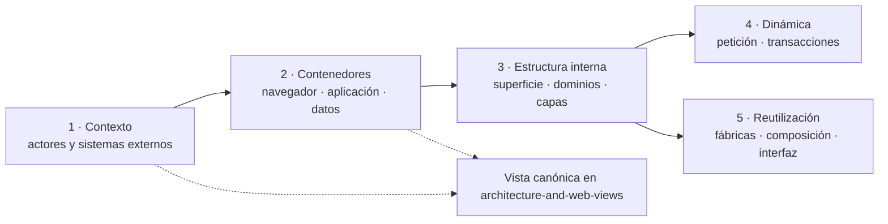
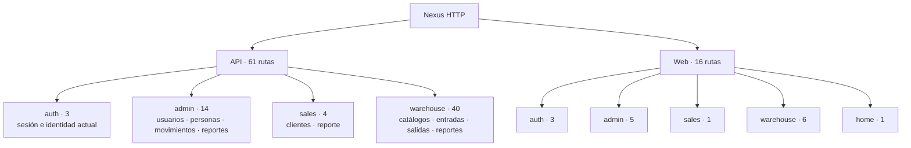
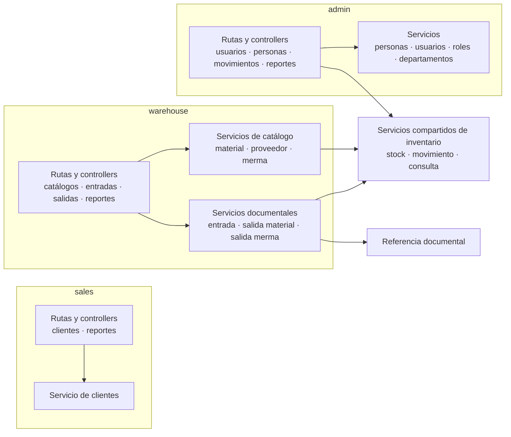
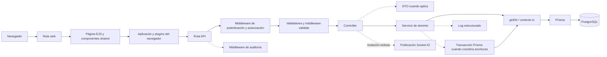
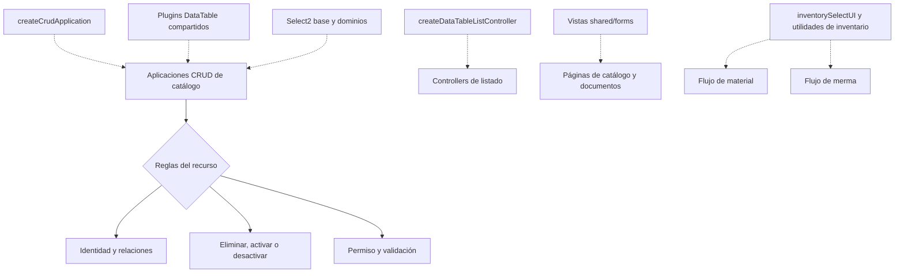

# Diagramas vigentes del código

## Propósito y mantenimiento

Estas vistas representan manualmente la estructura observable del código actual. No las
produce `scripts/generateArchitectureDocs.js`: se revisan en el mismo cambio que modifica
routers, capas, coordinación de servicios o componentes reutilizables. El
[mapa generado](../generated/code-map.md) sigue siendo el inventario verificable de rutas
e imports; estos diagramas agrupan esa evidencia para que una persona pueda comprenderla
sin recorrer todos los archivos.

Las flechas continuas significan llamada o delegación; las discontinuas significan
configuración o reutilización. Ninguna asociación concede permisos ni convierte una ruta
en caso de uso. Los objetivos del actor se mantienen en el
[diagrama de casos de uso](../requirements/domain-and-use-cases.md#casos-de-uso-vigentes).

## 1. Patrón de organización de las vistas

Se aplica el patrón **Viewpoint/View con revelado progresivo**, coherente con la
separación de preocupaciones de ISO/IEC/IEEE 42010 y con los niveles de abstracción que
populariza C4, sin declarar conformidad C4. Cada punto de vista responde una pregunta y
remite al siguiente nivel sólo cuando hace falta más detalle:

| Punto de vista | Pregunta | Vista canónica | Patrón del código que hace visible |
| --- | --- | --- | --- |
| Contexto | ¿Quién usa Nexus y de qué sistemas externos depende? | `architecture-and-web-views.md#diagrama-de-contexto-del-sistema` | Límite del sistema; no describe un patrón de implementación. |
| Contenedores | ¿Dónde se ejecutan interfaz, servidor y persistencia? | `architecture-and-web-views.md#contenedores-y-capas` | Aplicación web monolítica desplegable y separación cliente/servidor. |
| Estructura | ¿Qué superficie y dominios internos existen? | Secciones 2 y 3 de este documento. | **Monolito modular** y **arquitectura por capas**. |
| Dinámica | ¿Cómo atraviesa las capas una petición o transacción? | Sección 4 de este documento y diagramas de requisitos enlazados. | **Pipeline de middleware**, **Transaction Script** y publicación de eventos. |
| Reutilización | ¿Qué se configura o compone antes de crear otra variante? | Sección 5 de este documento. | **Factory functions**, composición de objetos y componentes compartidos. |

Contexto y contenedores no se dibujan otra vez aquí: se reutilizan las vistas canónicas.
Esto aplica **Single Source of Truth** como criterio documental y evita que dos diagramas
que responden la misma pregunta diverjan. Los patrones de implementación se explican en
[Patrones de diseño y construcción](design-and-construction-patterns.md); estas vistas
sólo muestran dónde aparecen.

## 2. Vista estructural: superficie HTTP registrada

Esta vista responde qué áreas exponen rutas API y páginas web. Los conteos son una
fotografía revisada contra los routers vigentes: 61 rutas API y 16 rutas web. El detalle
de método, ruta y archivo permanece en el mapa generado.

## 3. Vista estructural: dominios y colaboraciones

Esta vista responde qué dominios de transporte coordinan servicios compartidos. No
muestra cada import; para ello se usa el grafo generado de dependencias entre áreas. Los
subgrafos hacen visible el patrón **Monolito modular** y las flechas internas respetan la
**arquitectura por capas** sin presentar cada carpeta como un servicio desplegable.

## 4. Vistas dinámicas

### 4.1 Recorrido real de una petición

Esta vista responde dónde se ejecuta cada responsabilidad. No todas las consultas crean
un DTO ni todas las operaciones abren una transacción; los nodos discontinuos indican
puntos reutilizados sólo cuando el router o servicio los configura. El recorrido aplica
**Pipeline** en middleware, **DTO** en la frontera y **Transaction Script** con contexto
`tx` en las escrituras coordinadas; las notificaciones son **Publish/Subscribe** no
durable después de una mutación exitosa.

La evidencia principal está en `src/routes`, `src/middleware`, `src/controllers`,
`src/dtos`, `src/services`, `src/repository/baseRepository.js` y `src/lib/prisma.js`.

### 4.2 Operaciones que requieren vistas adicionales

El código confirma varias coordinaciones que no se entienden sólo con el diagrama de capas:

| Operación | Evidencia del código | Vista que explica el comportamiento |
| --- | --- | --- |
| Crear/editar usuario, acceso o contraseña | `src/services/admin/userService.js`, cifrado y asignaciones `UserRoleDepartment`. | [Secuencia de identidad y acceso](../requirements/requirements-diagrams.md#crear-o-editar-usuario-y-acceso--cu-iam-04-cu-iam-05). |
| Eliminar material o relación de proveedor | `materialService.deleteMaterial` y relaciones de uso en `supplierMaterialService.js`. | [Decisión de eliminación](../requirements/requirements-diagrams.md#eliminar-material-o-relación-de-proveedor--cu-cat-04). |
| Registrar una entrada | `goodsReceiptService.createGoodsReceipt`, referencias y servicios de inventario/costo. | [Secuencia de registro](../requirements/requirements-diagrams.md#registrar-entrada--cu-rec-02). |
| Corregir o cancelar detalle de entrada | `src/services/warehouse/goodsReceipts/detailChanges` y servicios de inventario. | [Secuencia atómica](../requirements/requirements-diagrams.md#coordinación-atómica-de-correcciones-de-entrada). |
| Surtir o devolver detalle de salida | Servicios de salidas de material/merma, reglas de cumplimiento y movimientos. | [Máquina de estados](../requirements/requirements-diagrams.md#estados-de-surtimiento-y-devolución). |
| Generar reporte Excel | Controllers de reporte, servicios de consulta y `reportExcelUtils.js`. | [Canal de generación](../requirements/requirements-diagrams.md#generar-reporte--cu-rep-02). |

No se duplican aquí esas vistas: combinan reglas de casos de atención alta con evidencia
del código, por lo que su fuente normativa sigue siendo la documentación de requisitos.

## 5. Vista de reutilización: CRUD e interfaz

Esta vista evita representar cliente, proveedor, material o merma como implementaciones
aisladas cuando el código ya ofrece piezas comunes. Una flecha discontinua significa que
el recurso configura o consume el componente, no que todos tengan idénticas reglas. Se
aplican **Factory functions** y **composición sobre herencia**: el recurso inyecta su
configuración y conserva localmente sus reglas de dominio.

La diferencia de contexto se conserva en configuraciones, validadores y servicios de
dominio. Antes de agregar otra aplicación o componente se revisan
`src/public/js/application/createCrudApplication.js`,
`src/controllers/api/createDataTableListController.js`, `src/views/shared`,
`src/public/js/ui` y `src/public/js/plugins`.

## 6. Lista de revisión manual

Al cambiar el código, Codex o cualquier contribuidor debe actualizar estas vistas cuando:

1. se agrega, elimina o mueve una ruta API o web;
2. cambia la cadena `middleware → controller → DTO → service → Prisma`;
3. un dominio comienza o deja de colaborar con inventario, referencias, auditoría o
   notificaciones;
4. se crea, reemplaza o retira una fábrica CRUD, listado o componente compartido;
5. cambia el límite transaccional de corrección, cancelación, surtimiento o devolución.

Después de la revisión manual también se ejecuta `npm run docs:architecture` para
actualizar el inventario técnico y `npm run docs:check` para detectar diferencias. Ambos
pasos son complementarios: el script comprueba evidencia enumerable y este documento
conserva la explicación comprensible.
