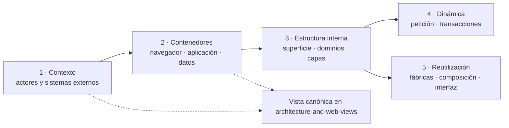

# 2. Patrón de organización de las vistas

Se aplica el patrón **Viewpoint/View con revelado progresivo**, coherente con la
separación de preocupaciones de ISO/IEC/IEEE 42010 y con los niveles de abstracción que
populariza C4, sin declarar conformidad C4. Cada punto de vista responde una pregunta y
remite al siguiente nivel sólo cuando hace falta más detalle:

| Punto de vista | Pregunta | Vista canónica | Patrón del código que hace visible |
| --- | --- | --- | --- |
| Contexto | ¿Quién usa Nexus y de qué sistemas externos depende? | `architecture-and-web-views/index.md#diagrama-de-contexto-del-sistema` | Límite del sistema; no describe un patrón de implementación. |
| Contenedores | ¿Dónde se ejecutan interfaz, servidor y persistencia? | `architecture-and-web-views/index.md#contenedores-y-capas` | Aplicación web monolítica desplegable y separación cliente/servidor. |
| Estructura | ¿Qué superficie y dominios internos existen? | Secciones 2 y 3 de este documento. | **Monolito modular** y **arquitectura por capas**. |
| Dinámica | ¿Cómo atraviesa las capas una petición o transacción? | Sección 4 de este documento y diagramas de requisitos enlazados. | **Pipeline de middleware**, **Transaction Script** y publicación de eventos. |
| Reutilización | ¿Qué se configura o compone antes de crear otra variante? | Sección 5 de este documento. | **Factory functions**, composición de objetos y componentes compartidos. |

Contexto y contenedores no se dibujan otra vez aquí: se reutilizan las vistas canónicas.
Esto aplica **Single Source of Truth** como criterio documental y evita que dos diagramas
que responden la misma pregunta diverjan. Los patrones de implementación se explican en
[Patrones de diseño y construcción](../design-and-construction-patterns/index.md); estas vistas
sólo muestran dónde aparecen.
