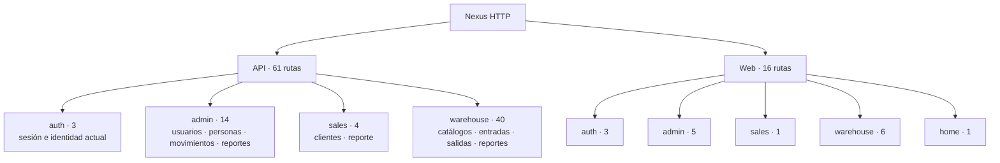

# 3. Vista estructural: superficie HTTP registrada

Esta vista responde qué áreas exponen rutas API y páginas web. Los conteos son una
fotografía revisada contra los routers vigentes: 61 rutas API y 16 rutas web. El detalle
de método, ruta y archivo permanece en el mapa generado.

