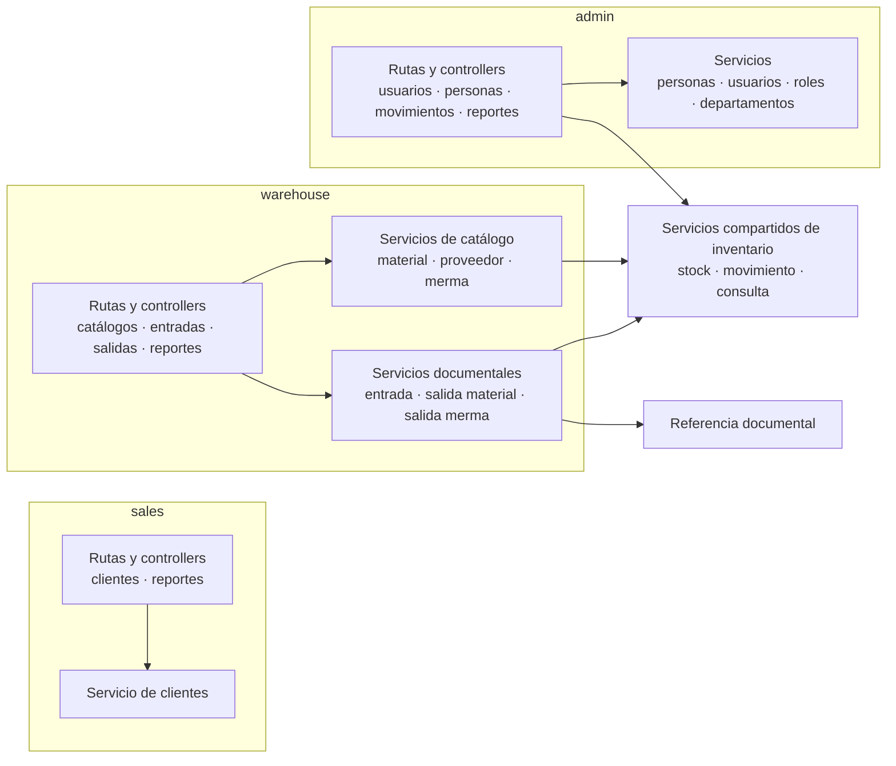

# 4. Vista estructural: dominios y colaboraciones

Esta vista responde qué dominios de transporte coordinan servicios compartidos. No
muestra cada import; para ello se usa el grafo generado de dependencias entre áreas. Los
subgrafos hacen visible el patrón **Monolito modular** y las flechas internas respetan la
**arquitectura por capas** sin presentar cada carpeta como un servicio desplegable.

