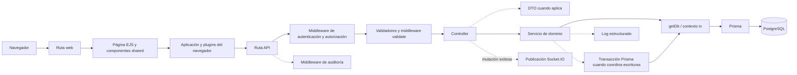

# 5. Vistas dinámicas

### 4.1 Recorrido real de una petición

Esta vista responde dónde se ejecuta cada responsabilidad. No todas las consultas crean
un DTO ni todas las operaciones abren una transacción; los nodos discontinuos indican
puntos reutilizados sólo cuando el router o servicio los configura. El recorrido aplica
**Pipeline** en middleware, **DTO** en la frontera y **Transaction Script** con contexto
`tx` en las escrituras coordinadas; las notificaciones son **Publish/Subscribe** no
durable después de una mutación exitosa.

La evidencia principal está en `src/routes`, `src/middleware`, `src/controllers`,
`src/dtos`, `src/services`, `src/repository/baseRepository.js` y `src/lib/prisma.js`.

### 4.2 Operaciones que requieren vistas adicionales

El código confirma varias coordinaciones que no se entienden sólo con el diagrama de capas:

| Operación | Evidencia del código | Vista que explica el comportamiento |
| --- | --- | --- |
| Crear/editar usuario, acceso o contraseña | `src/services/admin/userService.js`, cifrado y asignaciones `UserRoleDepartment`. | [Secuencia de identidad y acceso](../../requirements/diagrams/cross-cutting/14-crear-o-editar-usuario-y-acceso-cu-ida-06-cu-ida-07-cu-ida-08.md#crear-o-editar-usuario-y-acceso--cu-ida-06-cu-ida-07-cu-ida-08). |
| Eliminar material o relación de proveedor | `materialService.deleteMaterial` y relaciones de uso en `supplierMaterialService.js`. | [Decisión de eliminación](../../requirements/diagrams/cross-cutting/15-eliminar-material-o-relacion-de-proveedor-cu-cat-04.md#eliminar-material-o-relación-de-proveedor--cu-cat-04). |
| Registrar una entrada | `goodsReceiptService.createGoodsReceipt`, referencias y servicios de inventario/costo. | [Secuencia de registro](../../requirements/diagrams/cross-cutting/16-crear-compra-de-material-cu-ent-02.md#crear-compra-de-material--cu-ent-02). |
| Corregir o cancelar detalle de entrada | `src/services/warehouse/goodsReceipts/detailChanges` y servicios de inventario. | [Secuencia atómica](../../requirements/diagrams/cross-cutting/18-coordinacion-atomica-de-correcciones-de-entrada.md#coordinación-atómica-de-correcciones-de-entrada). |
| Surtir o devolver detalle de salida | Servicios de salidas de material/merma, reglas de cumplimiento y movimientos. | [Máquina de estados](../../requirements/diagrams/cross-cutting/index.md#estados-de-surtimiento-y-devolución). |
| Generar reporte Excel | Controllers de reporte, servicios de consulta y `reportExcelUtils.js`. | [Canal de generación](../../requirements/diagrams/cross-cutting/17-generar-reportes-especificos-cu-ida-04-cu-ida-09-cu-cat-07-cu-cat-09-cu-.md#generar-reportes-específicos--cu-ida-04-cu-ida-09-cu-cat-07-cu-cat-09-cu-cat-14-cu-cat-18-cu-cat-24-cu-cat-26-cu-ent-06-cu-sal-07-y-cu-sal-14). |

No se duplican aquí esas vistas: combinan reglas de coordinación compleja con evidencia
del código, por lo que su fuente normativa sigue siendo la documentación de requisitos.

### 4.3 Resultado de la revisión de trazabilidad diagrama–código

La revisión del código no justifica crear otra familia de diagramas: contexto,
estructura, interacción, reutilización, casos de uso, actividades, secuencias, estados y
datos ya tienen una vista canónica. Sí requiere conservar los siguientes enlaces y
aclaraciones técnicas para que una etiqueta funcional no se confunda con una ruta, una
función o un estado persistido:

| Vista o casos | Entrada HTTP verificable | Coordinación que sustenta el diagrama | Aclaración técnica |
| --- | --- | --- | --- |
| `CU-AUT-01` a `CU-AUT-02` | `src/routes/api/authApiRoute.js` y `src/routes/web/auth/logoutWebRoute.js` | `src/services/authService.js` y utilidades de cookies | Iniciar y cerrar sesión son objetivos visibles; consultar o renovar la sesión son mecanismos técnicos y no casos independientes. |
| `CU-IDA-01` a `CU-IDA-11` | `src/routes/api/admin/personApiRoute.js`, `userApiRoute.js`, `roleApiRoute.js` y `departmentApiRoute.js` | `src/services/admin/person/personService.js` y `src/services/admin/userService.js` | Crear usuario, editar acceso y cambiar contraseña son casos de uso independientes; la transacción y el cifrado pertenecen al servicio, no al actor del diagrama. |
| `CU-CAT-01` a `CU-CAT-48` | Routers de cliente bajo `sales`; proveedor, material, merma y lecturas operativas bajo `warehouse`; administración de catálogos auxiliares bajo `admin` | Servicios homónimos, `src/services/warehouse/materials/supplierMaterialService.js` y el registro seguro `src/services/admin/catalogService.js` | El grupo funcional reúne recursos con el patrón CRUD, pero no implica que todos admitan `DELETE` o cambio de estado. |
| `CU-ENT-01` a `CU-ENT-06` | `src/routes/api/warehouse/goodsReceiptApiRoute.js` | `goodsReceiptService.js` y `goodsReceipts/detailChanges/*Service.js` | Corrección y cancelación son rutas `PATCH` distintas; el recálculo de costo posterior al commit queda fuera de la transacción mostrada. |
| `CU-SAL-01` a `CU-SAL-14` | `goodsIssueApiRoute.js` y `wasteIssueApiRoute.js` | Servicios de `goodsIssues`, `wasteIssues`, sus `detailReturns` y `issueFulfillmentRules.js` | **Surtir no tiene un endpoint `/supply`:** se confirma mediante `PATCH /:id/details`; devolver usa `PATCH /:id/details/:detailId/returns`. La acción funcional y la URL no deben igualarse por nombre. |
| Estados de salidas | Las mismas rutas de detalle y devolución | `src/constants/warehouseStatuses.js`, `issueFulfillmentRules.js` y reglas específicas | Los valores persistidos son `Pendiente`, `Surtido parcial`, `Surtido` y `Cancelado`; crear/editar/surtir/devolver son operaciones, no estados. |
| `CU-IDA-04`, `CU-IDA-09`, `CU-CAT-07`, `CU-CAT-09`, `CU-CAT-14`, `CU-CAT-18`, `CU-CAT-24`, `CU-CAT-26`, `CU-ENT-06`, `CU-SAL-07` y `CU-SAL-14` | Routers de reporte de `admin`, `sales` y `warehouse` | Servicios de reporte y `src/utils/reportExcelUtils.js` | Consultar y exportar reutilizan filtros, pero cada reporte conserva permiso, columnas y transformación propios. |
| Entidades y cardinalidades | No aplica a una ruta individual | `prisma/schema.prisma` | El ER y el diccionario son generados; una relación Prisma no prueba que exista un flujo HTTP completo. |

Para seguir una fila hasta método y URL exactos se usa el
[mapa generado](../../generated/code-map.md); para seguirla hasta permiso y estado de
implementación se usa la
[matriz de operaciones](../../requirements/requirements-operations-matrix.md). Las pruebas
no se inventan a partir del dibujo: la cobertura existente y sus faltantes se mantienen
en el [plan de pruebas](../../testing/test-plan.md). Así, cada enlace tiene una sola fuente
de verdad y una brecha de cobertura permanece visible en vez de presentarse como
evidencia inexistente.
