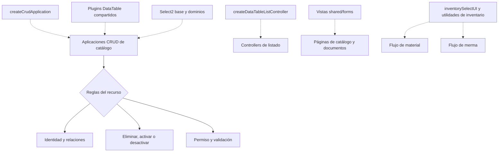

# 6. Vista de reutilización: CRUD e interfaz

Esta vista evita representar cliente, proveedor, material o merma como implementaciones
aisladas cuando el código ya ofrece piezas comunes. Una flecha discontinua significa que
el recurso configura o consume el componente, no que todos tengan idénticas reglas. Se
aplican **Factory functions** y **composición sobre herencia**: el recurso inyecta su
configuración y conserva localmente sus reglas de dominio.

La diferencia de contexto se conserva en configuraciones, validadores y servicios de
dominio. Antes de agregar otra aplicación o componente se revisan
`src/public/js/application/createCrudApplication.js`,
`src/controllers/api/createDataTableListController.js`, `src/views/shared`,
`src/public/js/ui` y `src/public/js/plugins`.

Esta vista resume la decisión arquitectónica. Cada diagrama `DIA-FE-CU-*` o
`DIA-BE-CU-*` indica mediante su línea **Patrones** qué pieza compartida consume y
reserva el bloque Mermaid para el recorrido concreto. Cuando una refactorización
extrae, sustituye o elimina una pieza común, se actualizan primero esta vista y el
catálogo de patrones, y luego se revisan los casos localizados por esos códigos.
