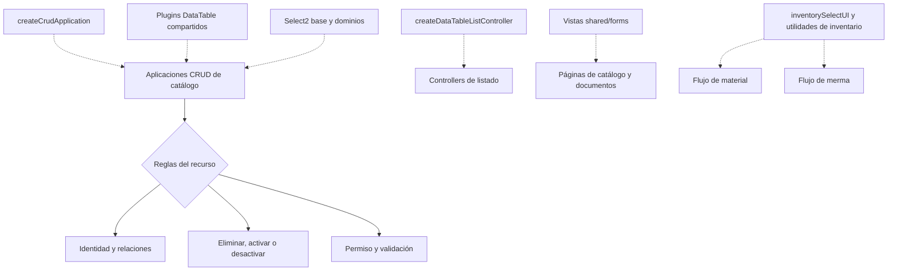
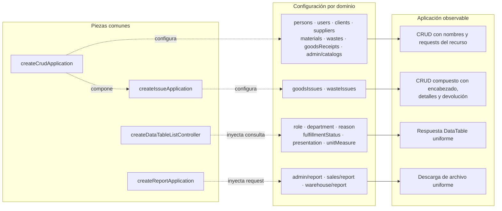

# 6. Vista de reutilización: CRUD e interfaz

Esta vista evita representar cliente, proveedor, material o merma como implementaciones
aisladas cuando el código ya ofrece piezas comunes. Una flecha discontinua significa que
el recurso configura o consume el componente, no que todos tengan idénticas reglas. Se
aplican **Factory functions** y **composición sobre herencia**: el recurso inyecta su
configuración y conserva localmente sus reglas de dominio.

**Identificador:** `DIA-COD-REU-001`. **Pregunta:** ¿qué piezas compartidas ya deben
configurarse o componerse antes de implementar otra variante?

```mermaid
flowchart TB
    crudFactory["createCrudApplication"] -.-> catalogApps["Aplicaciones CRUD de catálogo"]
    listFactory["createDataTableListController"] -.-> listControllers["Controllers de listado"]
    sharedForms["Vistas shared/forms"] -.-> catalogPages["Páginas de catálogo y documentos"]
    dataTable["Plugins DataTable compartidos"] -.-> catalogApps
    select2["Select2 base y dominios"] -.-> catalogApps
    inventoryUi["inventorySelectUI y utilidades de inventario"] -.-> materialFlow["Flujo de material"]
    inventoryUi -.-> wasteFlow["Flujo de merma"]

    catalogApps --> resourceRules{"Reglas del recurso"}
    resourceRules --> identity["Identidad y relaciones"]
    resourceRules --> removal["Eliminar, activar o desactivar"]
    resourceRules --> permissions["Permiso y validación"]
```

La diferencia de contexto se conserva en configuraciones, validadores y servicios de
dominio. Antes de agregar otra aplicación o componente se revisan
`src/public/js/application/createCrudApplication.js`,
`src/controllers/api/createDataTableListController.js`, `src/views/shared`,
`src/public/js/ui` y `src/public/js/plugins`.

La revisión del código confirma cuatro puntos de extensión que no necesitan otra
abstracción para sus consumidores actuales:

| Necesidad repetida | Pieza que se reutiliza | Variación que permanece en el propietario |
| --- | --- | --- |
| Listar y mutar recursos desde el navegador | `createCrudApplication` | Requests, claves de respuesta y mutaciones adicionales. |
| Extender el CRUD con encabezado, detalles y devolución | `createIssueApplication` | Servicios, cantidades y reglas de salida de material o merma. |
| Responder catálogos tabulares de sólo lectura | `createDataTableListController` | Función de consulta y mensaje de error del recurso. |
| Adaptar una exportación a un archivo descargable | `createReportApplication` | Request, endpoint y nombre de reporte de cada dominio. |

### Perspectiva de realización de la reutilización

**Identificador:** `DIA-COD-REU-002`. **Pregunta:** ¿cómo llegan las abstracciones
compartidas a los módulos de dominio que las aplican actualmente?

```mermaid
flowchart LR
    subgraph shared["Piezas comunes"]
        crud["createCrudApplication"]
        issue["createIssueApplication"]
        list["createDataTableListController"]
        report["createReportApplication"]
    end

    subgraph adapters["Configuración por dominio"]
        crudModules["persons · users · clients · suppliers<br/>materials · wastes · goodsReceipts · admin/catalogs"]
        issueModules["goodsIssues · wasteIssues"]
        listControllers["role · department · reason<br/>fulfillmentStatus · presentation · unitMeasure"]
        reportModules["admin/report · sales/report · warehouse/report"]
    end

    subgraph results["Aplicación observable"]
        crudContract["CRUD con nombres y requests del recurso"]
        issueContract["CRUD compuesto con encabezado,<br/>detalles y devolución"]
        listContract["Respuesta DataTable uniforme"]
        reportContract["Descarga de archivo uniforme"]
    end

    crud -. configura .-> crudModules --> crudContract
    crud -. compone .-> issue
    issue -. configura .-> issueModules --> issueContract
    list -. inyecta consulta .-> listControllers --> listContract
    report -. inyecta request .-> reportModules --> reportContract
```

Esta perspectiva se lee de izquierda a derecha: la pieza común concentra el mecanismo,
el módulo intermedio inyecta dependencias y conserva nombres del dominio, y el último
nodo muestra el contrato que reciben sus consumidores. Las líneas discontinuas expresan
configuración o composición; las continuas, el resultado que expone cada adaptador. Así
se puede localizar una reutilización concreta sin interpretar que todos los dominios
comparten sus reglas.

| Aplicación observada | Cómo se materializa | Evidencia que debe revisarse al cambiarla |
| --- | --- | --- |
| Configuración de factory CRUD | Cada módulo pasa `requests` y, cuando corresponde, `dataKeys` o mutaciones adicionales; después exporta operaciones con vocabulario del recurso. | Factory, módulo configurador y pruebas de ambos. |
| Composición de aplicaciones de salida | `createIssueApplication` configura `createCrudApplication` y agrega contratos de encabezado, detalle y devolución para material y merma. | Las dos factories y los módulos `goodsIssues` y `wasteIssues`. |
| Factory de controller tabular | Cada controller inyecta su consulta en `createDataTableListController`; ruta y servicio permanecen en el dominio. | Factory, controllers configuradores y pruebas HTTP del catálogo. |
| Adaptador de reportes | Los módulos de cada área entregan su request a `createReportApplication` y conservan exports específicos. | Factory, servicio de transporte y consumidor que inicia la descarga. |

La concentración de un mecanismo y la existencia de adaptadores pequeños hacen visible
el **resultado estructural** de una refactorización de extracción. El código vigente no
demuestra por sí solo cuándo ocurrió esa transformación; para afirmar su evolución se
necesita además el historial de cambios. Esta vista documenta cómo queda aplicada hoy,
no reconstruye un “antes y después” hipotético.

Para analizar el impacto se sigue una columna completa: pieza común, configuradores y
contrato observable. Las secuencias `DIA-FE-CU-*` y `DIA-BE-CU-*` muestran después el
recorrido de cada caso y su línea **Patrones** enlaza la colaboración canónica
`DIA-PAT-*`. Los imports del mapa generado y las pruebas de la pieza y sus consumidores
aportan la evidencia que el diagrama no sustituye.

Esta vista resume la aplicación arquitectónica. Cada diagrama `DIA-FE-CU-*` o
`DIA-BE-CU-*` indica mediante su línea **Patrones** qué pieza compartida consume y
reserva el bloque Mermaid para el recorrido concreto. Cuando una refactorización
extrae, sustituye o elimina una pieza común, se actualizan primero esta vista y el
catálogo de patrones, y luego se revisan los casos localizados por esos códigos.
