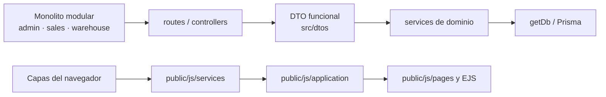
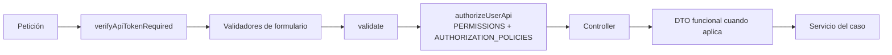
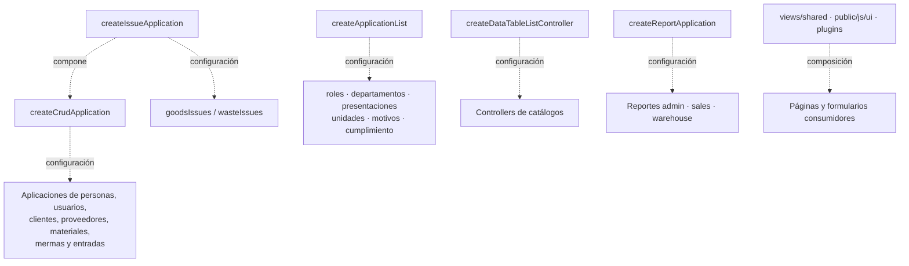
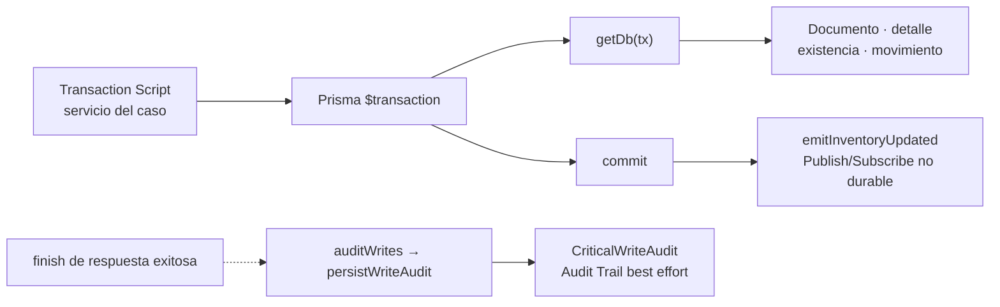
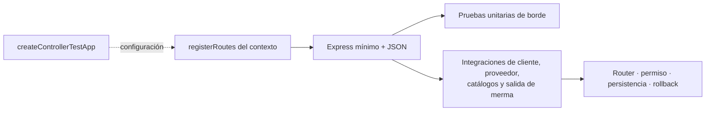
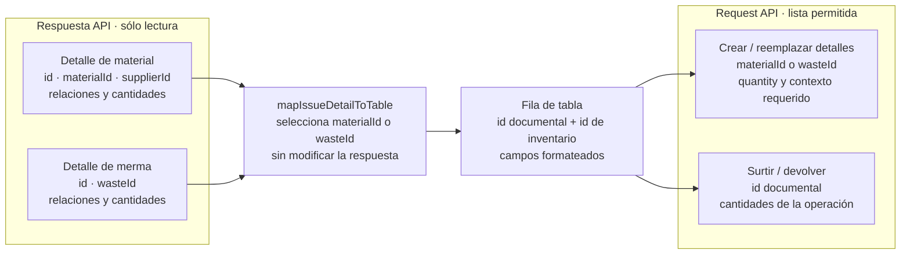

# Patrones de diseño y construcción aplicados

## Alcance de la revisión

Este documento registra patrones que tienen evidencia repetida en el código. Distingue
un **patrón formal o arquitectónico** de una simple función con un nombre parecido. El
objetivo no es asignar etiquetas GoF a todo el repositorio, sino saber qué solución debe
reutilizarse antes de construir otro flujo y dónde terminan sus límites.

## Resumen de patrones confirmados

| Nivel | Patrón o estrategia confirmada | Evidencia principal |
| --- | --- | --- |
| Arquitectura | Monolito modular organizado por dominio y capas | `src/routes`, `controllers`, `services`, `repository`, `views` y `public/js`, subdivididos en `admin`, `sales` y `warehouse` cuando aplica. |
| Transporte | Pipeline de middleware de Express | Rutas que componen autenticación, validadores, autorización y controller en un orden explícito. |
| Frontera | DTO funcional para normalizar entrada | Módulos bajo `src/dtos` que extraen y normalizan campos antes de llegar al servicio. |
| Autorización | Políticas declarativas como datos inmutables | `PERMISSIONS`, `AUTHORIZATION_POLICIES`, `createPolicy` y `getGrantedPermissions`. |
| Construcción | Factory functions configurables | `createCrudApplication`, `createIssueApplication` y `createDataTableListController`. |
| Composición | Extensión por composición de objetos | `createIssueApplication` incorpora el CRUD común y agrega encabezado, detalles y devolución sin herencia. |
| Persistencia | Propagación explícita del contexto transaccional | `getDb(tx)` selecciona la transacción recibida o el cliente Prisma compartido. |
| Consistencia | Límite transaccional para un caso de uso | Servicios que ejecutan documento, detalle, existencia y movimiento dentro de `$transaction`. |
| Integración | Publicación de eventos de actualización | `emitInventoryUpdated` traduce un contexto de inventario en eventos Socket.IO. |
| Auditoría | Audit Trail transversal posterior a la respuesta | `auditWrites`, `persistWriteAudit` y `CriticalWriteAudit` registran escrituras API exitosas y sanitizan campos sensibles. |
| Presentación | Composición de componentes y ownership por recurso | `src/views/shared`, `src/public/js/ui`, `plugins` y componentes que permanecen en la carpeta de su recurso. |
| Pruebas | Test harness configurable | `createControllerTestApp` registra sólo las rutas necesarias para probar controllers con Supertest. |

Las constantes compartidas forman parte de estas fronteras de construcción: modos de
formulario, estados, permisos y selectores se importan desde `src/constants` o
`src/public/js/constants`, según el entorno. Los consumidores no deben volver a
declarar sus valores literales; al ampliar un conjunto se actualiza su export y todos
los imports relacionados para conservar una única fuente de verdad.

Los selectores se agrupan por el tipo de elemento que identifican:
`FORM_SELECTORS`, `MODAL_SELECTORS`, `INPUT_SELECTORS`, `SELECT_SELECTORS`,
`BUTTON_SELECTORS` y `HEADING_SELECTORS`. Dentro de cada grupo, la clave nombra el
recurso o propósito (`GOODS_RECEIPT_CORRECTION`, `ADD_MATERIAL`, `MODAL_TITLE`) sin
repetir el tipo ya expresado por el nombre del grupo. Un selector usado en más de un
consumidor se incorpora al grupo correspondiente antes de agregar otro literal.

Los nombres de eventos reutilizados siguen la misma separación por integración:
`DOM_EVENT_NAMES` para eventos nativos, `SELECT2_EVENT_NAMES` para Select2 y
`MODAL_EVENT_NAMES` para los ciclos de vida de MDB o Bootstrap. Los listeners CRUD
importan estos nombres en lugar de repetir literales como `click`, `change` o `submit`;
un evento con namespace exclusivo de un módulo permanece local hasta que exista un
segundo consumidor real. Las utilidades compartidas que disparan eventos de plugins,
como `toggleDisabledElement` al sincronizar Select2, también importan la constante del
adaptador correspondiente para evitar dependencias implícitas del ámbito global.

## Catálogo visual de patrones aplicados

Estas vistas representan únicamente patrones con implementación y consumidores
verificables. Una caja nombra el patrón o estrategia; el nodo siguiente identifica el
símbolo o carpeta que lo implementa y el último nodo muestra consumidores reales. Las
flechas no significan herencia salvo que se indique expresamente.

### Estructura por dominio, capas y fronteras

**Identificador:** `DIA-PAT-EST-001`. **Pregunta:** ¿cómo se separan dominio,
transporte y reglas sin declarar un MVC estricto?



### Pipeline, DTO y políticas declarativas

**Identificador:** `DIA-PAT-FRO-001`. **Pregunta:** ¿qué mecanismos reutiliza una ruta
antes de entregar datos normalizados al caso de uso?



### Factories y composición sobre herencia

**Identificador:** `DIA-PAT-CON-001`. **Pregunta:** ¿qué se configura para crear una
variante sin duplicar el flujo común?



### Transacción, eventos y auditoría

**Identificador:** `DIA-PAT-DIN-001`. **Pregunta:** ¿cómo colaboran consistencia
atómica, publicación y trazabilidad sin confundir sus límites?



### Test harness configurable

**Identificador:** `DIA-PAT-TST-001`. **Pregunta:** ¿cómo reutilizan las pruebas el
montaje HTTP sin ocultar las rutas y efectos propios de cada contexto?



Las vistas canónicas de reutilización
[`DIA-FE-REU-001`](frontend-use-case-diagrams.md#vista-canónica-de-reutilización-frontend)
y [`DIA-BE-REU-001`](backend-use-case-diagrams.md#vista-canónica-de-reutilización-backend)
parten de este catálogo. A su vez, cada diagrama específico referencia su vista de
reutilización y declara una línea **Patrones** con los códigos resueltos por el índice
rápido de frontend o backend. Así se identifica la solución aplicada sin repetir su
explicación en los 63 casos de cada perspectiva. La cadena de lectura es
**patrón aplicado → punto común frontend/backend → especialización del caso**; así una
refactorización cambia primero el contrato común y permite localizar después todos los
casos afectados. `DIA-PAT-TST-001` representa
por separado la reutilización del montaje de pruebas, porque no participa en el flujo
de ejecución de un caso en producción.

## 1. Monolito modular por dominio y arquitectura por capas

Nexus se despliega como una aplicación, pero organiza responsabilidades por dominio y
capa. El recorrido habitual es:

```text
ruta/middleware → controller/DTO → servicio de dominio → Prisma → PostgreSQL
```

En el navegador, `services` encapsula HTTP, `application` expresa operaciones del caso
de uso y `pages` compone comportamiento visual. Esto se parece a MVC en algunos puntos,
pero no se declara un MVC estricto: los servicios de dominio, DTO, JavaScript del
navegador y eventos no encajan en tres componentes únicos.

La correspondencia MVC útil es parcial: EJS y los módulos de UI son la **Vista**;
routers/controllers Express cumplen la entrada del **Controlador**; Prisma y los
servicios administran estado y reglas que, en conjunto, se aproximan al **Modelo**.
Nexus aplica por ello un **MVC web extendido dentro de una arquitectura por capas**, no
un segundo patrón arquitectónico que sustituya al monolito modular. No falta crear una
clase `Model` ni trasladar reglas a controllers para «completar» MVC.

**Regla de construcción:** un recurso nuevo conserva el mismo dominio y nombre a través
de sus capas. No se crea una carpeta horizontal nueva sólo para una operación CRUD.

## 2. Pipeline de middleware

Express construye cada endpoint como una secuencia de funciones. Nexus reutiliza esa
capacidad como pipeline: autenticación, validación de campos, consolidación de errores,
autorización y controller se ejecutan en el orden declarado por la ruta.

No se denomina automáticamente *Chain of Responsibility*: los middleware no eligen
libremente otro manejador; forman una tubería definida por Express. La propiedad que se
debe conservar es el **orden visible y revisable**, con seguridad y validación en el
servidor antes de la mutación.

**Pruebas:** los casos negativos verifican que una entrada o sesión inválida no alcance
el servicio ni escriba datos; la integración CRUD atraviesa el pipeline real.

## 3. DTO funcional y políticas declarativas

Los módulos de `src/dtos` aplican el patrón **Data Transfer Object** sin requerir clases:
seleccionan campos aceptados y normalizan valores de transporte antes de invocar el
servicio. Un DTO no contiene autorización ni reemplaza validadores o reglas de negocio.
Se reutiliza uno existente cuando dos endpoints aceptan el mismo contrato; no se fuerza
si una mutación especializada necesita campos o semántica diferentes.

La autorización se construye como una tabla inmutable: una clave de `PERMISSIONS` apunta
a roles y departamentos en `AUTHORIZATION_POLICIES`. `createPolicy` congela la
configuración y `getGrantedPermissions` la evalúa para los accesos de la sesión. Es una
**política declarativa**, no el patrón GoF *Strategy*: no intercambia algoritmos, sino
datos de decisión consumidos por un evaluador común.

**Regla de construcción:** un endpoint nuevo reutiliza un permiso existente sólo si la
capacidad y alcance son los mismos. Una operación especializada con riesgo distinto
recibe su propia clave y casos negativos de autorización.

## 4. Factory functions y composición de aplicaciones

### CRUD común del navegador

`createCrudApplication` recibe requests y claves de respuesta, y construye un objeto
inmutable con `getAll`, `register` y `edit`. `createApplicationMutation` concentra la
adaptación de `formData`, `id`, `detailId`, opciones adicionales de contexto y la
respuesta exitosa. La opción `additionalMutations` agrega al mismo objeto operaciones
con ese contrato, usando una clave de respuesta por nombre cuando corresponde.
Personas, usuarios, clientes, proveedores, materiales, mermas, entradas y salidas
configuran esta misma construcción; cada módulo conserva sus nombres de dominio y
adapta únicamente el payload que realmente difiere.

La aplicación no vuelve a enumerar campos que ya fueron seleccionados por el formulario
y normalizados por el DTO del servidor. Materiales envía el objeto recibido sin
reconstruirlo; su único adaptador de registro elimina `maxUnitCost` cuando el contexto
es una entrada de compra, porque ese costo procede del detalle de la entrada. Esta
excepción contextual no sustituye los mapeos existentes ni crea un segundo DTO en el
navegador.

Los listados CRUD devuelven la respuesta del recurso; no agregan métodos `get*Options`
si Select2 ya dispone de `mapOption` para construir `{ id, text }`. Proveedores y
materiales usan directamente `getAllSuppliers` y `getAllMaterials`, tanto en el AJAX del
select como en filtros. Un adaptador de opciones sólo permanece cuando resuelve una
necesidad distinta, por ejemplo precargar «Pendiente» o elegir la primera persona de un
departamento antes de inicializar el filtro.

El objeto construido permanece privado dentro del módulo de contexto. La frontera
pública son exports nombrados en lenguaje de dominio (`registerUser`,
`editGoodsReceiptHeader`, `registerWasteIssueDetailReturn`, etc.), no un export del objeto
genérico. Así los consumidores no dependen de claves como `register`, `edit` o de la
forma interna de la factory; además pueden importar sólo la capacidad que utilizan.
Las referencias exportadas conservan también el formato de entrada de la factory:
`deleteMaterial` recibe `{ id }`, igual que las demás mutaciones, para que datatable,
aplicación y servicio no alternen firmas.

### Especialización de salidas

`createIssueApplication` configura `createCrudApplication` con `editHeader`,
`editDetails` y `returnDetail` como mutaciones adicionales. Salidas de material y de
merma inyectan sus requests y claves; no duplican la coordinación. Entradas de compra
replican el mismo criterio directamente con corrección y cancelación de detalle,
porque sus nombres y reglas de documento son distintos aunque el transporte coincida.

Las mutaciones de detalle especializadas conservan una carpeta explícita dentro de su
recurso. Compras agrupa sus cambios en `goodsReceipts/detailChanges`; las devoluciones
de material y merma se ubican en `goodsIssues/detailReturns` y
`wasteIssues/detailReturns`. En el navegador, cada salida mantiene la coordinación de
su devolución en `pages/warehouse/<recurso>/returns`, mientras el formulario y el modal
permanecen en `ui/issues` y `views/shared/issues` porque ambos contextos reutilizan el
mismo componente. Así la organización no duplica el flujo compartido ni mezcla la
mutación especializada con el modal principal del CRUD.

Se exporta **la función constructora** `createIssueApplication`, no una aplicación de
salida ya creada. Es un punto de composición compartido: cada módulo de salida la llama
con sus propios requests, guarda localmente la instancia resultante y publica sólo sus
operaciones de dominio. Mantener exportable el constructor permite que material y
merma repliquen el mismo proceso sin compartir estado ni exponer el objeto genérico a
la UI.

### Listados de catálogos

`createApplicationList` concentra el contrato de lectura de la capa de aplicación:
recibe un request y produce una operación que siempre lo invoca con `{ params }`. El
CRUD reutiliza esa operación para `getAll`; los catálogos de departamentos, roles,
presentaciones, motivos y unidades de medida configuran la misma función sin repetir
adaptadores equivalentes. Los listados que transforman la respuesta a opciones
conservan su adaptador de dominio.

`createDataTableListController` construye controllers de lectura configurando función
de consulta, columnas y orden predeterminado. Roles, departamentos, presentaciones,
unidades, motivos y estados de cumplimiento reutilizan el mismo parsing de DataTable.

Son **factory functions**, no los patrones GoF *Factory Method* o *Abstract Factory*:
no existe jerarquía de creadores/productos. Tampoco `createIssueApplication` es
*Template Method*, porque especializa por composición de objetos y no por herencia.

**Regla de construcción:** primero se intenta configurar una factory existente. Sólo se
amplía la abstracción si la nueva operación conserva el mismo contrato en al menos dos
contextos; una diferencia exclusiva permanece en el módulo propietario.

**Regla de exposición:** no se exporta la instancia producida por la factory desde un
módulo de contexto. Se exportan referencias nombradas a sus operaciones, o un adaptador
cuando la firma de dominio difiere. Una función constructora puede exportarse desde un
módulo compartido cuando al menos dos contextos la consumen; su resultado permanece
privado en cada consumidor.

## 5. Contexto transaccional y consistencia atómica

`src/repository/baseRepository.js` expone únicamente `getDb(tx)`: propaga el cliente de
transacción cuando el caso de uso ya está dentro de `$transaction`, o usa Prisma cuando
no lo está. Esto permite que servicios auxiliares participen en la misma operación
atómica sin abrir transacciones anidadas ni depender de una variable global de
transacción.

El archivo **no implementa actualmente el patrón Repository completo**: no encapsula
colecciones ni ofrece repositorios por agregado. Tampoco se declara una implementación
propia de *Unit of Work*; Prisma administra el commit/rollback. La estrategia real es
**Transaction Script con propagación explícita de contexto**, coordinado por servicios
de caso de uso.

**Regla de construcción:** una operación que modifica documento, detalle, existencia y
movimiento abre un solo límite `$transaction` y pasa `tx` a las funciones participantes.
La prueba de integración debe demostrar tanto el efecto completo como el rollback.

## 6. Publicación de eventos de inventario

`emitInventoryUpdated` funciona como publicador: recibe `material` o `waste`, resuelve
los nombres de eventos y notifica inventario y movimientos mediante Socket.IO. Los
controllers publican sólo después de una mutación exitosa.

Es una aplicación ligera de **Publish/Subscribe** en el borde de presentación, no un bus
de eventos de dominio durable: no persiste mensajes, no garantiza entrega y no sustituye
la transacción. Una nueva notificación de inventario debe reutilizar este publicador;
otro tipo de evento sólo se incorpora aquí si comparte el mismo contrato y ciclo de
vida.

Los modelos `InventoryMovement`, `WasteMovement`, ajustes, devoluciones y cambios de
detalle conservan historia operativa, pero **no implementan Event Sourcing**: el estado
actual de existencias y documentos se actualiza y consulta directamente, no se
reconstruye reproduciendo una secuencia inmutable de eventos; tampoco existe event
store, versión de agregado, proyección ni consumidor durable. Nombrar movimientos o
eventos Socket.IO como Event Sourcing sería incorrecto. No se recomienda introducirlo
sin un requisito de reconstrucción temporal, integración durable o múltiples
proyecciones que justifique la complejidad; la trazabilidad vigente usa historial de
dominio más Audit Trail.

## 7. Audit Trail transversal

`auditWrites` implementa el patrón **Audit Trail** como middleware transversal. Filtra
`POST`, `PUT`, `PATCH` y `DELETE` bajo `/api`, espera el evento `finish`, descarta
respuestas fallidas o sin actor y delega a `persistWriteAudit`. El servicio deriva
acción, recurso e identidad, limita longitudes y elimina contraseña, token, secreto,
autorización y cookie antes de persistir `CriticalWriteAudit`.

Es auditoría de responsabilidad (*accountability*) y no Event Sourcing ni log de
dominio. Actualmente es **best effort y posterior al commit**: una falla se registra en
el logger pero no revierte la escritura. La brecha debe resolverse sólo si un requisito
exige garantía atómica o entrega durable; en ese caso se recomienda **Transactional
Outbox** o incluir un registro de auditoría específico en la misma transacción, no
convertir todos los agregados a Event Sourcing. También faltan pruebas dedicadas del
sanitizado, clasificación y política de fallo, brecha registrada en el plan de pruebas.

## 8. Composición y propiedad de componentes visuales

Los partials de `src/views/shared` y las piezas independientes del recurso bajo
`public/js/ui` o `plugins` se componen desde páginas específicas. Un formulario o modal
reutilizado por varias pantallas puede seguir perteneciendo a su recurso si conoce sus
selectores, validaciones y operaciones.

Los partials transversales se agrupan por responsabilidad dentro de `shared`: `controls`
contiene controles de interacción independientes, `forms` reúne campos y composición de
formularios, `layout` contiene estructuras contenedoras y `tables` reúne tablas, filtros
y resúmenes. `issues` se conserva separado porque compone esas primitivas para el contexto
compartido de salidas. `inventory/inventoryCrudModal.ejs` normaliza el contrato del formulario
y delega el marcado al modal de layout para que compras y salidas reutilicen la misma
composición sin trasladar reglas particulares de cada CRUD. En JavaScript,
`ui/inventory/inventoryCrudModalUI.js` comparte la inicialización de modo, identidad, errores
y estado habilitado entre compras, salidas, materiales y mermas; cada CRUD conserva la carga
de campos, encabezados, detalles y selects que sí depende de su contexto. Las vistas
consumidoras referencian siempre la categoría explícita,
y la prueba de estructura impide volver a dejar archivos EJS sueltos en la raíz.

Compras y salidas de material reutilizan `shared/forms/materialSelect.ejs`. Este partial
representa específicamente el campo de material: siempre renderiza `materialInput`,
`materialId` y `material-select` dentro de `col-12`, sin aceptar datos de otro dominio ni
permitir que una página redefina el ancho. El modal conserva el select genérico para
detalles de otros dominios, como merma, y sólo el contexto de material activa el partial.

Este criterio evita dos extremos: duplicar componentes por contexto y crear una
abstracción «compartida» que todavía depende de un recurso concreto. Al editar EJS se
preserva el cierre final de `contentFor` en su lugar; no se elimina y vuelve a agregar
como efecto secundario de una refactorización.

Las alertas SweetAlert siguen el mismo criterio de composición. El adaptador
`plugins/swal/baseSwal.js` concentra apariencia, variantes y botones de todos los
diálogos; los consumidores no llaman `Swal.fire` ni redefinen `customClass`. Cuando un
diálogo necesita contenido interactivo, un componente de `public/js/ui` construye y
expone el nodo HTML reutilizable junto con su ciclo de apertura. Por ejemplo,
`reportExportDialog.js` encapsula las opciones y validación de exportación, mientras
`tableUI.js` conserva únicamente la coordinación de la descarga. Los toast mantienen
su presentación compacta, pero usan el mismo adaptador público `swalComponent.js`.

El encabezado de todos los modales se compone con `shared/layout/header.ejs` y conserva
la clase semántica `modal-title`. Su estilo transversal se declara una sola vez en
`public/css/style.css`: color claro para contrastar con el encabezado secundario, peso
destacado, escala tipográfica adaptable y márgenes normalizados. Los contextos CRUD
sólo actualizan el contenido del título y no deben agregar estilos en línea ni clases
visuales particulares.

El backdrop también es una responsabilidad transversal del modal, no de cada
formulario. Los CRUD abren sus diálogos exclusivamente mediante `openModal`; el helper
común registra el modal en la pila, asocia el backdrop creado por MDB y vuelve a intentar
la asociación al completarse la apertura para admitir tanto creación síncrona como
diferida. Ningún formulario debe crear, buscar, elevar o eliminar backdrops por su cuenta.

### Organización de módulos de una sola responsabilidad

Los archivos con sufijo `Page` son entry points de composición. No registran `useForm`
ni `useIssueForm`: cargan el módulo de formulario propietario y coordinan únicamente
componentes de pantalla como tablas.
Las pantallas sin formulario, como inicio y movimientos, conservan en su entry point los
efectos propios de la pantalla.

Los filtros dependientes de movimientos reutilizan `bindDisabledSelectDependency`, el
mismo bloqueo transversal de Select2 usado por compras y salidas. La configuración del
filtro sólo declara el control de origen, el destino y el mensaje de su contexto; no
debe implementar nuevamente la desactivación, la limpieza ni el aviso visual.

Los módulos que componen varios Select2 dentro de un modal reutilizan
`scopeSelectors` para limitar un mapa de selectores al contenedor. Cada módulo declara
únicamente sus selectores de dominio y el modal que los contiene; no debe repetir la
transformación con `Object.entries` y `Object.fromEntries` ni conservar condicionalmente
un mapa anterior: cada inicialización vuelve a acotarlo al contenedor recibido.

Los módulos con sufijo `Fields` tampoco se replican por convención en cada recurso. Se
crean cuando dos módulos hermanos del mismo contexto comparten grupos de nombres de
campo por modo. Actualmente `materialFields.js` y `wasteFields.js` son contratos entre
sus respectivos formularios y modales para alta, edición y ajuste de stock. Compras,
salidas de material y salidas de merma conservan sus campos en su módulo propietario:
no comparten listas de campos entre formulario y modal, y crear un archivo `Fields` para
cada uno sólo agregaría una frontera sin contrato compartido.

La cantidad de exports o de consumidores no determina por sí sola si un archivo debe
fusionarse. Un módulo con un único método que encapsula la configuración de un CRUD
conserva una frontera útil, pero se ubica en la carpeta de su recurso en lugar de quedar
en la raíz de una infraestructura compartida. Por esta razón, los DataTables se ordenan
primero en `admin`, `sales` y `warehouse`, y después por recurso (`persons`, `clients`,
`goodsReceipts`, etc.). `core` contiene el constructor, la adaptación responsive y los
filtros reutilizables; `shared/issues` e `shared/inventory` contienen únicamente
composición usada por más de un flujo.

Dentro de `core`, la implementación se divide por responsabilidad en `base` (creación,
ciclo de vida, operaciones y botones de acción) y `responsive` (definiciones de
columnas, filas, cuadrícula y grupos de encabezados, y detalle). Cada consumidor importa
el contrato desde su módulo propietario; no se mantienen fachadas `baseDatatable.js` o
`responsive.js` que oculten dependencias y vuelvan a concentrar exports sin aportar una
abstracción adicional.

La composición de columnas de detalles se organiza de la misma manera en
`shared/issues/detailBuilder`: encabezados, columnas, inputs y reglas de visibilidad se
mantienen separados. Es una composición compartida porque entradas, salidas de material
y salidas de merma reutilizan el mismo contrato con distinto `type`, modo y permisos;
los DataTables de cada contexto sólo construyen esa configuración y conservan sus
efectos CRUD propios. Los detalles nuevos de compra reciben un `clientId` efímero para
que varios renglones del mismo material —por ejemplo, con precios o lotes
distintos— permanezcan independientes hasta que el backend les asigne su identidad
documental. Una marca que cambie la identidad operativa corresponde a otro material de
catálogo; no se infiere ni se guarda como atributo del detalle.

La mutación en memoria de detalles no pertenece al plugin de DataTable: entradas,
salidas de material y salidas de merma comparten `upsertDetail`, `removeDetail` y la
comparación de la identidad documental o de inventario desde
`public/js/utils/detailCollectionUtils.js`. Las funciones sólo administran la colección
y devuelven el detalle anterior o eliminado; cada contexto conserva en su formulario o
DataTable los efectos que sí le pertenecen, como totales, limpieza del formulario y
refresco visual. Por ello `addGoodsReceiptMaterial`, `addGoodsIssueMaterial` y `addWaste` no se
fusionan: la compra valida costo, agrega cada renglón como una partida independiente y ajusta totales; la salida
valida proveedor, conserva su costo máximo, convierte cantidades y usa la identidad
material-proveedor; la salida de merma usa `wasteId` y datos de presentación propios.
En edición, si agregar de nuevo el mismo inventario sustituye el detalle persistido,
`upsertIssueDetail` reutiliza `upsertDetail` y conserva su identificador documental
mediante `id`. Las salidas de material y merma aplican el mismo proceso: la fila
mantiene la acción de eliminar después de modificar su cantidad y puede retirarse de la
colección si finalmente ya no se necesita. El mapper de cada formulario continúa
enviando únicamente los campos aceptados por su contrato de actualización.
Volver a agregar la misma merma, o el mismo material con el mismo proveedor, no crea un
duplicado: sustituye los datos editables de la fila y conserva su `id` documental. En
materiales, elegir otro proveedor representa otra relación de inventario y sí agrega un
detalle independiente.
El CRUD de la colección sólo está disponible mientras la salida completa permanece
`Pendiente`. Una salida con surtido parcial o completo abre únicamente la edición del
encabezado, sin controles para agregar o eliminar materiales o mermas; una salida
cancelada se abre en consulta. Por tanto, las reglas de sustitución y eliminación que
siguen corresponden exclusivamente al modo pendiente.
En ese modo, un detalle recién agregado puede eliminarse con su identidad de inventario.
Si la selección coincide con un detalle registrado, el nuevo contenido sustituye la
fila conservando el `id`; eliminarla después retira también el detalle registrado de la
colección que se enviará al servicio.
La columna de acciones conserva prioridad responsiva tanto en alta como en edición
pendiente. El botón `Eliminar detalle` permanece visible y habilitado para la fila nueva,
la fila registrada y la fila registrada que acaba de ser sustituida.
La acción prioriza ese `id` documental conservado, por lo que el ciclo registrado,
editado y finalmente eliminado retira de la colección la misma fila persistida. Al
guardar una salida todavía pendiente, los servicios de material y merma reemplazan sus
detalles con la colección enviada y la ausencia de esa fila concreta su eliminación.
Los detalles agregados por primera vez durante la edición todavía no tienen identidad
documental. La regla compartida muestra también su acción de eliminar usando la
identidad de inventario (`materialId` o `wasteId`), mientras oculta la acción para
detalles cancelados; así pueden retirarse de la lista antes de enviar la actualización.
Los tres reutilizan las utilidades de colección, render y limpieza sin
ocultar esas reglas tras callbacks de contexto. Así `detailDatatableUtils` deja de duplicar una parte del proceso de
issues sin trasladar reglas de compras a una utilidad genérica.

El mismo criterio se aplica al resto del proyecto: un archivo consumido una sola vez
permanece junto a su recurso propietario; sólo se mueve a una carpeta compartida cuando
hay al menos dos consumidores reales y un contrato independiente del contexto. No se
fusionan módulos de capas diferentes para reducir el conteo de archivos, ni se crean
carpetas horizontales para operaciones CRUD aisladas. Al mover un módulo se actualizan
en la misma modificación todos sus imports, exports, pruebas y referencias generadas.

Cuando una operación se invoca una sola vez y no introduce una frontera de capa, se
implementa directamente en su consumidor: la lectura del mensaje flash pertenece al
entry point de inicio y la creación del enlace de descarga pertenece al botón de
exportación. No se publican handlers o utilidades de una sola llamada como componentes
compartidos anticipadamente; se extraen sólo cuando aparece otro consumidor real.

La revisión de ownership se aplica por capa a todo `src`:

| Área | Responsabilidad y decisión de ubicación |
| --- | --- |
| `constants`, `errors`, `messages`, `dtos`, `validators` | Contratos y reglas sin I/O; se subdividen por dominio cuando existe más de un contexto relacionado. Un único archivo de contrato no se mezcla con controller o service. |
| `routes`, `controllers`, `services` | Mantienen dominio y recurso equivalentes entre capas. Los recursos pequeños pueden ser un archivo dentro del dominio; los casos compuestos usan una carpeta del recurso para helpers y reglas privadas. |
| `repository`, `lib`, `middleware`, `utils` | Infraestructura transversal. Un módulo de un solo consumidor sólo permanece aquí si su contrato sigue siendo transversal; de lo contrario pertenece al recurso consumidor. |
| `public/js/services`, `application`, `pages` | Transporte HTTP, caso de uso y composición visual respectivamente. No se fusionan aunque una función tenga un único consumidor porque representan fronteras distintas. `application` y los flujos compuestos se agrupan por dominio y recurso; `report` permanece en el dominio porque sirve a varios recursos. |
| `public/js/plugins` | Adaptadores de bibliotecas externas. `datatable` replica dominio y recurso; `select2` separa adaptadores de dominio de composiciones de varios selects. |
| `public/js/ui` y `views/shared` | Componentes visuales reutilizables sin ownership de página. Si sólo una pantalla conoce sus selectores y proceso, el componente permanece con esa página o recurso. |
| `views/pages` | Entradas EJS por pantalla y partials propietarios. Una reubicación no reescribe ni desplaza el cierre final de `contentFor`. |

Esta revisión prioriza responsabilidad y cohesión, no un mínimo artificial de métodos
por archivo. Separar es necesario cuando un módulo mezcla transporte, coordinación
visual o negocio; fusionar sólo es válido dentro de la misma capa, recurso y ciclo de
cambio.

En `public/js/application`, los casos de sólo lectura que alimentan catálogos se agrupan
por dominio bajo `catalogs`: administración contiene departamentos y roles; almacén,
presentaciones, motivos, unidades de medida y estados de surtimiento. Cada catálogo
conserva su módulo y export de dominio, pero no crea una carpeta de un solo archivo.
Los CRUD con mutaciones o coordinación propia permanecen en la carpeta de su recurso;
movimientos también conserva su ownership porque representa una consulta operativa y
no un catálogo para seleccionar relaciones.

### Estado de surtimiento

`FulfillmentStatus` es una referencia interna de sólo lectura usada por encabezados,
detalles y filtros. No es un CRUD administrable. Sus transiciones funcionales y los
datos afectados se documentan en la
[matriz de operaciones](../requirements/requirements-operations-matrix.md#modos-precondiciones-y-datos-modificados);
su representación física se consulta en el
[diccionario generado](../generated/data-dictionary.md). Se evita justificar aquí la
elección de tabla frente a enum porque ese detalle de persistencia no cambia el caso de
uso y repetir relaciones técnicas vuelve redundante esta guía de construcción.

### Contrato de los selects en modales

Los módulos de `plugins/select2/domains` reciben un `baseSelector` ya delimitado cuando
inicializan directamente un dominio. Las funciones de composición `setup*Select`, en
cambio, reciben el selector relativo del control y lo combinan una sola vez con
`modalSelector`. El contenedor del modal se pasa también a cada inicializador para que
Select2 inserte el desplegable dentro del contexto visual correcto.

Los módulos de página conservan esta distinción al reutilizar los selects: reconstruyen
sus selectores delimitados cada vez que se monta el componente, usan el formulario del
CRUD correspondiente para resolver su modo y limpian el control, no el formulario que
lo contiene. Las pruebas unitarias de frontend en
`tests/unit/public/js/plugins/select2` verifican este contrato para materiales y salidas
de merma sin duplicar el recorrido CRUD persistente de las integraciones.

El transporte base de Select2 acepta tanto la respuesta HTTP de los listados CRUD como
un arreglo de opciones ya resuelto por la capa de aplicación. Esta normalización se
mantiene en el adaptador compartido: los catálogos con una selección predeterminada
pueden precargar y reutilizar esas mismas opciones sin envolverlas artificialmente ni
intentar leer `data` de un valor inexistente.

Los inputs de texto y número derivados de un select actualizan su valor mediante
`setMdbWrapperInputValue`. El adaptador compartido sincroniza la clase visual `active`
del control antes de actualizar la instancia MDB: un valor la activa y un valor vacío la
retira. Por ello, al deseleccionar el origen no sólo se vacía el dato dependiente, sino que
su `form-outline` recupera también el estado visual inicial.

Después de agregar un nuevo detalle de material o merma, `clearAddedItemInput` reutiliza
ese mismo adaptador para limpiar cantidad, presentación y costo. La limpieza ocurre como
efecto del clic en agregar, después de actualizar la colección y la tabla, y devuelve
tanto los valores como sus wrappers `form-outline` al estado visual inicial. Cada flujo
conserva sus reglas de validación y composición del detalle, sin duplicar la coordinación
visual compartida.

Los selects que consultan listados CRUD envían `start`, `length` y `search` al mismo
endpoint paginado que utiliza la tabla. Select2 convierte su número de página a ese
contrato y conserva `recordsFiltered` para habilitar la carga incremental mientras
existan opciones. El adaptador base aporta esta transformación por defecto; cada dominio
sólo define el mapeo visual o filtros adicionales. Los conjuntos cerrados y pequeños,
como tipos de movimiento, pueden seguir resolviéndose localmente sin una consulta extra.
La consulta de plantillas de merma aplica `start` después de consolidar por nombre y
ancho, y devuelve el total consolidado en `recordsFiltered`; así, el selector puede
cargar las páginas siguientes sin repetir la primera ni ocultar resultados disponibles.

La paginación base no serializa el resultado completo. Las relaciones que un control
necesita conservar en los atributos de su opción HTML se convierten a JSON dentro del
mapper del dominio, donde se conoce cuáles propiedades son objetos. El consumidor las
normaliza al seleccionarlas. Así se evita convertir datos escalares o imponer el contrato
de inventario a los demás selects. Los mappers de materiales, mermas y plantillas aplican
`JSON.stringify` únicamente a las relaciones que después recupera cada consumidor.

El filtro de estado de surtimiento conserva dos contratos separados: la precarga mínima
resuelve la opción `Pendiente`, mientras que las búsquedas de Select2 consumen la
respuesta paginada completa del catálogo. El adaptador del dominio transforma cada
registro `{ id, name }` en `{ id, text }` sin descartar `recordsFiltered`; así el cálculo
de páginas permanece en el componente base, igual que para proveedores, personas y
otros filtros remotos.

Todos los selects remotos conservan el transporte HTTP compartido y, por tanto, la
renovación de autenticación no se implementa dentro de cada plugin. Las respuestas `401`
concurrentes esperan una única solicitud de refresh y después reintentan su petición
original. La referencia a esa renovación se libera antes de los reintentos, de modo que
una expiración posterior puede iniciar otro ciclo sin quedar asociada a la promesa o a
la cola del ciclo anterior.

El CRUD de merma reutiliza `mapSelectMaterialData`, el mismo adaptador del dominio de
materiales, tanto para los resultados remotos como para restablecer la relación incluida
al editar. El adaptador, los accesores de material/merma y el texto común viven en
`public/js/utils/warehouseInventoryUtils.js`: su alcance incluye Select2, DataTables y
páginas de inventario, por lo que no pertenecen exclusivamente a un plugin de selects.
De este modo el `id` de Select2 continúa siendo el de proveedor-material y el texto
conserva material, medidas y proveedor sin mantener un segundo normalizador ni
introducir otro flujo de consulta. Las decisiones visuales dependientes de la
presentación se resuelven con `getPresentation` sobre el material de la opción, sin
duplicar ese dato como un atributo adicional de Select2. En el alta, `data` es nulo
porque aún no existe una merma persistida; el modal traduce ese estado a una plantilla
vacía antes de entregarla a los lectores, en lugar de ampliar su contrato con un valor
que no representa un material.

## 9. Orden de métodos por comportamiento

Los módulos que representan el mismo tipo de recurso conservan un orden de lectura
común aunque cambien los nombres del dominio. Para un CRUD, el orden es: **consulta,
creación, actualización general, actualizaciones especializadas y eliminación**. Las
actualizaciones especializadas se ordenan desde el alcance más general al más específico;
en salidas esto significa **encabezado, detalles y devolución de detalle**. Helpers y
constantes privadas se declaran antes de la primera operación pública que los necesita.

El orden se conserva de extremo a extremo en controller, ruta, servicio de dominio,
adaptador HTTP del navegador y aplicación. No cambia la prioridad de las rutas ni el
contrato público: hace predecible la ubicación de una operación y permite comparar dos
contextos equivalentes sin depender de que usen exactamente el mismo sustantivo. Al
agregar una operación se actualizan juntos sus imports, exports y la prueba estructural
del flujo relacionado.

Las salidas de material y de merma son la referencia comprobable: ambas exponen listado,
registro, edición, edición de encabezado, edición de detalles y devolución en ese orden.
Sus módulos de formulario conservan la normalización, validación, configuración de
`useIssueForm` y operaciones de captura como `addGoodsIssueMaterial` o `addWaste`. En módulos
hermanos distintos, los modales conservan la construcción e
inicialización de componentes, apertura, alta y búsqueda de detalles, y registro de
eventos. El entry point crea el DataTable e inyecta las acciones que abren el modal, sin
concentrar nuevamente ninguno de los dos flujos. El nombre concreto puede cambiar entre material y merma; su posición la
determina la responsabilidad equivalente, no el sustantivo del contexto.

La prueba ubicada junto a las unitarias de sus controllers verifica esta secuencia entre
las capas y en las páginas; las pruebas de comportamiento y la persistencia CRUD
permanecen en las ubicaciones definidas por la estrategia de pruebas.

## 10. Patrones de construcción de pruebas

`createControllerTestApp` es una factory de test harness: crea una aplicación Express
mínima, instala parsing JSON y deja que cada prueba registre las rutas necesarias. Se
reutiliza en unitarias de borde e integraciones de controller en vez de reconstruir una
aplicación distinta por CRUD.

La ubicación sigue indicando el propósito:

- reglas aisladas y efectos negativos en `tests/unit/controllers/<tipo>/<dominio>`;
- CRUD real por HTTP y Prisma en `tests/integration/controllers`;
- helpers compartidos en `tests/helpers`, con pruebas propias cuando contienen lógica.

Compartir harness o casos tabulados no elimina la integración de cada contexto: ésta
debe demostrar router, permiso, configuración, persistencia y efectos propios.

## Decisión antes de crear otro flujo

1. **¿Es listar/crear/editar con el mismo contrato del navegador?** Configurar
   `createCrudApplication`.
2. **¿Es una salida con encabezado, detalles y devolución?** Configurar
   `createIssueApplication` y conservar requests/servicios por contexto.
3. **¿Es un catálogo de sólo lectura para DataTable?** Configurar
   `createDataTableListController`.
4. **¿Participa en una escritura compuesta?** Recibir y propagar `tx` mediante `getDb`.
5. **¿Notifica un cambio de inventario confirmado?** Reutilizar
   `emitInventoryUpdated` después de la mutación.
6. **¿La UI ignora el recurso que la consume?** Reutilizar o extraer a `ui`, `plugins` o
   `views/shared`; si conoce el recurso, mantenerla con su propietario.
7. **¿Sólo cambia material por merma u otro contexto?** Parametrizar primero; separar
   únicamente reglas, permisos, persistencia o lenguaje que sean realmente distintos.

### Módulos de formulario enfocados

La UI transversal de formularios se divide por responsabilidad y no se concentra en
un archivo barril: `ui/forms/formErrorsUI.js` presenta y limpia errores, `ui/forms/formStateUI.js`
inicializa el formulario y controla el estado de sus campos, y `ui/forms/detailFormUI.js`
coordina los controles repetidos de las tablas de detalle. Los consumidores importan
directamente `ui/forms/totalsSummaryUI.js` para los acumulados.

El registro transversal del envío vive en `ui/forms/formUI.js`: depende del DOM, muestra
errores y controla el botón, por lo que es una responsabilidad de presentación y no un
caso de uso de `application`. Recibe `sendRequest` como colaboración para que los
formularios de cada recurso sigan delegando la operación de aplicación correspondiente.

Los reportes sí representan casos de uso de aplicación. Como todos adaptan la respuesta
del request al mismo contrato de archivo, `createReportApplication.js` concentra esa
traducción y los módulos de reporte por dominio se limitan a configurarla con su servicio
de transporte. Así se conservan las fronteras y rutas de cada dominio sin duplicar el
flujo.

Una operación específica de un solo CRUD permanece privada en su flujo. No se exportan
wrappers de una sola llamada como API compartida, porque no aportan reutilización y
ocultan el propietario real del comportamiento.

### Inicialización y dependencias de DataTable

Las tablas de detalle generan su encabezado y sus columnas en la función de
inicialización del contexto, mediante los constructores compartidos. No se escribe un
encabezado provisional al cargar el módulo: esa escritura duplica la configuración,
puede ejecutarse antes de que exista el elemento y queda reemplazada al iniciar el
DataTable. Los imports se limitan a las dependencias realmente consumidas; cuando una
refactorización mueve una responsabilidad a un constructor o componente compartido,
se retiran también los imports residuales del consumidor.

## Mantenimiento

Un patrón se documenta como aplicado sólo cuando hay al menos una implementación y un
uso verificables. Si una refactorización cambia su contrato o elimina sus consumidores,
se actualizan este documento, los diagramas, la matriz de operaciones y las pruebas
relacionadas. Los patrones propuestos se describen como decisión pendiente, nunca como
arquitectura vigente.
### Adaptadores de detalles de inventario

Las respuestas de salidas de material y de merma se consideran objetos de solo
lectura. Antes de mostrarlas, el adaptador compartido de
`warehouseInventoryUtils.js` identifica si cada detalle contiene `materialId` o
`wasteId`, crea una fila nueva y conserva por separado el identificador del detalle
documental y el del material o merma. El primer identificador se usa al surtir o
devolver; el segundo,
al crear o reemplazar detalles del CRUD. Los adaptadores de request aplican una
lista permitida de campos. Para crear o reemplazar detalles, el navegador conserva el
adaptador específico del inventario; al surtir, `mapIssueDetailsToSupplyRequest` recorre
las filas una sola vez y conserva únicamente `id`, `isSupplied` y
`projectConvertedQuantity` de las nuevas selecciones. Los DTO de salida vuelven a
aplicar esa lista permitida como frontera del servidor. La etiqueta compartida de
select y tabla obtiene el nombre del material y del proveedor mediante getters que
encapsulan las variantes del contrato (`material`, `supplierMaterial` o valores ya
aplanados), en lugar de repetir navegación opcional dentro del formateador.

#### Vista del contrato de datos de los detalles

Esta vista focalizada responde, para desarrollo y revisión, **qué identidad conserva
cada etapa** entre la respuesta HTTP, la tabla y los requests de una salida. Su alcance
es sólo la adaptación en el navegador; no sustituye el futuro contrato OpenAPI ni el
diagrama ER. La fuente de verdad son los DTO de salidas y los adaptadores de
`warehouseInventoryUtils.js`; `issueFormUI.js` conserva únicamente coordinación visual.



Las flechas expresan transformación de datos, no llamadas entre capas. `id` siempre
identifica el detalle documental; `materialId` y `wasteId` identifican el elemento de
inventario según el contexto. El diagrama se revisa cuando cambien los DTO de salida,
los campos permitidos de un request o `mapIssueDetailToTable`; `npm run docs:check`
continúa validando únicamente las vistas generadas, por lo que esta vista curada también
requiere revisión visual de Mermaid.
