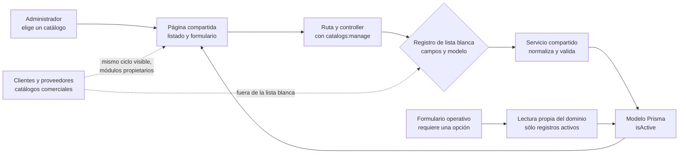
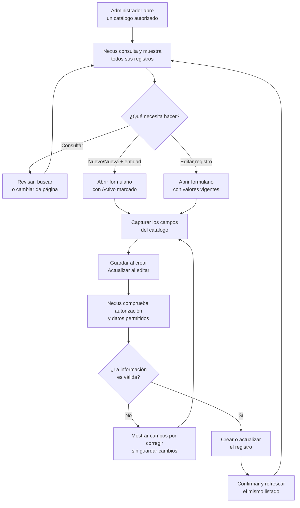
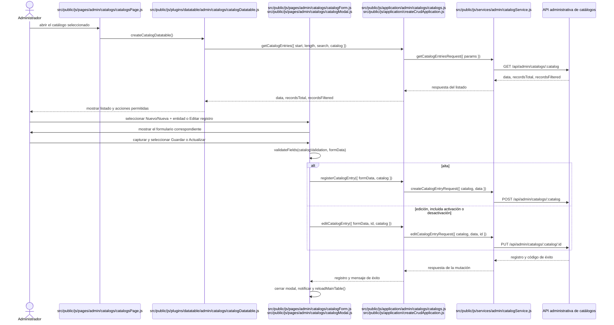
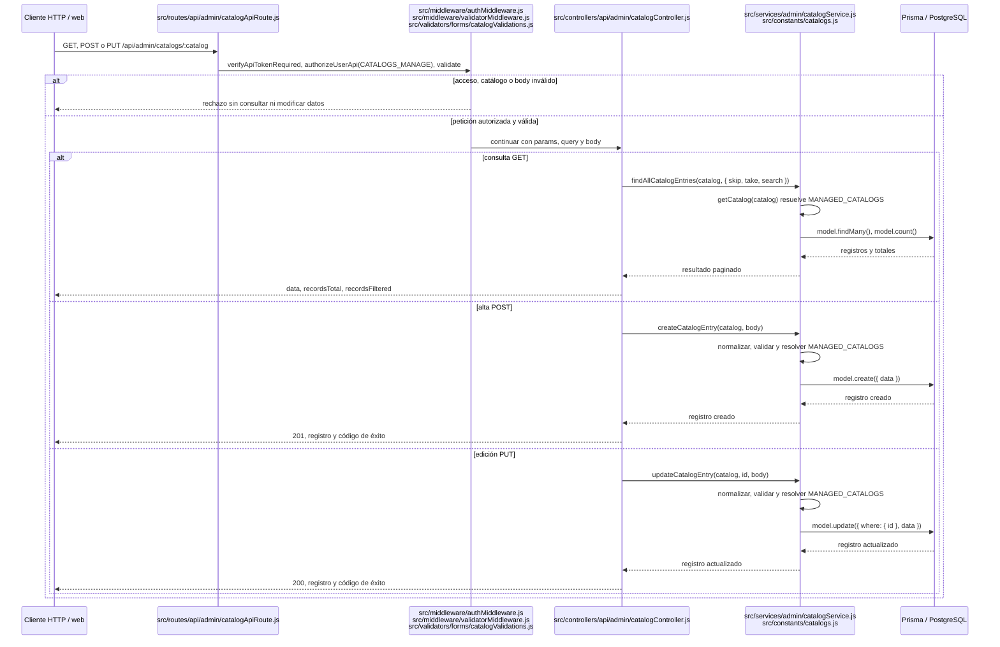

# 1. Registro de catálogos con lista blanca

Los catálogos auxiliares administrables aplican un **Registry/Strategy** acotado:
`catalogService` relaciona cada nombre público con su modelo Prisma, sus campos y sus
etiquetas. Controller, rutas y plantilla se comparten, mientras cada catálogo conserva
una URL y una entrada de navegación propias. En frontend, la página sólo compone el
flujo; formulario, modal, aplicación, transporte y DataTable mantienen la misma
separación utilizada por los demás CRUD. Así se evita duplicar seis implementaciones
sin permitir que el cliente seleccione modelos o campos arbitrarios. Las lecturas
operativas de cada dominio permanecen separadas para alimentar sus selectores.

La lista blanca es una frontera de seguridad. La página y el API administrativo
comprueban `catalogs:manage`; ocultar el enlace sólo mejora la navegación y nunca
reemplaza la autorización del servidor.

El flujo común no termina en los parciales visuales. En frontend, el listado se adapta
con `createCrudApplication.getAll`, se entrega a `createDataTable` mediante su opción
`ajax` y las altas o ediciones usan `handleSubmit`, que cierra el modal, presenta el
mensaje y recarga la DataTable conservando o reiniciando la página según el modo. Así,
Catálogos comparte el mismo ciclo observable que Clientes y Proveedores sin duplicar el
manejo de carga, error o refresco. En backend, el router aplica autenticación y
`catalogs:manage` antes del controller; el controller conserva el contrato DataTables y
delega normalización, lista blanca, validación y persistencia al servicio. El registro
**Registry/Strategy** es la única variación deliberada frente a un servicio por recurso.
Las columnas se entregan directamente a `createDataTable` y se componen desde los
campos del catálogo activo; no se mantienen seis arreglos equivalentes. La acción
reutiliza `buildMdbEditActionButton` con la etiqueta **Editar registro**, sin agregar `catalog` a
los contextos de negocio de `renderActionButtons`.
Las reglas visibles se crean mediante `createCatalogValidation` en la capa compartida
`utils/validations`, igual que los demás formularios; `catalogForm` sólo aporta etiqueta
y límites del recurso actual.

Los controles del formulario mantienen etiquetas de acción formadas únicamente por
verbos: **Guardar** al crear, **Actualizar** al editar, **Regresar** para salir y
**Cerrar** como etiqueta accesible del control de cabecera. El título del modal sí
incluye la entidad para aportar contexto, pero no forma parte de la etiqueta del botón.

El campo **Activo** forma parte del contrato común de los seis catálogos administrables.
El registro lo declara entre sus campos permitidos, el backend valida que sea booleano,
la pantalla lo presenta en formulario y listado, y Prisma lo conserva con valor inicial
activo. Las lecturas operativas sólo ofrecen registros activos; el listado administrativo
incluye ambos estados para permitir su reactivación.

El parámetro `catalog` se valida en la frontera HTTP contra `MANAGED_CATALOG_NAMES` y
el servicio vuelve a resolverlo desde `MANAGED_CATALOGS`; así no se puede seleccionar
un modelo arbitrario aunque el servicio se invoque fuera de la ruta. Como en los demás
módulos que reciben `id` en la URL, el servicio resuelve la existencia de la entidad y
traduce tanto el `P2025` como el `P2023` de Prisma a una entrada no encontrada que
incluye la etiqueta del catálogo. El validator HTTP se reserva para el contrato del body
y para `catalog`, que selecciona una estrategia y requiere rechazo antes del controller.

El registro contiene exactamente estos catálogos; ningún otro módulo forma parte de este
flujo compartido:

| Catálogo visible | Identificador de URL y API | Modelo Prisma | Campos administrables |
| --- | --- | --- | --- |
| Áreas | `departments` | `Department` | `name` (máximo 50), `isActive` booleano |
| Roles | `roles` | `Role` | `name` (máximo 50), `isActive` booleano |
| Presentaciones | `presentations` | `Presentation` | `name` (máximo 50), `isActive` booleano |
| Unidades de medida | `unit-measures` | `UnitMeasure` | `name` (máximo 20), `symbol` (máximo 10), `isActive` booleano |
| Motivos de ajuste | `reasons` | `StockAdjustmentReason` | `name` (máximo 100), `isActive` booleano |
| Estados de cumplimiento | `fulfillment-statuses` | `FulfillmentStatus` | `name` (máximo 50), `isActive` booleano |

**Clientes** y **Proveedores** no pertenecen a este registro: conservan sus módulos,
rutas, permisos, formularios y reglas de negocio propios.

En términos de negocio, clientes y proveedores **sí son catálogos comerciales** porque
son datos maestros reutilizados por salidas y compras. La distinción anterior es de
implementación: no son catálogos auxiliares ni deben agregarse al registro compartido.
Ambos conservan su indicador Activo en base de datos, backend, formulario y listado; sus
selectores operativos excluyen inactivos, mientras sus pantallas propietarias los mantienen
visibles para consulta y reactivación.

### Diagrama del patrón de catálogos administrables

**Diagrama:** `DIA-ARQ-CAT-001`. La vista muestra la variante permitida por la lista blanca
y la correspondencia del estado activo a través de las capas, sin confundir clientes o
proveedores con estrategias del registro auxiliar.

El recorrido superior se reutiliza para Áreas, Roles, Presentaciones, Unidades de medida,
Motivos de ajuste y Estados de cumplimiento. La línea discontinua documenta semejanza de
negocio y de experiencia, no dependencia del registro.

### Diagrama del ciclo CRUD compartido

**Diagrama:** `DIA-ARQ-CAT-002`. Una sola actividad representa el ciclo común porque
consultar, crear y editar pasan por la misma composición de pantalla, autorización,
validación, persistencia y refresco. No se mantiene un diagrama por acción ni por catálogo:
esas copias repetirían el patrón sin aportar decisiones diferentes. Se crea una vista
adicional únicamente cuando una operación incorpore otra coordinación, por ejemplo una
transacción de inventario o una política de eliminación propia.

La rama **Editar registro** incluye activar o desactivar mediante la casilla **Activo**; no existe
una acción de eliminación dentro de este patrón. El listado administrativo conserva los
registros inactivos para que puedan revisarse y reactivarse. Los endpoints operativos de
cada dominio permanecen fuera de este ciclo y sólo ofrecen opciones activas.

### Secuencias técnicas del patrón CRUD en frontend y backend

Las vistas técnicas se dividen por frontera de ejecución. `DIA-ARQ-CAT-003` explica la
reutilización dentro del navegador y termina en la petición HTTP;
`DIA-ARQ-CAT-004` comienza en esa petición y explica la selección segura del catálogo y
su persistencia. Separarlas mantiene legibles los participantes de cada lado sin
presentar frontend y backend como un único componente. Ambas complementan la actividad
funcional `DIA-ARQ-CAT-002` y juntas documentan el mismo patrón, no dos CRUD distintos.

#### Secuencia compartida del frontend

**Diagrama:** `DIA-ARQ-CAT-003`. La página compone una sola DataTable, formulario y
modal. `createCrudApplication` adapta las mismas operaciones de consulta, alta y edición,
y el servicio HTTP sólo sustituye método, URL y payload según la acción elegida.

#### Secuencia compartida del backend

**Diagrama:** `DIA-ARQ-CAT-004`. El backend conserva el mismo pipeline de autenticación,
autorización y validación para el recurso solicitado. El controller traduce el contrato
HTTP y el servicio resuelve `catalog` contra `MANAGED_CATALOGS` antes de acceder al modelo
Prisma permitido.

No se requiere una secuencia separada para cada catálogo ni para cada verbo HTTP: los
fragmentos de cada lado hacen explícitas las únicas bifurcaciones del CRUD vigente. Si se
incorpora una eliminación real o una operación con transacción o efectos adicionales,
esa coordinación sí debe representarse en otra vista. Ambos diagramas deben revisarse
cuando cambie la composición compartida, el contrato HTTP, el orden de middleware o la
resolución de `MANAGED_CATALOGS`; `npm run docs:check` comprueba sus rutas y referencias.
