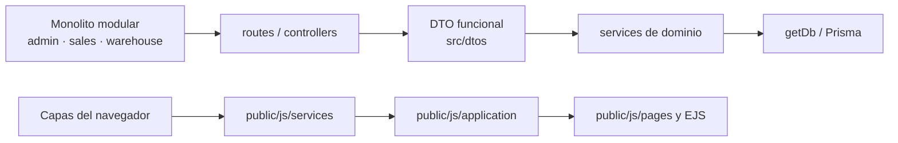
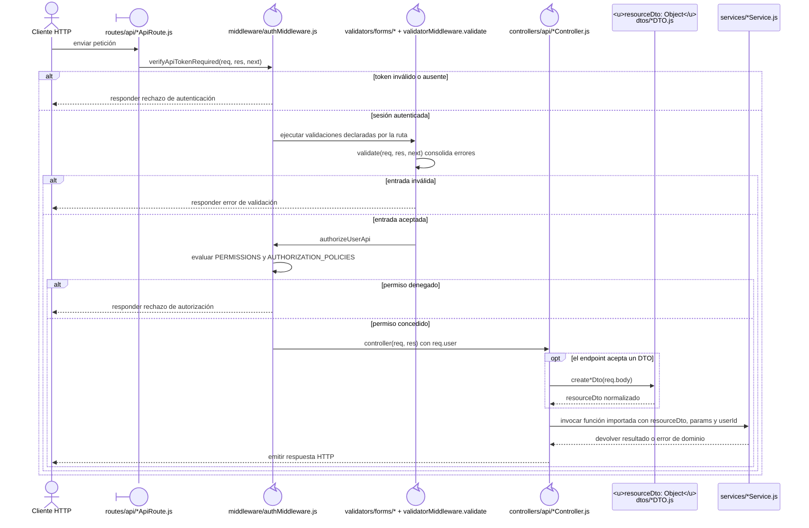
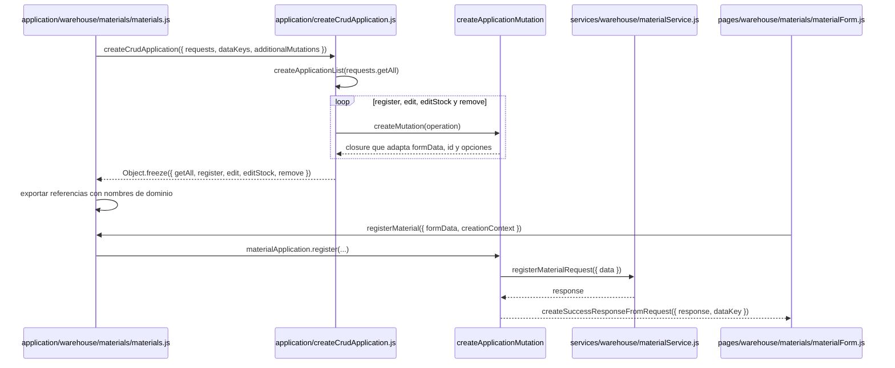
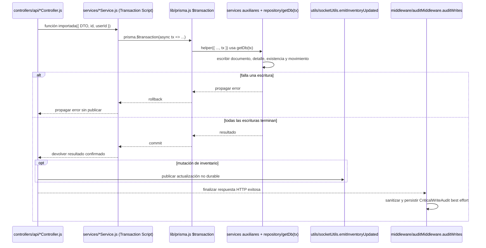
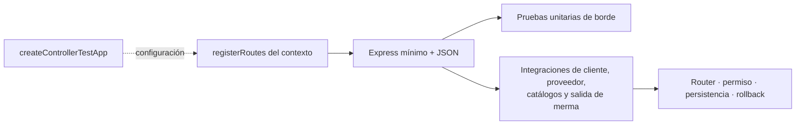

# 4. Catálogo visual de patrones aplicados

Estas vistas representan únicamente patrones con implementación y consumidores
verificables. En las vistas estructurales, una caja nombra el patrón o estrategia, el
nodo siguiente identifica el símbolo o carpeta que lo implementa y el último nodo
muestra consumidores reales. Las flechas de esas vistas no significan herencia salvo
que se indique expresamente.
Los diagramas estructurales localizan implementaciones y consumidores; las secuencias
de frontera y dinámica muestran orden, alternativas y límites temporales. En estas
últimas, los participantes nombran el archivo o símbolo ejecutable y los mensajes
conservan las llamadas y datos que pueden seguirse en el código. El código del patrón
en la línea **Patrones** sirve sólo como índice: no sustituye esta traza de construcción.
Así el catálogo representa tanto la forma del patrón como su colaboración sin cargar
los diagramas de cada caso con infraestructura repetida.

### Estructura por dominio, capas y fronteras

**Identificador:** `DIA-PAT-EST-001`. **Pregunta:** ¿cómo se separan dominio,
transporte y reglas sin declarar un MVC estricto?

### Pipeline, DTO y políticas declarativas

**Identificador:** `DIA-PAT-FRO-001`. **Pregunta:** ¿qué mecanismos reutiliza una ruta
antes de entregar datos normalizados al caso de uso?

La construcción se comprueba desde la declaración ordenada de middleware en
[`src/routes/api`](../../../src/routes/api), las funciones de
[`authMiddleware.js`](../../../src/middleware/authMiddleware.js) y
[`validatorMiddleware.js`](../../../src/middleware/validatorMiddleware.js), y la adaptación
de entrada en [`src/controllers/api`](../../../src/controllers/api) y
[`src/dtos`](../../../src/dtos). Las etiquetas genéricas `*` agrupan archivos equivalentes;
el diagrama de cada caso las reemplaza por su ruta, controller, DTO y servicio concretos.
Las figuras `boundary` y `control`, el actor y la línea de vida del objeto son parte de
la lectura visual; los textos de la cabecera no funcionan como estereotipos sustitutos.
La validación mostrada es la autoritativa del backend. Una validación frontend se traza
por separado como auto-mensaje del formulario o módulo UI y como alternativa previa al
request, sin omitir que el servidor vuelve a validar la entrada.

### Factories y composición sobre herencia

**Identificador:** `DIA-PAT-CON-001`. **Pregunta:** ¿qué se configura para crear una
variante sin duplicar el flujo común?

Esta secuencia muestra la construcción en dos momentos que el resumen del patrón no
expresa: al evaluar el módulo se inyectan requests y se crean *closures* inmutables; al
interactuar la página se usa una referencia de dominio que conserva esa configuración.
El ejemplo se puede recorrer en
[`createCrudApplication.js`](../../../src/public/js/application/createCrudApplication.js),
[`materials.js`](../../../src/public/js/application/warehouse/materials/materials.js),
[`materialService.js`](../../../src/public/js/services/warehouse/materialService.js) y
[`materialForm.js`](../../../src/public/js/pages/warehouse/materials/materialForm.js). Los
demás consumidores reutilizan la misma construcción con su propia tabla `requests`.

### Transacción, eventos y auditoría

**Identificador:** `DIA-PAT-DIN-001`. **Pregunta:** ¿cómo colaboran consistencia
atómica, publicación y trazabilidad sin confundir sus límites?

La traza parte del controller propietario y permite distinguir código ejecutado dentro
del callback de Prisma de efectos posteriores. `getDb(tx)` está implementado en
[`baseRepository.js`](../../../src/repository/baseRepository.js), el publicador en
[`socketUtils.js`](../../../src/utils/socketUtils.js) y la auditoría transversal en
[`auditMiddleware.js`](../../../src/middleware/auditMiddleware.js). Los diagramas técnicos
de cada mutación sustituyen los comodines por los servicios y escrituras exactos.

### Test harness configurable

**Identificador:** `DIA-PAT-TST-001`. **Pregunta:** ¿cómo reutilizan las pruebas el
montaje HTTP sin ocultar las rutas y efectos propios de cada contexto?

Cada diagrama específico declara una línea **Patrones** con los códigos resueltos por el
índice rápido de frontend o backend. Así se identifica la solución aplicada sin repetir
su explicación ni añadir vistas intermedias en los 72 casos de cada perspectiva. La
cadena de lectura es **patrón aplicado → recorrido concreto del caso**: una
refactorización cambia primero este catálogo y sus implementaciones, y los códigos
permiten localizar después todos los casos afectados. `DIA-PAT-TST-001` representa
por separado la reutilización del montaje de pruebas, porque no participa en el flujo
de ejecución de un caso en producción.
