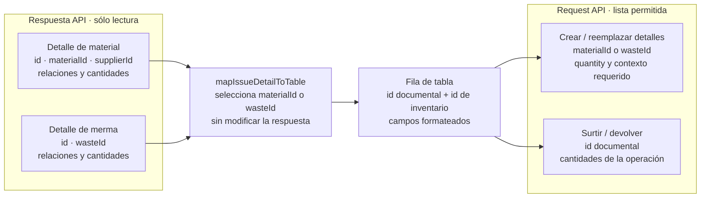

# Mantenimiento

Un patrón se documenta como aplicado sólo cuando hay al menos una implementación y un
uso verificables. Si una refactorización cambia su contrato o elimina sus consumidores,
se actualizan este documento, los diagramas, la matriz de operaciones y las pruebas
relacionadas. Los patrones propuestos se describen como decisión pendiente, nunca como
arquitectura vigente.
### Adaptadores de detalles de inventario

Las respuestas de salidas de material y de merma se consideran objetos de solo
lectura. Antes de mostrarlas, el adaptador compartido de
`warehouseInventoryUtils.js` identifica si cada detalle contiene `materialId` o
`wasteId`, crea una fila nueva y conserva por separado el identificador del detalle
documental y el del material o merma. El primer identificador se usa al surtir o
devolver; el segundo,
al crear o reemplazar detalles del CRUD. Los adaptadores de request aplican una
lista permitida de campos. Para crear o reemplazar detalles, el navegador conserva el
adaptador específico del inventario; al surtir, `mapIssueDetailsToSupplyRequest` recorre
las filas una sola vez y conserva únicamente `id`, `isSupplied` y
`projectConvertedQuantity` de las nuevas selecciones. Los DTO de salida vuelven a
aplicar esa lista permitida como frontera del servidor. La etiqueta compartida de
select y tabla obtiene el nombre del material y del proveedor mediante getters que
encapsulan las variantes del contrato (`material`, `supplierMaterial` o valores ya
aplanados), en lugar de repetir navegación opcional dentro del formateador.

#### Vista del contrato de datos de los detalles

Esta vista focalizada responde, para desarrollo y revisión, **qué identidad conserva
cada etapa** entre la respuesta HTTP, la tabla y los requests de una salida. Su alcance
es sólo la adaptación en el navegador; no sustituye el futuro contrato OpenAPI ni el
diagrama ER. La fuente de verdad son los DTO de salidas y los adaptadores de
`warehouseInventoryUtils.js`; `issueFormUI.js` conserva únicamente coordinación visual.

Las flechas expresan transformación de datos, no llamadas entre capas. `id` siempre
identifica el detalle documental; `materialId` y `wasteId` identifican el elemento de
inventario según el contexto. El diagrama se revisa cuando cambien los DTO de salida,
los campos permitidos de un request o `mapIssueDetailToTable`; `npm run docs:check`
continúa validando únicamente las vistas generadas, por lo que esta vista curada también
requiere revisión visual de Mermaid.
