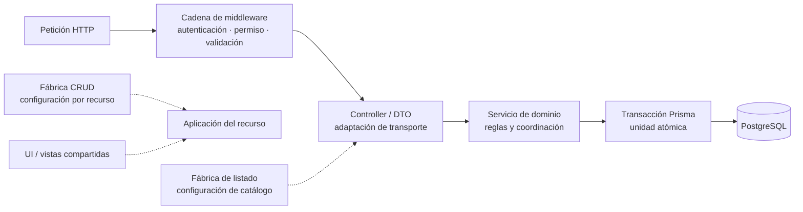

# Convenciones y patrones para diagramas

## Propósito

Los diagramas de Nexus también siguen patrones, pero se distingue entre:

- **patrón de documentación:** forma repetible de construir y leer una vista;
- **patrón presente en el código:** solución reutilizada por la implementación que el
  diagrama representa;
- **notación:** sintaxis visual, actualmente Mermaid.

Usar Mermaid no convierte un diagrama en UML, C4 o una vista conforme con una norma.
Cuando se adopta un patrón conocido se indica su propósito y se conserva el vínculo con
la evidencia del repositorio. No se agregan nombres de patrones sólo para describir una
similitud superficial.

## Patrón mínimo de cada diagrama

Antes de crear otro diagrama se reutiliza una vista existente si responde la misma
pregunta. Si se necesita uno nuevo, debe quedar claro —en el título o texto inmediato—:

1. **pregunta y lector:** qué decisión ayuda a revisar y para quién;
2. **alcance:** sistema, contenedor, dominio, flujo, estado, datos o implementación;
3. **fuente de verdad:** decisión curada, router/import, esquema Prisma o requisito;
4. **semántica:** significado de nodos, flechas, estilos, estados y relaciones;
5. **nivel de detalle:** no mezclar contexto de negocio con clases, tablas o funciones;
6. **mantenimiento:** evento que obliga a editarlo o regenerarlo y comprobación
   aplicable.

Todo diagrama curado tiene un identificador estable registrado en el
[inventario de diagramas](diagram-inventory.md). Los diagramas de un caso de uso usan
`DIA-REQ-CU-<identificador CU>`; las demás vistas usan
`DIA-<familia>-<tipo>-<número>`. El título indica su semántica (contexto, contenedores,
componentes, secuencia, actividad, estados, ER, navegación o flujo), porque `flowchart`
es sólo la sintaxis Mermaid y no convierte todas esas vistas en el mismo tipo.
Las vistas técnicas que aplican código a todos los casos conservan directamente el
identificador funcional como `DIA-FE-CU-<grupo>-<secuencia>` o
`DIA-BE-CU-<grupo>-<secuencia>`; así frontend y backend pueden localizar el mismo caso
sin depender del orden físico de los bloques.

Las secuencias y actividades técnicas de frontend o backend que implementan casos de
uso se asocian con **un único `CU-*`**. No se permiten participantes alternativos con
“o”, comodines, URLs elípticas ni rangos de casos para convertir un flujo en plantilla.
Los elementos reutilizados se documentan como dependencias o componentes compartidos;
cuando dos casos necesitan vista dinámica, cada diagrama conserva nombres y decisiones
específicos de su implementación.

Cada colección de aplicación al código comienza con una vista canónica `DIA-*-REU-*`
que muestra factories, componentes, infraestructura y colaboradores realmente
compartidos. El diagrama específico referencia esa vista mediante una flecha
discontinua y nombra la pieza utilizada; su recorrido continuo muestra la
especialización del caso. Así una refactorización se revisa primero en el punto común y
después en cada consumidor, sin copiar la implementación compartida como si fuera local.
La referencia completa sigue `DIA-PAT-*` → `DIA-FE/BE-REU-*` → `DIA-FE/BE-CU-*`:
el primer nivel demuestra el patrón mediante símbolos y consumidores; el segundo
identifica el punto común por entorno; el tercero conserva la ruta y efecto del caso.
Entre reutilización y caso pueden enlazarse perspectivas `PER-CMP`, `PER-SEQ` y
`PER-EST`: componentes responde estructura, secuencia responde orden y estados responde
ciclo de vida. No se reemplazan entre sí ni se usa `flowchart` para fingir esas tres
semánticas.

En secuencias, `actor` se reserva para una persona, rol o sistema externo autónomo que
inicia o recibe una interacción. Navegador, EJS, router, controller, servicio y base de
datos son `participant`. Una secuencia técnica puede omitir al actor humano cuando su
límite empieza en HTTP y enlaza el `CU-*` que ya lo identifica; una secuencia de
experiencia completa sí debe mostrar el actor canónico del caso. No se cambia el actor
por «Usuario» si el requisito distingue Almacén de Administración.

Los identificadores Mermaid deben ser estables y descriptivos (`apiRoutes`,
`goodsIssues`), mientras la etiqueta puede estar en español. La orientación se conserva
por tipo: `LR` para recorridos y dependencias, `TB` para capas o descomposición. Los
subgrafos representan un límite real y no se usan sólo como decoración.

### Organización por Viewpoint/View y revelado progresivo

La familia de arquitectura aplica un patrón documental **Viewpoint/View**: cada punto de
vista fija pregunta, lectores y reglas de representación; cada vista responde esa
pregunta para Nexus. Se combina con revelado progresivo para navegar de lo general a lo
particular sin producir un diagrama único e ilegible:

1. **contexto:** actores, Nexus y sistemas externos;
2. **contenedores y despliegue:** lugares de ejecución y comunicación;
3. **estructura interna:** superficie HTTP, dominios, capas y componentes;
4. **dinámica:** petición representativa y coordinaciones complejas;
5. **reutilización:** fábricas, composición y componentes compartidos;
6. **detalle mecánico:** rutas, imports y modelos en artefactos generados.

No es un patrón GoF ni altera el código. Organiza vistas y hace visibles patrones que sí
existen en la implementación: monolito modular, capas, pipeline de middleware, DTO,
Transaction Script, fábricas configurables, composición y publicación de eventos. La
vista canónica de cada nivel se enlaza en vez de copiarse, aplicando una única fuente de
verdad documental.

## Vistas reutilizadas

| Vista | Patrón o notación | Pregunta que responde | Fuente y actualización |
| --- | --- | --- | --- |
| Contexto | Inspirada en C4, sin afirmar conformidad C4 | ¿Quién usa Nexus y con qué sistemas se comunica? | Decisión curada; cambia al agregar actores o dependencias externas. |
| Contenedores y capas | Capas y separación de responsabilidades | ¿Dónde se ejecuta cada responsabilidad principal? | Arquitectura curada y registro real de capas. |
| Despliegue | Grafo de nodos y entornos de ejecución inspirado en UML | ¿En qué entorno se ejecutan los artefactos y con qué dependencias se comunican? | Decisión operativa, `Dockerfile`, Compose y entrypoint; separa con línea discontinua la topología objetivo aún no versionada. |
| Secuencia | `sequenceDiagram` de Mermaid | ¿Cómo atraviesa las capas un caso concreto? | Flujo curado y asociado con un solo `CU-*`; no se crea si una ficha tabular basta. |
| Navegación | Máquina de estados inspirada en UML para acceso y mapa de sitio dirigido para el menú | ¿Qué transición cambia el estado de acceso y qué destinos ofrece la navegación principal? | Rutas web y `navList`; cambia al modificar sesión, destinos, categorías o permisos. |
| Trazabilidad | Grafo dirigido | ¿Desde dónde se llega a una evidencia? | Requisitos y referencias; la leyenda define el significado de cada enlace. |
| Ciclo CRUD o estados | Máquina de estados | ¿Qué transiciones admite el proceso? | Reglas de negocio; una flecha expresa una transición, no una llamada de código. |
| Entidad-relación | `erDiagram` de Mermaid | ¿Qué estructura persistente y cardinalidades existen? | Generada desde Prisma; Prisma y las migraciones conservan el detalle normativo. |
| Dominio conceptual | Conceptos y relaciones del negocio | ¿Qué lenguaje comparten actores y desarrollo sin introducir tablas o clases técnicas? | Curada con validación funcional; se enlaza con requisitos y persistencia. |
| Casos de uso | Objetivos agrupados por actor | ¿Qué quiere lograr un actor y qué capacidades están disponibles o pendientes? | Curada desde requisitos; no equivale a un inventario de endpoints. |
| Dependencias | Grafo dirigido generado | ¿Qué áreas importan otras áreas? | Generada desde imports relativos bajo `src`; no equivale a una dependencia en ejecución. |

## Diagramas derivados de casos de uso y de código

La revisión separa dos preguntas que no deben resolverse con la misma fuente. Los casos
de uso explican **por qué y para quién** ocurre una operación; el código permite afirmar
**qué está registrado o conectado**. «Generado» significa que el contenido puede
reconstruirse de manera determinista, no que una herramienta deba inventar semántica de
negocio.

| Origen | Diagrama necesario | Estado y ubicación | Razón para generarlo o mantenerlo curado |
| --- | --- | --- | --- |
| Casos `CU-*` | Casos de uso por actor y límite de Nexus | Curado en `domain-and-use-cases.md`. | Actores, objetivos y asociaciones requieren decisión funcional; no se infieren de una ruta. |
| Casos `CU-*` | Flujo de actividad y vista técnica complementaria de cada objetivo | Curado por familia en `requirements-diagrams.md`. | El primero representa escenario exitoso, decisiones y resultado; la segunda hace visible su ejecución entre capas o la bifurcación que el flujo omite, sin fusionar objetivos. |
| Casos con estados | Máquina de estados de salidas, surtimientos y devoluciones | Curada en requisitos. | Los nombres y transiciones combinan reglas y cantidades; el código es evidencia, no única fuente normativa. |
| Casos transaccionales | Secuencia específica cuando la coordinación técnica aporta información adicional | Curada en requisitos o en la referencia técnica correspondiente y enlazada al servicio. | Explica el límite atómico y rollback del caso sin fusionarlo con otra operación. |
| Código de routers | Superficie API/Web por área y método | Curada en `code-diagrams.md` y comprobada contra el mapa de rutas. | Montajes y métodos son verificables, pero la vista se actualiza explícitamente junto al cambio para conservar agrupaciones comprensibles. |
| Código JavaScript | Dependencias entre áreas | Generada en `generated/code-map.md`. | Los `import` relativos permiten reconstruir aristas deterministas. |
| Prisma | Entidad-relación por área | Generada en `generated/database-schema.md`. | Modelos, claves y relaciones pertenecen al esquema versionado. |
| Código + `CU-*` | Trazabilidad de cada caso hacia endpoint, permiso, servicio y prueba | Matriz curada, no diagrama automático por ahora. | Asociar una ruta con un objetivo exige interpretación; coincidir por verbo o nombre produciría falsos vínculos. |

### Diagramas descartados en la revisión

- **Una secuencia genérica aplicada a varios `CU-*`:** ocultaría diferencias de endpoint,
  participantes, modelos y errores. Sólo los casos cuya coordinación aporta información
  necesitan vista técnica; cuando existe, ésta nombra exclusivamente los elementos del
  objetivo documentado y la reutilización queda en la ficha o vista estructural.
- **Un diagrama de clases generado desde JavaScript:** la aplicación no declara clases de
  dominio equivalentes al modelo conceptual; los imports no permiten inferirlas.
- **Casos de uso generados desde endpoints:** `POST`, `PATCH` o `GET` no revelan actor,
  intención, precondición ni resultado esperado.
- **Permisos inferidos desde vistas o nombres de carpeta:** la autorización efectiva
  depende de middleware y configuración; debe verificarse en la matriz de operaciones.
- **Un grafo con los 61 endpoints como nodos:** el inventario tabular conserva el detalle
  de forma más legible; el diagrama curado agrupa la superficie por área y operación.

Al agregar un caso se actualizan las vistas curadas y su trazabilidad. Al cambiar un
router también se revisa manualmente `code-diagrams.md`; al cambiar rutas, imports o
Prisma se ejecuta además `npm run docs:architecture` para comprobar los inventarios. Si
una asociación caso-código llega a tener una fuente declarativa versionada, podrá
generarse entonces; hasta ese momento permanece curada para no presentar heurísticas
como hechos.

Contexto y contenedores pueden inspirarse en C4, y secuencias o estados pueden usar
conceptos habituales de UML, pero se documenta sólo la semántica realmente empleada.
ISO/IEC/IEEE 42010 orienta la separación entre preocupaciones, puntos de vista y vistas;
no obliga a utilizar UML, C4, Mermaid ni una herramienta concreta.

## Inventario de notación UML

La revisión de las vistas vigentes evita llamar UML a cualquier bloque Mermaid. No
faltan diagramas para describir el alcance actual, pero sí es necesario distinguir los
que usan notación UML de los que sólo adoptan una semántica parecida:

| Vista | Clasificación vigente | ¿Falta notación UML? |
| --- | --- | --- |
| Modelo conceptual del dominio | UML de clases (`classDiagram`), con multiplicidades, asociaciones y composiciones. | No. |
| Componentes de la aplicación | Aproximación UML de componentes mediante clases con el estereotipo `<<component>>`; Mermaid no ofrece un diagrama de componentes nativo. | Parcial; migrar a una herramienta UML sólo si se necesitan puertos e interfaces formales. |
| Recorrido de una interacción | UML de secuencia (`sequenceDiagram`), con actor, participantes y mensajes. | No. |
| Estados de acceso y estados de las salidas | UML de máquina de estados (`stateDiagram-v2`). | No. |
| Casos de uso | Aproximación UML mediante `flowchart`: clasificadores externos con estereotipo `«actor»`, grupos funcionales dentro del límite de Nexus, objetivos y asociaciones. Los grupos son ayudas visuales, no paquetes UML. | Parcial; Mermaid no ofrece casos de uso UML nativos. |
| Despliegue actual y objetivo | Grafo inspirado en despliegue UML; sus subgrafos representan entornos y nodos, pero no artefactos UML formales. | Parcial; la semántica actual es suficiente mientras no se documenten artefactos instalados. |
| Contexto, contenedores, capas, navegación, requisitos, trazabilidad y ciclo CRUD | C4 inspirado o grafos dirigidos con semántica local. | No aplica: convertirlos a UML cambiaría la pregunta que responden. |
| Esquema persistente | Entidad-relación (`erDiagram`), no UML. | No aplica: Prisma y las migraciones son la fuente técnica adecuada. |

Por tanto, las únicas brechas de notación son **componentes, casos de uso y
despliegue**, y están declaradas como aproximaciones deliberadas. No se agrega otro
diagrama que duplique su contenido sólo para obtener una etiqueta UML. Si una entrega
contractual exige UML estricto, esas tres vistas deben migrarse juntas a una herramienta
que soporte la notación y conservar los mismos límites y fuentes de verdad.

## Patrones de implementación que deben verse en los diagramas

Los diagramas de arquitectura muestran soluciones que sí tienen evidencia en el
código. La relación vigente es:

| Patrón o estrategia | Cómo se representa | Evidencia principal |
| --- | --- | --- |
| Arquitectura por capas | Recorrido `route/middleware → controller/DTO → service → Prisma`. | `src/routes`, `src/controllers`, `src/dtos`, `src/services`, `src/lib/prisma.js` |
| Organización por dominio | Subgrafos o nombres coherentes para `admin`, `sales` y `warehouse`; no una vista distinta por operación CRUD. | Directorios de rutas, controllers, servicios, páginas y aplicaciones. |
| Cadena de middleware | Pasos ordenados de autenticación, autorización y validación antes del controller. | Routers bajo `src/routes/api` y middleware bajo `src/middleware`. |
| Fábrica CRUD | Un proceso común con configuración por recurso; las diferencias de contexto no duplican el ciclo. | `src/public/js/application/createCrudApplication.js` y sus consumidores. |
| Fábrica de listado | Un controlador de listado parametrizado para catálogos equivalentes. | `src/controllers/api/createDataTableListController.js` y controllers de catálogos. |
| Contexto transaccional | Propagación del cliente `tx` o selección de Prisma sin afirmar un Repository completo. | `src/repository/baseRepository.js` |
| Transacción atómica | Un límite de transacción rodea cambios relacionados de documento, detalle, stock y movimiento. | Servicios que usan `getDb().$transaction(...)`. |
| Componentes de presentación compartidos | Una pieza independiente del recurso puede aparecer como dependencia común, sin replicar cada inclusión EJS. | `src/views/shared`, `src/public/js/ui` y `src/public/js/plugins`. |

Las flechas continuas describen el recorrido de una solicitud; las discontinuas indican
configuración o reutilización. El diagrama no afirma que todas las rutas usen todas las
fábricas: muestra los puntos de extensión disponibles que deben revisarse antes de
crear otro flujo.

La clasificación, límites y reglas de reutilización se detallan en
[patrones de diseño y construcción](design-and-construction-patterns.md). Este documento
visual sólo resume los patrones que necesitan aparecer en diagramas.

## Reglas para código que genera diagramas

El generador sigue el patrón **extraer → normalizar → representar → comprobar/escribir**:

1. extrae rutas e imports desde `src` y modelos desde `prisma/schema.prisma`;
2. normaliza rutas, áreas, entidades y relaciones en estructuras intermedias;
3. representa tablas y bloques Mermaid mediante funciones sin modificar las fuentes;
4. con `--check` compara el resultado esperado sin escribir, y sin esa opción actualiza
   únicamente `docs/generated`.

Para extenderlo se reutilizan funciones de recorrido y representación antes de crear
otro script. Las listas como `SOURCE_AREAS` y `DATABASE_AREAS` son configuración
declarativa; una nueva área se incorpora allí y debe producir una salida determinista.
Los elementos y relaciones se ordenan para evitar diferencias accidentales. El código
generador nunca debe inferir actores, motivaciones, permisos efectivos o decisiones de
negocio: ésas permanecen en diagramas curados.

## Revisión

Todo cambio de diagrama debe comprobar:

- que no duplica una vista existente con otro nombre;
- que la abstracción coincide con el código actual y no presenta una propuesta como
  implementada;
- que un nuevo contexto reutiliza el patrón CRUD, fábrica o componente aplicable;
- que los requisitos y pruebas CRUD relacionados siguen enlazados en su ubicación
  definida por `service-test-coverage.md`;
- que los diagramas generados se validan con `npm run docs:check` y los curados se
  revisan en la vista previa de Mermaid.
