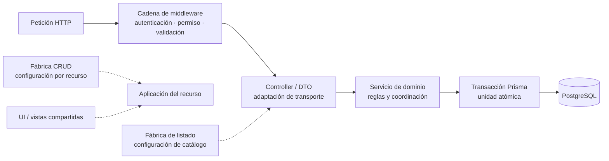

# Convenciones y patrones para diagramas

## Propósito

Los diagramas de Nexus también siguen patrones, pero se distingue entre:

- **patrón de documentación:** forma repetible de construir y leer una vista;
- **patrón presente en el código:** solución reutilizada por la implementación que el
  diagrama representa;
- **notación:** sintaxis visual, actualmente Mermaid.

Usar Mermaid no convierte un diagrama en UML, C4 o una vista conforme con una norma.
Cuando se adopta un patrón conocido se indica su propósito y se conserva el vínculo con
la evidencia del repositorio. No se agregan nombres de patrones sólo para describir una
similitud superficial.

## Dos lecturas complementarias

Nexus separa deliberadamente dos preguntas que no deben resolverse en el mismo nivel de
detalle:

| Lectura | Pregunta | Notación y vocabulario | Fuente |
| --- | --- | --- | --- |
| Funcional | ¿Qué objetivo cumple el actor y qué resultado espera? | Aproximación UML de casos de uso y lenguaje del negocio, sin métodos ni variables. | [Modelo y casos de uso](../requirements/domain-and-use-cases.md#casos-de-uso-vigentes). |
| Ejecución | ¿Qué archivos, símbolos, llamadas y datos ejecutan ese objetivo? | Secuencia Mermaid con semántica UML y notación literal de JavaScript/HTTP cuando corresponde. | [Secuencias backend](backend-code-sequences/index.md) y [secuencias frontend](frontend-code-sequences/index.md). |

El identificador `CU-*` enlaza ambas lecturas, pero no convierte una secuencia técnica en
un diagrama UML de casos de uso. En la lectura funcional se conserva el lenguaje accesible;
en la lectura de ejecución se escriben firmas como `función(argumento)`, métodos HTTP,
rutas, DTO/payload y `tx` cuando esos datos permiten seguir el flujo real. No se añaden
variables locales que no cambien una colaboración, decisión o resultado observable.

## Patrón mínimo de cada diagrama

Antes de crear otro diagrama se reutiliza una vista existente si responde la misma
pregunta. Si se necesita uno nuevo, debe quedar claro —en el título o texto inmediato—:

1. **pregunta y lector:** qué decisión ayuda a revisar y para quién;
2. **alcance:** sistema, contenedor, dominio, flujo, estado, datos o implementación;
3. **fuente de verdad:** decisión curada, router/import, esquema Prisma o requisito;
4. **semántica:** significado de nodos, flechas, estilos, estados y relaciones;
5. **nivel de detalle:** no mezclar contexto de negocio con clases, tablas o funciones;
6. **mantenimiento:** evento que obliga a editarlo o regenerarlo y comprobación
   aplicable.

Todo diagrama curado tiene un identificador estable registrado en el
[inventario de diagramas](diagram-inventory.md). Los diagramas de un caso de uso usan
`DIA-REQ-CU-<identificador CU>`; las demás vistas usan
`DIA-<familia>-<tipo>-<número>`. El título indica su semántica (contexto, contenedores,
componentes, secuencia, actividad, estados, ER, navegación o flujo), porque `flowchart`
es sólo la sintaxis Mermaid y no convierte todas esas vistas en el mismo tipo.
Las colecciones canónicas que aplican código a todos los casos usan
`DIA-FE-CU-<grupo>-<secuencia>` o `DIA-BE-CU-<grupo>-<secuencia>`. La documentación
técnica enlaza esas vistas en vez de mantener una segunda secuencia por caso. El
segmento `TEC` se reserva para una vista complementaria que responda otra pregunta,
como un ciclo de estados, y no para duplicar el mismo recorrido por capas.
Cada recorrido contextual usa una secuencia para hacer visible el orden del código. Una
actividad `flowchart` se conserva sólo cuando existen decisiones que cambian el camino;
una vista de estados se agrega cuando el caso tiene un ciclo técnico relevante. No se
mantiene un `flowchart` lineal si comunica menos que la secuencia equivalente.
El detalle de una secuencia se incorpora de forma progresiva: primero se identifican
los participantes y el camino exitoso, después se añaden únicamente las validaciones,
alternativas, transacciones o efectos que cambian la interpretación del caso. Los
nombres de archivos van en participantes y los símbolos ejecutados en mensajes, no
en párrafos dentro de una sola etiqueta. Si para explicar una colaboración reutilizada hiciera falta
repetirla en varios casos, se enlaza su vista `DIA-PAT-*` y la secuencia del caso conserva
sólo la invocación y el resultado observable.
En cada documento de arquitectura, los diagramas asociados con `CU-*` siguen el orden
del catálogo de casos de uso; si un caso necesita más de una vista, permanecen juntas,
y las vistas transversales sin caso se ubican después. En mensajes y etiquetas de
`sequenceDiagram` se evita el punto y coma, porque GitHub puede interpretarlo como un
separador de sentencias; se usa una coma o una oración nueva.

Las secuencias y actividades técnicas de frontend o backend que implementan casos de
uso se asocian con **un único `CU-*`**. No se permiten participantes alternativos con
“o”, comodines, URLs elípticas ni rangos de casos para convertir un flujo en plantilla.
Los elementos reutilizados se documentan como dependencias o componentes compartidos;
cuando dos casos necesitan vista dinámica, cada diagrama conserva nombres y decisiones
específicos de su implementación.

Cada colección de aplicación al código incluye un índice breve de patrones. El diagrama
de cada caso declara los códigos que aplica, pero esa línea funciona sólo como índice y
no como explicación de la construcción. La secuencia conserva el recorrido concreto:
participantes con archivos o símbolos ejecutables, mensajes con llamadas ordenadas y
datos de frontera, y notas sólo para límites que no caben en un mensaje. La explicación
reutilizable y su secuencia canónica permanecen en el catálogo de patrones. Así una
refactorización se revisa primero en `DIA-PAT-*` y sus implementaciones, y los casos
afectados se localizan por su línea **Patrones**, sin insertar participantes ficticios
ni presentar el resumen del patrón como evidencia suficiente.

En secuencias, `actor` se reserva para una persona, rol o sistema externo autónomo que
inicia o recibe una interacción. Navegador, EJS, router, controller, servicio y base de
datos son `participant`. Una secuencia técnica puede omitir al actor humano cuando su
límite empieza en HTTP y enlaza el `CU-*` que ya lo identifica; una secuencia de
experiencia completa sí debe mostrar el actor canónico del caso. No se cambia el actor
por «Usuario» si el requisito distingue Almacén de Administración.

Los participantes de las secuencias técnicas combinan la figura de Mermaid con una
etiqueta sólo cuando hace falta aportar semántica que la figura no posee. La figura
`control` identifica por sí sola el adaptador que recibe la interacción (controller HTTP
o frontera API que lo contiene), por lo que **no** repite el estereotipo
`«controller»`. `«object»` se reserva para un objeto JSON o una instancia de clase que
forme parte del modelo de dominio; no identifica archivos, módulos, servicios, vistas,
helpers ni funciones. Cuando un controller crea un DTO JSON que interviene en el
recorrido, la secuencia lo incorpora como participante `«object»`, nombra la variable
concreta y mantiene el archivo `src/dtos/` que prueba su construcción. Los demás
participantes ejecutables se identifican sólo por sus archivos y el símbolo exacto se
muestra en el mensaje que representa su ejecución.

La distinción visual combina los tipos de participante de Mermaid con la notación UML de
estereotipos. Un controller se declara como
`participant Controller@{ "type": "control" }` y su nombre de archivo basta en la
cabecera. Un objeto conserva la figura rectangular estándar de `participant` y muestra
`«object»`: en UML de secuencia el rectángulo con línea de vida representa una instancia,
y `object` no es un tipo nativo de Mermaid. No debe sustituirse por `entity`, que expresa
una entidad de dominio y no cualquier objeto o DTO. Tampoco se usa `actor` para simular
otra figura, pues representa una persona, rol o sistema externo autónomo. Así, la forma
aporta la diferencia visible cuando la notación la ofrece y el estereotipo se conserva
sólo para la clasificación que Mermaid no puede expresar directamente.

### Cómo leer las figuras y fragmentos de una secuencia

| Elemento | Representación | Significado en Nexus |
| --- | --- | --- |
| Actor | Figura humana declarada con `actor` | Persona, rol o sistema externo autónomo que inicia o recibe una interacción. |
| Controlador o frontera | Figura de control declarada con `@{ "type": "control" }` | Adaptador HTTP o frontera API. La figura reemplaza el estereotipo textual `«controller»`. |
| Objeto/DTO | Rectángulo de `participant`, etiqueta `«object»`, variable y archivo | Instancia concreta que transporta datos; el rectángulo es la figura UML de objeto en una secuencia. |
| Participante | Rectángulo de `participant` y ruta de archivo | Módulo, vista, servicio o helper propietario de las acciones enviadas a su línea de vida; no implica un objeto de dominio. |
| Base de datos | Figura `database` cuando se necesita distinguir persistencia | Almacén persistente externo al proceso. Si agrupa Prisma/PostgreSQL, los mensajes aclaran la operación. |
| Línea de vida | Línea vertical discontinua bajo cada cabecera | Existencia del participante en el intervalo representado, leído de arriba hacia abajo. |
| Activación | Barra vertical entre `activate` y `deactivate` | Periodo en que un participante controla la colaboración; no expresa duración real. |
| Mensaje síncrono | Flecha continua `->>` | Llamada o interacción cuyo orden importa. El texto nombra la acción, firma o datos de frontera. |
| Respuesta | Flecha discontinua `-->>` | Resultado, estado HTTP, payload o error observable. |
| Auto-mensaje | Flecha que vuelve al mismo participante | Validación o regla dentro del mismo archivo, sin inventar otro componente. |
| `alt` / `else` | Fragmento combinado con ramas | Caminos mutuamente excluyentes elegidos por una condición. |
| `opt` | Fragmento combinado de una rama | Comportamiento opcional que sólo ocurre si se cumple su guarda. |
| `loop` | Fragmento combinado repetitivo | Repetición cuya condición o colección debe aparecer en la guarda. |
| `par` | Fragmento combinado paralelo | Interacciones independientes; no se usa para acciones esperadas en serie. |
| `break` / `critical` | Interrupción o región crítica | Terminación anticipada o sección que no debe intercalarse; sólo si el código posee esa semántica. |
| `rect` | Fondo que agrupa mensajes | Límite visual, por ejemplo una transacción; solo no crea participante, fragmento UML ni atomicidad. |
| `Note` | Nota anclada a participantes | Aclaración de variables, guardas o límites; no representa ejecución. |

Un **componente** de la secuencia es uno de sus participantes ejecutables; su cabecera
identifica la responsabilidad y su línea de vida recibe mensajes. Un **fragmento**
organiza mensajes (`alt`, `opt`, `loop`, `par`, `break` o `critical`) y no es un
componente. El marco completo fija el intervalo y el alcance del caso. Los tipos
`boundary`, `entity`, `collections` y `queue` de Mermaid sólo se usan si el elemento real
tiene, respectivamente, semántica de frontera, entidad, colección o cola; no decoran
módulos ordinarios.

### Cómo leer las figuras de los demás diagramas

| Tipo de vista | Figuras y componentes | Relaciones y fragmentos |
| --- | --- | --- |
| Contexto/contenedores | Rectángulos para personas, Nexus, procesos o contenedores; subgrafos para límites de ejecución. | Flecha continua: comunicación. Línea discontinua: dependencia propuesta, indirecta o de configuración según la leyenda local. |
| Componentes | Rectángulo `class` con `<<component>>` para una unidad sustituible y subgrafo para una capa o dominio. | Flecha: dependencia dirigida, no secuencia temporal. Mermaid aproxima UML y no expresa puertos o interfaces formales. |
| Casos de uso | Nodo externo `«actor»`, nodo de objetivo y subgrafo como límite de Nexus o agrupación funcional. | Línea sin texto: asociación; `«include»`/`«extend»`: relaciones UML; generalización: herencia de participación. |
| Actividad/flujo | Rectángulo: acción; rombo: decisión; círculo: inicio/fin cuando esté declarado; subgrafo: fase o responsable. | Flecha: orden y guarda; toda rama debe rotular su condición. |
| Estados | Estado inicial/final y rectángulos redondeados para estados observables; estado compuesto si agrupa un ciclo real. | Flecha: transición causada por evento o condición, no llamada de código. |
| Clases/dominio | Clase o concepto con compartimentos; rombo lleno para composición. | Línea: asociación; punta: dirección; multiplicidades: cantidad de instancias relacionadas. |
| Entidad-relación | Rectángulo: entidad/tabla con atributos; `PK`, `FK` y `UK` califican columnas. | Pata de cuervo y barra/círculo: cardinalidad y obligatoriedad; no representan flujo. |
| Despliegue | Subgrafo: entorno o nodo; rectángulo: proceso, servicio o artefacto; cilindro: almacén. | Flecha: canal de comunicación; línea discontinua: topología objetivo si la leyenda lo declara. |
| Navegación | Rectángulo: pantalla/destino; estado: condición de sesión en `stateDiagram-v2`. | Flecha: navegación permitida o transición de acceso, no import ni invocación interna. |
| Dependencias/trazabilidad | Rectángulo: artefacto, área o evidencia; otra forma sólo si la leyenda le asigna semántica. | Flecha: import, dependencia o evidencia exactamente según el título y la leyenda local. |

Esta tabla define el vocabulario común, pero cada vista conserva una explicación inmediata
de su alcance y de cualquier color, línea o figura adicional. No se intercambian figuras
entre tipos sólo por semejanza visual: un cilindro no representa un servicio, un rombo no
es una actividad y una flecha de estados no equivale a una llamada.

Para que una secuencia sea detallada sin mezclar niveles, se aplican estas reglas:

- cada alias de participante representa una responsabilidad estable y su etiqueta nombra
  el archivo u objeto concreto del caso, no una función, endpoint ni oración sobre el
  resultado;
- los mensajes nombran una acción concreta y mantienen el orden comprobable;
- las llamadas se escriben como `objeto.metodo(variable)` o `funcion(variable)`, no como
  una descripción sin firma; cuando un participante agrupa ruta y controller, su etiqueta
  nombra ambos archivos y el mensaje nombra el símbolo del controller;
- las variables de frontera que condicionan la llamada (`id`, `detailId`, payload,
  filtros, DTO o `tx`) se nombran en el diagrama; los temporales internos que no cambian
  la colaboración se consultan en el código enlazado;
- `alt`/`opt` se usa sólo para una decisión que cambia el recorrido y `rect` sólo para
  señalar un límite relevante, como una transacción;
- las respuestas discontinuas muestran resultados o errores observables, no repiten la
  llamada anterior;
- una vista que exceda aproximadamente siete participantes se divide por responsabilidad
  o se complementa con una vista estructural, en lugar de reducir su legibilidad;
- el detalle mecánico que no altera coordinación permanece en texto, tablas o código.

Los identificadores Mermaid deben ser estables y descriptivos (`apiRoutes`,
`goodsIssues`), mientras la etiqueta puede estar en español.

#### Nomenclatura verificable de participantes

En las colecciones `DIA-BE-CU-*` y `DIA-FE-CU-*`, cada `participant` que representa
código del repositorio muestra la ruta completa `src/.../<archivo>.js` o `.ejs`. La ruta
conserva exactamente el `camelCase`, directorio y sufijo de capa presentes en el código
(`ApiRoute`, `Controller`, `Service`, `DTO`, `UI`, etc.); no se reemplaza con traducciones
como “Servicio de inventario” o con el nombre aislado de una función. Si una
responsabilidad requiere dos archivos, ambos se enumeran en la misma etiqueta sólo
cuando actúan como un único participante y el mensaje permite reconocer qué símbolo se
ejecuta.

Los alias Mermaid usan `PascalCase` descriptivo (`Controller`, `Inventory`, `Request`) y
son identificadores locales del diagrama, no nombres nuevos del código. `actor` conserva
el rol humano canónico. Los límites externos que no corresponden a un archivo del
repositorio —`Navegador`, `Cliente HTTP / web`, `Prisma / PostgreSQL` y la respuesta de
Express— pueden mostrarse sin ruta; no deben usarse para ocultar un módulo interno.
`npm run docs:check` valida que cada ruta declarada exista y que ningún otro participante
interno quede identificado sólo por una etiqueta genérica.

Los mensajes entre participantes internos nombran el símbolo ejecutado con su firma
observable y las variables que cruzan la llamada, por ejemplo
`loginUser({ name, password })` o `editMaterialStockRequest({ data: formData, id })`.
Las escrituras muestran `tx` cuando se propaga y las respuestas nombran el resultado o
error observable. No se inventa una función para describir una regla interna: si la regla
no tiene símbolo propio, se expresa como una auto-llamada del archivo propietario con los
datos que evalúa. Los mensajes iniciados por un actor o dirigidos a un límite externo
pueden conservar lenguaje de interacción, pero no sustituyen las llamadas ejecutables.
Cada secuencia contiene al menos dos firmas de código comprobables; `npm run docs:check`
rechaza recorridos compuestos únicamente por descripciones genéricas.

La orientación se conserva por tipo: `LR` para recorridos y dependencias, `TB` para capas
o descomposición. Los subgrafos representan un límite real y no se usan sólo como
decoración.

### Organización por Viewpoint/View y revelado progresivo

La familia de arquitectura aplica un patrón documental **Viewpoint/View**: cada punto de
vista fija pregunta, lectores y reglas de representación; cada vista responde esa
pregunta para Nexus. Se combina con revelado progresivo para navegar de lo general a lo
particular sin producir un diagrama único e ilegible:

1. **contexto:** actores, Nexus y sistemas externos;
2. **contenedores y despliegue:** lugares de ejecución y comunicación;
3. **estructura interna:** superficie HTTP, dominios, capas y componentes;
4. **dinámica:** petición representativa y coordinaciones complejas;
5. **reutilización:** fábricas, composición y componentes compartidos;
6. **detalle mecánico:** rutas, imports y modelos en artefactos generados.

No es un patrón GoF ni altera el código. Organiza vistas y hace visibles patrones que sí
existen en la implementación: monolito modular, capas, pipeline de middleware, DTO,
Transaction Script, fábricas configurables, composición y publicación de eventos. La
vista canónica de cada nivel se enlaza en vez de copiarse, aplicando una única fuente de
verdad documental.

## Vistas reutilizadas

| Vista | Patrón o notación | Pregunta que responde | Fuente y actualización |
| --- | --- | --- | --- |
| Contexto | Inspirada en C4, sin afirmar conformidad C4 | ¿Quién usa Nexus y con qué sistemas se comunica? | Decisión curada; cambia al agregar actores o dependencias externas. |
| Contenedores y capas | Capas y separación de responsabilidades | ¿Dónde se ejecuta cada responsabilidad principal? | Arquitectura curada y registro real de capas. |
| Despliegue | Grafo de nodos y entornos de ejecución inspirado en UML | ¿En qué entorno se ejecutan los artefactos y con qué dependencias se comunican? | Decisión operativa, `Dockerfile`, Compose y entrypoint; separa con línea discontinua la topología objetivo aún no versionada. |
| Secuencia | `sequenceDiagram` de Mermaid | ¿Cómo atraviesa las capas un caso concreto? | Flujo curado y asociado con un solo `CU-*`; no se crea si una ficha tabular basta. |
| Navegación | Máquina de estados inspirada en UML para acceso y mapa de sitio dirigido para el menú | ¿Qué transición cambia el estado de acceso y qué destinos ofrece la navegación principal? | Rutas web y `navList`; cambia al modificar sesión, destinos, categorías o permisos. |
| Trazabilidad | Grafo dirigido | ¿Desde dónde se llega a una evidencia? | Requisitos y referencias; la leyenda define el significado de cada enlace. |
| Ciclo CRUD o estados | Máquina de estados | ¿Qué transiciones admite el proceso? | Reglas de negocio; una flecha expresa una transición, no una llamada de código. |
| Entidad-relación | `erDiagram` de Mermaid | ¿Qué estructura persistente y cardinalidades existen? | Generada desde Prisma; Prisma y las migraciones conservan el detalle normativo. |
| Dominio conceptual | Conceptos y relaciones del negocio | ¿Qué lenguaje comparten actores y desarrollo sin introducir tablas o clases técnicas? | Curada con validación funcional; se enlaza con requisitos y persistencia. |
| Casos de uso | Objetivos agrupados por actor | ¿Qué quiere lograr un actor y qué capacidades están disponibles o pendientes? | Curada desde requisitos; no equivale a un inventario de endpoints. |
| Dependencias | Grafo dirigido generado | ¿Qué áreas importan otras áreas? | Generada desde imports relativos bajo `src`; no equivale a una dependencia en ejecución. |

## Diagramas derivados de casos de uso y de código

La revisión separa dos preguntas que no deben resolverse con la misma fuente. Los casos
de uso explican **por qué y para quién** ocurre una operación; el código permite afirmar
**qué está registrado o conectado**. «Generado» significa que el contenido puede
reconstruirse de manera determinista, no que una herramienta deba inventar semántica de
negocio.

| Origen | Diagrama necesario | Estado y ubicación | Razón para generarlo o mantenerlo curado |
| --- | --- | --- | --- |
| Casos `CU-*` | Casos de uso por actor y límite de Nexus | Curado en `domain-and-use-cases.md`. | Actores, objetivos y asociaciones requieren decisión funcional; no se infieren de una ruta. |
| Casos `CU-*` | Flujo de actividad y vista técnica complementaria de cada objetivo | Curado por familia en `requirements-diagrams.md`. | El primero representa escenario exitoso, decisiones y resultado; la segunda hace visible su ejecución entre capas o la bifurcación que el flujo omite, sin fusionar objetivos. |
| Casos con estados | Máquina de estados de salidas, surtimientos y devoluciones | Curada en requisitos. | Los nombres y transiciones combinan reglas y cantidades; el código es evidencia, no única fuente normativa. |
| Casos transaccionales | Secuencia específica cuando la coordinación técnica aporta información adicional | Curada en requisitos o en la referencia técnica correspondiente y enlazada al servicio. | Explica el límite atómico y rollback del caso sin fusionarlo con otra operación. |
| Código de routers | Superficie API/Web por área y método | Curada en `code-diagrams.md` y comprobada contra el mapa de rutas. | Montajes y métodos son verificables, pero la vista se actualiza explícitamente junto al cambio para conservar agrupaciones comprensibles. |
| Código JavaScript | Dependencias entre áreas | Generada en `generated/code-map.md`. | Los `import` relativos permiten reconstruir aristas deterministas. |
| Prisma | Entidad-relación por área | Generada en `generated/database-schema.md`. | Modelos, claves y relaciones pertenecen al esquema versionado. |
| Código + `CU-*` | Trazabilidad de cada caso hacia endpoint, permiso, servicio y prueba | Matriz curada, no diagrama automático por ahora. | Asociar una ruta con un objetivo exige interpretación; coincidir por verbo o nombre produciría falsos vínculos. |

### Diagramas descartados en la revisión

- **Una secuencia genérica aplicada a varios `CU-*`:** ocultaría diferencias de endpoint,
  participantes, modelos y errores. Sólo los casos cuya coordinación aporta información
  necesitan vista técnica; cuando existe, ésta nombra exclusivamente los elementos del
  objetivo documentado y la reutilización queda en la ficha o vista estructural.
- **Un diagrama de clases generado desde JavaScript:** la aplicación no declara clases de
  dominio equivalentes al modelo conceptual; los imports no permiten inferirlas.
- **Casos de uso generados desde endpoints:** `POST`, `PATCH` o `GET` no revelan actor,
  intención, precondición ni resultado esperado.
- **Permisos inferidos desde vistas o nombres de carpeta:** la autorización efectiva
  depende de middleware y configuración; debe verificarse en la matriz de operaciones.
- **Un grafo con los 61 endpoints como nodos:** el inventario tabular conserva el detalle
  de forma más legible; el diagrama curado agrupa la superficie por área y operación.

Al agregar un caso se actualizan las vistas curadas y su trazabilidad. Al cambiar un
router también se revisa manualmente `code-diagrams.md`; al cambiar rutas, imports o
Prisma se ejecuta además `npm run docs:architecture` para comprobar los inventarios. Si
una asociación caso-código llega a tener una fuente declarativa versionada, podrá
generarse entonces; hasta ese momento permanece curada para no presentar heurísticas
como hechos.

Contexto y contenedores pueden inspirarse en C4, y secuencias o estados pueden usar
conceptos habituales de UML, pero se documenta sólo la semántica realmente empleada.
ISO/IEC/IEEE 42010 orienta la separación entre preocupaciones, puntos de vista y vistas;
no obliga a utilizar UML, C4, Mermaid ni una herramienta concreta.

## Inventario de notación UML

La revisión de las vistas vigentes evita llamar UML a cualquier bloque Mermaid. No
faltan diagramas para describir el alcance actual, pero sí es necesario distinguir los
que usan notación UML de los que sólo adoptan una semántica parecida:

| Vista | Clasificación vigente | ¿Falta notación UML? |
| --- | --- | --- |
| Modelo conceptual del dominio | UML de clases (`classDiagram`), con multiplicidades, asociaciones y composiciones. | No. |
| Componentes de la aplicación | Aproximación UML de componentes mediante clases con el estereotipo `<<component>>`; Mermaid no ofrece un diagrama de componentes nativo. | Parcial; migrar a una herramienta UML sólo si se necesitan puertos e interfaces formales. |
| Recorrido de una interacción | UML de secuencia (`sequenceDiagram`), con actor, participantes y mensajes. | No. |
| Estados de acceso y estados de las salidas | UML de máquina de estados (`stateDiagram-v2`). | No. |
| Casos de uso | Aproximación UML mediante `flowchart`: clasificadores externos con estereotipo `«actor»`, grupos funcionales dentro del límite de Nexus, objetivos y asociaciones. Los grupos son ayudas visuales, no paquetes UML. | Parcial; Mermaid no ofrece casos de uso UML nativos. |
| Despliegue actual y objetivo | Grafo inspirado en despliegue UML; sus subgrafos representan entornos y nodos, pero no artefactos UML formales. | Parcial; la semántica actual es suficiente mientras no se documenten artefactos instalados. |
| Contexto, contenedores, capas, navegación, requisitos, trazabilidad y ciclo CRUD | C4 inspirado o grafos dirigidos con semántica local. | No aplica: convertirlos a UML cambiaría la pregunta que responden. |
| Esquema persistente | Entidad-relación (`erDiagram`), no UML. | No aplica: Prisma y las migraciones son la fuente técnica adecuada. |

Por tanto, las únicas brechas de notación son **componentes, casos de uso y
despliegue**, y están declaradas como aproximaciones deliberadas. No se agrega otro
diagrama que duplique su contenido sólo para obtener una etiqueta UML. Si una entrega
contractual exige UML estricto, esas tres vistas deben migrarse juntas a una herramienta
que soporte la notación y conservar los mismos límites y fuentes de verdad.

### Decisión sobre los diagramas de componentes

Se conserva `DIA-ARQ-CMP-001` porque responde la pregunta estructural de arquitectura:
qué componentes principales existen y de cuáles dependen. Las vistas de patrones y las
vistas técnicas aplicadas de backend y frontend descienden después a los elementos que
participan en cada recorrido sin duplicar ese diagrama estructural.

No se necesita un diagrama de componentes por `CU-*`. Cada caso referencia los patrones
aplicados y utiliza su diagrama canónico frontend o backend para mostrar la ruta concreta
hacia la implementación. Se añadirá otra vista de componentes únicamente si aparece
una frontera estable que ninguna vista vigente pueda localizar; agregar
otra por cantidad de casos o por repetir imports produciría documentación duplicada.

### Enlaces entre diagramas y patrones

UML permite expresar dependencias, notas y estereotipos entre elementos de una misma
vista, pero no define que un diagrama se incruste dentro de otro. En Nexus tampoco se
usan enlaces `click` dentro de Mermaid: no funcionan de manera uniforme en GitHub, en
los paquetes exportados ni en todos los renderizadores. Por ello, la relación entre una
vista aplicada y su patrón se documenta como metadato Markdown inmediatamente antes del
bloque, mediante **Identificador**, **Pregunta** y **Patrones**.

Los códigos `DIA-PAT-*` de **Patrones** apuntan conceptualmente al
[catálogo visual de patrones aplicados](design-and-construction-patterns.md#catálogo-visual-de-patrones-aplicados),
y la matriz técnica enlaza el `DIA-FE-CU-*` o `DIA-BE-CU-*` concreto. Dentro del bloque
se muestran únicamente los participantes, relaciones o mensajes que prueban la
aplicación del patrón; no se agrega un nodo que represente a otro diagrama. Esta forma
conserva navegación, legibilidad y compatibilidad sin confundir una referencia
documental con una relación del modelo.

La relación se resuelve en dos saltos verificables: la línea **Patrones** del caso usa
un código local `FE-P*` o `BE-P*`; el índice rápido de su colección traduce ese código
a una vista estable `DIA-PAT-*` y enlaza su ubicación canónica. El código local expresa
cómo se manifiesta el patrón en esa perspectiva, mientras `DIA-PAT-*` conserva una sola
explicación y representación del patrón compartido. Si un patrón no tiene evidencia
suficiente para una vista canónica, no se incorpora al índice aplicado.

Esta es una convención documental de Nexus, no una sintaxis exigida por UML o por una
norma ISO. La aplicación selectiva de ISO/IEC/IEEE 42010 justifica declarar relaciones
entre vistas y mantener correspondencias trazables; ISO/IEC/IEEE 1016 ayuda a relacionar
elementos, interfaces, vistas y justificación del diseño. Ninguna de las dos prescribe
Mermaid, el campo **Patrones**, los códigos `DIA-PAT-*` ni enlaces entre bloques. Esos
mecanismos locales implementan la trazabilidad sin afirmar conformidad formal.

### Simetría de detalle entre secuencias frontend y backend

Las dos colecciones tienen el mismo **nivel de evidencia**, pero no necesitan el mismo
número de participantes ni mensajes. Ambas deben identificar archivos reales, variables
de frontera, al menos dos firmas comprobables y un recorrido ordenado con un mínimo de
siete mensajes. `npm run docs:check` aplica ese piso común a frontend y backend.

Esto no significa que el frontend deba copiar el detalle interno del backend. La revisión
busca una profundidad equivalente dentro de los límites de cada perspectiva:

| Evidencia revisada | Frontend | Backend |
| --- | --- | --- |
| Inicio del recorrido | Evento de navegador, vista o módulo UI. | Petición HTTP y ruta registrada. |
| Coordinación propia | Validación visual, aplicación, servicio de request y cliente HTTP, cada uno con su archivo. | Middleware, controller/DTO y servicio de dominio. |
| Frontera compartida | Método, endpoint, payload o parámetros enviados. | Método, endpoint y datos recibidos desde `req`. |
| Resultado | Respuesta normalizada, error y efecto visible. | Persistencia o efecto, respuesta HTTP y propagación de error. |

Una fila ausente indica una brecha de detalle en su perspectiva; que sólo aparezca en la
otra colección no obliga a duplicarla. Por ejemplo, una transacción pertenece al backend
y el cambio de modo de un formulario pertenece al frontend.

El contenido se detiene en la responsabilidad de cada perspectiva:

- frontend muestra interacción, recolección o validación, aplicación, servicio HTTP,
  respuesta o error normalizado y efecto visible;
- backend muestra ruta y middleware, controller/DTO, servicio, persistencia o efecto,
  respuesta HTTP y propagación del error;
- una coordinación especializada se agrega sólo donde realmente ocurre. El frontend no
  reproduce transacciones o consultas internas del servidor, y el backend no simula
  estados visuales del navegador para igualar artificialmente el tamaño del diagrama.

Por tanto, la paridad se evalúa por trazabilidad y resultado observable, no por igualdad
gráfica. Si un flujo frontend contiene una factory, un adaptador, validación especializada
o coordinación de UI relevante, esos participantes sí se muestran; los temporales
mecánicos permanecen en el código igual que en backend.

## Patrones de implementación que deben verse en los diagramas

Los diagramas de arquitectura muestran soluciones que sí tienen evidencia en el
código. La relación vigente es:

| Patrón o estrategia | Cómo se representa | Evidencia principal |
| --- | --- | --- |
| Arquitectura por capas | Recorrido `route/middleware → controller/DTO → service → Prisma`. | `src/routes`, `src/controllers`, `src/dtos`, `src/services`, `src/lib/prisma.js` |
| Organización por dominio | Subgrafos o nombres coherentes para `admin`, `sales` y `warehouse`; no una vista distinta por operación CRUD. | Directorios de rutas, controllers, servicios, páginas y aplicaciones. |
| Cadena de middleware | Pasos ordenados de autenticación, autorización y validación antes del controller. | Routers bajo `src/routes/api` y middleware bajo `src/middleware`. |
| Fábrica CRUD | Un proceso común con configuración por recurso; las diferencias de contexto no duplican el ciclo. | `src/public/js/application/createCrudApplication.js` y sus consumidores. |
| Fábrica de listado | Un controlador de listado parametrizado para catálogos equivalentes. | `src/controllers/api/createDataTableListController.js` y controllers de catálogos. |
| Contexto transaccional | Propagación del cliente `tx` o selección de Prisma sin afirmar un Repository completo. | `src/repository/baseRepository.js` |
| Transacción atómica | Un límite de transacción rodea cambios relacionados de documento, detalle, stock y movimiento. | Servicios que usan `getDb().$transaction(...)`. |
| Componentes de presentación compartidos | Una pieza independiente del recurso puede aparecer como dependencia común, sin replicar cada inclusión EJS. | `src/views/shared`, `src/public/js/ui` y `src/public/js/plugins`. |

Las flechas continuas describen el recorrido de una solicitud; las discontinuas indican
configuración o reutilización. El diagrama no afirma que todas las rutas usen todas las
fábricas: muestra los puntos de extensión disponibles que deben revisarse antes de
crear otro flujo.

La clasificación, límites y reglas de reutilización se detallan en
[patrones de diseño y construcción](design-and-construction-patterns.md). Este documento
visual sólo resume los patrones que necesitan aparecer en diagramas.

## Reglas para código que genera diagramas

El generador sigue el patrón **extraer → normalizar → representar → comprobar/escribir**:

1. extrae rutas e imports desde `src` y modelos desde `prisma/schema.prisma`;
2. normaliza rutas, áreas, entidades y relaciones en estructuras intermedias;
3. representa tablas y bloques Mermaid mediante funciones sin modificar las fuentes;
4. con `--check` compara el resultado esperado sin escribir, y sin esa opción actualiza
   únicamente `docs/generated`.

Para extenderlo se reutilizan funciones de recorrido y representación antes de crear
otro script. Las listas como `SOURCE_AREAS` y `DATABASE_AREAS` son configuración
declarativa; una nueva área se incorpora allí y debe producir una salida determinista.
Los elementos y relaciones se ordenan para evitar diferencias accidentales. El código
generador nunca debe inferir actores, motivaciones, permisos efectivos o decisiones de
negocio: ésas permanecen en diagramas curados.

## Revisión

Todo cambio de diagrama debe comprobar:

- que no duplica una vista existente con otro nombre;
- que la abstracción coincide con el código actual y no presenta una propuesta como
  implementada;
- que un nuevo contexto reutiliza el patrón CRUD, fábrica o componente aplicable;
- que los requisitos y pruebas CRUD relacionados siguen enlazados en su ubicación
  definida por `service-test-coverage.md`;
- que `npm run docs:check` valida los diagramas generados y la cobertura de los casos
  curados frontend/backend contra el catálogo; la sintaxis y lectura visual de los
  bloques curados se revisan además en la vista previa de Mermaid.
