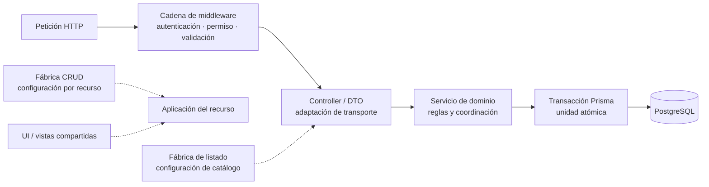

# Patrones de implementación que deben verse en los diagramas

Los diagramas de arquitectura muestran soluciones que sí tienen evidencia en el
código. La relación vigente es:

| Patrón o estrategia | Cómo se representa | Evidencia principal |
| --- | --- | --- |
| Arquitectura por capas | Recorrido `route/middleware → controller/DTO → service → Prisma`. | `src/routes`, `src/controllers`, `src/dtos`, `src/services`, `src/lib/prisma.js` |
| Organización por dominio | Subgrafos o nombres coherentes para `admin`, `sales` y `warehouse`; no una vista distinta por operación CRUD. | Directorios de rutas, controllers, servicios, páginas y aplicaciones. |
| Cadena de middleware | Pasos ordenados de autenticación, autorización y validación antes del controller. | Routers bajo `src/routes/api` y middleware bajo `src/middleware`. |
| Fábrica CRUD | Un proceso común con configuración por recurso; las diferencias de contexto no duplican el ciclo. | `src/public/js/application/createCrudApplication.js` y sus consumidores. |
| Fábrica de listado | Un controlador de listado parametrizado para catálogos equivalentes. | `src/controllers/api/createDataTableListController.js` y controllers de catálogos. |
| Contexto transaccional | Propagación del cliente `tx` o selección de Prisma sin afirmar un Repository completo. | `src/repository/baseRepository.js` |
| Transacción atómica | Un límite de transacción rodea cambios relacionados de documento, detalle, stock y movimiento. | Servicios que usan `getDb().$transaction(...)`. |
| Componentes de presentación compartidos | Una pieza independiente del recurso puede aparecer como dependencia común, sin replicar cada inclusión EJS. | `src/views/shared`, `src/public/js/ui` y `src/public/js/plugins`. |

Las flechas continuas describen el recorrido de una solicitud; las discontinuas indican
configuración o reutilización. El diagrama no afirma que todas las rutas usen todas las
fábricas: muestra los puntos de extensión disponibles que deben revisarse antes de
crear otro flujo.

La clasificación, límites y reglas de reutilización se detallan en
[patrones de diseño y construcción](../design-and-construction-patterns/index.md). Este documento
visual sólo resume los patrones que necesitan aparecer en diagramas.
