# Diagramas de secuencia del código frontend

Esta colección **no es un catálogo de diagramas de casos de uso**. Es la lectura técnica
complementaria del catálogo funcional: cada `CU-*` aporta trazabilidad, mientras Mermaid
muestra la ejecución entre vista/UI, aplicación, request y endpoint. Para entender el
objetivo y la interacción con lenguaje de negocio se consulta primero el [modelo y los
diagramas funcionales de casos de uso](../requirements/domain-and-use-cases.md#casos-de-uso-vigentes).

La [matriz técnica de frontend](frontend-technical-documentation.md#aplicación-de-todos-los-casos-al-código-frontend)
es el índice único de trazabilidad: relaciona caso, interacción, implementación y
diagrama. Esta colección no vuelve a copiar esa relación en cada sección. Los
participantes identifican archivo, objeto y símbolo. `«object»` marca los módulos UI y de
aplicación, mientras `«controller»` marca la frontera API y el controller backend que
recibe cada request sin abrir otra línea de vida. El archivo y el método exactos se
mantienen debajo del estereotipo. Así, la vista
mantiene normalmente cuatro responsabilidades bien separadas —navegador, objeto UI,
objetos de aplicación/request y frontera API/controller— en lugar de representar cada
archivo auxiliar como otra entidad. Los mensajes conservan métodos y requests en orden y
las notas nombran los datos de frontera
(`id`, `detailId`, `formData`/payload, parámetros y filtros). Los temporales mecánicos
permanecen en el código. Cada caso mantiene una secuencia específica aunque reutilice
una factory o componente, porque cambian módulos, firmas, rutas, datos o efectos.

### Regla de identificación y lectura

El encabezado `CU-<grupo>-<número>` enlaza directamente la ficha funcional del mismo
identificador. El diagrama de esa sección se identifica de forma determinista como
`DIA-FE-CU-<grupo>-<número>`; por ejemplo, la sección `CU-ENT-02` contiene
`DIA-FE-CU-ENT-02`. La matriz técnica mantiene el enlace navegable y la evidencia de
código. Aquí se conserva solamente la información propia de la vista: patrones,
participantes, eventos, payload, requests y resultado visible. El objetivo, actor y
flujo de negocio no se repiten porque pertenecen a la ficha del caso de uso.

## Índice rápido de patrones por caso

Cada caso conserva una línea **Patrones** con códigos de este índice y enlaza el
[catálogo canónico](design-and-construction-patterns.md#resumen-de-patrones-confirmados).
La referencia identifica las soluciones aplicadas sin repetirlas dentro de Mermaid. La
implementación se reconoce directamente por las rutas `src/...`, símbolos y llamadas
del recorrido concreto.

| Código | Patrón aplicado | Elementos que permiten reconocerlo |
| --- | --- | --- |
| `FE-P01` | Capas del navegador | Página/UI → aplicación → servicio HTTP → endpoint. |
| `FE-P02` | Factory CRUD | `createCrudApplication` configurada con requests y claves del recurso. |
| `FE-P03` | Factory/adaptador de catálogo | `createApplicationList` + request y transformación de opciones. |
| `FE-P04` | Mutación por composición | Operación adicional incorporada al CRUD sin herencia. |
| `FE-P05` | Composición de salidas | `createIssueApplication` configurada para material o merma. |
| `FE-P06` | UI de devolución compartida | `issueReturnUI` parametrizada por el contexto de la salida. |
| `FE-P07` | Consulta tabular | DataTable + filtros + aplicación de lectura contextual. |
| `FE-P08` | Factory de reporte | `createReportApplication` + `buildExcelButton` y request de descarga. |
| `FE-P09` | Navegación compuesta | Formulario o layout común coordina navegación/sesión sin duplicar el endpoint. |

### Cobertura de casos frontend

La comparación con el catálogo y la matriz técnica confirma que cada identificador
aparece una vez, conserva su referencia de patrones y contiene un bloque Mermaid.

| Grupo | Rango cubierto | Diagramas | Estado |
| --- | --- | ---: | --- |
| Autenticación | `CU-AUT-01..02` | 2 | Completo |
| Identidad y acceso | `CU-IDA-01..09` | 9 | Completo |
| Catálogos | `CU-CAT-01..20` | 20 | Completo |
| Entradas | `CU-ENT-01..05` | 5 | Completo |
| Salidas | `CU-SAL-01..12` | 12 | Completo |
| Consultas y reportes | `CU-REP-01..15` | 15 | Completo |
| **Total** | `CU-AUT-01..CU-REP-15` | **63** | **63 de 63** |

## `CU-AUT-01`

**Patrones:** `FE-P01`, `FE-P09`.

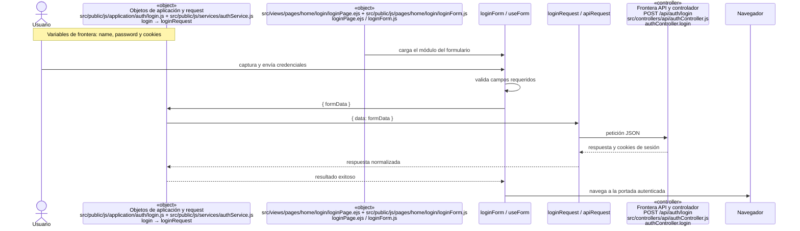

## `CU-AUT-02`

**Patrones:** `FE-P09`.

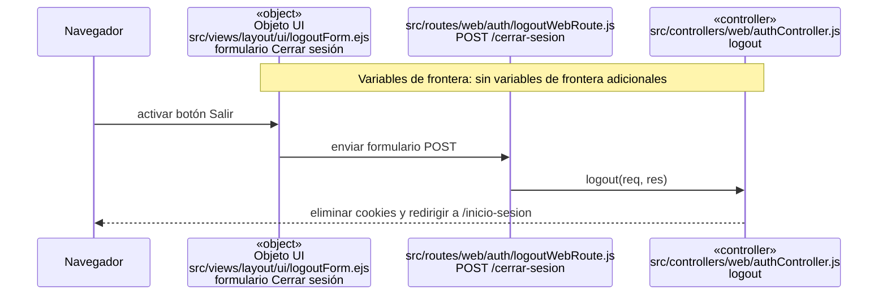

## `CU-IDA-01`

**Patrones:** `FE-P02`.

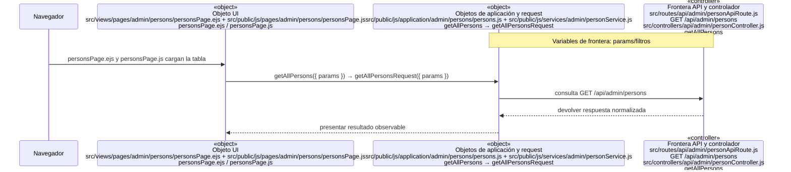

## `CU-IDA-02`

**Patrones:** `FE-P02`.

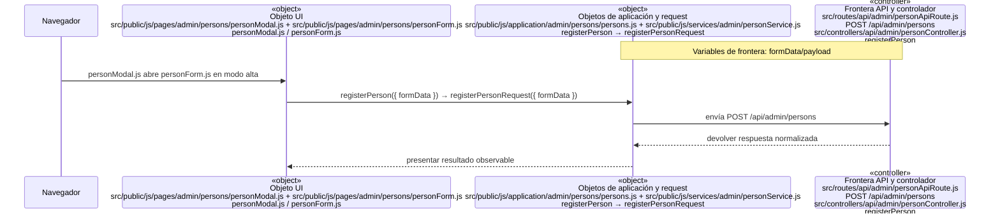

## `CU-IDA-03`

**Patrones:** `FE-P02`.

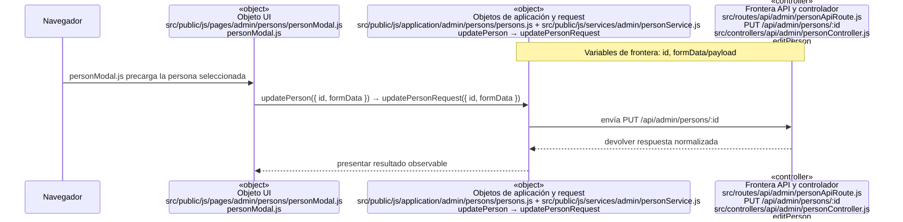

## `CU-IDA-04`

**Patrones:** `FE-P02`.

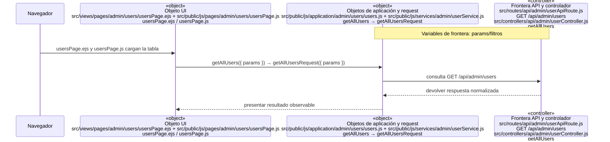

## `CU-IDA-05`

**Patrones:** `FE-P02`.


## `CU-IDA-06`

**Patrones:** `FE-P02`.

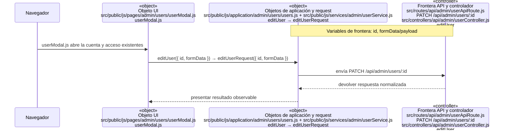

## `CU-IDA-07`

**Patrones:** `FE-P02`.

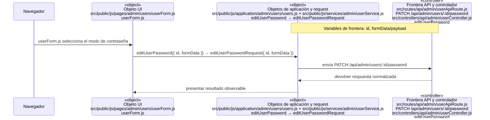

## `CU-IDA-08`

**Patrones:** `FE-P03`.

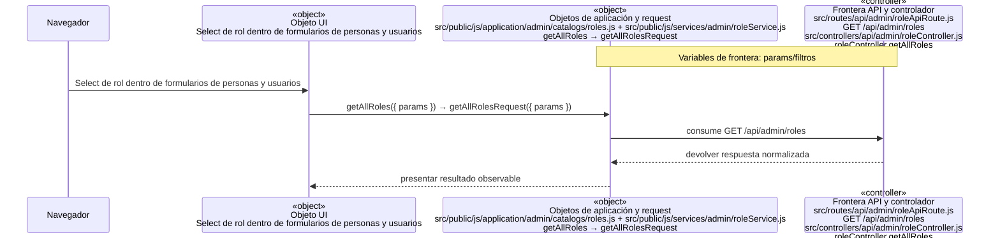

## `CU-IDA-09`

**Patrones:** `FE-P03`.

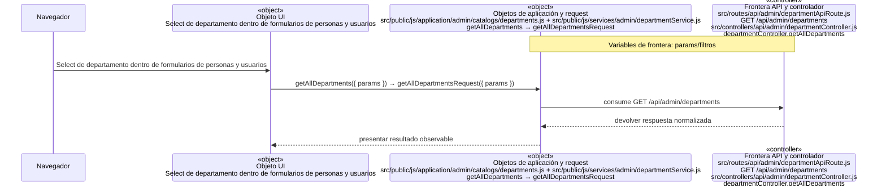

## `CU-CAT-01`

**Patrones:** `FE-P02`.

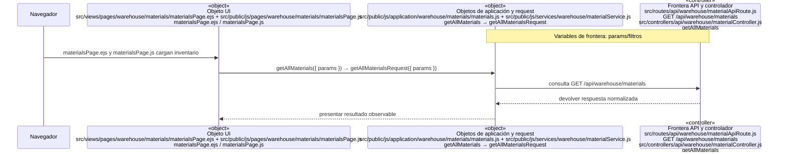

## `CU-CAT-02`

**Patrones:** `FE-P02`.

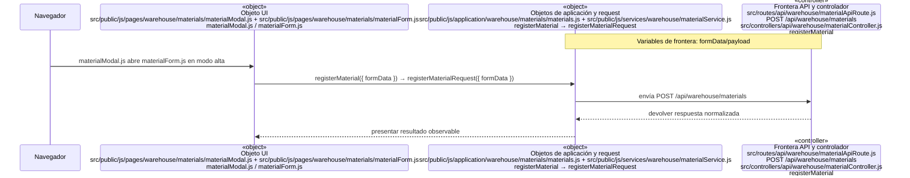

## `CU-CAT-03`

**Patrones:** `FE-P02`.

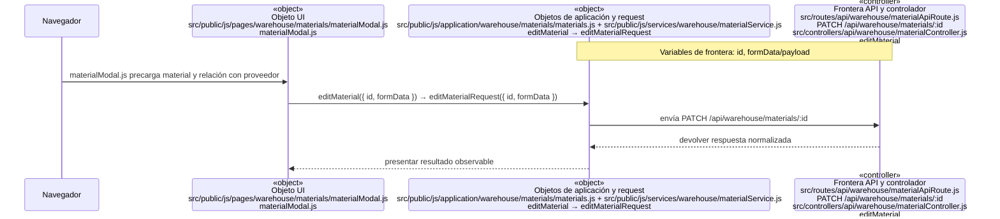

## `CU-CAT-04`

**Patrones:** `FE-P02`.

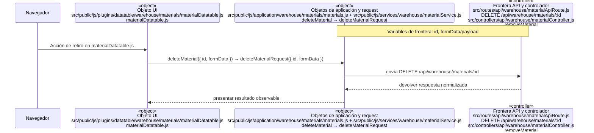

## `CU-CAT-05`

**Patrones:** `FE-P02`.

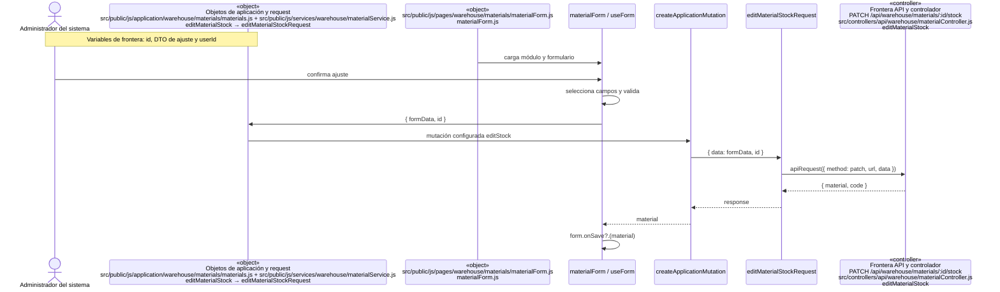

## `CU-CAT-06`

**Patrones:** `FE-P02`.

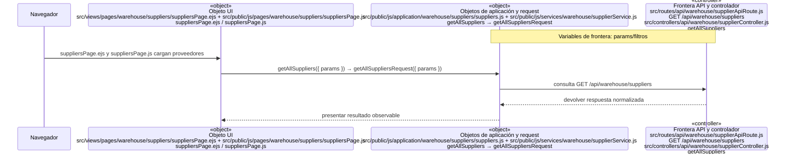

## `CU-CAT-07`

**Patrones:** `FE-P02`.

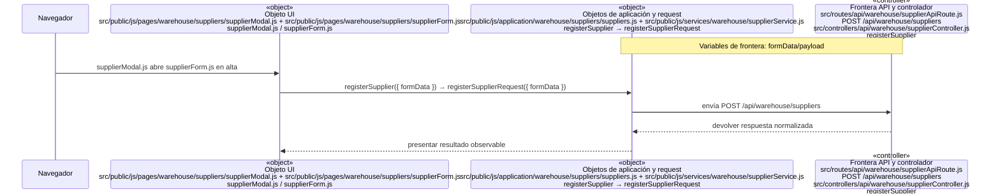

## `CU-CAT-08`

**Patrones:** `FE-P02`.

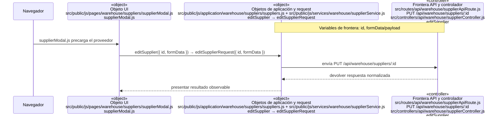

## `CU-CAT-09`

**Patrones:** `FE-P02`.

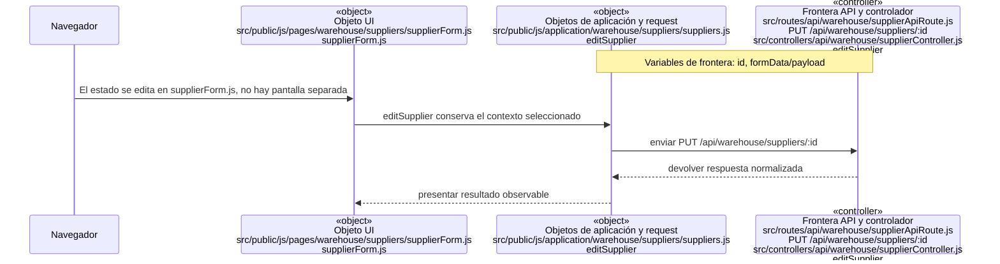

## `CU-CAT-10`

**Patrones:** `FE-P02`.

```mermaid
sequenceDiagram
    participant Browser as Navegador
    participant View as «object»<br/>Objeto UI<br/>src/views/pages/sales/clients/clientsPage.ejs + src/public/js/pages/sales/clients/clientsPage.js<br/>clientsPage.ejs / clientsPage.js
    participant Application as «object»<br/>Objetos de aplicación y request<br/>src/public/js/application/sales/clients/clients.js + src/public/js/services/sales/clientService.js<br/>getAllClients → getAllClientsRequest
    participant Transport as «controller»<br/>Frontera API y controlador<br/>src/routes/api/sales/clientApiRoute.js<br/>GET /api/sales/clients<br/>src/controllers/api/sales/clientController.js<br/>getAllClients
    Note over Application,Transport: Variables de frontera: params/filtros

    Browser->>View: clientsPage.ejs y clientsPage.js cargan clientes
    View->>Application: getAllClients({ params }) → getAllClientsRequest({ params })
    Application->>Transport: consulta GET /api/sales/clients
    Transport-->>Application: devolver respuesta normalizada
    Application-->>View: presentar resultado observable
```

## `CU-CAT-11`

**Patrones:** `FE-P02`.

```mermaid
sequenceDiagram
    participant Browser as Navegador
    participant View as «object»<br/>Objeto UI<br/>src/public/js/pages/sales/clients/clientModal.js + src/public/js/pages/sales/clients/clientForm.js<br/>clientModal.js / clientForm.js
    participant Application as «object»<br/>Objetos de aplicación y request<br/>src/public/js/application/sales/clients/clients.js + src/public/js/services/sales/clientService.js<br/>registerClient → createClientRequest
    participant Transport as «controller»<br/>Frontera API y controlador<br/>src/routes/api/sales/clientApiRoute.js<br/>POST /api/sales/clients<br/>src/controllers/api/sales/clientController.js<br/>registerClient
    Note over Application,Transport: Variables de frontera: formData/payload

    Browser->>View: clientModal.js abre clientForm.js en alta
    View->>Application: registerClient({ formData }) → createClientRequest({ formData })
    Application->>Transport: envía POST /api/sales/clients
    Transport-->>Application: devolver respuesta normalizada
    Application-->>View: presentar resultado observable
```

## `CU-CAT-12`

**Patrones:** `FE-P02`.

```mermaid
sequenceDiagram
    participant Browser as Navegador
    participant View as «object»<br/>Objeto UI<br/>src/public/js/pages/sales/clients/clientModal.js<br/>clientModal.js
    participant Application as «object»<br/>Objetos de aplicación y request<br/>src/public/js/application/sales/clients/clients.js + src/public/js/services/sales/clientService.js<br/>editClient → editClientRequest
    participant Transport as «controller»<br/>Frontera API y controlador<br/>src/routes/api/sales/clientApiRoute.js<br/>PUT /api/sales/clients/:id<br/>src/controllers/api/sales/clientController.js<br/>editClient
    Note over Application,Transport: Variables de frontera: id, formData/payload

    Browser->>View: clientModal.js precarga el cliente
    View->>Application: editClient({ id, formData }) → editClientRequest({ id, formData })
    Application->>Transport: envía PUT /api/sales/clients/:id
    Transport-->>Application: devolver respuesta normalizada
    Application-->>View: presentar resultado observable
```

## `CU-CAT-13`

**Patrones:** `FE-P02`.

```mermaid
sequenceDiagram
    participant Browser as Navegador
    participant View as «object»<br/>Objeto UI<br/>src/views/pages/warehouse/wastes/wastesPage.ejs + src/public/js/pages/warehouse/wastes/wastesPage.js<br/>wastesPage.ejs / wastesPage.js
    participant Application as «object»<br/>Objetos de aplicación y request<br/>src/public/js/application/warehouse/wastes/wastes.js + src/public/js/services/warehouse/wasteService.js<br/>getAllWastes → getAllWastesRequest
    participant Transport as «controller»<br/>Frontera API y controlador<br/>src/routes/api/warehouse/wasteApiRoute.js<br/>GET /api/warehouse/wastes<br/>src/controllers/api/warehouse/wasteController.js<br/>getAllWastes
    Note over Application,Transport: Variables de frontera: params/filtros

    Browser->>View: wastesPage.ejs y wastesPage.js cargan mermas
    View->>Application: getAllWastes({ params }) → getAllWastesRequest({ params })
    Application->>Transport: consulta GET /api/warehouse/wastes
    Transport-->>Application: devolver respuesta normalizada
    Application-->>View: presentar resultado observable
```

## `CU-CAT-14`

**Patrones:** `FE-P02`.

```mermaid
sequenceDiagram
    participant Browser as Navegador
    participant View as «object»<br/>Objeto UI<br/>src/public/js/pages/warehouse/wastes/wasteModal.js + src/public/js/pages/warehouse/wastes/wasteForm.js<br/>wasteModal.js / wasteForm.js
    participant Application as «object»<br/>Objetos de aplicación y request<br/>src/public/js/application/warehouse/wastes/wastes.js<br/>getWasteMaterialTemplates
    participant Transport as «controller»<br/>Frontera API y controlador<br/>src/routes/api/warehouse/wasteApiRoute.js<br/>POST /api/warehouse/wastes<br/>src/controllers/api/warehouse/wasteController.js<br/>getWasteMaterialTemplates / registerWaste
    Note over Application,Transport: Variables de frontera: formData/payload

    Browser->>View: wasteModal.js y wasteForm.js seleccionan una plantilla de material
    View->>Application: getWasteMaterialTemplates prepara datos y registerWaste registra
    Application->>Transport: enviar POST /api/warehouse/wastes
    Transport-->>Application: devolver respuesta normalizada
    Application-->>View: presentar resultado observable
```

## `CU-CAT-15`

**Patrones:** `FE-P02`.

```mermaid
sequenceDiagram
    participant Browser as Navegador
    participant View as «object»<br/>Objeto UI<br/>src/public/js/pages/warehouse/wastes/wasteModal.js<br/>wasteModal.js
    participant Application as «object»<br/>Objetos de aplicación y request<br/>src/public/js/application/warehouse/wastes/wastes.js + src/public/js/services/warehouse/wasteService.js<br/>editWaste → editWasteRequest
    participant Transport as «controller»<br/>Frontera API y controlador<br/>src/routes/api/warehouse/wasteApiRoute.js<br/>PATCH /api/warehouse/wastes/:id<br/>src/controllers/api/warehouse/wasteController.js<br/>editWaste
    Note over Application,Transport: Variables de frontera: id, formData/payload

    Browser->>View: wasteModal.js precarga la merma
    View->>Application: editWaste({ id, formData }) → editWasteRequest({ id, formData })
    Application->>Transport: envía PATCH /api/warehouse/wastes/:id
    Transport-->>Application: devolver respuesta normalizada
    Application-->>View: presentar resultado observable
```

## `CU-CAT-16`

**Patrones:** `FE-P02`.

```mermaid
sequenceDiagram
    participant Browser as Navegador
    participant View as «object»<br/>Objeto UI<br/>src/public/js/pages/warehouse/wastes/wasteForm.js<br/>wasteForm.js
    participant Application as «object»<br/>Objetos de aplicación y request<br/>src/public/js/application/warehouse/wastes/wastes.js + src/public/js/services/warehouse/wasteService.js<br/>editWasteStock → editWasteStockRequest
    participant Transport as «controller»<br/>Frontera API y controlador<br/>src/routes/api/warehouse/wasteApiRoute.js<br/>PATCH /api/warehouse/wastes/:id/stock<br/>src/controllers/api/warehouse/wasteController.js<br/>editWasteStock
    Note over Application,Transport: Variables de frontera: id, formData/payload

    Browser->>View: wasteForm.js usa el modo de ajuste
    View->>Application: editWasteStock({ id, formData }) → editWasteStockRequest({ id, formData })
    Application->>Transport: envía PATCH /api/warehouse/wastes/:id/stock
    Transport-->>Application: devolver respuesta normalizada
    Application-->>View: presentar resultado observable
```

## `CU-CAT-17`

**Patrones:** `FE-P03`.

```mermaid
sequenceDiagram
    participant Browser as Navegador
    participant View as «object»<br/>Objeto UI<br/>src/public/js/pages/warehouse/materials/materialFields.js + src/public/js/pages/warehouse/wastes/wasteFields.js<br/>materialFields.js / wasteFields.js
    participant Application as «object»<br/>Objetos de aplicación y request<br/>src/public/js/application/warehouse/catalogs/presentations.js + src/public/js/services/warehouse/presentationService.js<br/>getAllPresentations → getAllPresentationsRequest
    participant Transport as «controller»<br/>Frontera API y controlador<br/>src/routes/api/warehouse/presentationApiRoute.js<br/>GET /api/warehouse/presentations<br/>src/controllers/api/warehouse/presentationController.js<br/>getAllPresentations
    Note over Application,Transport: Variables de frontera: params/filtros

    Browser->>View: Select de presentación en materialFields.js y wasteFields.js
    View->>Application: getAllPresentations({ params }) → getAllPresentationsRequest({ params })
    Application->>Transport: consume GET /api/warehouse/presentations
    Transport-->>Application: devolver respuesta normalizada
    Application-->>View: presentar resultado observable
```

## `CU-CAT-18`

**Patrones:** `FE-P03`.

```mermaid
sequenceDiagram
    participant Browser as Navegador
    participant View as «object»<br/>Objeto UI<br/>Select de unidad en formularios de material y merma
    participant Application as «object»<br/>Objetos de aplicación y request<br/>src/public/js/application/warehouse/catalogs/unitMeasures.js + src/public/js/services/warehouse/unitMeasureService.js<br/>getAllUnitMeasures → getAllUnitMeasuresRequest
    participant Transport as «controller»<br/>Frontera API y controlador<br/>src/routes/api/warehouse/unitMeasureApiRoute.js<br/>GET /api/warehouse/unit-measures<br/>src/controllers/api/warehouse/unitMeasureController.js<br/>getAllUnitMeasures
    Note over Application,Transport: Variables de frontera: params/filtros

    Browser->>View: Select de unidad en formularios de material y merma
    View->>Application: getAllUnitMeasures({ params }) → getAllUnitMeasuresRequest({ params })
    Application->>Transport: consume GET /api/warehouse/unit-measures
    Transport-->>Application: devolver respuesta normalizada
    Application-->>View: presentar resultado observable
```

## `CU-CAT-19`

**Patrones:** `FE-P03`.

```mermaid
sequenceDiagram
    participant Browser as Navegador
    participant View as «object»<br/>Objeto UI<br/>Select de motivo en los modos de ajuste
    participant Application as «object»<br/>Objetos de aplicación y request<br/>src/public/js/application/warehouse/catalogs/reasons.js + src/public/js/services/warehouse/reasonService.js<br/>getAllReasons → getAllReasonsRequest
    participant Transport as «controller»<br/>Frontera API y controlador<br/>src/routes/api/warehouse/reasonApiRoute.js<br/>GET /api/warehouse/reasons<br/>src/controllers/api/warehouse/reasonController.js<br/>getAllReasons
    Note over Application,Transport: Variables de frontera: params/filtros

    Browser->>View: Select de motivo en los modos de ajuste
    View->>Application: getAllReasons({ params }) → getAllReasonsRequest({ params })
    Application->>Transport: consume GET /api/warehouse/reasons
    Transport-->>Application: devolver respuesta normalizada
    Application-->>View: presentar resultado observable
```

## `CU-CAT-20`

**Patrones:** `FE-P03`.

```mermaid
sequenceDiagram
    participant Browser as Navegador
    participant View as «object»<br/>Objeto UI<br/>Estado visible en tablas y formularios de salidas
    participant Application as «object»<br/>Objetos de aplicación y request<br/>src/public/js/application/warehouse/catalogs/fulfillmentStatuses.js<br/>getAllFulfillmentStatuses
    participant Transport as «controller»<br/>Frontera API y controlador<br/>src/routes/api/warehouse/fulfillmentStatusApiRoute.js<br/>GET /api/warehouse/fulfillment-statuses<br/>src/controllers/api/warehouse/fulfillmentStatusController.js<br/>getAllFulfillmentStatuses
    Note over Application,Transport: Variables de frontera: params/filtros

    Browser->>View: Estado visible en tablas y formularios de salidas
    View->>Application: getAllFulfillmentStatuses({ params }) → getAllFulfillmentStatusesRequest({ params })
    Application->>Transport: consume GET /api/warehouse/fulfillment-statuses
    Transport-->>Application: devolver respuesta normalizada
    Application-->>View: presentar resultado observable
```

## `CU-ENT-01`

**Patrones:** `FE-P02`, `FE-P04`.

```mermaid
sequenceDiagram
    participant Browser as Navegador
    participant View as «object»<br/>Objeto UI<br/>src/views/pages/warehouse/goodsReceipts/goodsReceiptsPage.ejs<br/>goodsReceiptsPage.ejs
    participant Application as «object»<br/>Objetos de aplicación y request<br/>src/public/js/application/warehouse/goodsReceipts/goodsReceipts.js<br/>getAllGoodsReceipts
    participant Transport as «controller»<br/>Frontera API y controlador<br/>src/routes/api/warehouse/goodsReceiptApiRoute.js<br/>GET /api/warehouse/goods-receipts<br/>src/controllers/api/warehouse/goodsReceiptController.js<br/>getAllGoodsReceipts
    Note over Application,Transport: Variables de frontera: params/filtros

    Browser->>View: goodsReceiptsPage.ejs y su DataTable cargan compras
    View->>Application: getAllGoodsReceipts({ params }) → getAllGoodsReceiptsRequest({ params })
    Application->>Transport: consulta GET /api/warehouse/goods-receipts
    Transport-->>Application: devolver respuesta normalizada
    Application-->>View: presentar resultado observable
```

## `CU-ENT-02`

**Patrones:** `FE-P02`, `FE-P04`.

```mermaid
sequenceDiagram
    actor Warehouse as Personal de almacén
    participant Modal as «object»<br/>src/public/js/pages/warehouse/goodsReceipts/goodsReceiptModal.js<br/>openGoodsReceiptModal
    participant Form as src/public/js/pages/warehouse/goodsReceipts/goodsReceiptForm.js<br/>useForm / normalizeGoodsReceiptData
    participant DetailUI as Objeto de detalles<br/>goodsReceiptDetails.js + goodsReceiptDatatable.js<br/>details / mapGoodsReceiptSelectionToDetail
    participant App as «object»<br/>Objetos de aplicación y request<br/>src/public/js/application/warehouse/goodsReceipts/goodsReceipts.js<br/>registerGoodsReceipt
    participant Request as src/public/js/services/warehouse/goodsReceiptService.js<br/>registerGoodsReceiptRequest
    participant API as «controller»<br/>Frontera API y controlador<br/>POST /api/warehouse/goods-receipts<br/>src/controllers/api/warehouse/goodsReceiptController.js<br/>registerGoodsReceipt
    Note over Form,Request: Variables de frontera: isInvoiced, invoice, supplierId, receivedById, receptionDate, observations y details

    Warehouse->>Modal: abrir «Nueva compra»
    Modal->>Modal: resetear formulario, inicializar selectores y ocultar/mostrar factura
    Warehouse->>DetailUI: seleccionar material, cantidad y costo por presentación
    DetailUI->>DetailUI: validar y agregar detalle, recalcular tabla y totales
    Warehouse->>Form: confirmar compra
    Form->>Form: normalizar comprobante y adjuntar details
    Form->>Form: validateFields(goodsReceiptValidation, formData)
    alt Hay errores de captura
        Form-->>Warehouse: mostrar campos inválidos sin enviar request
    else Captura válida
        Form->>App: registerGoodsReceipt({ formData })
        App->>Request: createCrudApplication.register({ data })
        Request->>API: apiRequest({ method: post, url, data })
        API-->>Request: { goodsReceipt, code }
        Request-->>Form: respuesta normalizada
        Form-->>Warehouse: cerrar modal, notificar y actualizar listado
    end
```

## `CU-ENT-03`

**Patrones:** `FE-P02`, `FE-P04`.

```mermaid
sequenceDiagram
    participant Browser as Navegador
    participant View as «object»<br/>Objeto UI<br/>src/public/js/pages/warehouse/goodsReceipts/goodsReceiptModal.js<br/>goodsReceiptModal.js
    participant Application as «object»<br/>Objetos de aplicación y request<br/>src/public/js/application/warehouse/goodsReceipts/goodsReceipts.js<br/>editGoodsReceiptHeader
    participant Transport as «controller»<br/>Frontera API y controlador<br/>src/routes/api/warehouse/goodsReceiptApiRoute.js<br/>PATCH /api/warehouse/goods-receipts/:id<br/>src/controllers/api/warehouse/goodsReceiptController.js<br/>editGoodsReceiptHeader
    Note over Application,Transport: Variables de frontera: id, formData/payload

    Browser->>View: goodsReceiptModal.js abre una compra existente
    View->>Application: editGoodsReceiptHeader({ id, formData }) → editGoodsReceiptHeaderRequest({ id, formData })
    Application->>Transport: envía PATCH /api/warehouse/goods-receipts/:id
    Transport-->>Application: devolver respuesta normalizada
    Application-->>View: presentar resultado observable
```

## `CU-ENT-04`

**Patrones:** `FE-P02`, `FE-P04`.

```mermaid
sequenceDiagram
    participant Browser as Navegador
    participant View as «object»<br/>Objeto UI<br/>src/public/js/pages/warehouse/goodsReceipts/corrections/correctionModal.js + src/public/js/pages/warehouse/goodsReceipts/corrections/correctionForm.js<br/>correctionModal.js / correctionForm.js
    participant Application as «object»<br/>Objetos de aplicación y request<br/>src/public/js/application/warehouse/goodsReceipts/goodsReceipts.js<br/>correctGoodsReceiptDetail
    participant Transport as «controller»<br/>Frontera API y controlador<br/>src/routes/api/warehouse/goodsReceiptApiRoute.js<br/>PATCH /api/warehouse/goods-receipts/:id/details/:detailId/corrections<br/>src/controllers/api/warehouse/goodsReceiptController.js<br/>correctGoodsReceiptDetail
    Note over Application,Transport: Variables de frontera: id, detailId, formData/payload

    Browser->>View: correctionModal.js y correctionForm.js aíslan la corrección
    View->>Application: correctGoodsReceiptDetail({ id, detailId, formData }) → correctGoodsReceiptDetailRequest({ id, detailId, formData })
    Application->>Transport: envía PATCH /api/warehouse/goods-receipts/:id/details/:detailId/corrections
    Transport-->>Application: devolver respuesta normalizada
    Application-->>View: presentar resultado observable
```

## `CU-ENT-05`

**Patrones:** `FE-P02`, `FE-P04`.

```mermaid
sequenceDiagram
    participant Browser as Navegador
    participant View as «object»<br/>Objeto UI<br/>Acción Cancelar del detalle en el modal de compra
    participant Application as «object»<br/>Objetos de aplicación y request<br/>src/public/js/application/warehouse/goodsReceipts/goodsReceipts.js<br/>cancelGoodsReceiptDetail
    participant Transport as «controller»<br/>Frontera API y controlador<br/>src/routes/api/warehouse/goodsReceiptApiRoute.js<br/>PATCH /api/warehouse/goods-receipts/:id/details/:detailId/cancel<br/>src/controllers/api/warehouse/goodsReceiptController.js<br/>cancelGoodsReceiptDetail
    Note over Application,Transport: Variables de frontera: id, detailId, formData/payload

    Browser->>View: Acción Cancelar del detalle en el modal de compra
    View->>Application: cancelGoodsReceiptDetail({ id, detailId, formData }) → cancelGoodsReceiptDetailRequest({ id, detailId, formData })
    Application->>Transport: envía PATCH /api/warehouse/goods-receipts/:id/details/:detailId/cancel
    Transport-->>Application: devolver respuesta normalizada
    Application-->>View: presentar resultado observable
```

## `CU-SAL-01`

**Patrones:** `FE-P05`.

```mermaid
sequenceDiagram
    participant Browser as Navegador
    participant View as «object»<br/>Objeto UI<br/>src/views/pages/warehouse/goodsIssues/goodsIssuesPage.ejs<br/>goodsIssuesPage.ejs
    participant Application as «object»<br/>Objetos de aplicación y request<br/>src/public/js/application/warehouse/goodsIssues/goodsIssues.js<br/>getAllGoodsIssues
    participant Transport as «controller»<br/>Frontera API y controlador<br/>src/routes/api/warehouse/goodsIssueApiRoute.js<br/>GET /api/warehouse/goods-issues<br/>src/controllers/api/warehouse/goodsIssueController.js<br/>getAllGoodsIssues
    Note over Application,Transport: Variables de frontera: params/filtros

    Browser->>View: goodsIssuesPage.ejs y su DataTable cargan salidas
    View->>Application: getAllGoodsIssues({ params }) → getAllGoodsIssuesRequest({ params })
    Application->>Transport: consulta GET /api/warehouse/goods-issues
    Transport-->>Application: devolver respuesta normalizada
    Application-->>View: presentar resultado observable
```

## `CU-SAL-02`

**Patrones:** `FE-P05`.

```mermaid
sequenceDiagram
    participant Browser as Navegador
    participant View as «object»<br/>Objeto UI<br/>src/public/js/pages/warehouse/goodsIssues/goodsIssueModal.js<br/>goodsIssueModal.js
    participant Application as «object»<br/>Objetos de aplicación y request<br/>src/public/js/application/warehouse/goodsIssues/goodsIssues.js<br/>registerGoodsIssue
    participant Transport as «controller»<br/>Frontera API y controlador<br/>src/routes/api/warehouse/goodsIssueApiRoute.js<br/>POST /api/warehouse/goods-issues<br/>src/controllers/api/warehouse/goodsIssueController.js<br/>registerGoodsIssue
    Note over Application,Transport: Variables de frontera: formData/payload

    Browser->>View: goodsIssueModal.js captura documento y materiales
    View->>Application: registerGoodsIssue({ formData }) → registerGoodsIssueRequest({ formData })
    Application->>Transport: envía POST /api/warehouse/goods-issues
    Transport-->>Application: devolver respuesta normalizada
    Application-->>View: presentar resultado observable
```

## `CU-SAL-03`

**Patrones:** `FE-P05`.

```mermaid
sequenceDiagram
    participant Browser as Navegador
    participant View as «object»<br/>Objeto UI<br/>src/public/js/pages/warehouse/goodsIssues/goodsIssueModal.js<br/>goodsIssueModal.js
    participant Application as «object»<br/>Objetos de aplicación y request<br/>src/public/js/application/warehouse/goodsIssues/goodsIssues.js<br/>editGoodsIssueHeader
    participant Transport as «controller»<br/>Frontera API y controlador<br/>src/routes/api/warehouse/goodsIssueApiRoute.js<br/>PATCH /api/warehouse/goods-issues/:id/header<br/>src/controllers/api/warehouse/goodsIssueController.js<br/>editGoodsIssueHeader
    Note over Application,Transport: Variables de frontera: id, formData/payload

    Browser->>View: Modo encabezado de goodsIssueModal.js
    View->>Application: editGoodsIssueHeader({ id, formData }) → editGoodsIssueHeaderRequest({ id, formData })
    Application->>Transport: envía PATCH /api/warehouse/goods-issues/:id/header
    Transport-->>Application: devolver respuesta normalizada
    Application-->>View: presentar resultado observable
```

## `CU-SAL-04`

**Patrones:** `FE-P05`.

```mermaid
sequenceDiagram
    participant Browser as Navegador
    participant View as «object»<br/>Objeto UI<br/>src/public/js/pages/warehouse/goodsIssues/goodsIssueModal.js<br/>goodsIssueModal.js
    participant Application as «object»<br/>Objetos de aplicación y request<br/>src/public/js/application/warehouse/goodsIssues/goodsIssues.js<br/>editGoodsIssueDetails
    participant Transport as «controller»<br/>Frontera API y controlador<br/>src/routes/api/warehouse/goodsIssueApiRoute.js<br/>PATCH /api/warehouse/goods-issues/:id/details<br/>src/controllers/api/warehouse/goodsIssueController.js<br/>editGoodsIssueDetails
    Note over Application,Transport: Variables de frontera: id, formData/payload

    Browser->>View: Modo detalles de goodsIssueModal.js
    View->>Application: editGoodsIssueDetails({ id, formData }) → editGoodsIssueDetailsRequest({ id, formData })
    Application->>Transport: envía PATCH /api/warehouse/goods-issues/:id/details
    Transport-->>Application: devolver respuesta normalizada
    Application-->>View: presentar resultado observable
```

## `CU-SAL-05`

**Patrones:** `FE-P05`.

```mermaid
sequenceDiagram
    participant Browser as Navegador
    participant View as «object»<br/>Objeto UI<br/>Acción Surtir dentro de los detalles de salida
    participant Application as «object»<br/>Objetos de aplicación y request<br/>src/public/js/application/warehouse/goodsIssues/goodsIssues.js<br/>editGoodsIssueDetails
    participant Transport as «controller»<br/>Frontera API y controlador<br/>src/routes/api/warehouse/goodsIssueApiRoute.js<br/>PATCH /api/warehouse/goods-issues/:id/details<br/>src/controllers/api/warehouse/goodsIssueController.js<br/>editGoodsIssueDetails
    Note over Application,Transport: Variables de frontera: id, formData/payload

    Browser->>View: Acción Surtir dentro de los detalles de salida
    View->>Application: editGoodsIssueDetails entrega las cantidades capturadas
    Application->>Transport: enviar PATCH /api/warehouse/goods-issues/:id/details
    Transport-->>Application: devolver respuesta normalizada
    Application-->>View: presentar resultado observable
```

## `CU-SAL-06`

**Patrones:** `FE-P05`, `FE-P06`.

```mermaid
sequenceDiagram
    Note over Warehouse,App: Variables de frontera: id, detailId, returnDto, userId y tx
    actor Warehouse as Almacén
    participant Issue as «object»<br/>src/public/js/pages/warehouse/goodsIssues/returns/goodsIssueReturn.js<br/>returns/goodsIssueReturn.js
    participant Return as issueReturn UI
    participant Domain as initializeGoodsIssueReturns
    participant App as «object»<br/>Objetos de aplicación y request<br/>src/public/js/application/warehouse/goodsIssues/goodsIssues.js<br/>returnGoodsIssueDetail
    participant API as «controller»<br/>Frontera API y controlador<br/>PATCH /api/warehouse/goods-issues/:id/details/:detailId/returns<br/>src/controllers/api/warehouse/goodsIssueController.js<br/>registerGoodsIssueDetailReturn

    Warehouse->>Issue: selecciona Devolver en un detalle
    Issue->>Domain: entrega detalles y documento actual
    Domain->>Return: abre devolución con cantidad retornable
    Warehouse->>Return: captura cantidad y confirma
    Return->>Return: valida límite retornable
    Return->>App: { id, detailId, formData }
    App->>API: returnGoodsIssueDetailRequest
    API-->>App: salida actualizada
    App-->>Return: respuesta exitosa
    Return->>Issue: recarga la página y consulta el estado actualizado
```

## `CU-SAL-07`

**Patrones:** `FE-P05`.

```mermaid
sequenceDiagram
    participant Browser as Navegador
    participant View as «object»<br/>Objeto UI<br/>src/views/pages/warehouse/wasteIssues/wasteIssuesPage.ejs<br/>wasteIssuesPage.ejs
    participant Application as «object»<br/>Objetos de aplicación y request<br/>src/public/js/application/warehouse/wasteIssues/wasteIssues.js<br/>getAllWasteIssues
    participant Transport as «controller»<br/>Frontera API y controlador<br/>src/routes/api/warehouse/wasteIssueApiRoute.js<br/>GET /api/warehouse/waste-issues<br/>src/controllers/api/warehouse/wasteIssueController.js<br/>getAllWasteIssues
    Note over Application,Transport: Variables de frontera: params/filtros

    Browser->>View: wasteIssuesPage.ejs y su DataTable cargan salidas de merma
    View->>Application: getAllWasteIssues({ params }) → getAllWasteIssuesRequest({ params })
    Application->>Transport: consulta GET /api/warehouse/waste-issues
    Transport-->>Application: devolver respuesta normalizada
    Application-->>View: presentar resultado observable
```

## `CU-SAL-08`

**Patrones:** `FE-P05`.

```mermaid
sequenceDiagram
    participant Browser as Navegador
    participant View as «object»<br/>Objeto UI<br/>src/public/js/pages/warehouse/wasteIssues/wasteIssueModal.js<br/>wasteIssueModal.js
    participant Application as «object»<br/>Objetos de aplicación y request<br/>src/public/js/application/warehouse/wasteIssues/wasteIssues.js<br/>registerWasteIssue
    participant Transport as «controller»<br/>Frontera API y controlador<br/>src/routes/api/warehouse/wasteIssueApiRoute.js<br/>POST /api/warehouse/waste-issues<br/>src/controllers/api/warehouse/wasteIssueController.js<br/>registerWasteIssue
    Note over Application,Transport: Variables de frontera: formData/payload

    Browser->>View: wasteIssueModal.js captura documento y mermas
    View->>Application: registerWasteIssue({ formData }) → registerWasteIssueRequest({ formData })
    Application->>Transport: envía POST /api/warehouse/waste-issues
    Transport-->>Application: devolver respuesta normalizada
    Application-->>View: presentar resultado observable
```

## `CU-SAL-09`

**Patrones:** `FE-P05`.

```mermaid
sequenceDiagram
    participant Browser as Navegador
    participant View as «object»<br/>Objeto UI<br/>src/public/js/pages/warehouse/wasteIssues/wasteIssueModal.js<br/>wasteIssueModal.js
    participant Application as «object»<br/>Objetos de aplicación y request<br/>src/public/js/application/warehouse/wasteIssues/wasteIssues.js<br/>editWasteIssueHeader
    participant Transport as «controller»<br/>Frontera API y controlador<br/>src/routes/api/warehouse/wasteIssueApiRoute.js<br/>PATCH /api/warehouse/waste-issues/:id/header<br/>src/controllers/api/warehouse/wasteIssueController.js<br/>editWasteIssueHeader
    Note over Application,Transport: Variables de frontera: id, formData/payload

    Browser->>View: Modo encabezado de wasteIssueModal.js
    View->>Application: editWasteIssueHeader({ id, formData }) → editWasteIssueHeaderRequest({ id, formData })
    Application->>Transport: envía PATCH /api/warehouse/waste-issues/:id/header
    Transport-->>Application: devolver respuesta normalizada
    Application-->>View: presentar resultado observable
```

## `CU-SAL-10`

**Patrones:** `FE-P05`.

```mermaid
sequenceDiagram
    participant Browser as Navegador
    participant View as «object»<br/>Objeto UI<br/>src/public/js/pages/warehouse/wasteIssues/wasteIssueModal.js<br/>wasteIssueModal.js
    participant Application as «object»<br/>Objetos de aplicación y request<br/>src/public/js/application/warehouse/wasteIssues/wasteIssues.js<br/>editWasteIssueDetails
    participant Transport as «controller»<br/>Frontera API y controlador<br/>src/routes/api/warehouse/wasteIssueApiRoute.js<br/>PATCH /api/warehouse/waste-issues/:id/details<br/>src/controllers/api/warehouse/wasteIssueController.js<br/>editWasteIssueDetails
    Note over Application,Transport: Variables de frontera: id, formData/payload

    Browser->>View: Modo detalles de wasteIssueModal.js
    View->>Application: editWasteIssueDetails({ id, formData }) → editWasteIssueDetailsRequest({ id, formData })
    Application->>Transport: envía PATCH /api/warehouse/waste-issues/:id/details
    Transport-->>Application: devolver respuesta normalizada
    Application-->>View: presentar resultado observable
```

## `CU-SAL-11`

**Patrones:** `FE-P05`.

```mermaid
sequenceDiagram
    participant Browser as Navegador
    participant View as «object»<br/>Objeto UI<br/>Acción Surtir dentro de los detalles de merma
    participant Application as «object»<br/>Objetos de aplicación y request<br/>src/public/js/application/warehouse/wasteIssues/wasteIssues.js<br/>editWasteIssueDetails
    participant Transport as «controller»<br/>Frontera API y controlador<br/>src/routes/api/warehouse/wasteIssueApiRoute.js<br/>PATCH /api/warehouse/waste-issues/:id/details<br/>src/controllers/api/warehouse/wasteIssueController.js<br/>editWasteIssueDetails
    Note over Application,Transport: Variables de frontera: id, formData/payload

    Browser->>View: Acción Surtir dentro de los detalles de merma
    View->>Application: editWasteIssueDetails entrega las cantidades capturadas
    Application->>Transport: enviar PATCH /api/warehouse/waste-issues/:id/details
    Transport-->>Application: devolver respuesta normalizada
    Application-->>View: presentar resultado observable
```

## `CU-SAL-12`

**Patrones:** `FE-P05`, `FE-P06`.

```mermaid
sequenceDiagram
    Note over Warehouse,App: Variables de frontera: id, detailId, returnDto, userId y tx
    actor Warehouse as Almacén
    participant Issue as «object»<br/>src/public/js/pages/warehouse/wasteIssues/returns/wasteIssueReturn.js<br/>returns/wasteIssueReturn.js
    participant Return as issueReturn UI
    participant Domain as initializeWasteIssueReturns
    participant App as «object»<br/>Objetos de aplicación y request<br/>src/public/js/application/warehouse/wasteIssues/wasteIssues.js<br/>returnWasteIssueDetail
    participant API as «controller»<br/>Frontera API y controlador<br/>PATCH /api/warehouse/waste-issues/:id/details/:detailId/returns<br/>src/controllers/api/warehouse/wasteIssueController.js<br/>registerWasteIssueDetailReturn

    Warehouse->>Issue: selecciona Devolver en un detalle de merma
    Issue->>Domain: entrega detalle y salida de merma actual
    Domain->>Return: abre devolución con cantidad retornable
    Warehouse->>Return: captura cantidad y confirma
    Return->>Return: valida límite retornable
    Return->>App: { id, detailId, formData }
    App->>API: returnWasteIssueDetailRequest
    API-->>App: wasteIssueReturn
    App-->>Return: respuesta exitosa
    Return->>Issue: recarga la página y consulta la salida actualizada
```

## `CU-REP-01`

**Patrones:** `FE-P07`.

```mermaid
sequenceDiagram
    participant Browser as Navegador
    participant View as «object»<br/>Objeto UI<br/>src/public/js/pages/warehouse/materials/materialsPage.js<br/>materialsPage.js
    participant Application as «object»<br/>Objetos de aplicación y request<br/>src/public/js/services/warehouse/materialService.js<br/>reutilizar getAllMaterialsRequest con los filtros
    participant Transport as «controller»<br/>Frontera API y controlador<br/>src/routes/api/warehouse/materialApiRoute.js<br/>GET /api/warehouse/materials<br/>src/controllers/api/warehouse/materialController.js<br/>getAllMaterials
    Note over Application,Transport: Variables de frontera: params/filtros

    Browser->>View: La consulta es el listado de materialsPage.js, no hay página de reporte
    View->>Application: reutilizar getAllMaterialsRequest con los filtros
    Application->>Transport: consultar GET /api/warehouse/materials sin mutación
    Transport-->>Application: devolver respuesta normalizada
    Application-->>View: presentar resultado observable
```

## `CU-REP-02`

**Patrones:** `FE-P07`.

```mermaid
sequenceDiagram
    participant Browser as Navegador
    participant View as «object»<br/>Objeto UI<br/>src/public/js/pages/admin/movements/movementsPage.js<br/>movementsPage.js
    participant Application as «object»<br/>Objetos de aplicación y request<br/>src/public/js/application/admin/movements/movements.js<br/>getAllMovements con contexto materials
    participant Transport as «controller»<br/>Frontera API y controlador<br/>src/routes/api/admin/movementApiRoute.js<br/>GET /api/admin/movements/materials<br/>src/controllers/api/admin/movementController.js<br/>getAllMaterialMovements
    Note over Application,Transport: Variables de frontera: params/filtros

    Browser->>View: movementsPage.js selecciona el contexto material
    View->>Application: getAllMovements con contexto materials
    Application->>Transport: consultar GET /api/admin/movements/materials
    Transport-->>Application: devolver respuesta normalizada
    Application-->>View: presentar resultado observable
```

## `CU-REP-03`

**Patrones:** `FE-P08`.

```mermaid
sequenceDiagram
    participant Browser as Navegador
    participant View as «object»<br/>Objeto UI<br/>src/public/js/plugins/datatable/warehouse/materials/materialDatatable.js<br/>materialDatatable.js
    participant Application as «object»<br/>Objetos de aplicación y request<br/>src/public/js/application/warehouse/report.js + src/public/js/services/warehouse/reportService.js<br/>exportWarehouseReport → exportWarehouseReportRequest
    participant Transport as «controller»<br/>Frontera API y controlador<br/>src/routes/api/warehouse/reportApiRoute.js<br/>descarga /api/warehouse/reports/inventory/excel<br/>src/controllers/api/warehouse/reportController.js<br/>exportWarehouseReportExcel
    Note over Application,Transport: Variables de frontera: params/filtros

    Browser->>View: Botón Excel de materialDatatable.js
    View->>Application: exportWarehouseReport({ params }) → exportWarehouseReportRequest({ params })
    Application->>Transport: descarga /api/warehouse/reports/inventory/excel
    Transport-->>Application: devolver respuesta normalizada
    Application-->>View: presentar resultado observable
```

## `CU-REP-04`

**Patrones:** `FE-P08`.

```mermaid
sequenceDiagram
    participant Browser as Navegador
    participant View as «object»<br/>Objeto UI<br/>Botón Excel del listado de salidas de material
    participant Application as «object»<br/>Objetos de aplicación y request<br/>src/public/js/application/warehouse/report.js<br/>exportGoodsIssueReport
    participant Transport as «controller»<br/>Frontera API y controlador<br/>src/routes/api/warehouse/reportApiRoute.js<br/>descarga /api/warehouse/reports/goods-issues/excel<br/>src/controllers/api/warehouse/reportController.js<br/>exportGoodsIssueReportExcel
    Note over Application,Transport: Variables de frontera: params/filtros

    Browser->>View: Botón Excel del listado de salidas de material
    View->>Application: exportGoodsIssueReport({ params }) → exportGoodsIssueReportRequest({ params })
    Application->>Transport: descarga /api/warehouse/reports/goods-issues/excel
    Transport-->>Application: devolver respuesta normalizada
    Application-->>View: presentar resultado observable
```

## `CU-REP-05`

**Patrones:** `FE-P08`.

```mermaid
sequenceDiagram
    participant Browser as Navegador
    participant View as «object»<br/>Objeto UI<br/>Botón Excel de movimientos en contexto material
    participant Application as «object»<br/>Objetos de aplicación y request<br/>src/public/js/application/admin/report.js<br/>exportMovementReport → request con materials
    participant Transport as «controller»<br/>Frontera API y controlador<br/>src/routes/api/admin/reportApiRoute.js<br/>descarga /api/admin/reports/movements/materials/excel<br/>src/controllers/api/admin/reportController.js<br/>exportMovementReport
    Note over Application,Transport: Variables de frontera: params/filtros

    Browser->>View: Botón Excel de movimientos en contexto material
    View->>Application: exportMovementReport({ params, type: materials }) → exportMovementReportRequest({ params, type: materials })
    Application->>Transport: descarga /api/admin/reports/movements/materials/excel
    Transport-->>Application: devolver respuesta normalizada
    Application-->>View: presentar resultado observable
```

## `CU-REP-06`

**Patrones:** `FE-P07`.

```mermaid
sequenceDiagram
    participant Browser as Navegador
    participant View as «object»<br/>Objeto UI<br/>src/public/js/pages/warehouse/wastes/wastesPage.js<br/>wastesPage.js
    participant Application as «object»<br/>Objetos de aplicación y request<br/>src/public/js/services/warehouse/wasteService.js<br/>reutilizar getAllWastesRequest con los filtros
    participant Transport as «controller»<br/>Frontera API y controlador<br/>src/routes/api/warehouse/wasteApiRoute.js<br/>GET /api/warehouse/wastes<br/>src/controllers/api/warehouse/wasteController.js<br/>getAllWastes
    Note over Application,Transport: Variables de frontera: params/filtros

    Browser->>View: La consulta es el listado de wastesPage.js, no hay página de reporte
    View->>Application: reutilizar getAllWastesRequest con los filtros
    Application->>Transport: consultar GET /api/warehouse/wastes sin mutación
    Transport-->>Application: devolver respuesta normalizada
    Application-->>View: presentar resultado observable
```

## `CU-REP-07`

**Patrones:** `FE-P07`.

```mermaid
sequenceDiagram
    participant Browser as Navegador
    participant View as «object»<br/>Objeto UI<br/>src/public/js/pages/admin/movements/movementsPage.js<br/>movementsPage.js
    participant Application as «object»<br/>Objetos de aplicación y request<br/>src/public/js/application/admin/movements/movements.js<br/>getAllMovements con contexto wastes
    participant Transport as «controller»<br/>Frontera API y controlador<br/>src/routes/api/admin/movementApiRoute.js<br/>GET /api/admin/movements/wastes<br/>src/controllers/api/admin/movementController.js<br/>getAllWasteMovements
    Note over Application,Transport: Variables de frontera: params/filtros

    Browser->>View: movementsPage.js selecciona el contexto merma
    View->>Application: getAllMovements con contexto wastes
    Application->>Transport: consultar GET /api/admin/movements/wastes
    Transport-->>Application: devolver respuesta normalizada
    Application-->>View: presentar resultado observable
```

## `CU-REP-08`

**Patrones:** `FE-P08`.

```mermaid
sequenceDiagram
    participant Browser as Navegador
    participant View as «object»<br/>Objeto UI<br/>Botón Excel del listado de salidas de merma
    participant Application as «object»<br/>Objetos de aplicación y request<br/>src/public/js/application/warehouse/report.js<br/>exportWasteIssueReport
    participant Transport as «controller»<br/>Frontera API y controlador<br/>src/routes/api/warehouse/reportApiRoute.js<br/>descarga /api/warehouse/reports/waste-issues/excel<br/>src/controllers/api/warehouse/reportController.js<br/>exportWasteIssueReportExcel
    Note over Application,Transport: Variables de frontera: params/filtros

    Browser->>View: Botón Excel del listado de salidas de merma
    View->>Application: exportWasteIssueReport({ params }) → exportWasteIssueReportRequest({ params })
    Application->>Transport: descarga /api/warehouse/reports/waste-issues/excel
    Transport-->>Application: devolver respuesta normalizada
    Application-->>View: presentar resultado observable
```

## `CU-REP-09`

**Patrones:** `FE-P08`.

```mermaid
sequenceDiagram
    participant Browser as Navegador
    participant View as «object»<br/>Objeto UI<br/>src/public/js/plugins/datatable/warehouse/wastes/wasteDatatable.js<br/>wasteDatatable.js
    participant Application as «object»<br/>Objetos de aplicación y request<br/>src/public/js/application/warehouse/report.js<br/>exportWasteReport
    participant Transport as «controller»<br/>Frontera API y controlador<br/>src/routes/api/warehouse/reportApiRoute.js<br/>descarga /api/warehouse/reports/wastes/excel<br/>src/controllers/api/warehouse/reportController.js<br/>exportWasteReportExcel
    Note over Application,Transport: Variables de frontera: params/filtros

    Browser->>View: Botón Excel de wasteDatatable.js
    View->>Application: exportWasteReport({ params }) → exportWasteReportRequest({ params })
    Application->>Transport: descarga /api/warehouse/reports/wastes/excel
    Transport-->>Application: devolver respuesta normalizada
    Application-->>View: presentar resultado observable
```

## `CU-REP-10`

**Patrones:** `FE-P08`.

```mermaid
sequenceDiagram
    participant Browser as Navegador
    participant View as «object»<br/>Objeto UI<br/>Botón Excel de movimientos en contexto merma
    participant Application as «object»<br/>Objetos de aplicación y request<br/>src/public/js/application/admin/report.js<br/>exportMovementReport → request con wastes
    participant Transport as «controller»<br/>Frontera API y controlador<br/>src/routes/api/admin/reportApiRoute.js<br/>descarga /api/admin/reports/movements/wastes/excel<br/>src/controllers/api/admin/reportController.js<br/>exportWasteMovementReport
    Note over Application,Transport: Variables de frontera: params/filtros

    Browser->>View: Botón Excel de movimientos en contexto merma
    View->>Application: exportMovementReport({ params, type: wastes }) → exportMovementReportRequest({ params, type: wastes })
    Application->>Transport: descarga /api/admin/reports/movements/wastes/excel
    Transport-->>Application: devolver respuesta normalizada
    Application-->>View: presentar resultado observable
```

## `CU-REP-11`

**Patrones:** `FE-P08`.

```mermaid
sequenceDiagram
    participant Browser as Navegador
    participant View as «object»<br/>Objeto UI<br/>src/public/js/plugins/datatable/warehouse/goodsReceipts/goodsReceiptDatatable.js<br/>goodsReceiptDatatable.js
    participant Application as «object»<br/>Objetos de aplicación y request<br/>src/public/js/application/warehouse/report.js<br/>exportGoodsReceiptReport
    participant Transport as «controller»<br/>Frontera API y controlador<br/>src/routes/api/warehouse/reportApiRoute.js<br/>descarga /api/warehouse/reports/goods-receipts/excel<br/>src/controllers/api/warehouse/reportController.js<br/>exportGoodsReceiptReportExcel
    Note over Application,Transport: Variables de frontera: params/filtros

    Browser->>View: Botón Excel de goodsReceiptDatatable.js
    View->>Application: exportGoodsReceiptReport({ params }) → exportGoodsReceiptReportRequest({ params })
    Application->>Transport: descarga /api/warehouse/reports/goods-receipts/excel
    Transport-->>Application: devolver respuesta normalizada
    Application-->>View: presentar resultado observable
```

## `CU-REP-12`

**Patrones:** `FE-P08`.

```mermaid
sequenceDiagram
    participant Browser as Navegador
    participant View as «object»<br/>Objeto UI<br/>src/public/js/plugins/datatable/warehouse/suppliers/supplierDatatable.js<br/>supplierDatatable.js
    participant Application as «object»<br/>Objetos de aplicación y request<br/>src/public/js/application/warehouse/report.js<br/>exportSupplierReport
    participant Transport as «controller»<br/>Frontera API y controlador<br/>src/routes/api/warehouse/reportApiRoute.js<br/>descarga /api/warehouse/reports/suppliers/excel<br/>src/controllers/api/warehouse/reportController.js<br/>exportSupplierReportExcel
    Note over Application,Transport: Variables de frontera: params/filtros

    Browser->>View: Botón Excel de supplierDatatable.js
    View->>Application: exportSupplierReport({ params }) → exportSupplierReportRequest({ params })
    Application->>Transport: descarga /api/warehouse/reports/suppliers/excel
    Transport-->>Application: devolver respuesta normalizada
    Application-->>View: presentar resultado observable
```

## `CU-REP-13`

**Patrones:** `FE-P08`.

```mermaid
sequenceDiagram
    participant Browser as Navegador
    participant View as «object»<br/>Objeto UI<br/>src/public/js/plugins/datatable/sales/clients/clientDatatable.js<br/>clientDatatable.js
    participant Application as «object»<br/>Objetos de aplicación y request<br/>src/public/js/application/sales/report.js<br/>exportClientReport
    participant Transport as «controller»<br/>Frontera API y controlador<br/>src/routes/api/sales/reportApiRoute.js<br/>descarga /api/sales/reports/clients/excel<br/>src/controllers/api/sales/reportController.js<br/>exportClientReport
    Note over Application,Transport: Variables de frontera: params/filtros

    Browser->>View: Botón Excel de clientDatatable.js
    View->>Application: exportClientReport({ params }) → exportClientReportRequest({ params })
    Application->>Transport: descarga /api/sales/reports/clients/excel
    Transport-->>Application: devolver respuesta normalizada
    Application-->>View: presentar resultado observable
```

## `CU-REP-14`

**Patrones:** `FE-P08`.

```mermaid
sequenceDiagram
    participant Browser as Navegador
    participant View as «object»<br/>Objeto UI<br/>src/public/js/plugins/datatable/admin/persons/personDatatable.js<br/>personDatatable.js
    participant Application as «object»<br/>Objetos de aplicación y request<br/>src/public/js/application/admin/report.js<br/>exportPersonReport
    participant Transport as «controller»<br/>Frontera API y controlador<br/>descarga /api/admin/reports/persons/excel<br/>src/controllers/api/admin/reportController.js<br/>exportPersonReport
    Note over Application,Transport: Variables de frontera: params/filtros

    Browser->>View: Botón Excel de personDatatable.js
    View->>Application: exportPersonReport({ params }) → exportPersonReportRequest({ params })
    Application->>Transport: descarga /api/admin/reports/persons/excel
    Transport-->>Application: devolver respuesta normalizada
    Application-->>View: presentar resultado observable
```

## `CU-REP-15`

**Patrones:** `FE-P08`.

```mermaid
sequenceDiagram
    participant Browser as Navegador
    participant View as «object»<br/>Objeto UI<br/>src/public/js/plugins/datatable/admin/users/userDatatable.js<br/>userDatatable.js
    participant Application as «object»<br/>Objetos de aplicación y request<br/>src/public/js/application/admin/report.js<br/>exportUserReport
    participant Transport as «controller»<br/>Frontera API y controlador<br/>src/routes/api/admin/reportApiRoute.js<br/>descarga /api/admin/reports/users/excel<br/>src/controllers/api/admin/reportController.js<br/>exportUserReport
    Note over Application,Transport: Variables de frontera: params/filtros

    Browser->>View: Botón Excel de userDatatable.js
    View->>Application: exportUserReport({ params }) → exportUserReportRequest({ params })
    Application->>Transport: descarga /api/admin/reports/users/excel
    Transport-->>Application: devolver respuesta normalizada
    Application-->>View: presentar resultado observable
```
