# Diagramas de secuencia del código frontend

Esta colección **no es un catálogo de diagramas de casos de uso**. Es la lectura técnica
complementaria del catálogo funcional: cada `CU-*` aporta trazabilidad, mientras Mermaid
muestra la ejecución entre vista/UI, aplicación, request y endpoint. Para entender el
objetivo y la interacción con lenguaje de negocio se consulta primero el [modelo y los
diagramas funcionales de casos de uso](../requirements/domain-and-use-cases.md#casos-de-uso-vigentes).

La [matriz técnica de frontend](frontend-technical-documentation.md#aplicación-de-todos-los-casos-al-código-frontend)
es el índice único de trazabilidad: relaciona caso, interacción, implementación y
diagrama. Esta colección no vuelve a copiar esa relación en cada sección. Los
participantes identifican archivo y objeto. Los métodos, requests y endpoints se indican
en los mensajes que ejecutan cada proceso para no repetirlos en las entidades. `«object»` marca los módulos UI y de
aplicación, mientras `«controller»` marca la frontera API y el controller backend que
recibe cada request sin abrir otra línea de vida. Los archivos concretos se mantienen
debajo del estereotipo. Así, la vista
mantiene normalmente cuatro responsabilidades bien separadas —navegador, objeto UI,
objetos de aplicación/request y frontera API/controller— en lugar de representar cada
archivo auxiliar como otra entidad. Los mensajes conservan métodos y requests en orden y
las notas nombran los datos de frontera
(`id`, `detailId`, `formData`/payload, parámetros y filtros). Todos los recorridos
explicitan recolección/validación de entrada, request, respuesta exitosa, error normalizado
y efecto visible; las coordinaciones complejas añaden sus módulos especializados.
Los temporales mecánicos
permanecen en el código. Cada caso mantiene una secuencia específica aunque reutilice
una factory o componente, porque cambian módulos, firmas, rutas, datos o efectos.

### Relación con la documentación técnica

Este archivo es la **fuente canónica del recorrido secuencial por caso**: si cambia la
cadena interacción → UI → aplicación → request → endpoint → resultado visible, se
actualiza aquí. La [documentación técnica del frontend](frontend-technical-documentation.md#relación-entre-la-colección-canónica-y-las-vistas-adicionales)
explica las responsabilidades del navegador, mantiene la matriz de trazabilidad y sólo
conserva otra vista cuando responde una pregunta distinta, como decisiones de una
actividad o modos de un formulario. La vista adicional enlaza el `DIA-FE-CU-*`
correspondiente y no repite su secuencia.

### Regla de identificación y lectura

El encabezado `CU-<grupo>-<número>` enlaza directamente la ficha funcional del mismo
identificador. El diagrama de esa sección se identifica de forma determinista como
`DIA-FE-CU-<grupo>-<número>`; por ejemplo, la sección `CU-ENT-02` contiene
`DIA-FE-CU-ENT-02`. La matriz técnica mantiene el enlace navegable y la evidencia de
código. Aquí se conserva solamente la información propia de la vista: patrones,
participantes, eventos, payload, requests y resultado visible. El objetivo, actor y
flujo de negocio no se repiten porque pertenecen a la ficha del caso de uso.

## Índice rápido de patrones por caso

Cada caso conserva una línea **Patrones** con códigos de este índice y enlaza el
[catálogo canónico](design-and-construction-patterns.md#resumen-de-patrones-confirmados).
La referencia identifica las soluciones aplicadas sin repetirlas dentro de Mermaid. La
implementación se reconoce directamente por las rutas `src/...`, símbolos y llamadas
del recorrido concreto.

| Código | Patrón aplicado | Elementos que permiten reconocerlo |
| --- | --- | --- |
| `FE-P01` | Capas del navegador | Página/UI → aplicación → servicio HTTP → endpoint. |
| `FE-P02` | Factory CRUD | `createCrudApplication` configurada con requests y claves del recurso. |
| `FE-P03` | Factory/adaptador de catálogo | `createApplicationList` + request y transformación de opciones. |
| `FE-P04` | Mutación por composición | Operación adicional incorporada al CRUD sin herencia. |
| `FE-P05` | Composición de salidas | `createIssueApplication` configurada para material o merma. |
| `FE-P06` | UI de devolución compartida | `issueReturnUI` parametrizada por el contexto de la salida. |
| `FE-P07` | Consulta tabular | DataTable + filtros + aplicación de lectura contextual. |
| `FE-P08` | Factory de reporte | `createReportApplication` + `buildExcelButton` y request de descarga. |
| `FE-P09` | Navegación compuesta | Formulario o layout común coordina navegación/sesión sin duplicar el endpoint. |

### Cobertura de casos frontend

La comparación con el catálogo y la matriz técnica confirma que cada identificador
aparece una vez, conserva su referencia de patrones y contiene un bloque Mermaid.

| Grupo | Rango cubierto | Diagramas | Estado |
| --- | --- | ---: | --- |
| Autenticación | `CU-AUT-01..02` | 2 | Completo |
| Identidad y acceso | `CU-IDA-01..09` | 9 | Completo |
| Catálogos | `CU-CAT-01..20` | 20 | Completo |
| Entradas | `CU-ENT-01..05` | 5 | Completo |
| Salidas | `CU-SAL-01..12` | 12 | Completo |
| Consultas y reportes | `CU-REP-01..15` | 15 | Completo |
| **Total** | `CU-AUT-01..CU-REP-15` | **63** | **63 de 63** |

## `CU-AUT-01`

**Patrones:** `FE-P01`, `FE-P09`.

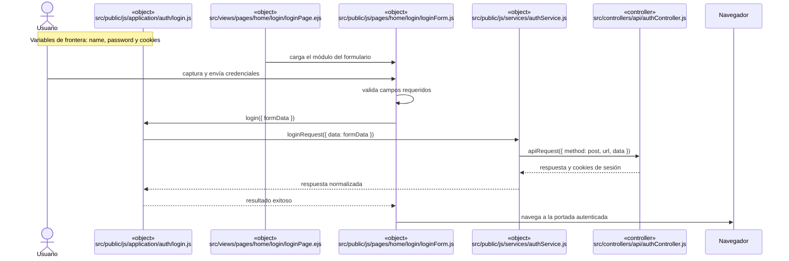

## `CU-AUT-02`

**Patrones:** `FE-P09`.

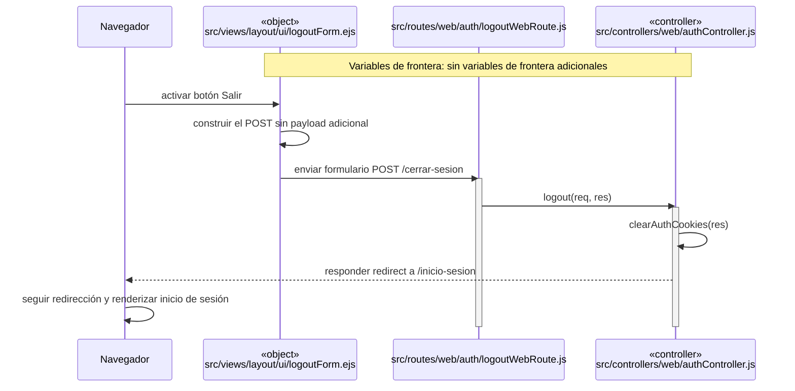

## `CU-IDA-01`

**Patrones:** `FE-P02`.

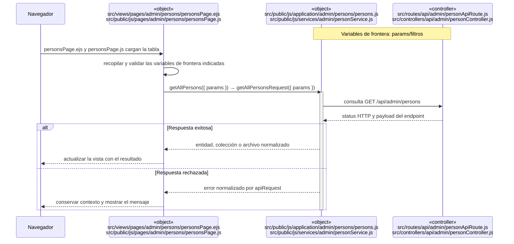

## `CU-IDA-02`

**Patrones:** `FE-P02`.

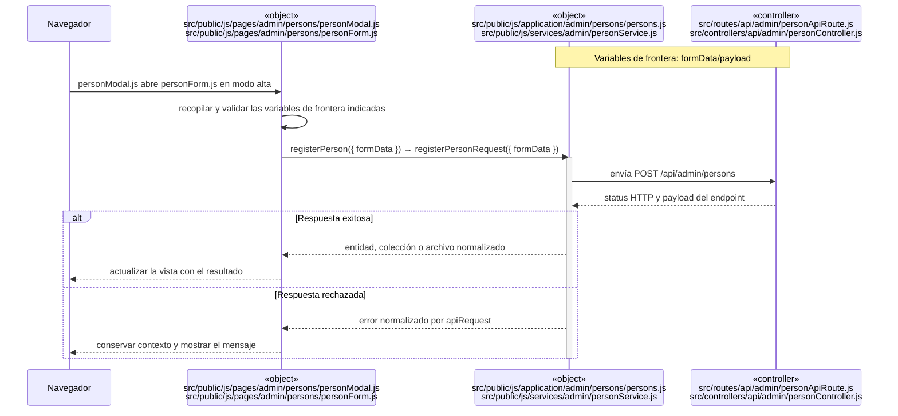

## `CU-IDA-03`

**Patrones:** `FE-P02`.

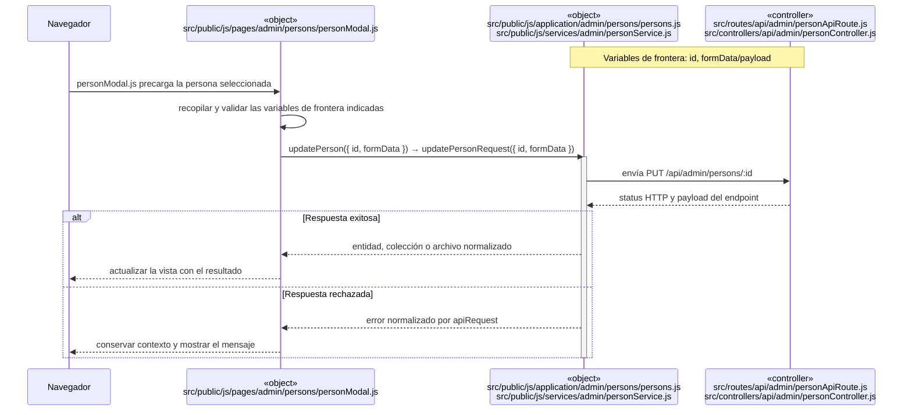

## `CU-IDA-04`

**Patrones:** `FE-P02`.

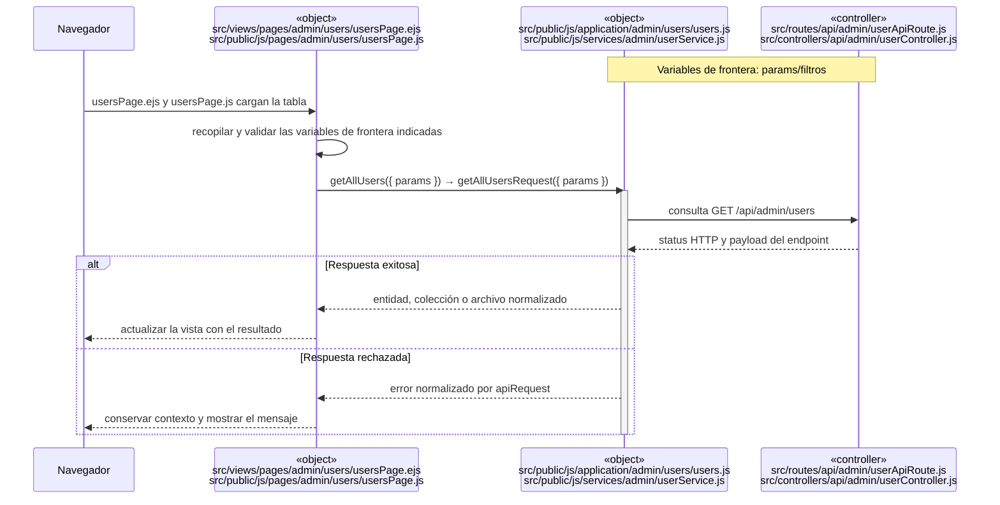

## `CU-IDA-05`

**Patrones:** `FE-P02`.

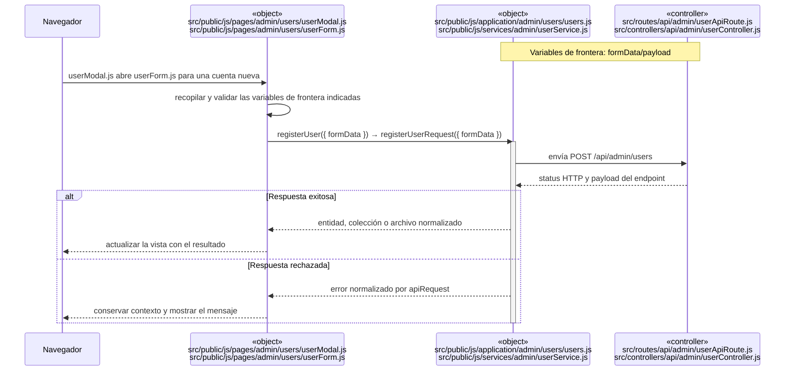

## `CU-IDA-06`

**Patrones:** `FE-P02`.

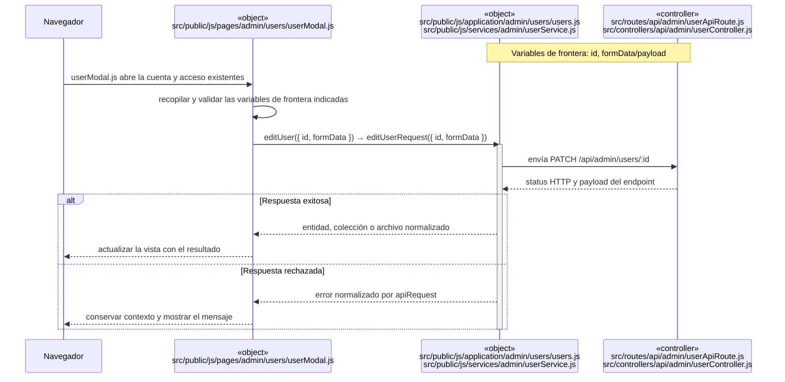

## `CU-IDA-07`

**Patrones:** `FE-P02`.

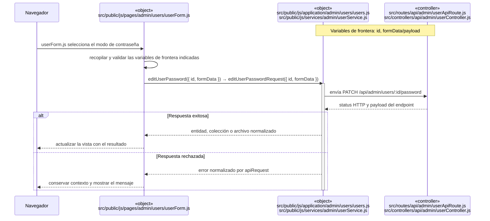

## `CU-IDA-08`

**Patrones:** `FE-P03`.

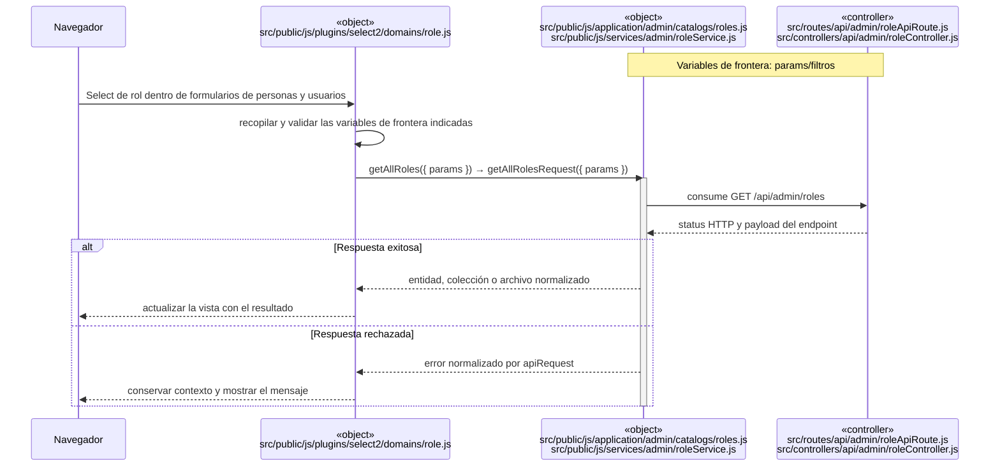

## `CU-IDA-09`

**Patrones:** `FE-P03`.

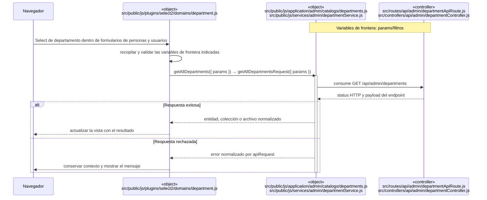

## `CU-CAT-01`

**Patrones:** `FE-P02`.

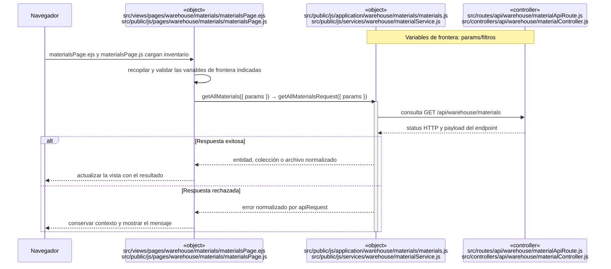

## `CU-CAT-02`

**Patrones:** `FE-P02`.

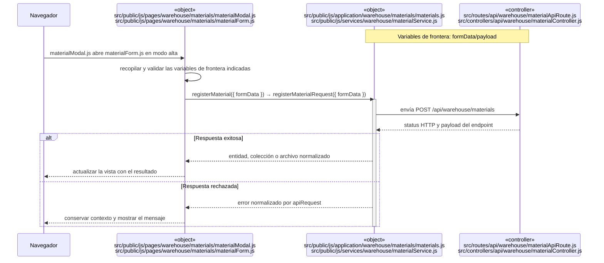

## `CU-CAT-03`

**Patrones:** `FE-P02`.

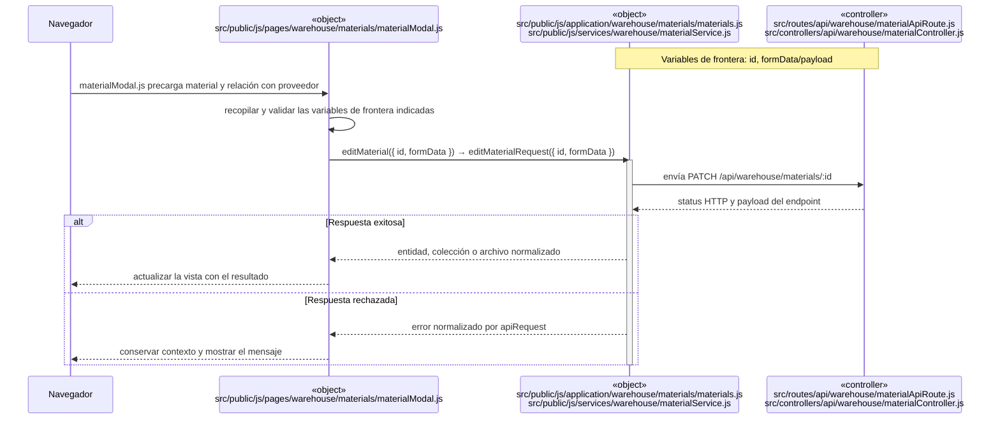

## `CU-CAT-04`

**Patrones:** `FE-P02`.

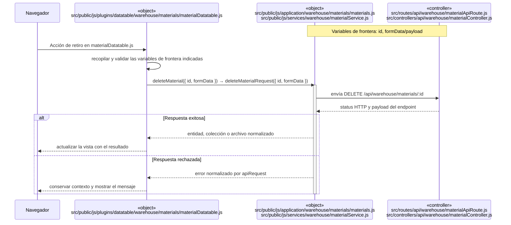

## `CU-CAT-05`

**Patrones:** `FE-P02`.

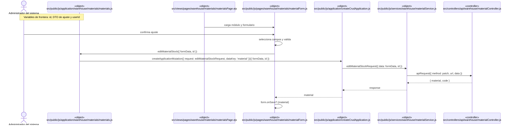

## `CU-CAT-06`

**Patrones:** `FE-P02`.

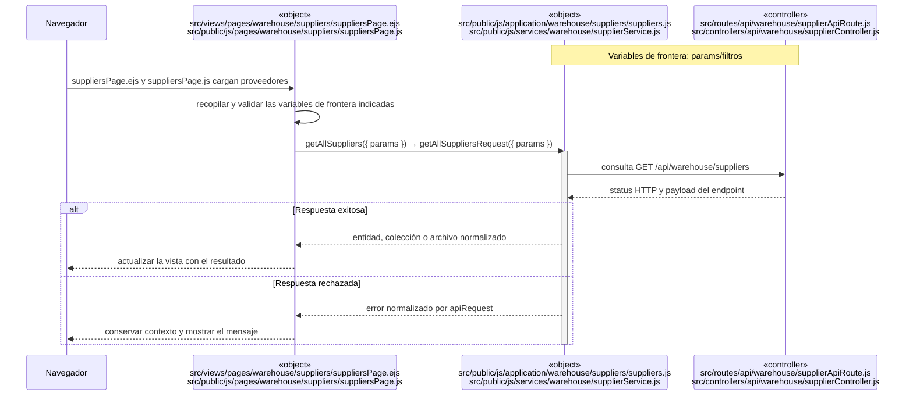

## `CU-CAT-07`

**Patrones:** `FE-P02`.

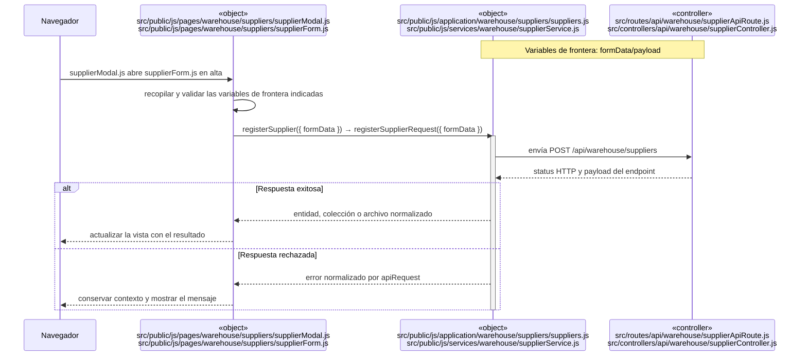

## `CU-CAT-08`

**Patrones:** `FE-P02`.

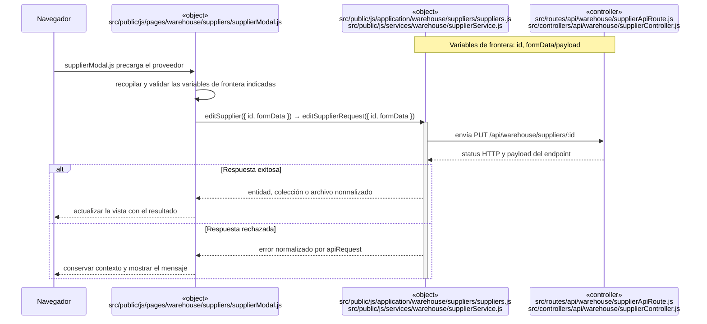

## `CU-CAT-09`

**Patrones:** `FE-P02`.

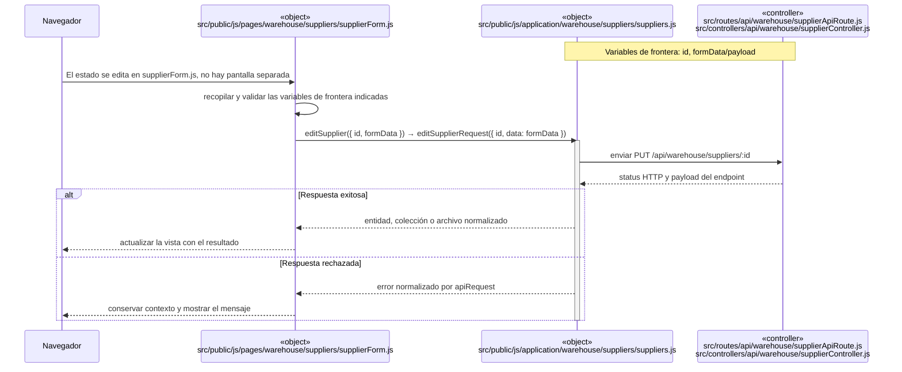

## `CU-CAT-10`

**Patrones:** `FE-P02`.

```mermaid
sequenceDiagram
    participant Browser as Navegador
    participant View as «object»<br/>src/views/pages/sales/clients/clientsPage.ejs<br/>src/public/js/pages/sales/clients/clientsPage.js
    participant Application as «object»<br/>src/public/js/application/sales/clients/clients.js<br/>src/public/js/services/sales/clientService.js
    participant Transport as «controller»<br/>src/routes/api/sales/clientApiRoute.js<br/>src/controllers/api/sales/clientController.js
    Note over Application,Transport: Variables de frontera: params/filtros

    Browser->>View: clientsPage.ejs y clientsPage.js cargan clientes
    View->>View: recopilar y validar las variables de frontera indicadas
    View->>Application: getAllClients({ params }) → getAllClientsRequest({ params })
    activate Application
    Application->>Transport: consulta GET /api/sales/clients
    Transport-->>Application: status HTTP y payload del endpoint
    alt Respuesta exitosa
        Application-->>View: entidad, colección o archivo normalizado
        View-->>Browser: actualizar la vista con el resultado
    else Respuesta rechazada
        Application-->>View: error normalizado por apiRequest
        View-->>Browser: conservar contexto y mostrar el mensaje
    end
    deactivate Application
```

## `CU-CAT-11`

**Patrones:** `FE-P02`.

```mermaid
sequenceDiagram
    participant Browser as Navegador
    participant View as «object»<br/>src/public/js/pages/sales/clients/clientModal.js<br/>src/public/js/pages/sales/clients/clientForm.js
    participant Application as «object»<br/>src/public/js/application/sales/clients/clients.js<br/>src/public/js/services/sales/clientService.js
    participant Transport as «controller»<br/>src/routes/api/sales/clientApiRoute.js<br/>src/controllers/api/sales/clientController.js
    Note over Application,Transport: Variables de frontera: formData/payload

    Browser->>View: clientModal.js abre clientForm.js en alta
    View->>View: recopilar y validar las variables de frontera indicadas
    View->>Application: registerClient({ formData }) → createClientRequest({ formData })
    activate Application
    Application->>Transport: envía POST /api/sales/clients
    Transport-->>Application: status HTTP y payload del endpoint
    alt Respuesta exitosa
        Application-->>View: entidad, colección o archivo normalizado
        View-->>Browser: actualizar la vista con el resultado
    else Respuesta rechazada
        Application-->>View: error normalizado por apiRequest
        View-->>Browser: conservar contexto y mostrar el mensaje
    end
    deactivate Application
```

## `CU-CAT-12`

**Patrones:** `FE-P02`.

```mermaid
sequenceDiagram
    participant Browser as Navegador
    participant View as «object»<br/>src/public/js/pages/sales/clients/clientModal.js
    participant Application as «object»<br/>src/public/js/application/sales/clients/clients.js<br/>src/public/js/services/sales/clientService.js
    participant Transport as «controller»<br/>src/routes/api/sales/clientApiRoute.js<br/>src/controllers/api/sales/clientController.js
    Note over Application,Transport: Variables de frontera: id, formData/payload

    Browser->>View: clientModal.js precarga el cliente
    View->>View: recopilar y validar las variables de frontera indicadas
    View->>Application: editClient({ id, formData }) → editClientRequest({ id, formData })
    activate Application
    Application->>Transport: envía PUT /api/sales/clients/:id
    Transport-->>Application: status HTTP y payload del endpoint
    alt Respuesta exitosa
        Application-->>View: entidad, colección o archivo normalizado
        View-->>Browser: actualizar la vista con el resultado
    else Respuesta rechazada
        Application-->>View: error normalizado por apiRequest
        View-->>Browser: conservar contexto y mostrar el mensaje
    end
    deactivate Application
```

## `CU-CAT-13`

**Patrones:** `FE-P02`.

```mermaid
sequenceDiagram
    participant Browser as Navegador
    participant View as «object»<br/>src/views/pages/warehouse/wastes/wastesPage.ejs<br/>src/public/js/pages/warehouse/wastes/wastesPage.js
    participant Application as «object»<br/>src/public/js/application/warehouse/wastes/wastes.js<br/>src/public/js/services/warehouse/wasteService.js
    participant Transport as «controller»<br/>src/routes/api/warehouse/wasteApiRoute.js<br/>src/controllers/api/warehouse/wasteController.js
    Note over Application,Transport: Variables de frontera: params/filtros

    Browser->>View: wastesPage.ejs y wastesPage.js cargan mermas
    View->>View: recopilar y validar las variables de frontera indicadas
    View->>Application: getAllWastes({ params }) → getAllWastesRequest({ params })
    activate Application
    Application->>Transport: consulta GET /api/warehouse/wastes
    Transport-->>Application: status HTTP y payload del endpoint
    alt Respuesta exitosa
        Application-->>View: entidad, colección o archivo normalizado
        View-->>Browser: actualizar la vista con el resultado
    else Respuesta rechazada
        Application-->>View: error normalizado por apiRequest
        View-->>Browser: conservar contexto y mostrar el mensaje
    end
    deactivate Application
```

## `CU-CAT-14`

**Patrones:** `FE-P02`.

```mermaid
sequenceDiagram
    participant Browser as Navegador
    participant View as «object»<br/>src/public/js/pages/warehouse/wastes/wasteModal.js<br/>src/public/js/pages/warehouse/wastes/wasteForm.js
    participant Application as «object»<br/>src/public/js/application/warehouse/wastes/wastes.js
    participant Transport as «controller»<br/>src/routes/api/warehouse/wasteApiRoute.js<br/>src/controllers/api/warehouse/wasteController.js
    Note over Application,Transport: Variables de frontera: formData/payload

    Browser->>View: wasteModal.js y wasteForm.js seleccionan una plantilla de material
    View->>View: recopilar y validar las variables de frontera indicadas
    View->>Application: getWasteMaterialTemplates({ params }) → registerWaste({ formData })
    activate Application
    Application->>Transport: enviar POST /api/warehouse/wastes
    Transport-->>Application: status HTTP y payload del endpoint
    alt Respuesta exitosa
        Application-->>View: entidad, colección o archivo normalizado
        View-->>Browser: actualizar la vista con el resultado
    else Respuesta rechazada
        Application-->>View: error normalizado por apiRequest
        View-->>Browser: conservar contexto y mostrar el mensaje
    end
    deactivate Application
```

## `CU-CAT-15`

**Patrones:** `FE-P02`.

```mermaid
sequenceDiagram
    participant Browser as Navegador
    participant View as «object»<br/>src/public/js/pages/warehouse/wastes/wasteModal.js
    participant Application as «object»<br/>src/public/js/application/warehouse/wastes/wastes.js<br/>src/public/js/services/warehouse/wasteService.js
    participant Transport as «controller»<br/>src/routes/api/warehouse/wasteApiRoute.js<br/>src/controllers/api/warehouse/wasteController.js
    Note over Application,Transport: Variables de frontera: id, formData/payload

    Browser->>View: wasteModal.js precarga la merma
    View->>View: recopilar y validar las variables de frontera indicadas
    View->>Application: editWaste({ id, formData }) → editWasteRequest({ id, formData })
    activate Application
    Application->>Transport: envía PATCH /api/warehouse/wastes/:id
    Transport-->>Application: status HTTP y payload del endpoint
    alt Respuesta exitosa
        Application-->>View: entidad, colección o archivo normalizado
        View-->>Browser: actualizar la vista con el resultado
    else Respuesta rechazada
        Application-->>View: error normalizado por apiRequest
        View-->>Browser: conservar contexto y mostrar el mensaje
    end
    deactivate Application
```

## `CU-CAT-16`

**Patrones:** `FE-P02`.

```mermaid
sequenceDiagram
    participant Browser as Navegador
    participant View as «object»<br/>src/public/js/pages/warehouse/wastes/wasteForm.js
    participant Application as «object»<br/>src/public/js/application/warehouse/wastes/wastes.js<br/>src/public/js/services/warehouse/wasteService.js
    participant Transport as «controller»<br/>src/routes/api/warehouse/wasteApiRoute.js<br/>src/controllers/api/warehouse/wasteController.js
    Note over Application,Transport: Variables de frontera: id, formData/payload

    Browser->>View: wasteForm.js usa el modo de ajuste
    View->>View: recopilar y validar las variables de frontera indicadas
    View->>Application: editWasteStock({ id, formData }) → editWasteStockRequest({ id, formData })
    activate Application
    Application->>Transport: envía PATCH /api/warehouse/wastes/:id/stock
    Transport-->>Application: status HTTP y payload del endpoint
    alt Respuesta exitosa
        Application-->>View: entidad, colección o archivo normalizado
        View-->>Browser: actualizar la vista con el resultado
    else Respuesta rechazada
        Application-->>View: error normalizado por apiRequest
        View-->>Browser: conservar contexto y mostrar el mensaje
    end
    deactivate Application
```

## `CU-CAT-17`

**Patrones:** `FE-P03`.

```mermaid
sequenceDiagram
    participant Browser as Navegador
    participant View as «object»<br/>src/public/js/pages/warehouse/materials/materialFields.js<br/>src/public/js/pages/warehouse/wastes/wasteFields.js
    participant Application as «object»<br/>src/public/js/application/warehouse/catalogs/presentations.js<br/>src/public/js/services/warehouse/presentationService.js
    participant Transport as «controller»<br/>src/routes/api/warehouse/presentationApiRoute.js<br/>src/controllers/api/warehouse/presentationController.js
    Note over Application,Transport: Variables de frontera: params/filtros

    Browser->>View: Select de presentación en materialFields.js y wasteFields.js
    View->>View: recopilar y validar las variables de frontera indicadas
    View->>Application: getAllPresentations({ params }) → getAllPresentationsRequest({ params })
    activate Application
    Application->>Transport: consume GET /api/warehouse/presentations
    Transport-->>Application: status HTTP y payload del endpoint
    alt Respuesta exitosa
        Application-->>View: entidad, colección o archivo normalizado
        View-->>Browser: actualizar la vista con el resultado
    else Respuesta rechazada
        Application-->>View: error normalizado por apiRequest
        View-->>Browser: conservar contexto y mostrar el mensaje
    end
    deactivate Application
```

## `CU-CAT-18`

**Patrones:** `FE-P03`.

```mermaid
sequenceDiagram
    participant Browser as Navegador
    participant View as «object»<br/>src/public/js/plugins/select2/domains/unitMeasure.js
    participant Application as «object»<br/>src/public/js/application/warehouse/catalogs/unitMeasures.js<br/>src/public/js/services/warehouse/unitMeasureService.js
    participant Transport as «controller»<br/>src/routes/api/warehouse/unitMeasureApiRoute.js<br/>src/controllers/api/warehouse/unitMeasureController.js
    Note over Application,Transport: Variables de frontera: params/filtros

    Browser->>View: Select de unidad en formularios de material y merma
    View->>View: recopilar y validar las variables de frontera indicadas
    View->>Application: getAllUnitMeasures({ params }) → getAllUnitMeasuresRequest({ params })
    activate Application
    Application->>Transport: consume GET /api/warehouse/unit-measures
    Transport-->>Application: status HTTP y payload del endpoint
    alt Respuesta exitosa
        Application-->>View: entidad, colección o archivo normalizado
        View-->>Browser: actualizar la vista con el resultado
    else Respuesta rechazada
        Application-->>View: error normalizado por apiRequest
        View-->>Browser: conservar contexto y mostrar el mensaje
    end
    deactivate Application
```

## `CU-CAT-19`

**Patrones:** `FE-P03`.

```mermaid
sequenceDiagram
    participant Browser as Navegador
    participant View as «object»<br/>src/public/js/plugins/select2/domains/reason.js
    participant Application as «object»<br/>src/public/js/application/warehouse/catalogs/reasons.js<br/>src/public/js/services/warehouse/reasonService.js
    participant Transport as «controller»<br/>src/routes/api/warehouse/reasonApiRoute.js<br/>src/controllers/api/warehouse/reasonController.js
    Note over Application,Transport: Variables de frontera: params/filtros

    Browser->>View: Select de motivo en los modos de ajuste
    View->>View: recopilar y validar las variables de frontera indicadas
    View->>Application: getAllReasons({ params }) → getAllReasonsRequest({ params })
    activate Application
    Application->>Transport: consume GET /api/warehouse/reasons
    Transport-->>Application: status HTTP y payload del endpoint
    alt Respuesta exitosa
        Application-->>View: entidad, colección o archivo normalizado
        View-->>Browser: actualizar la vista con el resultado
    else Respuesta rechazada
        Application-->>View: error normalizado por apiRequest
        View-->>Browser: conservar contexto y mostrar el mensaje
    end
    deactivate Application
```

## `CU-CAT-20`

**Patrones:** `FE-P03`.

```mermaid
sequenceDiagram
    participant Browser as Navegador
    participant View as «object»<br/>src/public/js/plugins/select2/domains/fulfillmentStatus.js
    participant Application as «object»<br/>src/public/js/application/warehouse/catalogs/fulfillmentStatuses.js
    participant Transport as «controller»<br/>src/routes/api/warehouse/fulfillmentStatusApiRoute.js<br/>src/controllers/api/warehouse/fulfillmentStatusController.js
    Note over Application,Transport: Variables de frontera: params/filtros

    Browser->>View: Estado visible en tablas y formularios de salidas
    View->>View: recopilar y validar las variables de frontera indicadas
    View->>Application: getAllFulfillmentStatuses({ params }) → getAllFulfillmentStatusesRequest({ params })
    activate Application
    Application->>Transport: consume GET /api/warehouse/fulfillment-statuses
    Transport-->>Application: status HTTP y payload del endpoint
    alt Respuesta exitosa
        Application-->>View: entidad, colección o archivo normalizado
        View-->>Browser: actualizar la vista con el resultado
    else Respuesta rechazada
        Application-->>View: error normalizado por apiRequest
        View-->>Browser: conservar contexto y mostrar el mensaje
    end
    deactivate Application
```

## `CU-ENT-01`

**Patrones:** `FE-P02`, `FE-P04`.

```mermaid
sequenceDiagram
    participant Browser as Navegador
    participant View as «object»<br/>src/views/pages/warehouse/goodsReceipts/goodsReceiptsPage.ejs
    participant Application as «object»<br/>src/public/js/application/warehouse/goodsReceipts/goodsReceipts.js
    participant Transport as «controller»<br/>src/routes/api/warehouse/goodsReceiptApiRoute.js<br/>src/controllers/api/warehouse/goodsReceiptController.js
    Note over Application,Transport: Variables de frontera: params/filtros

    Browser->>View: goodsReceiptsPage.ejs y su DataTable cargan compras
    View->>View: recopilar y validar las variables de frontera indicadas
    View->>Application: getAllGoodsReceipts({ params }) → getAllGoodsReceiptsRequest({ params })
    activate Application
    Application->>Transport: consulta GET /api/warehouse/goods-receipts
    Transport-->>Application: status HTTP y payload del endpoint
    alt Respuesta exitosa
        Application-->>View: entidad, colección o archivo normalizado
        View-->>Browser: actualizar la vista con el resultado
    else Respuesta rechazada
        Application-->>View: error normalizado por apiRequest
        View-->>Browser: conservar contexto y mostrar el mensaje
    end
    deactivate Application
```

## `CU-ENT-02`

**Patrones:** `FE-P02`, `FE-P04`.

```mermaid
sequenceDiagram
    actor Warehouse as Personal de almacén
    participant Modal as «object»<br/>src/public/js/pages/warehouse/goodsReceipts/goodsReceiptModal.js
    participant Form as src/public/js/pages/warehouse/goodsReceipts/goodsReceiptForm.js
    participant DetailUI as «object»<br/>src/public/js/pages/warehouse/goodsReceipts/goodsReceiptDetails.js<br/>src/public/js/plugins/datatable/warehouse/goodsReceipts/goodsReceiptDatatable.js
    participant App as «object»<br/>src/public/js/application/warehouse/goodsReceipts/goodsReceipts.js
    participant Request as src/public/js/services/warehouse/goodsReceiptService.js
    participant API as «controller»<br/>src/controllers/api/warehouse/goodsReceiptController.js
    Note over Form,Request: Variables de frontera: isInvoiced, invoice, supplierId, receivedById, receptionDate, observations y details

    Warehouse->>Modal: abrir «Nueva compra»
    Modal->>Modal: resetear formulario, inicializar selectores y ocultar/mostrar factura
    Warehouse->>DetailUI: seleccionar material, cantidad y costo por presentación
    DetailUI->>DetailUI: validar y agregar detalle, recalcular tabla y totales
    Warehouse->>Form: confirmar compra
    Form->>Form: normalizar comprobante y adjuntar details
    Form->>Form: validateFields(goodsReceiptValidation, formData)
    alt Hay errores de captura
        Form-->>Warehouse: mostrar campos inválidos sin enviar request
    else Captura válida
        Form->>App: registerGoodsReceipt({ formData })
        App->>Request: createCrudApplication.register({ data })
        Request->>API: apiRequest({ method: post, url, data })
        API-->>Request: { goodsReceipt, code }
        Request-->>Form: respuesta normalizada
        Form-->>Warehouse: cerrar modal, notificar y actualizar listado
    end
```

## `CU-ENT-03`

**Patrones:** `FE-P02`, `FE-P04`.

```mermaid
sequenceDiagram
    participant Browser as Navegador
    participant View as «object»<br/>src/public/js/pages/warehouse/goodsReceipts/goodsReceiptModal.js
    participant Application as «object»<br/>src/public/js/application/warehouse/goodsReceipts/goodsReceipts.js
    participant Transport as «controller»<br/>src/routes/api/warehouse/goodsReceiptApiRoute.js<br/>src/controllers/api/warehouse/goodsReceiptController.js
    Note over Application,Transport: Variables de frontera: id, formData/payload

    Browser->>View: goodsReceiptModal.js abre una compra existente
    View->>View: recopilar y validar las variables de frontera indicadas
    View->>Application: editGoodsReceiptHeader({ id, formData }) → editGoodsReceiptHeaderRequest({ id, formData })
    activate Application
    Application->>Transport: envía PATCH /api/warehouse/goods-receipts/:id
    Transport-->>Application: status HTTP y payload del endpoint
    alt Respuesta exitosa
        Application-->>View: entidad, colección o archivo normalizado
        View-->>Browser: actualizar la vista con el resultado
    else Respuesta rechazada
        Application-->>View: error normalizado por apiRequest
        View-->>Browser: conservar contexto y mostrar el mensaje
    end
    deactivate Application
```

## `CU-ENT-04`

**Patrones:** `FE-P02`, `FE-P04`.

```mermaid
sequenceDiagram
    participant Browser as Navegador
    participant View as «object»<br/>src/public/js/pages/warehouse/goodsReceipts/corrections/correctionModal.js<br/>src/public/js/pages/warehouse/goodsReceipts/corrections/correctionForm.js
    participant Application as «object»<br/>src/public/js/application/warehouse/goodsReceipts/goodsReceipts.js
    participant Transport as «controller»<br/>src/routes/api/warehouse/goodsReceiptApiRoute.js<br/>src/controllers/api/warehouse/goodsReceiptController.js
    Note over Application,Transport: Variables de frontera: id, detailId, formData/payload

    Browser->>View: correctionModal.js y correctionForm.js aíslan la corrección
    View->>View: recopilar y validar las variables de frontera indicadas
    View->>Application: correctGoodsReceiptDetail({ id, detailId, formData }) → correctGoodsReceiptDetailRequest({ id, detailId, formData })
    activate Application
    Application->>Transport: envía PATCH /api/warehouse/goods-receipts/:id/details/:detailId/corrections
    Transport-->>Application: status HTTP y payload del endpoint
    alt Respuesta exitosa
        Application-->>View: entidad, colección o archivo normalizado
        View-->>Browser: actualizar la vista con el resultado
    else Respuesta rechazada
        Application-->>View: error normalizado por apiRequest
        View-->>Browser: conservar contexto y mostrar el mensaje
    end
    deactivate Application
```

## `CU-ENT-05`

**Patrones:** `FE-P02`, `FE-P04`.

```mermaid
sequenceDiagram
    participant Browser as Navegador
    participant View as «object»<br/>src/public/js/pages/warehouse/goodsReceipts/goodsReceiptModal.js
    participant Application as «object»<br/>src/public/js/application/warehouse/goodsReceipts/goodsReceipts.js
    participant Transport as «controller»<br/>src/routes/api/warehouse/goodsReceiptApiRoute.js<br/>src/controllers/api/warehouse/goodsReceiptController.js
    Note over Application,Transport: Variables de frontera: id, detailId, formData/payload

    Browser->>View: Acción Cancelar del detalle en el modal de compra
    View->>View: recopilar y validar las variables de frontera indicadas
    View->>Application: cancelGoodsReceiptDetail({ id, detailId, formData }) → cancelGoodsReceiptDetailRequest({ id, detailId, formData })
    activate Application
    Application->>Transport: envía PATCH /api/warehouse/goods-receipts/:id/details/:detailId/cancel
    Transport-->>Application: status HTTP y payload del endpoint
    alt Respuesta exitosa
        Application-->>View: entidad, colección o archivo normalizado
        View-->>Browser: actualizar la vista con el resultado
    else Respuesta rechazada
        Application-->>View: error normalizado por apiRequest
        View-->>Browser: conservar contexto y mostrar el mensaje
    end
    deactivate Application
```

## `CU-SAL-01`

**Patrones:** `FE-P05`.

```mermaid
sequenceDiagram
    participant Browser as Navegador
    participant View as «object»<br/>src/views/pages/warehouse/goodsIssues/goodsIssuesPage.ejs
    participant Application as «object»<br/>src/public/js/application/warehouse/goodsIssues/goodsIssues.js
    participant Transport as «controller»<br/>src/routes/api/warehouse/goodsIssueApiRoute.js<br/>src/controllers/api/warehouse/goodsIssueController.js
    Note over Application,Transport: Variables de frontera: params/filtros

    Browser->>View: goodsIssuesPage.ejs y su DataTable cargan salidas
    View->>View: recopilar y validar las variables de frontera indicadas
    View->>Application: getAllGoodsIssues({ params }) → getAllGoodsIssuesRequest({ params })
    activate Application
    Application->>Transport: consulta GET /api/warehouse/goods-issues
    Transport-->>Application: status HTTP y payload del endpoint
    alt Respuesta exitosa
        Application-->>View: entidad, colección o archivo normalizado
        View-->>Browser: actualizar la vista con el resultado
    else Respuesta rechazada
        Application-->>View: error normalizado por apiRequest
        View-->>Browser: conservar contexto y mostrar el mensaje
    end
    deactivate Application
```

## `CU-SAL-02`

**Patrones:** `FE-P05`.

```mermaid
sequenceDiagram
    participant Browser as Navegador
    participant View as «object»<br/>src/public/js/pages/warehouse/goodsIssues/goodsIssueModal.js
    participant Application as «object»<br/>src/public/js/application/warehouse/goodsIssues/goodsIssues.js
    participant Transport as «controller»<br/>src/routes/api/warehouse/goodsIssueApiRoute.js<br/>src/controllers/api/warehouse/goodsIssueController.js
    Note over Application,Transport: Variables de frontera: formData/payload

    Browser->>View: goodsIssueModal.js captura documento y materiales
    View->>View: recopilar y validar las variables de frontera indicadas
    View->>Application: registerGoodsIssue({ formData }) → registerGoodsIssueRequest({ formData })
    activate Application
    Application->>Transport: envía POST /api/warehouse/goods-issues
    Transport-->>Application: status HTTP y payload del endpoint
    alt Respuesta exitosa
        Application-->>View: entidad, colección o archivo normalizado
        View-->>Browser: actualizar la vista con el resultado
    else Respuesta rechazada
        Application-->>View: error normalizado por apiRequest
        View-->>Browser: conservar contexto y mostrar el mensaje
    end
    deactivate Application
```

## `CU-SAL-03`

**Patrones:** `FE-P05`.

```mermaid
sequenceDiagram
    participant Browser as Navegador
    participant View as «object»<br/>src/public/js/pages/warehouse/goodsIssues/goodsIssueModal.js
    participant Application as «object»<br/>src/public/js/application/warehouse/goodsIssues/goodsIssues.js
    participant Transport as «controller»<br/>src/routes/api/warehouse/goodsIssueApiRoute.js<br/>src/controllers/api/warehouse/goodsIssueController.js
    Note over Application,Transport: Variables de frontera: id, formData/payload

    Browser->>View: Modo encabezado de goodsIssueModal.js
    View->>View: recopilar y validar las variables de frontera indicadas
    View->>Application: editGoodsIssueHeader({ id, formData }) → editGoodsIssueHeaderRequest({ id, formData })
    activate Application
    Application->>Transport: envía PATCH /api/warehouse/goods-issues/:id/header
    Transport-->>Application: status HTTP y payload del endpoint
    alt Respuesta exitosa
        Application-->>View: entidad, colección o archivo normalizado
        View-->>Browser: actualizar la vista con el resultado
    else Respuesta rechazada
        Application-->>View: error normalizado por apiRequest
        View-->>Browser: conservar contexto y mostrar el mensaje
    end
    deactivate Application
```

## `CU-SAL-04`

**Patrones:** `FE-P05`.

```mermaid
sequenceDiagram
    participant Browser as Navegador
    participant View as «object»<br/>src/public/js/pages/warehouse/goodsIssues/goodsIssueModal.js
    participant Application as «object»<br/>src/public/js/application/warehouse/goodsIssues/goodsIssues.js
    participant Transport as «controller»<br/>src/routes/api/warehouse/goodsIssueApiRoute.js<br/>src/controllers/api/warehouse/goodsIssueController.js
    Note over Application,Transport: Variables de frontera: id, formData/payload

    Browser->>View: Modo detalles de goodsIssueModal.js
    View->>View: recopilar y validar las variables de frontera indicadas
    View->>Application: editGoodsIssueDetails({ id, formData }) → editGoodsIssueDetailsRequest({ id, formData })
    activate Application
    Application->>Transport: envía PATCH /api/warehouse/goods-issues/:id/details
    Transport-->>Application: status HTTP y payload del endpoint
    alt Respuesta exitosa
        Application-->>View: entidad, colección o archivo normalizado
        View-->>Browser: actualizar la vista con el resultado
    else Respuesta rechazada
        Application-->>View: error normalizado por apiRequest
        View-->>Browser: conservar contexto y mostrar el mensaje
    end
    deactivate Application
```

## `CU-SAL-05`

**Patrones:** `FE-P05`.

```mermaid
sequenceDiagram
    participant Browser as Navegador
    participant View as «object»<br/>src/public/js/pages/warehouse/goodsIssues/goodsIssueForm.js
    participant Application as «object»<br/>src/public/js/application/warehouse/goodsIssues/goodsIssues.js
    participant Transport as «controller»<br/>src/routes/api/warehouse/goodsIssueApiRoute.js<br/>src/controllers/api/warehouse/goodsIssueController.js
    Note over Application,Transport: Variables de frontera: id, formData/payload

    Browser->>View: Acción Surtir dentro de los detalles de salida
    View->>View: recopilar y validar las variables de frontera indicadas
    View->>Application: editGoodsIssueDetails({ id, formData }) → editGoodsIssueDetailsRequest({ id, data: formData })
    activate Application
    Application->>Transport: enviar PATCH /api/warehouse/goods-issues/:id/details
    Transport-->>Application: status HTTP y payload del endpoint
    alt Respuesta exitosa
        Application-->>View: entidad, colección o archivo normalizado
        View-->>Browser: actualizar la vista con el resultado
    else Respuesta rechazada
        Application-->>View: error normalizado por apiRequest
        View-->>Browser: conservar contexto y mostrar el mensaje
    end
    deactivate Application
```

## `CU-SAL-06`

**Patrones:** `FE-P05`, `FE-P06`.

```mermaid
sequenceDiagram
    Note over Warehouse,App: Variables de frontera: id, detailId, returnDto, userId y tx
    actor Warehouse as Almacén
    participant Issue as «object»<br/>src/public/js/pages/warehouse/goodsIssues/returns/goodsIssueReturn.js
    participant Return as «object»<br/>src/public/js/ui/issues/issueReturnUI.js
    participant App as «object»<br/>src/public/js/application/warehouse/goodsIssues/goodsIssues.js
    participant API as «controller»<br/>src/controllers/api/warehouse/goodsIssueController.js

    Warehouse->>Issue: selecciona Devolver en un detalle
    Issue->>Issue: initializeGoodsIssueReturns({ details, getCurrentIssue })
    Issue->>Return: goodsIssueReturn.open({ issue, detail })
    Warehouse->>Return: captura cantidad y confirma
    Return->>Return: valida límite retornable
    Return->>App: returnGoodsIssueDetail({ id, detailId, formData })
    App->>API: returnGoodsIssueDetailRequest({ id, detailId, data: formData })
    API-->>App: salida actualizada
    App-->>Return: respuesta exitosa
    Return->>Issue: recarga la página y consulta el estado actualizado
```

## `CU-SAL-07`

**Patrones:** `FE-P05`.

```mermaid
sequenceDiagram
    participant Browser as Navegador
    participant View as «object»<br/>src/views/pages/warehouse/wasteIssues/wasteIssuesPage.ejs
    participant Application as «object»<br/>src/public/js/application/warehouse/wasteIssues/wasteIssues.js
    participant Transport as «controller»<br/>src/routes/api/warehouse/wasteIssueApiRoute.js<br/>src/controllers/api/warehouse/wasteIssueController.js
    Note over Application,Transport: Variables de frontera: params/filtros

    Browser->>View: wasteIssuesPage.ejs y su DataTable cargan salidas de merma
    View->>View: recopilar y validar las variables de frontera indicadas
    View->>Application: getAllWasteIssues({ params }) → getAllWasteIssuesRequest({ params })
    activate Application
    Application->>Transport: consulta GET /api/warehouse/waste-issues
    Transport-->>Application: status HTTP y payload del endpoint
    alt Respuesta exitosa
        Application-->>View: entidad, colección o archivo normalizado
        View-->>Browser: actualizar la vista con el resultado
    else Respuesta rechazada
        Application-->>View: error normalizado por apiRequest
        View-->>Browser: conservar contexto y mostrar el mensaje
    end
    deactivate Application
```

## `CU-SAL-08`

**Patrones:** `FE-P05`.

```mermaid
sequenceDiagram
    participant Browser as Navegador
    participant View as «object»<br/>src/public/js/pages/warehouse/wasteIssues/wasteIssueModal.js
    participant Application as «object»<br/>src/public/js/application/warehouse/wasteIssues/wasteIssues.js
    participant Transport as «controller»<br/>src/routes/api/warehouse/wasteIssueApiRoute.js<br/>src/controllers/api/warehouse/wasteIssueController.js
    Note over Application,Transport: Variables de frontera: formData/payload

    Browser->>View: wasteIssueModal.js captura documento y mermas
    View->>View: recopilar y validar las variables de frontera indicadas
    View->>Application: registerWasteIssue({ formData }) → registerWasteIssueRequest({ formData })
    activate Application
    Application->>Transport: envía POST /api/warehouse/waste-issues
    Transport-->>Application: status HTTP y payload del endpoint
    alt Respuesta exitosa
        Application-->>View: entidad, colección o archivo normalizado
        View-->>Browser: actualizar la vista con el resultado
    else Respuesta rechazada
        Application-->>View: error normalizado por apiRequest
        View-->>Browser: conservar contexto y mostrar el mensaje
    end
    deactivate Application
```

## `CU-SAL-09`

**Patrones:** `FE-P05`.

```mermaid
sequenceDiagram
    participant Browser as Navegador
    participant View as «object»<br/>src/public/js/pages/warehouse/wasteIssues/wasteIssueModal.js
    participant Application as «object»<br/>src/public/js/application/warehouse/wasteIssues/wasteIssues.js
    participant Transport as «controller»<br/>src/routes/api/warehouse/wasteIssueApiRoute.js<br/>src/controllers/api/warehouse/wasteIssueController.js
    Note over Application,Transport: Variables de frontera: id, formData/payload

    Browser->>View: Modo encabezado de wasteIssueModal.js
    View->>View: recopilar y validar las variables de frontera indicadas
    View->>Application: editWasteIssueHeader({ id, formData }) → editWasteIssueHeaderRequest({ id, formData })
    activate Application
    Application->>Transport: envía PATCH /api/warehouse/waste-issues/:id/header
    Transport-->>Application: status HTTP y payload del endpoint
    alt Respuesta exitosa
        Application-->>View: entidad, colección o archivo normalizado
        View-->>Browser: actualizar la vista con el resultado
    else Respuesta rechazada
        Application-->>View: error normalizado por apiRequest
        View-->>Browser: conservar contexto y mostrar el mensaje
    end
    deactivate Application
```

## `CU-SAL-10`

**Patrones:** `FE-P05`.

```mermaid
sequenceDiagram
    participant Browser as Navegador
    participant View as «object»<br/>src/public/js/pages/warehouse/wasteIssues/wasteIssueModal.js
    participant Application as «object»<br/>src/public/js/application/warehouse/wasteIssues/wasteIssues.js
    participant Transport as «controller»<br/>src/routes/api/warehouse/wasteIssueApiRoute.js<br/>src/controllers/api/warehouse/wasteIssueController.js
    Note over Application,Transport: Variables de frontera: id, formData/payload

    Browser->>View: Modo detalles de wasteIssueModal.js
    View->>View: recopilar y validar las variables de frontera indicadas
    View->>Application: editWasteIssueDetails({ id, formData }) → editWasteIssueDetailsRequest({ id, formData })
    activate Application
    Application->>Transport: envía PATCH /api/warehouse/waste-issues/:id/details
    Transport-->>Application: status HTTP y payload del endpoint
    alt Respuesta exitosa
        Application-->>View: entidad, colección o archivo normalizado
        View-->>Browser: actualizar la vista con el resultado
    else Respuesta rechazada
        Application-->>View: error normalizado por apiRequest
        View-->>Browser: conservar contexto y mostrar el mensaje
    end
    deactivate Application
```

## `CU-SAL-11`

**Patrones:** `FE-P05`.

```mermaid
sequenceDiagram
    participant Browser as Navegador
    participant View as «object»<br/>src/public/js/pages/warehouse/wasteIssues/wasteIssueForm.js
    participant Application as «object»<br/>src/public/js/application/warehouse/wasteIssues/wasteIssues.js
    participant Transport as «controller»<br/>src/routes/api/warehouse/wasteIssueApiRoute.js<br/>src/controllers/api/warehouse/wasteIssueController.js
    Note over Application,Transport: Variables de frontera: id, formData/payload

    Browser->>View: Acción Surtir dentro de los detalles de merma
    View->>View: recopilar y validar las variables de frontera indicadas
    View->>Application: editWasteIssueDetails({ id, formData }) → editWasteIssueDetailsRequest({ id, data: formData })
    activate Application
    Application->>Transport: enviar PATCH /api/warehouse/waste-issues/:id/details
    Transport-->>Application: status HTTP y payload del endpoint
    alt Respuesta exitosa
        Application-->>View: entidad, colección o archivo normalizado
        View-->>Browser: actualizar la vista con el resultado
    else Respuesta rechazada
        Application-->>View: error normalizado por apiRequest
        View-->>Browser: conservar contexto y mostrar el mensaje
    end
    deactivate Application
```

## `CU-SAL-12`

**Patrones:** `FE-P05`, `FE-P06`.

```mermaid
sequenceDiagram
    Note over Warehouse,App: Variables de frontera: id, detailId, returnDto, userId y tx
    actor Warehouse as Almacén
    participant Issue as «object»<br/>src/public/js/pages/warehouse/wasteIssues/returns/wasteIssueReturn.js
    participant Return as «object»<br/>src/public/js/ui/issues/issueReturnUI.js
    participant App as «object»<br/>src/public/js/application/warehouse/wasteIssues/wasteIssues.js
    participant API as «controller»<br/>src/controllers/api/warehouse/wasteIssueController.js

    Warehouse->>Issue: selecciona Devolver en un detalle de merma
    Issue->>Issue: initializeWasteIssueReturns({ details, getIssueId })
    Issue->>Return: wasteIssueReturn.open({ issue: { id }, detail })
    Warehouse->>Return: captura cantidad y confirma
    Return->>Return: valida límite retornable
    Return->>App: returnWasteIssueDetail({ id, detailId, formData })
    App->>API: returnWasteIssueDetailRequest({ id, detailId, data: formData })
    API-->>App: wasteIssueReturn
    App-->>Return: respuesta exitosa
    Return->>Issue: recarga la página y consulta la salida actualizada
```

## `CU-REP-01`

**Patrones:** `FE-P07`.

```mermaid
sequenceDiagram
    participant Browser as Navegador
    participant View as «object»<br/>src/public/js/pages/warehouse/materials/materialsPage.js
    participant Application as «object»<br/>src/public/js/services/warehouse/materialService.js
    participant Transport as «controller»<br/>src/routes/api/warehouse/materialApiRoute.js<br/>src/controllers/api/warehouse/materialController.js
    Note over Application,Transport: Variables de frontera: params/filtros

    Browser->>View: La consulta es el listado de materialsPage.js, no hay página de reporte
    View->>View: recopilar y validar las variables de frontera indicadas
    View->>Application: getAllMaterialsRequest({ params })
    activate Application
    Application->>Transport: apiRequest({ method: 'get', url: '/api/warehouse/materials', params })
    Transport-->>Application: status HTTP y payload del endpoint
    alt Respuesta exitosa
        Application-->>View: entidad, colección o archivo normalizado
        View-->>Browser: actualizar la vista con el resultado
    else Respuesta rechazada
        Application-->>View: error normalizado por apiRequest
        View-->>Browser: conservar contexto y mostrar el mensaje
    end
    deactivate Application
```

## `CU-REP-02`

**Patrones:** `FE-P07`.

```mermaid
sequenceDiagram
    participant Browser as Navegador
    participant View as «object»<br/>src/public/js/pages/admin/movements/movementsPage.js
    participant Application as «object»<br/>src/public/js/application/admin/movements/movements.js
    participant Transport as «controller»<br/>src/routes/api/admin/movementApiRoute.js<br/>src/controllers/api/admin/movementController.js
    Note over Application,Transport: Variables de frontera: params/filtros

    Browser->>View: movementsPage.js selecciona el contexto material
    View->>View: recopilar y validar las variables de frontera indicadas
    View->>Application: getAllMovements({ context: 'materials', params }) → getAllMovementsRequest({ context, params })
    activate Application
    Application->>Transport: consultar GET /api/admin/movements/materials
    Transport-->>Application: status HTTP y payload del endpoint
    alt Respuesta exitosa
        Application-->>View: entidad, colección o archivo normalizado
        View-->>Browser: actualizar la vista con el resultado
    else Respuesta rechazada
        Application-->>View: error normalizado por apiRequest
        View-->>Browser: conservar contexto y mostrar el mensaje
    end
    deactivate Application
```

## `CU-REP-03`

**Patrones:** `FE-P08`.

```mermaid
sequenceDiagram
    participant Browser as Navegador
    participant View as «object»<br/>src/public/js/plugins/datatable/warehouse/materials/materialDatatable.js
    participant Application as «object»<br/>src/public/js/application/warehouse/report.js<br/>src/public/js/services/warehouse/reportService.js
    participant Transport as «controller»<br/>src/routes/api/warehouse/reportApiRoute.js<br/>src/controllers/api/warehouse/reportController.js
    Note over Application,Transport: Variables de frontera: params/filtros

    Browser->>View: Botón Excel de materialDatatable.js
    View->>View: recopilar y validar las variables de frontera indicadas
    View->>Application: exportWarehouseReport({ params }) → exportWarehouseReportRequest({ params })
    activate Application
    Application->>Transport: descarga /api/warehouse/reports/inventory/excel
    Transport-->>Application: status HTTP y payload del endpoint
    alt Respuesta exitosa
        Application-->>View: entidad, colección o archivo normalizado
        View-->>Browser: actualizar la vista con el resultado
    else Respuesta rechazada
        Application-->>View: error normalizado por apiRequest
        View-->>Browser: conservar contexto y mostrar el mensaje
    end
    deactivate Application
```

## `CU-REP-04`

**Patrones:** `FE-P08`.

```mermaid
sequenceDiagram
    participant Browser as Navegador
    participant View as «object»<br/>src/public/js/plugins/datatable/warehouse/goodsIssues/goodsIssueDatatable.js
    participant Application as «object»<br/>src/public/js/application/warehouse/report.js
    participant Transport as «controller»<br/>src/routes/api/warehouse/reportApiRoute.js<br/>src/controllers/api/warehouse/reportController.js
    Note over Application,Transport: Variables de frontera: params/filtros

    Browser->>View: Botón Excel del listado de salidas de material
    View->>View: recopilar y validar las variables de frontera indicadas
    View->>Application: exportGoodsIssueReport({ params }) → exportGoodsIssueReportRequest({ params })
    activate Application
    Application->>Transport: descarga /api/warehouse/reports/goods-issues/excel
    Transport-->>Application: status HTTP y payload del endpoint
    alt Respuesta exitosa
        Application-->>View: entidad, colección o archivo normalizado
        View-->>Browser: actualizar la vista con el resultado
    else Respuesta rechazada
        Application-->>View: error normalizado por apiRequest
        View-->>Browser: conservar contexto y mostrar el mensaje
    end
    deactivate Application
```

## `CU-REP-05`

**Patrones:** `FE-P08`.

```mermaid
sequenceDiagram
    participant Browser as Navegador
    participant View as «object»<br/>src/public/js/plugins/datatable/admin/movements/movementDatatable.js
    participant Application as «object»<br/>src/public/js/application/admin/report.js
    participant Transport as «controller»<br/>src/routes/api/admin/reportApiRoute.js<br/>src/controllers/api/admin/reportController.js
    Note over Application,Transport: Variables de frontera: params/filtros

    Browser->>View: Botón Excel de movimientos en contexto material
    View->>View: recopilar y validar las variables de frontera indicadas
    View->>Application: exportMovementReport({ params, type: materials }) → exportMovementReportRequest({ params, type: materials })
    activate Application
    Application->>Transport: descarga /api/admin/reports/movements/materials/excel
    Transport-->>Application: status HTTP y payload del endpoint
    alt Respuesta exitosa
        Application-->>View: entidad, colección o archivo normalizado
        View-->>Browser: actualizar la vista con el resultado
    else Respuesta rechazada
        Application-->>View: error normalizado por apiRequest
        View-->>Browser: conservar contexto y mostrar el mensaje
    end
    deactivate Application
```

## `CU-REP-06`

**Patrones:** `FE-P07`.

```mermaid
sequenceDiagram
    participant Browser as Navegador
    participant View as «object»<br/>src/public/js/pages/warehouse/wastes/wastesPage.js
    participant Application as «object»<br/>src/public/js/services/warehouse/wasteService.js
    participant Transport as «controller»<br/>src/routes/api/warehouse/wasteApiRoute.js<br/>src/controllers/api/warehouse/wasteController.js
    Note over Application,Transport: Variables de frontera: params/filtros

    Browser->>View: La consulta es el listado de wastesPage.js, no hay página de reporte
    View->>View: recopilar y validar las variables de frontera indicadas
    View->>Application: getAllWastesRequest({ params })
    activate Application
    Application->>Transport: apiRequest({ method: 'get', url: '/api/warehouse/wastes', params })
    Transport-->>Application: status HTTP y payload del endpoint
    alt Respuesta exitosa
        Application-->>View: entidad, colección o archivo normalizado
        View-->>Browser: actualizar la vista con el resultado
    else Respuesta rechazada
        Application-->>View: error normalizado por apiRequest
        View-->>Browser: conservar contexto y mostrar el mensaje
    end
    deactivate Application
```

## `CU-REP-07`

**Patrones:** `FE-P07`.

```mermaid
sequenceDiagram
    participant Browser as Navegador
    participant View as «object»<br/>src/public/js/pages/admin/movements/movementsPage.js
    participant Application as «object»<br/>src/public/js/application/admin/movements/movements.js
    participant Transport as «controller»<br/>src/routes/api/admin/movementApiRoute.js<br/>src/controllers/api/admin/movementController.js
    Note over Application,Transport: Variables de frontera: params/filtros

    Browser->>View: movementsPage.js selecciona el contexto merma
    View->>View: recopilar y validar las variables de frontera indicadas
    View->>Application: getAllMovements({ context: 'wastes', params }) → getAllMovementsRequest({ context, params })
    activate Application
    Application->>Transport: consultar GET /api/admin/movements/wastes
    Transport-->>Application: status HTTP y payload del endpoint
    alt Respuesta exitosa
        Application-->>View: entidad, colección o archivo normalizado
        View-->>Browser: actualizar la vista con el resultado
    else Respuesta rechazada
        Application-->>View: error normalizado por apiRequest
        View-->>Browser: conservar contexto y mostrar el mensaje
    end
    deactivate Application
```

## `CU-REP-08`

**Patrones:** `FE-P08`.

```mermaid
sequenceDiagram
    participant Browser as Navegador
    participant View as «object»<br/>src/public/js/plugins/datatable/warehouse/wasteIssues/wasteIssueDatatable.js
    participant Application as «object»<br/>src/public/js/application/warehouse/report.js
    participant Transport as «controller»<br/>src/routes/api/warehouse/reportApiRoute.js<br/>src/controllers/api/warehouse/reportController.js
    Note over Application,Transport: Variables de frontera: params/filtros

    Browser->>View: Botón Excel del listado de salidas de merma
    View->>View: recopilar y validar las variables de frontera indicadas
    View->>Application: exportWasteIssueReport({ params }) → exportWasteIssueReportRequest({ params })
    activate Application
    Application->>Transport: descarga /api/warehouse/reports/waste-issues/excel
    Transport-->>Application: status HTTP y payload del endpoint
    alt Respuesta exitosa
        Application-->>View: entidad, colección o archivo normalizado
        View-->>Browser: actualizar la vista con el resultado
    else Respuesta rechazada
        Application-->>View: error normalizado por apiRequest
        View-->>Browser: conservar contexto y mostrar el mensaje
    end
    deactivate Application
```

## `CU-REP-09`

**Patrones:** `FE-P08`.

```mermaid
sequenceDiagram
    participant Browser as Navegador
    participant View as «object»<br/>src/public/js/plugins/datatable/warehouse/wastes/wasteDatatable.js
    participant Application as «object»<br/>src/public/js/application/warehouse/report.js
    participant Transport as «controller»<br/>src/routes/api/warehouse/reportApiRoute.js<br/>src/controllers/api/warehouse/reportController.js
    Note over Application,Transport: Variables de frontera: params/filtros

    Browser->>View: Botón Excel de wasteDatatable.js
    View->>View: recopilar y validar las variables de frontera indicadas
    View->>Application: exportWasteReport({ params }) → exportWasteReportRequest({ params })
    activate Application
    Application->>Transport: descarga /api/warehouse/reports/wastes/excel
    Transport-->>Application: status HTTP y payload del endpoint
    alt Respuesta exitosa
        Application-->>View: entidad, colección o archivo normalizado
        View-->>Browser: actualizar la vista con el resultado
    else Respuesta rechazada
        Application-->>View: error normalizado por apiRequest
        View-->>Browser: conservar contexto y mostrar el mensaje
    end
    deactivate Application
```

## `CU-REP-10`

**Patrones:** `FE-P08`.

```mermaid
sequenceDiagram
    participant Browser as Navegador
    participant View as «object»<br/>src/public/js/plugins/datatable/admin/movements/movementDatatable.js
    participant Application as «object»<br/>src/public/js/application/admin/report.js
    participant Transport as «controller»<br/>src/routes/api/admin/reportApiRoute.js<br/>src/controllers/api/admin/reportController.js
    Note over Application,Transport: Variables de frontera: params/filtros

    Browser->>View: Botón Excel de movimientos en contexto merma
    View->>View: recopilar y validar las variables de frontera indicadas
    View->>Application: exportMovementReport({ params, type: wastes }) → exportMovementReportRequest({ params, type: wastes })
    activate Application
    Application->>Transport: descarga /api/admin/reports/movements/wastes/excel
    Transport-->>Application: status HTTP y payload del endpoint
    alt Respuesta exitosa
        Application-->>View: entidad, colección o archivo normalizado
        View-->>Browser: actualizar la vista con el resultado
    else Respuesta rechazada
        Application-->>View: error normalizado por apiRequest
        View-->>Browser: conservar contexto y mostrar el mensaje
    end
    deactivate Application
```

## `CU-REP-11`

**Patrones:** `FE-P08`.

```mermaid
sequenceDiagram
    participant Browser as Navegador
    participant View as «object»<br/>src/public/js/plugins/datatable/warehouse/goodsReceipts/goodsReceiptDatatable.js
    participant Application as «object»<br/>src/public/js/application/warehouse/report.js
    participant Transport as «controller»<br/>src/routes/api/warehouse/reportApiRoute.js<br/>src/controllers/api/warehouse/reportController.js
    Note over Application,Transport: Variables de frontera: params/filtros

    Browser->>View: Botón Excel de goodsReceiptDatatable.js
    View->>View: recopilar y validar las variables de frontera indicadas
    View->>Application: exportGoodsReceiptReport({ params }) → exportGoodsReceiptReportRequest({ params })
    activate Application
    Application->>Transport: descarga /api/warehouse/reports/goods-receipts/excel
    Transport-->>Application: status HTTP y payload del endpoint
    alt Respuesta exitosa
        Application-->>View: entidad, colección o archivo normalizado
        View-->>Browser: actualizar la vista con el resultado
    else Respuesta rechazada
        Application-->>View: error normalizado por apiRequest
        View-->>Browser: conservar contexto y mostrar el mensaje
    end
    deactivate Application
```

## `CU-REP-12`

**Patrones:** `FE-P08`.

```mermaid
sequenceDiagram
    participant Browser as Navegador
    participant View as «object»<br/>src/public/js/plugins/datatable/warehouse/suppliers/supplierDatatable.js
    participant Application as «object»<br/>src/public/js/application/warehouse/report.js
    participant Transport as «controller»<br/>src/routes/api/warehouse/reportApiRoute.js<br/>src/controllers/api/warehouse/reportController.js
    Note over Application,Transport: Variables de frontera: params/filtros

    Browser->>View: Botón Excel de supplierDatatable.js
    View->>View: recopilar y validar las variables de frontera indicadas
    View->>Application: exportSupplierReport({ params }) → exportSupplierReportRequest({ params })
    activate Application
    Application->>Transport: descarga /api/warehouse/reports/suppliers/excel
    Transport-->>Application: status HTTP y payload del endpoint
    alt Respuesta exitosa
        Application-->>View: entidad, colección o archivo normalizado
        View-->>Browser: actualizar la vista con el resultado
    else Respuesta rechazada
        Application-->>View: error normalizado por apiRequest
        View-->>Browser: conservar contexto y mostrar el mensaje
    end
    deactivate Application
```

## `CU-REP-13`

**Patrones:** `FE-P08`.

```mermaid
sequenceDiagram
    participant Browser as Navegador
    participant View as «object»<br/>src/public/js/plugins/datatable/sales/clients/clientDatatable.js
    participant Application as «object»<br/>src/public/js/application/sales/report.js
    participant Transport as «controller»<br/>src/routes/api/sales/reportApiRoute.js<br/>src/controllers/api/sales/reportController.js
    Note over Application,Transport: Variables de frontera: params/filtros

    Browser->>View: Botón Excel de clientDatatable.js
    View->>View: recopilar y validar las variables de frontera indicadas
    View->>Application: exportClientReport({ params }) → exportClientReportRequest({ params })
    activate Application
    Application->>Transport: descarga /api/sales/reports/clients/excel
    Transport-->>Application: status HTTP y payload del endpoint
    alt Respuesta exitosa
        Application-->>View: entidad, colección o archivo normalizado
        View-->>Browser: actualizar la vista con el resultado
    else Respuesta rechazada
        Application-->>View: error normalizado por apiRequest
        View-->>Browser: conservar contexto y mostrar el mensaje
    end
    deactivate Application
```

## `CU-REP-14`

**Patrones:** `FE-P08`.

```mermaid
sequenceDiagram
    participant Browser as Navegador
    participant View as «object»<br/>src/public/js/plugins/datatable/admin/persons/personDatatable.js
    participant Application as «object»<br/>src/public/js/application/admin/report.js
    participant Transport as «controller»<br/>src/controllers/api/admin/reportController.js
    Note over Application,Transport: Variables de frontera: params/filtros

    Browser->>View: Botón Excel de personDatatable.js
    View->>View: recopilar y validar las variables de frontera indicadas
    View->>Application: exportPersonReport({ params }) → exportPersonReportRequest({ params })
    activate Application
    Application->>Transport: descarga /api/admin/reports/persons/excel
    Transport-->>Application: status HTTP y payload del endpoint
    alt Respuesta exitosa
        Application-->>View: entidad, colección o archivo normalizado
        View-->>Browser: actualizar la vista con el resultado
    else Respuesta rechazada
        Application-->>View: error normalizado por apiRequest
        View-->>Browser: conservar contexto y mostrar el mensaje
    end
    deactivate Application
```

## `CU-REP-15`

**Patrones:** `FE-P08`.

```mermaid
sequenceDiagram
    participant Browser as Navegador
    participant View as «object»<br/>src/public/js/plugins/datatable/admin/users/userDatatable.js
    participant Application as «object»<br/>src/public/js/application/admin/report.js
    participant Transport as «controller»<br/>src/routes/api/admin/reportApiRoute.js<br/>src/controllers/api/admin/reportController.js
    Note over Application,Transport: Variables de frontera: params/filtros

    Browser->>View: Botón Excel de userDatatable.js
    View->>View: recopilar y validar las variables de frontera indicadas
    View->>Application: exportUserReport({ params }) → exportUserReportRequest({ params })
    activate Application
    Application->>Transport: descarga /api/admin/reports/users/excel
    Transport-->>Application: status HTTP y payload del endpoint
    alt Respuesta exitosa
        Application-->>View: entidad, colección o archivo normalizado
        View-->>Browser: actualizar la vista con el resultado
    else Respuesta rechazada
        Application-->>View: error normalizado por apiRequest
        View-->>Browser: conservar contexto y mostrar el mensaje
    end
    deactivate Application
```
