# Diagramas de secuencia del código frontend

Esta colección **no es un catálogo de diagramas de casos de uso**. Es la lectura técnica
complementaria del catálogo funcional: cada `CU-*` aporta trazabilidad, mientras Mermaid
muestra la ejecución entre vista/UI, aplicación, request y endpoint. Para entender el
objetivo y la interacción con lenguaje de negocio se consulta primero el [modelo y los
diagramas funcionales de casos de uso](../requirements/domain-and-use-cases.md#casos-de-uso-vigentes).

La [matriz técnica de frontend](frontend-technical-documentation.md#aplicación-de-todos-los-casos-al-código-frontend)
localiza la evidencia concreta. Los participantes identifican archivo y símbolo, los
mensajes conservan métodos y requests en orden y las notas nombran los datos de frontera
(`id`, `detailId`, `formData`/payload, parámetros y filtros). Los temporales mecánicos
permanecen en el código. Cada caso mantiene una secuencia específica aunque reutilice
una factory o componente, porque cambian módulos, firmas, rutas, datos o efectos.

## Índice rápido de patrones por caso

Cada caso conserva una línea **Patrones** con códigos de este índice y enlaza el
[catálogo canónico](design-and-construction-patterns.md#resumen-de-patrones-confirmados).
La referencia identifica las soluciones aplicadas sin repetirlas dentro de Mermaid. La
implementación se reconoce directamente por las rutas `src/...`, símbolos y llamadas
del recorrido concreto.

| Código | Patrón aplicado | Elementos que permiten reconocerlo |
| --- | --- | --- |
| `FE-P01` | Capas del navegador | Página/UI → aplicación → servicio HTTP → endpoint. |
| `FE-P02` | Factory CRUD | `createCrudApplication` configurada con requests y claves del recurso. |
| `FE-P03` | Factory/adaptador de catálogo | `createApplicationList` + request y transformación de opciones. |
| `FE-P04` | Mutación por composición | Operación adicional incorporada al CRUD sin herencia. |
| `FE-P05` | Composición de salidas | `createIssueApplication` configurada para material o merma. |
| `FE-P06` | UI de devolución compartida | `issueReturnUI` parametrizada por el contexto de la salida. |
| `FE-P07` | Consulta tabular | DataTable + filtros + aplicación de lectura contextual. |
| `FE-P08` | Factory de reporte | `createReportApplication` + `buildExcelButton` y request de descarga. |
| `FE-P09` | Navegación compuesta | Formulario o layout común coordina navegación/sesión sin duplicar el endpoint. |

### Cobertura de casos frontend

La comparación con el catálogo y la matriz técnica confirma que cada identificador
aparece una vez, conserva su referencia de patrones y contiene un bloque Mermaid.

| Grupo | Rango cubierto | Diagramas | Estado |
| --- | --- | ---: | --- |
| Autenticación | `CU-AUT-01..02` | 2 | Completo |
| Identidad y acceso | `CU-IDA-01..09` | 9 | Completo |
| Catálogos | `CU-CAT-01..20` | 20 | Completo |
| Entradas | `CU-ENT-01..05` | 5 | Completo |
| Salidas | `CU-SAL-01..12` | 12 | Completo |
| Consultas y reportes | `CU-REP-01..15` | 15 | Completo |
| **Total** | `CU-AUT-01..CU-REP-15` | **63** | **63 de 63** |

## `CU-AUT-01`

**Identificador:** `DIA-FE-CU-AUT-01`. **Fuente:** fila `CU-AUT-01` de la matriz de aplicación al código frontend.

**Patrones:** `FE-P01`, `FE-P09`.

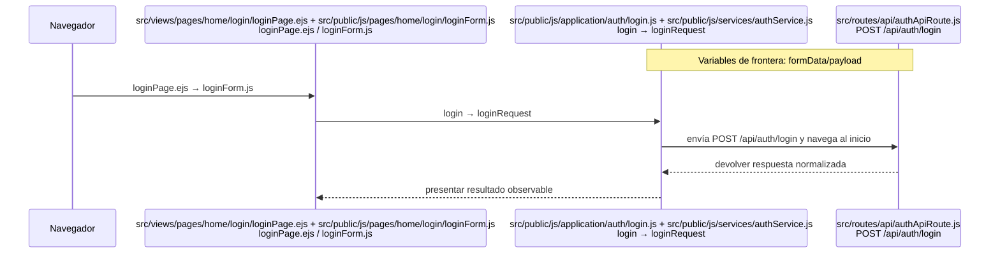

## `CU-AUT-02`

**Identificador:** `DIA-FE-CU-AUT-02`. **Fuente:** fila `CU-AUT-02` de la matriz de aplicación al código frontend.

**Patrones:** `FE-P09`.

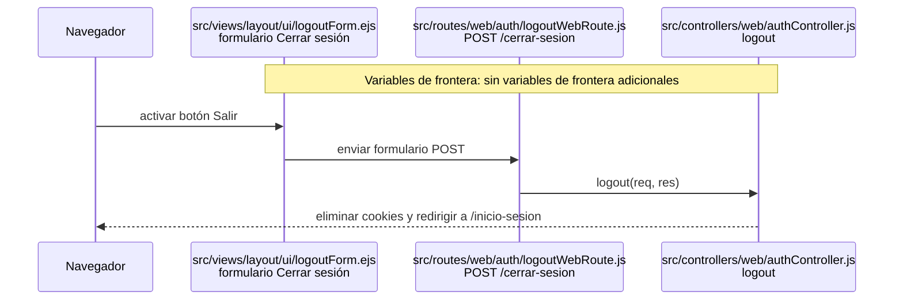

## `CU-IDA-01`

**Identificador:** `DIA-FE-CU-IDA-01`. **Fuente:** fila `CU-IDA-01` de la matriz de aplicación al código frontend.

**Patrones:** `FE-P02`.


## `CU-IDA-02`

**Identificador:** `DIA-FE-CU-IDA-02`. **Fuente:** fila `CU-IDA-02` de la matriz de aplicación al código frontend.

**Patrones:** `FE-P02`.

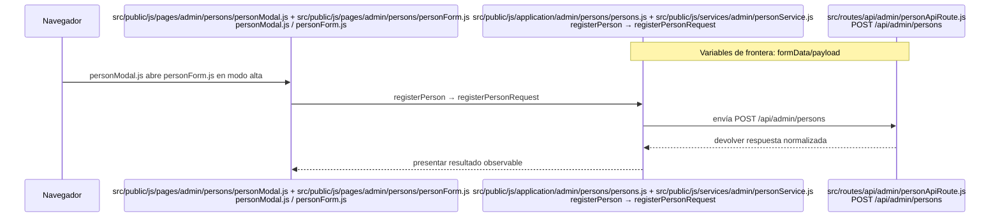

## `CU-IDA-03`

**Identificador:** `DIA-FE-CU-IDA-03`. **Fuente:** fila `CU-IDA-03` de la matriz de aplicación al código frontend.

**Patrones:** `FE-P02`.

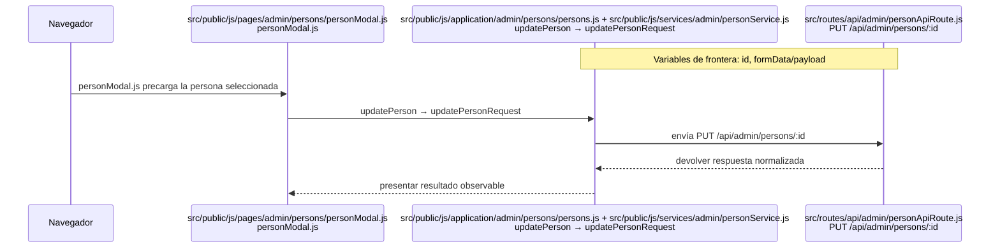

## `CU-IDA-04`

**Identificador:** `DIA-FE-CU-IDA-04`. **Fuente:** fila `CU-IDA-04` de la matriz de aplicación al código frontend.

**Patrones:** `FE-P02`.

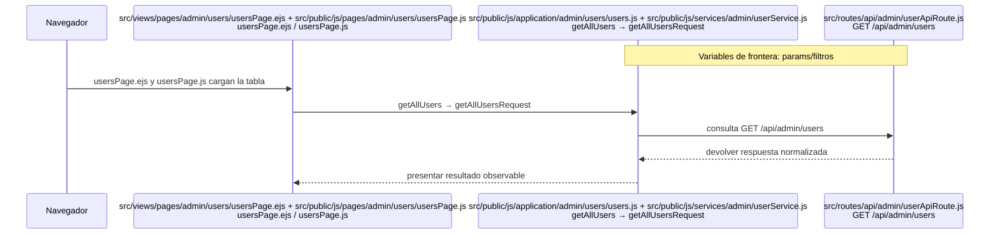

## `CU-IDA-05`

**Identificador:** `DIA-FE-CU-IDA-05`. **Fuente:** fila `CU-IDA-05` de la matriz de aplicación al código frontend.

**Patrones:** `FE-P02`.

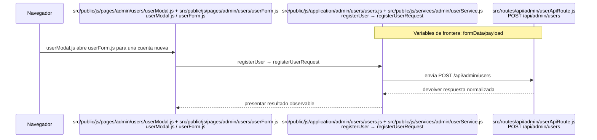

## `CU-IDA-06`

**Identificador:** `DIA-FE-CU-IDA-06`. **Fuente:** fila `CU-IDA-06` de la matriz de aplicación al código frontend.

**Patrones:** `FE-P02`.

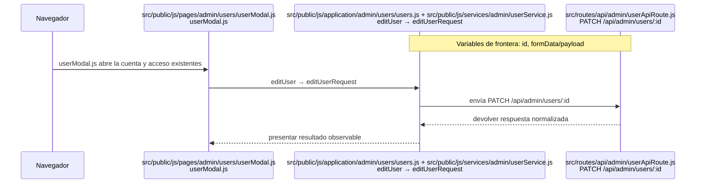

## `CU-IDA-07`

**Identificador:** `DIA-FE-CU-IDA-07`. **Fuente:** fila `CU-IDA-07` de la matriz de aplicación al código frontend.

**Patrones:** `FE-P02`.

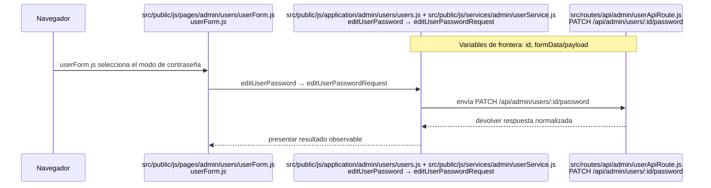

## `CU-IDA-08`

**Identificador:** `DIA-FE-CU-IDA-08`. **Fuente:** fila `CU-IDA-08` de la matriz de aplicación al código frontend.

**Patrones:** `FE-P03`.

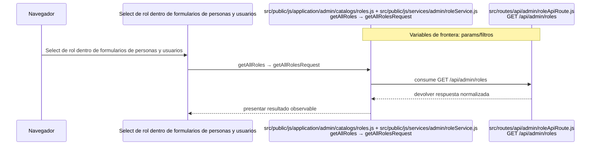

## `CU-IDA-09`

**Identificador:** `DIA-FE-CU-IDA-09`. **Fuente:** fila `CU-IDA-09` de la matriz de aplicación al código frontend.

**Patrones:** `FE-P03`.

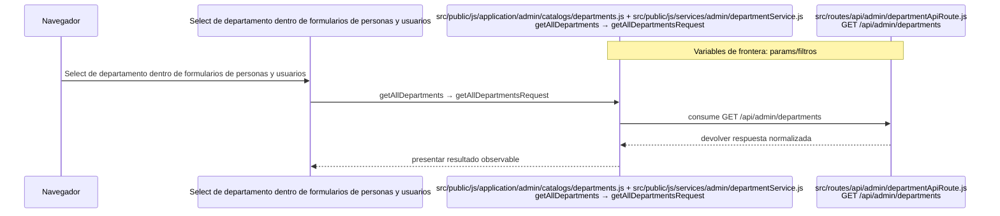

## `CU-CAT-01`

**Identificador:** `DIA-FE-CU-CAT-01`. **Fuente:** fila `CU-CAT-01` de la matriz de aplicación al código frontend.

**Patrones:** `FE-P02`.

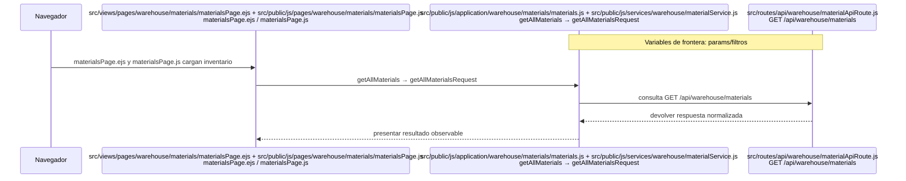

## `CU-CAT-02`

**Identificador:** `DIA-FE-CU-CAT-02`. **Fuente:** fila `CU-CAT-02` de la matriz de aplicación al código frontend.

**Patrones:** `FE-P02`.


## `CU-CAT-03`

**Identificador:** `DIA-FE-CU-CAT-03`. **Fuente:** fila `CU-CAT-03` de la matriz de aplicación al código frontend.

**Patrones:** `FE-P02`.

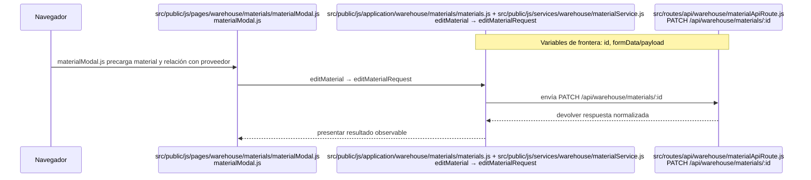

## `CU-CAT-04`

**Identificador:** `DIA-FE-CU-CAT-04`. **Fuente:** fila `CU-CAT-04` de la matriz de aplicación al código frontend.

**Patrones:** `FE-P02`.

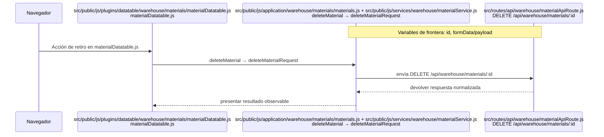

## `CU-CAT-05`

**Identificador:** `DIA-FE-CU-CAT-05`. **Fuente:** fila `CU-CAT-05` de la matriz de aplicación al código frontend.

**Patrones:** `FE-P02`.

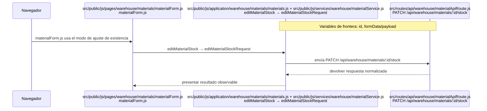

## `CU-CAT-06`

**Identificador:** `DIA-FE-CU-CAT-06`. **Fuente:** fila `CU-CAT-06` de la matriz de aplicación al código frontend.

**Patrones:** `FE-P02`.


## `CU-CAT-07`

**Identificador:** `DIA-FE-CU-CAT-07`. **Fuente:** fila `CU-CAT-07` de la matriz de aplicación al código frontend.

**Patrones:** `FE-P02`.


## `CU-CAT-08`

**Identificador:** `DIA-FE-CU-CAT-08`. **Fuente:** fila `CU-CAT-08` de la matriz de aplicación al código frontend.

**Patrones:** `FE-P02`.

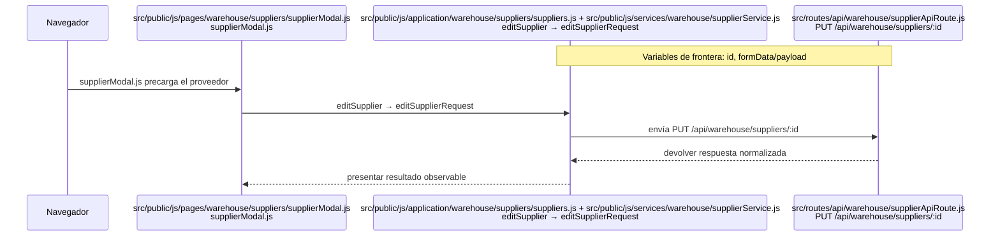

## `CU-CAT-09`

**Identificador:** `DIA-FE-CU-CAT-09`. **Fuente:** fila `CU-CAT-09` de la matriz de aplicación al código frontend.

**Patrones:** `FE-P02`.

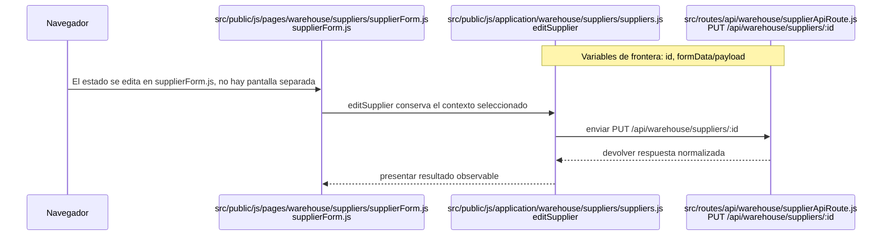

## `CU-CAT-10`

**Identificador:** `DIA-FE-CU-CAT-10`. **Fuente:** fila `CU-CAT-10` de la matriz de aplicación al código frontend.

**Patrones:** `FE-P02`.

```mermaid
sequenceDiagram
    participant Browser as Navegador
    participant View as src/views/pages/sales/clients/clientsPage.ejs + src/public/js/pages/sales/clients/clientsPage.js<br/>clientsPage.ejs / clientsPage.js
    participant Application as src/public/js/application/sales/clients/clients.js + src/public/js/services/sales/clientService.js<br/>getAllClients → getAllClientsRequest
    participant Transport as src/routes/api/sales/clientApiRoute.js<br/>GET /api/sales/clients
    Note over Application,Transport: Variables de frontera: params/filtros

    Browser->>View: clientsPage.ejs y clientsPage.js cargan clientes
    View->>Application: getAllClients → getAllClientsRequest
    Application->>Transport: consulta GET /api/sales/clients
    Transport-->>Application: devolver respuesta normalizada
    Application-->>View: presentar resultado observable
```

## `CU-CAT-11`

**Identificador:** `DIA-FE-CU-CAT-11`. **Fuente:** fila `CU-CAT-11` de la matriz de aplicación al código frontend.

**Patrones:** `FE-P02`.

```mermaid
sequenceDiagram
    participant Browser as Navegador
    participant View as src/public/js/pages/sales/clients/clientModal.js + src/public/js/pages/sales/clients/clientForm.js<br/>clientModal.js / clientForm.js
    participant Application as src/public/js/application/sales/clients/clients.js + src/public/js/services/sales/clientService.js<br/>registerClient → createClientRequest
    participant Transport as src/routes/api/sales/clientApiRoute.js<br/>POST /api/sales/clients
    Note over Application,Transport: Variables de frontera: formData/payload

    Browser->>View: clientModal.js abre clientForm.js en alta
    View->>Application: registerClient → createClientRequest
    Application->>Transport: envía POST /api/sales/clients
    Transport-->>Application: devolver respuesta normalizada
    Application-->>View: presentar resultado observable
```

## `CU-CAT-12`

**Identificador:** `DIA-FE-CU-CAT-12`. **Fuente:** fila `CU-CAT-12` de la matriz de aplicación al código frontend.

**Patrones:** `FE-P02`.

```mermaid
sequenceDiagram
    participant Browser as Navegador
    participant View as src/public/js/pages/sales/clients/clientModal.js<br/>clientModal.js
    participant Application as src/public/js/application/sales/clients/clients.js + src/public/js/services/sales/clientService.js<br/>editClient → editClientRequest
    participant Transport as src/routes/api/sales/clientApiRoute.js<br/>PUT /api/sales/clients/:id
    Note over Application,Transport: Variables de frontera: id, formData/payload

    Browser->>View: clientModal.js precarga el cliente
    View->>Application: editClient → editClientRequest
    Application->>Transport: envía PUT /api/sales/clients/:id
    Transport-->>Application: devolver respuesta normalizada
    Application-->>View: presentar resultado observable
```

## `CU-CAT-13`

**Identificador:** `DIA-FE-CU-CAT-13`. **Fuente:** fila `CU-CAT-13` de la matriz de aplicación al código frontend.

**Patrones:** `FE-P02`.

```mermaid
sequenceDiagram
    participant Browser as Navegador
    participant View as src/views/pages/warehouse/wastes/wastesPage.ejs + src/public/js/pages/warehouse/wastes/wastesPage.js<br/>wastesPage.ejs / wastesPage.js
    participant Application as src/public/js/application/warehouse/wastes/wastes.js + src/public/js/services/warehouse/wasteService.js<br/>getAllWastes → getAllWastesRequest
    participant Transport as src/routes/api/warehouse/wasteApiRoute.js<br/>GET /api/warehouse/wastes
    Note over Application,Transport: Variables de frontera: params/filtros

    Browser->>View: wastesPage.ejs y wastesPage.js cargan mermas
    View->>Application: getAllWastes → getAllWastesRequest
    Application->>Transport: consulta GET /api/warehouse/wastes
    Transport-->>Application: devolver respuesta normalizada
    Application-->>View: presentar resultado observable
```

## `CU-CAT-14`

**Identificador:** `DIA-FE-CU-CAT-14`. **Fuente:** fila `CU-CAT-14` de la matriz de aplicación al código frontend.

**Patrones:** `FE-P02`.

```mermaid
sequenceDiagram
    participant Browser as Navegador
    participant View as src/public/js/pages/warehouse/wastes/wasteModal.js + src/public/js/pages/warehouse/wastes/wasteForm.js<br/>wasteModal.js / wasteForm.js
    participant Application as src/public/js/application/warehouse/wastes/wastes.js<br/>getWasteMaterialTemplates
    participant Transport as src/routes/api/warehouse/wasteApiRoute.js<br/>POST /api/warehouse/wastes
    Note over Application,Transport: Variables de frontera: formData/payload

    Browser->>View: wasteModal.js y wasteForm.js seleccionan una plantilla de material
    View->>Application: getWasteMaterialTemplates prepara datos y registerWaste registra
    Application->>Transport: enviar POST /api/warehouse/wastes
    Transport-->>Application: devolver respuesta normalizada
    Application-->>View: presentar resultado observable
```

## `CU-CAT-15`

**Identificador:** `DIA-FE-CU-CAT-15`. **Fuente:** fila `CU-CAT-15` de la matriz de aplicación al código frontend.

**Patrones:** `FE-P02`.

```mermaid
sequenceDiagram
    participant Browser as Navegador
    participant View as src/public/js/pages/warehouse/wastes/wasteModal.js<br/>wasteModal.js
    participant Application as src/public/js/application/warehouse/wastes/wastes.js + src/public/js/services/warehouse/wasteService.js<br/>editWaste → editWasteRequest
    participant Transport as src/routes/api/warehouse/wasteApiRoute.js<br/>PATCH /api/warehouse/wastes/:id
    Note over Application,Transport: Variables de frontera: id, formData/payload

    Browser->>View: wasteModal.js precarga la merma
    View->>Application: editWaste → editWasteRequest
    Application->>Transport: envía PATCH /api/warehouse/wastes/:id
    Transport-->>Application: devolver respuesta normalizada
    Application-->>View: presentar resultado observable
```

## `CU-CAT-16`

**Identificador:** `DIA-FE-CU-CAT-16`. **Fuente:** fila `CU-CAT-16` de la matriz de aplicación al código frontend.

**Patrones:** `FE-P02`.

```mermaid
sequenceDiagram
    participant Browser as Navegador
    participant View as src/public/js/pages/warehouse/wastes/wasteForm.js<br/>wasteForm.js
    participant Application as src/public/js/application/warehouse/wastes/wastes.js + src/public/js/services/warehouse/wasteService.js<br/>editWasteStock → editWasteStockRequest
    participant Transport as src/routes/api/warehouse/wasteApiRoute.js<br/>PATCH /api/warehouse/wastes/:id/stock
    Note over Application,Transport: Variables de frontera: id, formData/payload

    Browser->>View: wasteForm.js usa el modo de ajuste
    View->>Application: editWasteStock → editWasteStockRequest
    Application->>Transport: envía PATCH /api/warehouse/wastes/:id/stock
    Transport-->>Application: devolver respuesta normalizada
    Application-->>View: presentar resultado observable
```

## `CU-CAT-17`

**Identificador:** `DIA-FE-CU-CAT-17`. **Fuente:** fila `CU-CAT-17` de la matriz de aplicación al código frontend.

**Patrones:** `FE-P03`.

```mermaid
sequenceDiagram
    participant Browser as Navegador
    participant View as src/public/js/pages/warehouse/materials/materialFields.js + src/public/js/pages/warehouse/wastes/wasteFields.js<br/>materialFields.js / wasteFields.js
    participant Application as src/public/js/application/warehouse/catalogs/presentations.js + src/public/js/services/warehouse/presentationService.js<br/>getAllPresentations → getAllPresentationsRequest
    participant Transport as src/routes/api/warehouse/presentationApiRoute.js<br/>GET /api/warehouse/presentations
    Note over Application,Transport: Variables de frontera: params/filtros

    Browser->>View: Select de presentación en materialFields.js y wasteFields.js
    View->>Application: getAllPresentations → getAllPresentationsRequest
    Application->>Transport: consume GET /api/warehouse/presentations
    Transport-->>Application: devolver respuesta normalizada
    Application-->>View: presentar resultado observable
```

## `CU-CAT-18`

**Identificador:** `DIA-FE-CU-CAT-18`. **Fuente:** fila `CU-CAT-18` de la matriz de aplicación al código frontend.

**Patrones:** `FE-P03`.

```mermaid
sequenceDiagram
    participant Browser as Navegador
    participant View as Select de unidad en formularios de material y merma
    participant Application as src/public/js/application/warehouse/catalogs/unitMeasures.js + src/public/js/services/warehouse/unitMeasureService.js<br/>getAllUnitMeasures → getAllUnitMeasuresRequest
    participant Transport as src/routes/api/warehouse/unitMeasureApiRoute.js<br/>GET /api/warehouse/unit-measures
    Note over Application,Transport: Variables de frontera: params/filtros

    Browser->>View: Select de unidad en formularios de material y merma
    View->>Application: getAllUnitMeasures → getAllUnitMeasuresRequest
    Application->>Transport: consume GET /api/warehouse/unit-measures
    Transport-->>Application: devolver respuesta normalizada
    Application-->>View: presentar resultado observable
```

## `CU-CAT-19`

**Identificador:** `DIA-FE-CU-CAT-19`. **Fuente:** fila `CU-CAT-19` de la matriz de aplicación al código frontend.

**Patrones:** `FE-P03`.

```mermaid
sequenceDiagram
    participant Browser as Navegador
    participant View as Select de motivo en los modos de ajuste
    participant Application as src/public/js/application/warehouse/catalogs/reasons.js + src/public/js/services/warehouse/reasonService.js<br/>getAllReasons → getAllReasonsRequest
    participant Transport as src/routes/api/warehouse/reasonApiRoute.js<br/>GET /api/warehouse/reasons
    Note over Application,Transport: Variables de frontera: params/filtros

    Browser->>View: Select de motivo en los modos de ajuste
    View->>Application: getAllReasons → getAllReasonsRequest
    Application->>Transport: consume GET /api/warehouse/reasons
    Transport-->>Application: devolver respuesta normalizada
    Application-->>View: presentar resultado observable
```

## `CU-CAT-20`

**Identificador:** `DIA-FE-CU-CAT-20`. **Fuente:** fila `CU-CAT-20` de la matriz de aplicación al código frontend.

**Patrones:** `FE-P03`.

```mermaid
sequenceDiagram
    participant Browser as Navegador
    participant View as Estado visible en tablas y formularios de salidas
    participant Application as src/public/js/application/warehouse/catalogs/fulfillmentStatuses.js<br/>getAllFulfillmentStatuses
    participant Transport as src/routes/api/warehouse/fulfillmentStatusApiRoute.js<br/>GET /api/warehouse/fulfillment-statuses
    Note over Application,Transport: Variables de frontera: params/filtros

    Browser->>View: Estado visible en tablas y formularios de salidas
    View->>Application: getAllFulfillmentStatuses → request homólogo
    Application->>Transport: consume GET /api/warehouse/fulfillment-statuses
    Transport-->>Application: devolver respuesta normalizada
    Application-->>View: presentar resultado observable
```

## `CU-ENT-01`

**Identificador:** `DIA-FE-CU-ENT-01`. **Fuente:** fila `CU-ENT-01` de la matriz de aplicación al código frontend.

**Patrones:** `FE-P02`, `FE-P04`.

```mermaid
sequenceDiagram
    participant Browser as Navegador
    participant View as src/views/pages/warehouse/goodsReceipts/goodsReceiptsPage.ejs<br/>goodsReceiptsPage.ejs
    participant Application as src/public/js/application/warehouse/goodsReceipts/goodsReceipts.js<br/>getAllGoodsReceipts
    participant Transport as src/routes/api/warehouse/goodsReceiptApiRoute.js<br/>GET /api/warehouse/goods-receipts
    Note over Application,Transport: Variables de frontera: params/filtros

    Browser->>View: goodsReceiptsPage.ejs y su DataTable cargan compras
    View->>Application: getAllGoodsReceipts → request homólogo
    Application->>Transport: consulta GET /api/warehouse/goods-receipts
    Transport-->>Application: devolver respuesta normalizada
    Application-->>View: presentar resultado observable
```

## `CU-ENT-02`

**Identificador:** `DIA-FE-CU-ENT-02`. **Fuente:** fila `CU-ENT-02` de la matriz de aplicación al código frontend.

**Patrones:** `FE-P02`, `FE-P04`.

```mermaid
sequenceDiagram
    participant Browser as Navegador
    participant View as src/public/js/pages/warehouse/goodsReceipts/goodsReceiptModal.js<br/>goodsReceiptModal.js
    participant Application as src/public/js/application/warehouse/goodsReceipts/goodsReceipts.js + src/public/js/services/warehouse/goodsReceiptService.js<br/>registerGoodsReceipt → registerGoodsReceiptRequest
    participant Transport as src/routes/api/warehouse/goodsReceiptApiRoute.js<br/>POST /api/warehouse/goods-receipts
    Note over Application,Transport: Variables de frontera: formData/payload

    Browser->>View: goodsReceiptModal.js captura encabezado y detalles
    View->>Application: registerGoodsReceipt → registerGoodsReceiptRequest
    Application->>Transport: envía POST /api/warehouse/goods-receipts
    Transport-->>Application: devolver respuesta normalizada
    Application-->>View: presentar resultado observable
```

## `CU-ENT-03`

**Identificador:** `DIA-FE-CU-ENT-03`. **Fuente:** fila `CU-ENT-03` de la matriz de aplicación al código frontend.

**Patrones:** `FE-P02`, `FE-P04`.

```mermaid
sequenceDiagram
    participant Browser as Navegador
    participant View as src/public/js/pages/warehouse/goodsReceipts/goodsReceiptModal.js<br/>goodsReceiptModal.js
    participant Application as src/public/js/application/warehouse/goodsReceipts/goodsReceipts.js<br/>editGoodsReceiptHeader
    participant Transport as src/routes/api/warehouse/goodsReceiptApiRoute.js<br/>PATCH /api/warehouse/goods-receipts/:id
    Note over Application,Transport: Variables de frontera: id, formData/payload

    Browser->>View: goodsReceiptModal.js abre una compra existente
    View->>Application: editGoodsReceiptHeader → request homólogo
    Application->>Transport: envía PATCH /api/warehouse/goods-receipts/:id
    Transport-->>Application: devolver respuesta normalizada
    Application-->>View: presentar resultado observable
```

## `CU-ENT-04`

**Identificador:** `DIA-FE-CU-ENT-04`. **Fuente:** fila `CU-ENT-04` de la matriz de aplicación al código frontend.

**Patrones:** `FE-P02`, `FE-P04`.

```mermaid
sequenceDiagram
    participant Browser as Navegador
    participant View as src/public/js/pages/warehouse/goodsReceipts/corrections/correctionModal.js + src/public/js/pages/warehouse/goodsReceipts/corrections/correctionForm.js<br/>correctionModal.js / correctionForm.js
    participant Application as src/public/js/application/warehouse/goodsReceipts/goodsReceipts.js<br/>correctGoodsReceiptDetail
    participant Transport as src/routes/api/warehouse/goodsReceiptApiRoute.js<br/>PATCH /api/warehouse/goods-receipts/:id/details/:detailId/corrections
    Note over Application,Transport: Variables de frontera: id, detailId, formData/payload

    Browser->>View: correctionModal.js y correctionForm.js aíslan la corrección
    View->>Application: correctGoodsReceiptDetail → request homólogo
    Application->>Transport: envía PATCH /api/warehouse/goods-receipts/:id/details/:detailId/corrections
    Transport-->>Application: devolver respuesta normalizada
    Application-->>View: presentar resultado observable
```

## `CU-ENT-05`

**Identificador:** `DIA-FE-CU-ENT-05`. **Fuente:** fila `CU-ENT-05` de la matriz de aplicación al código frontend.

**Patrones:** `FE-P02`, `FE-P04`.

```mermaid
sequenceDiagram
    participant Browser as Navegador
    participant View as Acción Cancelar del detalle en el modal de compra
    participant Application as src/public/js/application/warehouse/goodsReceipts/goodsReceipts.js<br/>cancelGoodsReceiptDetail
    participant Transport as src/routes/api/warehouse/goodsReceiptApiRoute.js<br/>PATCH /api/warehouse/goods-receipts/:id/details/:detailId/cancel
    Note over Application,Transport: Variables de frontera: id, detailId, formData/payload

    Browser->>View: Acción Cancelar del detalle en el modal de compra
    View->>Application: cancelGoodsReceiptDetail → request homólogo
    Application->>Transport: envía PATCH /api/warehouse/goods-receipts/:id/details/:detailId/cancel
    Transport-->>Application: devolver respuesta normalizada
    Application-->>View: presentar resultado observable
```

## `CU-SAL-01`

**Identificador:** `DIA-FE-CU-SAL-01`. **Fuente:** fila `CU-SAL-01` de la matriz de aplicación al código frontend.

**Patrones:** `FE-P05`.

```mermaid
sequenceDiagram
    participant Browser as Navegador
    participant View as src/views/pages/warehouse/goodsIssues/goodsIssuesPage.ejs<br/>goodsIssuesPage.ejs
    participant Application as src/public/js/application/warehouse/goodsIssues/goodsIssues.js<br/>getAllGoodsIssues
    participant Transport as src/routes/api/warehouse/goodsIssueApiRoute.js<br/>GET /api/warehouse/goods-issues
    Note over Application,Transport: Variables de frontera: params/filtros

    Browser->>View: goodsIssuesPage.ejs y su DataTable cargan salidas
    View->>Application: getAllGoodsIssues → request homólogo
    Application->>Transport: consulta GET /api/warehouse/goods-issues
    Transport-->>Application: devolver respuesta normalizada
    Application-->>View: presentar resultado observable
```

## `CU-SAL-02`

**Identificador:** `DIA-FE-CU-SAL-02`. **Fuente:** fila `CU-SAL-02` de la matriz de aplicación al código frontend.

**Patrones:** `FE-P05`.

```mermaid
sequenceDiagram
    participant Browser as Navegador
    participant View as src/public/js/pages/warehouse/goodsIssues/goodsIssueModal.js<br/>goodsIssueModal.js
    participant Application as src/public/js/application/warehouse/goodsIssues/goodsIssues.js<br/>registerGoodsIssue
    participant Transport as src/routes/api/warehouse/goodsIssueApiRoute.js<br/>POST /api/warehouse/goods-issues
    Note over Application,Transport: Variables de frontera: formData/payload

    Browser->>View: goodsIssueModal.js captura documento y materiales
    View->>Application: registerGoodsIssue → request homólogo
    Application->>Transport: envía POST /api/warehouse/goods-issues
    Transport-->>Application: devolver respuesta normalizada
    Application-->>View: presentar resultado observable
```

## `CU-SAL-03`

**Identificador:** `DIA-FE-CU-SAL-03`. **Fuente:** fila `CU-SAL-03` de la matriz de aplicación al código frontend.

**Patrones:** `FE-P05`.

```mermaid
sequenceDiagram
    participant Browser as Navegador
    participant View as src/public/js/pages/warehouse/goodsIssues/goodsIssueModal.js<br/>goodsIssueModal.js
    participant Application as src/public/js/application/warehouse/goodsIssues/goodsIssues.js<br/>editGoodsIssueHeader
    participant Transport as src/routes/api/warehouse/goodsIssueApiRoute.js<br/>PATCH /api/warehouse/goods-issues/:id/header
    Note over Application,Transport: Variables de frontera: id, formData/payload

    Browser->>View: Modo encabezado de goodsIssueModal.js
    View->>Application: editGoodsIssueHeader → request homólogo
    Application->>Transport: envía PATCH /api/warehouse/goods-issues/:id/header
    Transport-->>Application: devolver respuesta normalizada
    Application-->>View: presentar resultado observable
```

## `CU-SAL-04`

**Identificador:** `DIA-FE-CU-SAL-04`. **Fuente:** fila `CU-SAL-04` de la matriz de aplicación al código frontend.

**Patrones:** `FE-P05`.

```mermaid
sequenceDiagram
    participant Browser as Navegador
    participant View as src/public/js/pages/warehouse/goodsIssues/goodsIssueModal.js<br/>goodsIssueModal.js
    participant Application as src/public/js/application/warehouse/goodsIssues/goodsIssues.js<br/>editGoodsIssueDetails
    participant Transport as src/routes/api/warehouse/goodsIssueApiRoute.js<br/>PATCH /api/warehouse/goods-issues/:id/details
    Note over Application,Transport: Variables de frontera: id, formData/payload

    Browser->>View: Modo detalles de goodsIssueModal.js
    View->>Application: editGoodsIssueDetails → request homólogo
    Application->>Transport: envía PATCH /api/warehouse/goods-issues/:id/details
    Transport-->>Application: devolver respuesta normalizada
    Application-->>View: presentar resultado observable
```

## `CU-SAL-05`

**Identificador:** `DIA-FE-CU-SAL-05`. **Fuente:** fila `CU-SAL-05` de la matriz de aplicación al código frontend.

**Patrones:** `FE-P05`.

```mermaid
sequenceDiagram
    participant Browser as Navegador
    participant View as Acción Surtir dentro de los detalles de salida
    participant Application as src/public/js/application/warehouse/goodsIssues/goodsIssues.js<br/>editGoodsIssueDetails
    participant Transport as src/routes/api/warehouse/goodsIssueApiRoute.js<br/>PATCH /api/warehouse/goods-issues/:id/details
    Note over Application,Transport: Variables de frontera: id, formData/payload

    Browser->>View: Acción Surtir dentro de los detalles de salida
    View->>Application: editGoodsIssueDetails entrega las cantidades capturadas
    Application->>Transport: enviar PATCH /api/warehouse/goods-issues/:id/details
    Transport-->>Application: devolver respuesta normalizada
    Application-->>View: presentar resultado observable
```

## `CU-SAL-06`

**Identificador:** `DIA-FE-CU-SAL-06`. **Fuente:** fila `CU-SAL-06` de la matriz de aplicación al código frontend.

**Patrones:** `FE-P05`, `FE-P06`.

```mermaid
sequenceDiagram
    participant Browser as Navegador
    participant View as src/public/js/pages/warehouse/goodsIssues/returns/goodsIssueReturn.js<br/>returns/goodsIssueReturn.js
    participant Application as src/public/js/application/warehouse/goodsIssues/goodsIssues.js<br/>returnGoodsIssueDetail
    participant Transport as src/routes/api/warehouse/goodsIssueApiRoute.js<br/>PATCH /api/warehouse/goods-issues/:id/details/:detailId/returns
    Note over Application,Transport: Variables de frontera: id, detailId, formData/payload, cantidadRetornable

    Browser->>View: returns/goodsIssueReturn.js configura issueReturnUI
    View->>Application: returnGoodsIssueDetail → request homólogo
    Application->>Transport: envía PATCH /api/warehouse/goods-issues/:id/details/:detailId/returns
    Transport-->>Application: devolver respuesta normalizada
    Application-->>View: presentar resultado observable
```

## `CU-SAL-07`

**Identificador:** `DIA-FE-CU-SAL-07`. **Fuente:** fila `CU-SAL-07` de la matriz de aplicación al código frontend.

**Patrones:** `FE-P05`.

```mermaid
sequenceDiagram
    participant Browser as Navegador
    participant View as src/views/pages/warehouse/wasteIssues/wasteIssuesPage.ejs<br/>wasteIssuesPage.ejs
    participant Application as src/public/js/application/warehouse/wasteIssues/wasteIssues.js<br/>getAllWasteIssues
    participant Transport as src/routes/api/warehouse/wasteIssueApiRoute.js<br/>GET /api/warehouse/waste-issues
    Note over Application,Transport: Variables de frontera: params/filtros

    Browser->>View: wasteIssuesPage.ejs y su DataTable cargan salidas de merma
    View->>Application: getAllWasteIssues → request homólogo
    Application->>Transport: consulta GET /api/warehouse/waste-issues
    Transport-->>Application: devolver respuesta normalizada
    Application-->>View: presentar resultado observable
```

## `CU-SAL-08`

**Identificador:** `DIA-FE-CU-SAL-08`. **Fuente:** fila `CU-SAL-08` de la matriz de aplicación al código frontend.

**Patrones:** `FE-P05`.

```mermaid
sequenceDiagram
    participant Browser as Navegador
    participant View as src/public/js/pages/warehouse/wasteIssues/wasteIssueModal.js<br/>wasteIssueModal.js
    participant Application as src/public/js/application/warehouse/wasteIssues/wasteIssues.js<br/>registerWasteIssue
    participant Transport as src/routes/api/warehouse/wasteIssueApiRoute.js<br/>POST /api/warehouse/waste-issues
    Note over Application,Transport: Variables de frontera: formData/payload

    Browser->>View: wasteIssueModal.js captura documento y mermas
    View->>Application: registerWasteIssue → request homólogo
    Application->>Transport: envía POST /api/warehouse/waste-issues
    Transport-->>Application: devolver respuesta normalizada
    Application-->>View: presentar resultado observable
```

## `CU-SAL-09`

**Identificador:** `DIA-FE-CU-SAL-09`. **Fuente:** fila `CU-SAL-09` de la matriz de aplicación al código frontend.

**Patrones:** `FE-P05`.

```mermaid
sequenceDiagram
    participant Browser as Navegador
    participant View as src/public/js/pages/warehouse/wasteIssues/wasteIssueModal.js<br/>wasteIssueModal.js
    participant Application as src/public/js/application/warehouse/wasteIssues/wasteIssues.js<br/>editWasteIssueHeader
    participant Transport as src/routes/api/warehouse/wasteIssueApiRoute.js<br/>PATCH /api/warehouse/waste-issues/:id/header
    Note over Application,Transport: Variables de frontera: id, formData/payload

    Browser->>View: Modo encabezado de wasteIssueModal.js
    View->>Application: editWasteIssueHeader → request homólogo
    Application->>Transport: envía PATCH /api/warehouse/waste-issues/:id/header
    Transport-->>Application: devolver respuesta normalizada
    Application-->>View: presentar resultado observable
```

## `CU-SAL-10`

**Identificador:** `DIA-FE-CU-SAL-10`. **Fuente:** fila `CU-SAL-10` de la matriz de aplicación al código frontend.

**Patrones:** `FE-P05`.

```mermaid
sequenceDiagram
    participant Browser as Navegador
    participant View as src/public/js/pages/warehouse/wasteIssues/wasteIssueModal.js<br/>wasteIssueModal.js
    participant Application as src/public/js/application/warehouse/wasteIssues/wasteIssues.js<br/>editWasteIssueDetails
    participant Transport as src/routes/api/warehouse/wasteIssueApiRoute.js<br/>PATCH /api/warehouse/waste-issues/:id/details
    Note over Application,Transport: Variables de frontera: id, formData/payload

    Browser->>View: Modo detalles de wasteIssueModal.js
    View->>Application: editWasteIssueDetails → request homólogo
    Application->>Transport: envía PATCH /api/warehouse/waste-issues/:id/details
    Transport-->>Application: devolver respuesta normalizada
    Application-->>View: presentar resultado observable
```

## `CU-SAL-11`

**Identificador:** `DIA-FE-CU-SAL-11`. **Fuente:** fila `CU-SAL-11` de la matriz de aplicación al código frontend.

**Patrones:** `FE-P05`.

```mermaid
sequenceDiagram
    participant Browser as Navegador
    participant View as Acción Surtir dentro de los detalles de merma
    participant Application as src/public/js/application/warehouse/wasteIssues/wasteIssues.js<br/>editWasteIssueDetails
    participant Transport as src/routes/api/warehouse/wasteIssueApiRoute.js<br/>PATCH /api/warehouse/waste-issues/:id/details
    Note over Application,Transport: Variables de frontera: id, formData/payload

    Browser->>View: Acción Surtir dentro de los detalles de merma
    View->>Application: editWasteIssueDetails entrega las cantidades capturadas
    Application->>Transport: enviar PATCH /api/warehouse/waste-issues/:id/details
    Transport-->>Application: devolver respuesta normalizada
    Application-->>View: presentar resultado observable
```

## `CU-SAL-12`

**Identificador:** `DIA-FE-CU-SAL-12`. **Fuente:** fila `CU-SAL-12` de la matriz de aplicación al código frontend.

**Patrones:** `FE-P05`, `FE-P06`.

```mermaid
sequenceDiagram
    participant Browser as Navegador
    participant View as src/public/js/pages/warehouse/wasteIssues/returns/wasteIssueReturn.js<br/>returns/wasteIssueReturn.js
    participant Application as src/public/js/application/warehouse/wasteIssues/wasteIssues.js<br/>returnWasteIssueDetail
    participant Transport as src/routes/api/warehouse/wasteIssueApiRoute.js<br/>PATCH /api/warehouse/waste-issues/:id/details/:detailId/returns
    Note over Application,Transport: Variables de frontera: id, detailId, formData/payload, cantidadRetornable

    Browser->>View: returns/wasteIssueReturn.js configura issueReturnUI
    View->>Application: returnWasteIssueDetail → request homólogo
    Application->>Transport: envía PATCH /api/warehouse/waste-issues/:id/details/:detailId/returns
    Transport-->>Application: devolver respuesta normalizada
    Application-->>View: presentar resultado observable
```

## `CU-REP-01`

**Identificador:** `DIA-FE-CU-REP-01`. **Fuente:** fila `CU-REP-01` de la matriz de aplicación al código frontend.

**Patrones:** `FE-P07`.

```mermaid
sequenceDiagram
    participant Browser as Navegador
    participant View as src/public/js/pages/warehouse/materials/materialsPage.js<br/>materialsPage.js
    participant Application as src/public/js/services/warehouse/materialService.js<br/>reutilizar getAllMaterialsRequest con los filtros
    participant Transport as src/routes/api/warehouse/materialApiRoute.js<br/>GET /api/warehouse/materials
    Note over Application,Transport: Variables de frontera: params/filtros

    Browser->>View: La consulta es el listado de materialsPage.js, no hay página de reporte
    View->>Application: reutilizar getAllMaterialsRequest con los filtros
    Application->>Transport: consultar GET /api/warehouse/materials sin mutación
    Transport-->>Application: devolver respuesta normalizada
    Application-->>View: presentar resultado observable
```

## `CU-REP-02`

**Identificador:** `DIA-FE-CU-REP-02`. **Fuente:** fila `CU-REP-02` de la matriz de aplicación al código frontend.

**Patrones:** `FE-P07`.

```mermaid
sequenceDiagram
    participant Browser as Navegador
    participant View as src/public/js/pages/admin/movements/movementsPage.js<br/>movementsPage.js
    participant Application as src/public/js/application/admin/movements/movements.js<br/>getAllMovements con contexto materials
    participant Transport as src/routes/api/admin/movementApiRoute.js<br/>GET /api/admin/movements/materials
    Note over Application,Transport: Variables de frontera: params/filtros

    Browser->>View: movementsPage.js selecciona el contexto material
    View->>Application: getAllMovements con contexto materials
    Application->>Transport: consultar GET /api/admin/movements/materials
    Transport-->>Application: devolver respuesta normalizada
    Application-->>View: presentar resultado observable
```

## `CU-REP-03`

**Identificador:** `DIA-FE-CU-REP-03`. **Fuente:** fila `CU-REP-03` de la matriz de aplicación al código frontend.

**Patrones:** `FE-P08`.

```mermaid
sequenceDiagram
    participant Browser as Navegador
    participant View as src/public/js/plugins/datatable/warehouse/materials/materialDatatable.js<br/>materialDatatable.js
    participant Application as src/public/js/application/warehouse/report.js + src/public/js/services/warehouse/reportService.js<br/>exportWarehouseReport → exportWarehouseReportRequest
    participant Transport as src/routes/api/warehouse/reportApiRoute.js<br/>descarga /api/warehouse/reports/inventory/excel
    Note over Application,Transport: Variables de frontera: params/filtros

    Browser->>View: Botón Excel de materialDatatable.js
    View->>Application: exportWarehouseReport → exportWarehouseReportRequest
    Application->>Transport: descarga /api/warehouse/reports/inventory/excel
    Transport-->>Application: devolver respuesta normalizada
    Application-->>View: presentar resultado observable
```

## `CU-REP-04`

**Identificador:** `DIA-FE-CU-REP-04`. **Fuente:** fila `CU-REP-04` de la matriz de aplicación al código frontend.

**Patrones:** `FE-P08`.

```mermaid
sequenceDiagram
    participant Browser as Navegador
    participant View as Botón Excel del listado de salidas de material
    participant Application as src/public/js/application/warehouse/report.js<br/>exportGoodsIssueReport
    participant Transport as src/routes/api/warehouse/reportApiRoute.js<br/>descarga /api/warehouse/reports/goods-issues/excel
    Note over Application,Transport: Variables de frontera: params/filtros

    Browser->>View: Botón Excel del listado de salidas de material
    View->>Application: exportGoodsIssueReport → request homólogo
    Application->>Transport: descarga /api/warehouse/reports/goods-issues/excel
    Transport-->>Application: devolver respuesta normalizada
    Application-->>View: presentar resultado observable
```

## `CU-REP-05`

**Identificador:** `DIA-FE-CU-REP-05`. **Fuente:** fila `CU-REP-05` de la matriz de aplicación al código frontend.

**Patrones:** `FE-P08`.

```mermaid
sequenceDiagram
    participant Browser as Navegador
    participant View as Botón Excel de movimientos en contexto material
    participant Application as src/public/js/application/admin/report.js<br/>exportMovementReport → request con materials
    participant Transport as src/routes/api/admin/reportApiRoute.js<br/>descarga /api/admin/reports/movements/materials/excel
    Note over Application,Transport: Variables de frontera: params/filtros

    Browser->>View: Botón Excel de movimientos en contexto material
    View->>Application: exportMovementReport → request con materials
    Application->>Transport: descarga /api/admin/reports/movements/materials/excel
    Transport-->>Application: devolver respuesta normalizada
    Application-->>View: presentar resultado observable
```

## `CU-REP-06`

**Identificador:** `DIA-FE-CU-REP-06`. **Fuente:** fila `CU-REP-06` de la matriz de aplicación al código frontend.

**Patrones:** `FE-P07`.

```mermaid
sequenceDiagram
    participant Browser as Navegador
    participant View as src/public/js/pages/warehouse/wastes/wastesPage.js<br/>wastesPage.js
    participant Application as src/public/js/services/warehouse/wasteService.js<br/>reutilizar getAllWastesRequest con los filtros
    participant Transport as src/routes/api/warehouse/wasteApiRoute.js<br/>GET /api/warehouse/wastes
    Note over Application,Transport: Variables de frontera: params/filtros

    Browser->>View: La consulta es el listado de wastesPage.js, no hay página de reporte
    View->>Application: reutilizar getAllWastesRequest con los filtros
    Application->>Transport: consultar GET /api/warehouse/wastes sin mutación
    Transport-->>Application: devolver respuesta normalizada
    Application-->>View: presentar resultado observable
```

## `CU-REP-07`

**Identificador:** `DIA-FE-CU-REP-07`. **Fuente:** fila `CU-REP-07` de la matriz de aplicación al código frontend.

**Patrones:** `FE-P07`.

```mermaid
sequenceDiagram
    participant Browser as Navegador
    participant View as src/public/js/pages/admin/movements/movementsPage.js<br/>movementsPage.js
    participant Application as src/public/js/application/admin/movements/movements.js<br/>getAllMovements con contexto wastes
    participant Transport as src/routes/api/admin/movementApiRoute.js<br/>GET /api/admin/movements/wastes
    Note over Application,Transport: Variables de frontera: params/filtros

    Browser->>View: movementsPage.js selecciona el contexto merma
    View->>Application: getAllMovements con contexto wastes
    Application->>Transport: consultar GET /api/admin/movements/wastes
    Transport-->>Application: devolver respuesta normalizada
    Application-->>View: presentar resultado observable
```

## `CU-REP-08`

**Identificador:** `DIA-FE-CU-REP-08`. **Fuente:** fila `CU-REP-08` de la matriz de aplicación al código frontend.

**Patrones:** `FE-P08`.

```mermaid
sequenceDiagram
    participant Browser as Navegador
    participant View as Botón Excel del listado de salidas de merma
    participant Application as src/public/js/application/warehouse/report.js<br/>exportWasteIssueReport
    participant Transport as src/routes/api/warehouse/reportApiRoute.js<br/>descarga /api/warehouse/reports/waste-issues/excel
    Note over Application,Transport: Variables de frontera: params/filtros

    Browser->>View: Botón Excel del listado de salidas de merma
    View->>Application: exportWasteIssueReport → request homólogo
    Application->>Transport: descarga /api/warehouse/reports/waste-issues/excel
    Transport-->>Application: devolver respuesta normalizada
    Application-->>View: presentar resultado observable
```

## `CU-REP-09`

**Identificador:** `DIA-FE-CU-REP-09`. **Fuente:** fila `CU-REP-09` de la matriz de aplicación al código frontend.

**Patrones:** `FE-P08`.

```mermaid
sequenceDiagram
    participant Browser as Navegador
    participant View as src/public/js/plugins/datatable/warehouse/wastes/wasteDatatable.js<br/>wasteDatatable.js
    participant Application as src/public/js/application/warehouse/report.js<br/>exportWasteReport
    participant Transport as src/routes/api/warehouse/reportApiRoute.js<br/>descarga /api/warehouse/reports/wastes/excel
    Note over Application,Transport: Variables de frontera: params/filtros

    Browser->>View: Botón Excel de wasteDatatable.js
    View->>Application: exportWasteReport → request homólogo
    Application->>Transport: descarga /api/warehouse/reports/wastes/excel
    Transport-->>Application: devolver respuesta normalizada
    Application-->>View: presentar resultado observable
```

## `CU-REP-10`

**Identificador:** `DIA-FE-CU-REP-10`. **Fuente:** fila `CU-REP-10` de la matriz de aplicación al código frontend.

**Patrones:** `FE-P08`.

```mermaid
sequenceDiagram
    participant Browser as Navegador
    participant View as Botón Excel de movimientos en contexto merma
    participant Application as src/public/js/application/admin/report.js<br/>exportMovementReport → request con wastes
    participant Transport as src/routes/api/admin/reportApiRoute.js<br/>descarga /api/admin/reports/movements/wastes/excel
    Note over Application,Transport: Variables de frontera: params/filtros

    Browser->>View: Botón Excel de movimientos en contexto merma
    View->>Application: exportMovementReport → request con wastes
    Application->>Transport: descarga /api/admin/reports/movements/wastes/excel
    Transport-->>Application: devolver respuesta normalizada
    Application-->>View: presentar resultado observable
```

## `CU-REP-11`

**Identificador:** `DIA-FE-CU-REP-11`. **Fuente:** fila `CU-REP-11` de la matriz de aplicación al código frontend.

**Patrones:** `FE-P08`.

```mermaid
sequenceDiagram
    participant Browser as Navegador
    participant View as src/public/js/plugins/datatable/warehouse/goodsReceipts/goodsReceiptDatatable.js<br/>goodsReceiptDatatable.js
    participant Application as src/public/js/application/warehouse/report.js<br/>exportGoodsReceiptReport
    participant Transport as src/routes/api/warehouse/reportApiRoute.js<br/>descarga /api/warehouse/reports/goods-receipts/excel
    Note over Application,Transport: Variables de frontera: params/filtros

    Browser->>View: Botón Excel de goodsReceiptDatatable.js
    View->>Application: exportGoodsReceiptReport → request homólogo
    Application->>Transport: descarga /api/warehouse/reports/goods-receipts/excel
    Transport-->>Application: devolver respuesta normalizada
    Application-->>View: presentar resultado observable
```

## `CU-REP-12`

**Identificador:** `DIA-FE-CU-REP-12`. **Fuente:** fila `CU-REP-12` de la matriz de aplicación al código frontend.

**Patrones:** `FE-P08`.

```mermaid
sequenceDiagram
    participant Browser as Navegador
    participant View as src/public/js/plugins/datatable/warehouse/suppliers/supplierDatatable.js<br/>supplierDatatable.js
    participant Application as src/public/js/application/warehouse/report.js<br/>exportSupplierReport
    participant Transport as src/routes/api/warehouse/reportApiRoute.js<br/>descarga /api/warehouse/reports/suppliers/excel
    Note over Application,Transport: Variables de frontera: params/filtros

    Browser->>View: Botón Excel de supplierDatatable.js
    View->>Application: exportSupplierReport → request homólogo
    Application->>Transport: descarga /api/warehouse/reports/suppliers/excel
    Transport-->>Application: devolver respuesta normalizada
    Application-->>View: presentar resultado observable
```

## `CU-REP-13`

**Identificador:** `DIA-FE-CU-REP-13`. **Fuente:** fila `CU-REP-13` de la matriz de aplicación al código frontend.

**Patrones:** `FE-P08`.

```mermaid
sequenceDiagram
    participant Browser as Navegador
    participant View as src/public/js/plugins/datatable/sales/clients/clientDatatable.js<br/>clientDatatable.js
    participant Application as src/public/js/application/sales/report.js<br/>exportClientReport
    participant Transport as src/routes/api/sales/reportApiRoute.js<br/>descarga /api/sales/reports/clients/excel
    Note over Application,Transport: Variables de frontera: params/filtros

    Browser->>View: Botón Excel de clientDatatable.js
    View->>Application: exportClientReport → request homólogo
    Application->>Transport: descarga /api/sales/reports/clients/excel
    Transport-->>Application: devolver respuesta normalizada
    Application-->>View: presentar resultado observable
```

## `CU-REP-14`

**Identificador:** `DIA-FE-CU-REP-14`. **Fuente:** fila `CU-REP-14` de la matriz de aplicación al código frontend.

**Patrones:** `FE-P08`.

```mermaid
sequenceDiagram
    participant Browser as Navegador
    participant View as src/public/js/plugins/datatable/admin/persons/personDatatable.js<br/>personDatatable.js
    participant Application as src/public/js/application/admin/report.js<br/>exportPersonReport
    participant Transport as descarga /api/admin/reports/persons/excel
    Note over Application,Transport: Variables de frontera: params/filtros

    Browser->>View: Botón Excel de personDatatable.js
    View->>Application: exportPersonReport → request homólogo
    Application->>Transport: descarga /api/admin/reports/persons/excel
    Transport-->>Application: devolver respuesta normalizada
    Application-->>View: presentar resultado observable
```

## `CU-REP-15`

**Identificador:** `DIA-FE-CU-REP-15`. **Fuente:** fila `CU-REP-15` de la matriz de aplicación al código frontend.

**Patrones:** `FE-P08`.

```mermaid
sequenceDiagram
    participant Browser as Navegador
    participant View as src/public/js/plugins/datatable/admin/users/userDatatable.js<br/>userDatatable.js
    participant Application as src/public/js/application/admin/report.js<br/>exportUserReport
    participant Transport as src/routes/api/admin/reportApiRoute.js<br/>descarga /api/admin/reports/users/excel
    Note over Application,Transport: Variables de frontera: params/filtros

    Browser->>View: Botón Excel de userDatatable.js
    View->>Application: exportUserReport → request homólogo
    Application->>Transport: descarga /api/admin/reports/users/excel
    Transport-->>Application: devolver respuesta normalizada
    Application-->>View: presentar resultado observable
```
