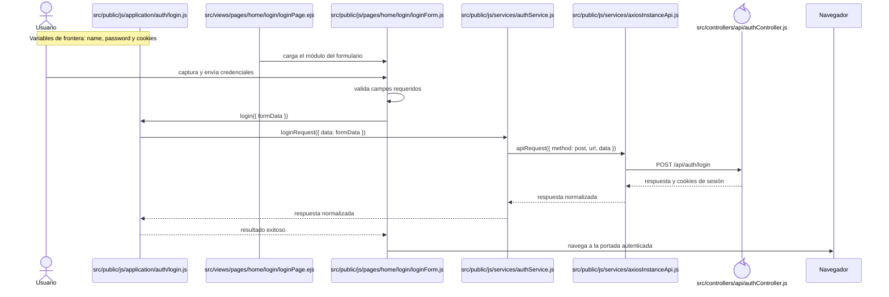
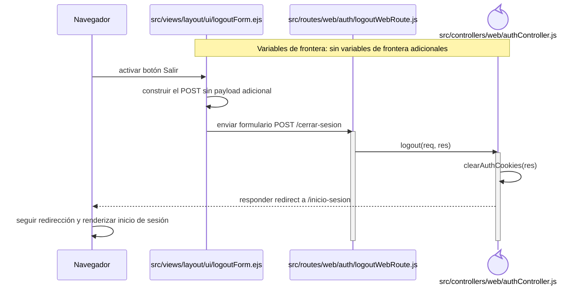

# Secuencias del código frontend: Autenticación

Este capítulo forma parte del [catálogo de secuencias del código frontend](index.md) y conserva los recorridos aplicados del grupo `AUT`. Las reglas comunes de lectura, trazabilidad y mantenimiento se declaran en el índice de la colección.

## `CU-AUT-01`

**Patrones:** `FE-P01`, `FE-P09`.

## `CU-AUT-02`

**Patrones:** `FE-P09`.

