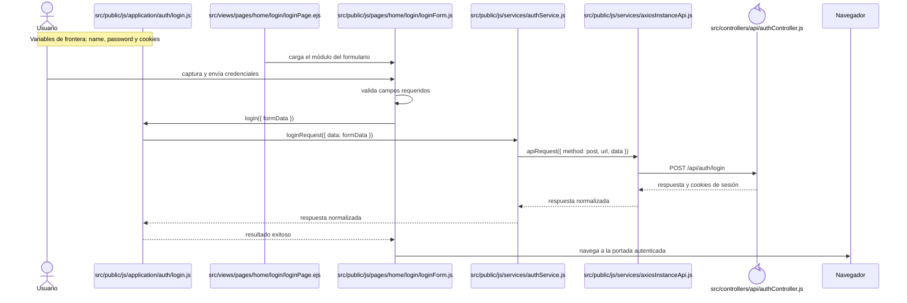

# `CU-AUT-01` — Iniciar sesión

**Patrones:** `FE-P01`, `FE-P09`.

```mermaid
sequenceDiagram
    Note over User,App: Variables de frontera: name, password y cookies
    actor User as Usuario
    participant EJS as src/views/pages/home/login/loginPage.ejs
    participant Form as src/public/js/pages/home/login/loginForm.js
    participant App as src/public/js/application/auth/login.js
    participant Request as src/public/js/services/authService.js
    participant HTTP as src/public/js/services/axiosInstanceApi.js
    participant API@{ "type": "control" } as src/controllers/api/authController.js
    participant Browser as Navegador

    EJS->>Form: carga el módulo del formulario
    User->>Form: captura y envía credenciales
    Form->>Form: valida campos requeridos
    Form->>App: login({ formData })
    App->>Request: loginRequest({ data: formData })
    Request->>HTTP: apiRequest({ method: post, url, data })
    HTTP->>API: POST /api/auth/login
    API-->>HTTP: respuesta y cookies de sesión
    HTTP-->>Request: respuesta normalizada
    Request-->>App: respuesta normalizada
    App-->>Form: resultado exitoso
    Form->>Browser: navega a la portada autenticada
```

