# Secuencias del código frontend: Catálogos e inventario

Este capítulo forma parte del [catálogo de secuencias del código frontend](index.md) y conserva los recorridos aplicados del grupo `CAT`. Las reglas comunes de lectura, trazabilidad y mantenimiento se declaran en el índice de la colección.

<a id="cu-cat-01"></a>

## `CU-CAT-01` — Consultar materiales

**Patrones:** `FE-P02`.


<a id="cu-cat-02"></a>

## `CU-CAT-02` — Crear material

**Patrones:** `FE-P02`.

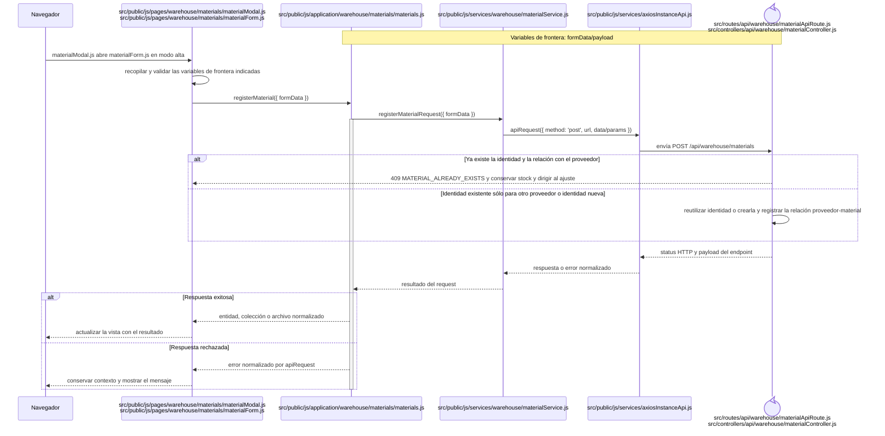

<a id="cu-cat-03"></a>

## `CU-CAT-03` — Editar material

**Patrones:** `FE-P02`.

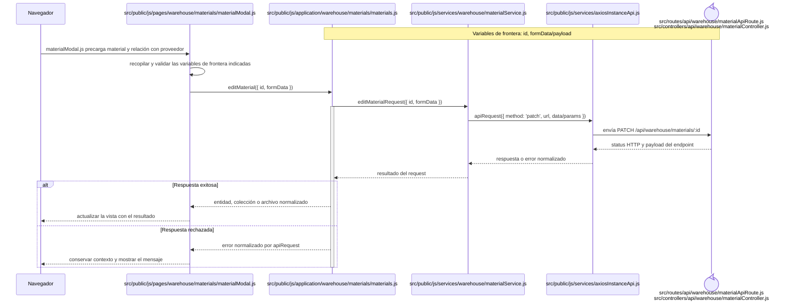

<a id="cu-cat-04"></a>

## `CU-CAT-04` — Retirar material

**Patrones:** `FE-P02`.

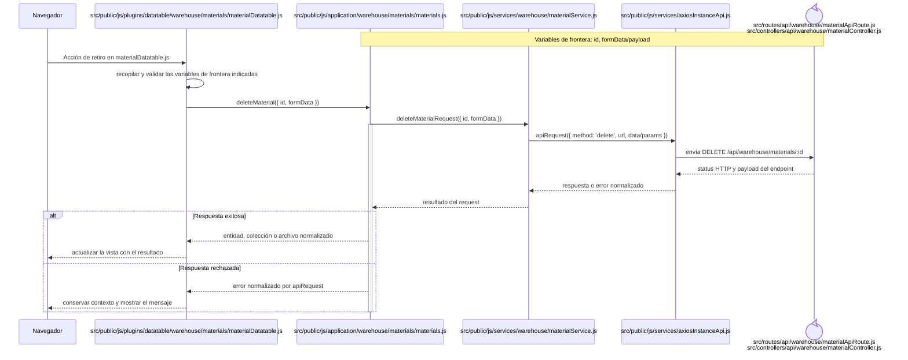

<a id="cu-cat-05"></a>

## `CU-CAT-05` — Ajustar existencia de material

**Patrones:** `FE-P02`.

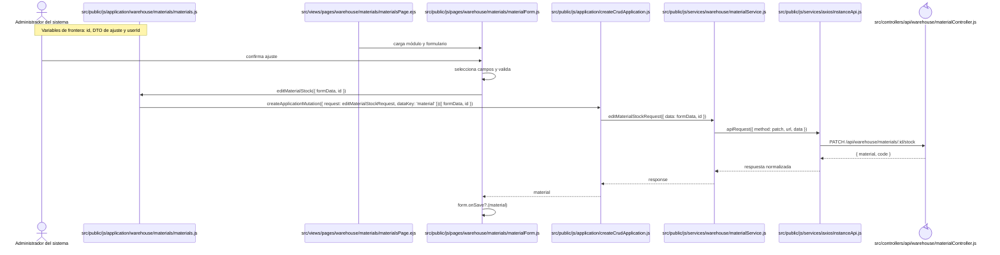

<a id="cu-cat-10"></a>

## `CU-CAT-06` — Consultar inventario de materiales

**Patrones:** `FE-P07`.

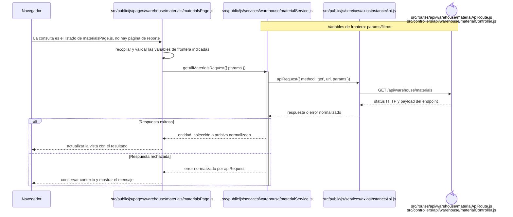

<a id="cu-cat-08"></a>

## `CU-CAT-07` — Generar reporte de inventario de materiales

**Patrones:** `FE-P08`.


<a id="cu-sal-07"></a>

## `CU-CAT-08` — Consultar movimientos de materiales

**Patrones:** `FE-P07`.

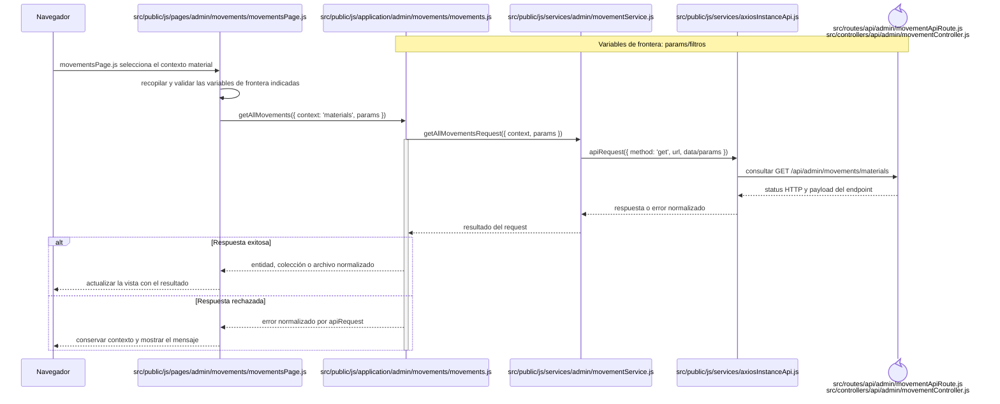

<a id="cu-cat-07"></a>

## `CU-CAT-09` — Generar reporte de movimientos de materiales

**Patrones:** `FE-P08`.

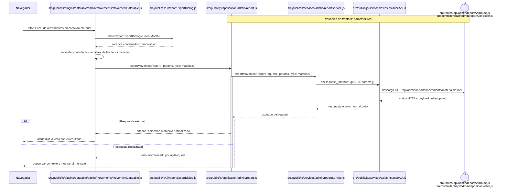

<a id="cu-cat-23"></a>

## `CU-CAT-10` — Consultar proveedores

**Patrones:** `FE-P02`.

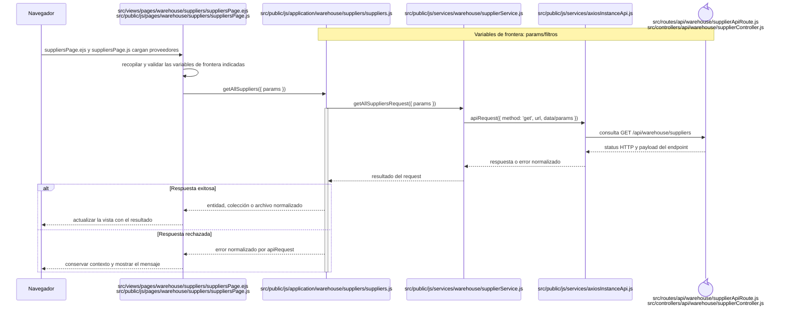

<a id="cu-cat-11"></a>

## `CU-CAT-11` — Crear proveedor

**Patrones:** `FE-P02`.

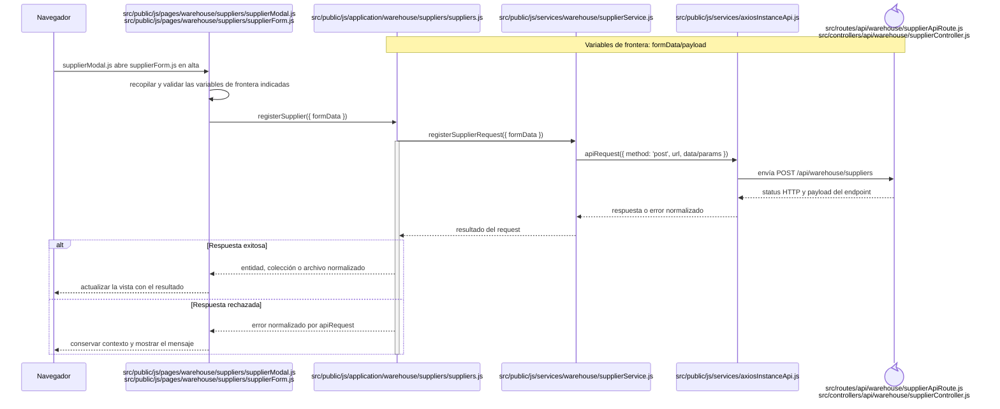

<a id="cu-cat-12"></a>

## `CU-CAT-12` — Editar proveedor

**Patrones:** `FE-P02`.

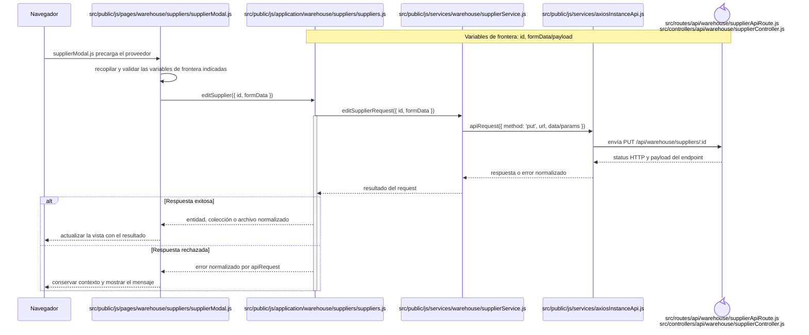

<a id="cu-cat-13"></a>

## `CU-CAT-13` — Cambiar estado de proveedor

**Patrones:** `FE-P02`.

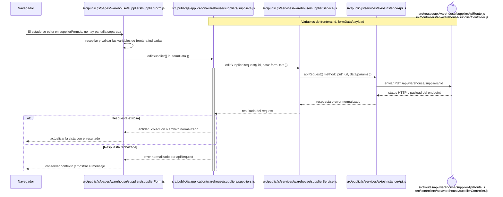

<a id="cu-cat-15"></a>

## `CU-CAT-14` — Generar reporte de proveedores

**Patrones:** `FE-P08`.


<a id="cu-cat-18"></a>

## `CU-CAT-15` — Consultar clientes

**Patrones:** `FE-P02`.

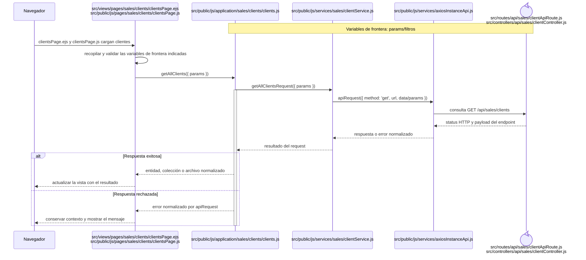

<a id="cu-cat-16"></a>

## `CU-CAT-16` — Crear cliente

**Patrones:** `FE-P02`.

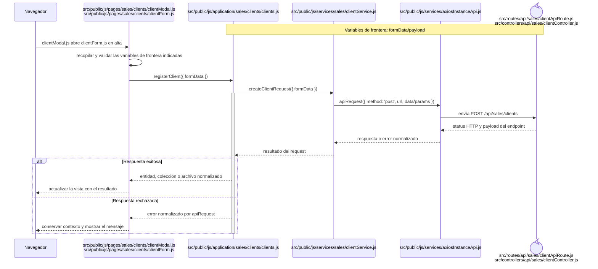

<a id="cu-cat-17"></a>

## `CU-CAT-17` — Editar cliente

**Patrones:** `FE-P02`.

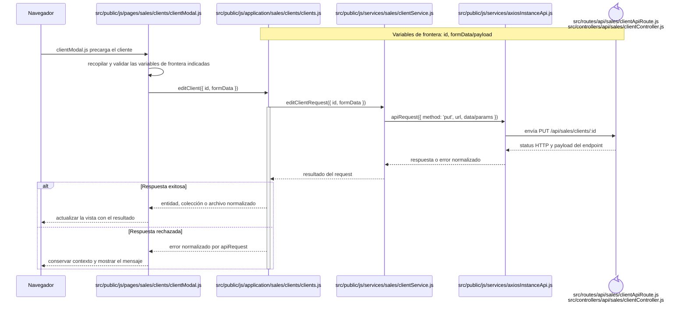

<a id="cu-cat-19"></a>

## `CU-CAT-18` — Generar reporte de clientes

**Patrones:** `FE-P08`.

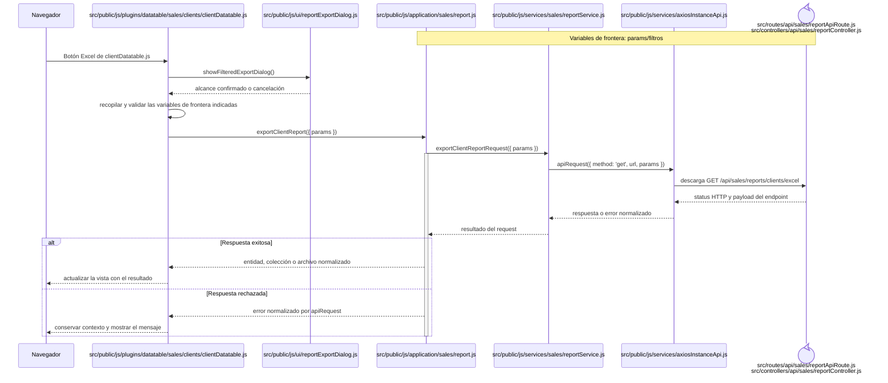

<a id="cu-ida-04"></a>

## `CU-CAT-19` — Consultar mermas

**Patrones:** `FE-P02`.

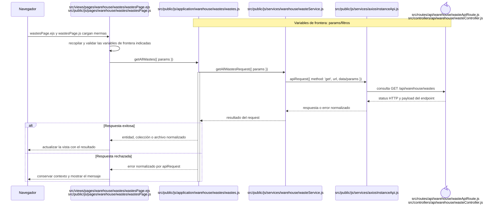

<a id="cu-cat-20"></a>

## `CU-CAT-20` — Registrar merma

**Patrones:** `FE-P02`.

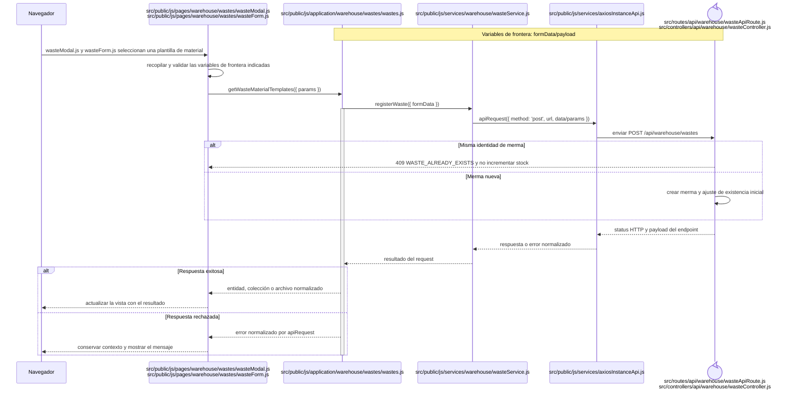

<a id="cu-cat-21"></a>

## `CU-CAT-21` — Editar merma

**Patrones:** `FE-P02`.

```mermaid
sequenceDiagram
    participant Browser as Navegador
    participant View as src/public/js/pages/warehouse/wastes/wasteModal.js
    participant Application as src/public/js/application/warehouse/wastes/wastes.js
    participant Request as src/public/js/services/warehouse/wasteService.js
    participant HTTP as src/public/js/services/axiosInstanceApi.js
    participant Transport@{ "type": "control" } as src/routes/api/warehouse/wasteApiRoute.js<br/>src/controllers/api/warehouse/wasteController.js
    Note over Application,Transport: Variables de frontera: id, formData/payload

    Browser->>View: wasteModal.js precarga la merma
    View->>View: recopilar y validar las variables de frontera indicadas
    View->>Application: editWaste({ id, formData })
    Application->>Request: editWasteRequest({ id, formData })
    activate Application
    Request->>HTTP: apiRequest({ method: 'patch', url, data/params })
    HTTP->>Transport: envía PATCH /api/warehouse/wastes/:id
    Transport-->>HTTP: status HTTP y payload del endpoint
    HTTP-->>Request: respuesta o error normalizado
    Request-->>Application: resultado del request
    alt Respuesta exitosa
        Application-->>View: entidad, colección o archivo normalizado
        View-->>Browser: actualizar la vista con el resultado
    else Respuesta rechazada
        Application-->>View: error normalizado por apiRequest
        View-->>Browser: conservar contexto y mostrar el mensaje
    end
    deactivate Application
```

<a id="cu-cat-22"></a>

## `CU-CAT-22` — Ajustar existencia de merma

**Patrones:** `FE-P02`.

```mermaid
sequenceDiagram
    participant Browser as Navegador
    participant View as src/public/js/pages/warehouse/wastes/wasteForm.js
    participant Application as src/public/js/application/warehouse/wastes/wastes.js
    participant Request as src/public/js/services/warehouse/wasteService.js
    participant HTTP as src/public/js/services/axiosInstanceApi.js
    participant Transport@{ "type": "control" } as src/routes/api/warehouse/wasteApiRoute.js<br/>src/controllers/api/warehouse/wasteController.js
    Note over Application,Transport: Variables de frontera: id, formData/payload

    Browser->>View: wasteForm.js usa el modo de ajuste
    View->>View: recopilar y validar las variables de frontera indicadas
    View->>Application: editWasteStock({ id, formData })
    Application->>Request: editWasteStockRequest({ id, formData })
    activate Application
    Request->>HTTP: apiRequest({ method: 'patch', url, data/params })
    HTTP->>Transport: envía PATCH /api/warehouse/wastes/:id/stock
    Transport-->>HTTP: status HTTP y payload del endpoint
    HTTP-->>Request: respuesta o error normalizado
    Request-->>Application: resultado del request
    alt Respuesta exitosa
        Application-->>View: entidad, colección o archivo normalizado
        View-->>Browser: actualizar la vista con el resultado
    else Respuesta rechazada
        Application-->>View: error normalizado por apiRequest
        View-->>Browser: conservar contexto y mostrar el mensaje
    end
    deactivate Application
```

<a id="cu-cat-27"></a>

## `CU-CAT-23` — Consultar inventario de mermas

**Patrones:** `FE-P07`.

```mermaid
sequenceDiagram
    participant Browser as Navegador
    participant View as src/public/js/pages/warehouse/wastes/wastesPage.js
    participant Request as src/public/js/services/warehouse/wasteService.js
    participant HTTP as src/public/js/services/axiosInstanceApi.js
    participant Transport@{ "type": "control" } as src/routes/api/warehouse/wasteApiRoute.js<br/>src/controllers/api/warehouse/wasteController.js
    Note over Request,Transport: Variables de frontera: params/filtros

    Browser->>View: La consulta es el listado de wastesPage.js, no hay página de reporte
    View->>View: recopilar y validar las variables de frontera indicadas
    View->>Request: getAllWastesRequest({ params })
    activate Request
    Request->>HTTP: apiRequest({ method: 'get', url, params })
    HTTP->>Transport: GET /api/warehouse/wastes
    Transport-->>HTTP: status HTTP y payload del endpoint
    HTTP-->>Request: respuesta o error normalizado
    alt Respuesta exitosa
        Request-->>View: entidad, colección o archivo normalizado
        View-->>Browser: actualizar la vista con el resultado
    else Respuesta rechazada
        Request-->>View: error normalizado por apiRequest
        View-->>Browser: conservar contexto y mostrar el mensaje
    end
    deactivate Request
```

<a id="cu-cat-25"></a>

## `CU-CAT-24` — Generar reporte de mermas

**Patrones:** `FE-P08`.

```mermaid
sequenceDiagram
    participant Browser as Navegador
    participant View as src/public/js/plugins/datatable/warehouse/wastes/wasteDatatable.js
    participant Dialog as src/public/js/ui/reportExportDialog.js
    participant Application as src/public/js/application/warehouse/report.js
    participant Request as src/public/js/services/warehouse/reportService.js
    participant HTTP as src/public/js/services/axiosInstanceApi.js
    participant Transport@{ "type": "control" } as src/routes/api/warehouse/reportApiRoute.js<br/>src/controllers/api/warehouse/reportController.js
    Note over Application,Transport: Variables de frontera: params/filtros

    Browser->>View: Botón Excel de wasteDatatable.js
    View->>Dialog: showInventoryExportDialog()
    Dialog-->>View: inventoryScope activo/existencia
    View->>View: recopilar y validar las variables de frontera indicadas
    View->>Application: exportWasteReport({ params })
    Application->>Request: exportWasteReportRequest({ params })
    activate Application
    Request->>HTTP: apiRequest({ method: 'get', url, params })
    HTTP->>Transport: descarga GET /api/warehouse/reports/wastes/excel
    Transport-->>HTTP: status HTTP y payload del endpoint
    HTTP-->>Request: respuesta o error normalizado
    Request-->>Application: resultado del request
    alt Respuesta exitosa
        Application-->>View: entidad, colección o archivo normalizado
        View-->>Browser: actualizar la vista con el resultado
    else Respuesta rechazada
        Application-->>View: error normalizado por apiRequest
        View-->>Browser: conservar contexto y mostrar el mensaje
    end
    deactivate Application
```

<a id="cu-cat-26"></a>

## `CU-CAT-25` — Consultar movimientos de mermas

**Patrones:** `FE-P07`.

```mermaid
sequenceDiagram
    participant Browser as Navegador
    participant View as src/public/js/pages/admin/movements/movementsPage.js
    participant Application as src/public/js/application/admin/movements/movements.js
    participant Request as src/public/js/services/admin/movementService.js
    participant HTTP as src/public/js/services/axiosInstanceApi.js
    participant Transport@{ "type": "control" } as src/routes/api/admin/movementApiRoute.js<br/>src/controllers/api/admin/movementController.js
    Note over Application,Transport: Variables de frontera: params/filtros

    Browser->>View: movementsPage.js selecciona el contexto merma
    View->>View: recopilar y validar las variables de frontera indicadas
    View->>Application: getAllMovements({ context: 'wastes', params })
    Application->>Request: getAllMovementsRequest({ context, params })
    activate Application
    Request->>HTTP: apiRequest({ method: 'get', url, data/params })
    HTTP->>Transport: consultar GET /api/admin/movements/wastes
    Transport-->>HTTP: status HTTP y payload del endpoint
    HTTP-->>Request: respuesta o error normalizado
    Request-->>Application: resultado del request
    alt Respuesta exitosa
        Application-->>View: entidad, colección o archivo normalizado
        View-->>Browser: actualizar la vista con el resultado
    else Respuesta rechazada
        Application-->>View: error normalizado por apiRequest
        View-->>Browser: conservar contexto y mostrar el mensaje
    end
    deactivate Application
```

<a id="cu-sal-14"></a>

## `CU-CAT-26` — Generar reporte de movimientos de mermas

**Patrones:** `FE-P08`.

```mermaid
sequenceDiagram
    participant Browser as Navegador
    participant View as src/public/js/plugins/datatable/admin/movements/movementDatatable.js
    participant Dialog as src/public/js/ui/reportExportDialog.js
    participant Application as src/public/js/application/admin/report.js
    participant Request as src/public/js/services/admin/reportService.js
    participant HTTP as src/public/js/services/axiosInstanceApi.js
    participant Transport@{ "type": "control" } as src/routes/api/admin/reportApiRoute.js<br/>src/controllers/api/admin/reportController.js
    Note over Application,Transport: Variables de frontera: params/filtros

    Browser->>View: Botón Excel de movimientos en contexto merma
    View->>Dialog: showReportExportDialog(currentMonth)
    Dialog-->>View: alcance confirmado o cancelación
    View->>View: recopilar y validar las variables de frontera indicadas
    View->>Application: exportMovementReport({ params, type: wastes })
    Application->>Request: exportMovementReportRequest({ params, type: wastes })
    activate Application
    Request->>HTTP: apiRequest({ method: 'get', url, params })
    HTTP->>Transport: descarga GET /api/admin/reports/movements/wastes/excel
    Transport-->>HTTP: status HTTP y payload del endpoint
    HTTP-->>Request: respuesta o error normalizado
    Request-->>Application: resultado del request
    alt Respuesta exitosa
        Application-->>View: entidad, colección o archivo normalizado
        View-->>Browser: actualizar la vista con el resultado
    else Respuesta rechazada
        Application-->>View: error normalizado por apiRequest
        View-->>Browser: conservar contexto y mostrar el mensaje
    end
    deactivate Application
```

<a id="cu-ent-06"></a>

## `CU-CAT-27` — Consultar presentaciones

**Patrones:** `FE-P03`.

```mermaid
sequenceDiagram
    participant Browser as Navegador
    participant View as src/public/js/pages/warehouse/materials/materialFields.js<br/>src/public/js/pages/warehouse/wastes/wasteFields.js
    participant Application as src/public/js/application/warehouse/catalogs/presentations.js
    participant Request as src/public/js/services/warehouse/presentationService.js
    participant HTTP as src/public/js/services/axiosInstanceApi.js
    participant Transport@{ "type": "control" } as src/routes/api/warehouse/presentationApiRoute.js<br/>src/controllers/api/warehouse/presentationController.js
    Note over Application,Transport: Variables de frontera: params/filtros

    Browser->>View: Select de presentación en materialFields.js y wasteFields.js
    View->>View: recopilar y validar las variables de frontera indicadas
    View->>Application: getAllPresentations({ params })
    Application->>Request: getAllPresentationsRequest({ params })
    activate Application
    Request->>HTTP: apiRequest({ method: 'get', url, data/params })
    HTTP->>Transport: consume GET /api/warehouse/presentations
    Transport-->>HTTP: status HTTP y payload del endpoint
    HTTP-->>Request: respuesta o error normalizado
    Request-->>Application: resultado del request
    alt Respuesta exitosa
        Application-->>View: entidad, colección o archivo normalizado
        View-->>Browser: actualizar la vista con el resultado
    else Respuesta rechazada
        Application-->>View: error normalizado por apiRequest
        View-->>Browser: conservar contexto y mostrar el mensaje
    end
    deactivate Application
```

<a id="cu-cat-28"></a>

## `CU-CAT-28` — Consultar unidades de medida

**Patrones:** `FE-P03`.

```mermaid
sequenceDiagram
    participant Browser as Navegador
    participant View as src/public/js/plugins/select2/domains/unitMeasure.js
    participant Application as src/public/js/application/warehouse/catalogs/unitMeasures.js
    participant Request as src/public/js/services/warehouse/unitMeasureService.js
    participant HTTP as src/public/js/services/axiosInstanceApi.js
    participant Transport@{ "type": "control" } as src/routes/api/warehouse/unitMeasureApiRoute.js<br/>src/controllers/api/warehouse/unitMeasureController.js
    Note over Application,Transport: Variables de frontera: params/filtros

    Browser->>View: Select de unidad en formularios de material y merma
    View->>View: recopilar y validar las variables de frontera indicadas
    View->>Application: getAllUnitMeasures({ params })
    Application->>Request: getAllUnitMeasuresRequest({ params })
    activate Application
    Request->>HTTP: apiRequest({ method: 'get', url, data/params })
    HTTP->>Transport: consume GET /api/warehouse/unit-measures
    Transport-->>HTTP: status HTTP y payload del endpoint
    HTTP-->>Request: respuesta o error normalizado
    Request-->>Application: resultado del request
    alt Respuesta exitosa
        Application-->>View: entidad, colección o archivo normalizado
        View-->>Browser: actualizar la vista con el resultado
    else Respuesta rechazada
        Application-->>View: error normalizado por apiRequest
        View-->>Browser: conservar contexto y mostrar el mensaje
    end
    deactivate Application
```

<a id="cu-cat-29"></a>

## `CU-CAT-29` — Consultar motivos de ajuste

**Patrones:** `FE-P03`.

```mermaid
sequenceDiagram
    participant Browser as Navegador
    participant View as src/public/js/plugins/select2/domains/reason.js
    participant Application as src/public/js/application/warehouse/catalogs/reasons.js
    participant Request as src/public/js/services/warehouse/reasonService.js
    participant HTTP as src/public/js/services/axiosInstanceApi.js
    participant Transport@{ "type": "control" } as src/routes/api/warehouse/reasonApiRoute.js<br/>src/controllers/api/warehouse/reasonController.js
    Note over Application,Transport: Variables de frontera: params/filtros

    Browser->>View: Select de motivo en los modos de ajuste
    View->>View: recopilar y validar las variables de frontera indicadas
    View->>Application: getAllReasons({ params })
    Application->>Request: getAllReasonsRequest({ params })
    activate Application
    Request->>HTTP: apiRequest({ method: 'get', url, data/params })
    HTTP->>Transport: consume GET /api/warehouse/reasons
    Transport-->>HTTP: status HTTP y payload del endpoint
    HTTP-->>Request: respuesta o error normalizado
    Request-->>Application: resultado del request
    alt Respuesta exitosa
        Application-->>View: entidad, colección o archivo normalizado
        View-->>Browser: actualizar la vista con el resultado
    else Respuesta rechazada
        Application-->>View: error normalizado por apiRequest
        View-->>Browser: conservar contexto y mostrar el mensaje
    end
    deactivate Application
```

<a id="cu-cat-30"></a>

## `CU-CAT-30` — Consultar estados de cumplimiento

**Patrones:** `FE-P03`.

```mermaid
sequenceDiagram
    participant Browser as Navegador
    participant View as src/public/js/plugins/select2/domains/fulfillmentStatus.js
    participant Application as src/public/js/application/warehouse/catalogs/fulfillmentStatuses.js
    participant Request as src/public/js/services/warehouse/fulfillmentStatusService.js
    participant HTTP as src/public/js/services/axiosInstanceApi.js
    participant Transport@{ "type": "control" } as src/routes/api/warehouse/fulfillmentStatusApiRoute.js<br/>src/controllers/api/warehouse/fulfillmentStatusController.js
    Note over Application,Transport: Variables de frontera: params/filtros

    Browser->>View: Estado visible en tablas y formularios de salidas
    View->>View: recopilar y validar las variables de frontera indicadas
    View->>Application: getAllFulfillmentStatuses({ params })
    Application->>Request: getAllFulfillmentStatusesRequest({ params })
    activate Application
    Request->>HTTP: apiRequest({ method: 'get', url, data/params })
    HTTP->>Transport: consume GET /api/warehouse/fulfillment-statuses
    Transport-->>HTTP: status HTTP y payload del endpoint
    HTTP-->>Request: respuesta o error normalizado
    Request-->>Application: resultado del request
    alt Respuesta exitosa
        Application-->>View: entidad, colección o archivo normalizado
        View-->>Browser: actualizar la vista con el resultado
    else Respuesta rechazada
        Application-->>View: error normalizado por apiRequest
        View-->>Browser: conservar contexto y mostrar el mensaje
    end
    deactivate Application
```


<a id="cu-cat-31"></a>

## `CU-CAT-31` — Consultar área

**Patrones:** `FE-P03`.

```mermaid
sequenceDiagram
    participant Browser as Navegador
    participant View as src/public/js/plugins/datatable/admin/catalogs/catalogDatatable.js
    participant Application as src/public/js/application/admin/catalogs/catalogs.js
    participant Request as src/public/js/services/admin/catalogService.js
    participant HTTP as src/public/js/services/axiosInstanceApi.js
    participant Transport@{ "type": "control" } as src/routes/api/admin/catalogApiRoute.js<br/>src/controllers/api/admin/catalogController.js
    Note over Application,Transport: Variables de frontera: params/catalog

    Browser->>View: abrir y cargar la tabla del catálogo
    View->>View: recopilar y validar las variables de frontera indicadas
    View->>Application: getAllCatalogEntries({ params, catalog })
    Application->>Request: getAllCatalogEntriesRequest({ params, catalog })
    activate Application
    Request->>HTTP: apiRequest({ method: 'get', url, data/params })
    HTTP->>Transport: consume GET /api/admin/catalogs/departments
    Transport-->>HTTP: status HTTP y payload del endpoint
    HTTP-->>Request: respuesta o error normalizado
    Request-->>Application: resultado del request
    alt Respuesta exitosa
        Application-->>View: entidad, colección o archivo normalizado
        View-->>Browser: actualizar la vista con el resultado
    else Respuesta rechazada
        Application-->>View: error normalizado por apiRequest
        View-->>Browser: conservar contexto y mostrar el mensaje
    end
    deactivate Application
```

<a id="cu-cat-32"></a>

## `CU-CAT-32` — Crear área

**Patrones:** `FE-P03`.

```mermaid
sequenceDiagram
    participant Browser as Navegador
    participant View as src/public/js/pages/admin/catalogs/catalogForm.js
    participant Application as src/public/js/application/admin/catalogs/catalogs.js
    participant Request as src/public/js/services/admin/catalogService.js
    participant HTTP as src/public/js/services/axiosInstanceApi.js
    participant Transport@{ "type": "control" } as src/routes/api/admin/catalogApiRoute.js<br/>src/controllers/api/admin/catalogController.js
    Note over Application,Transport: Variables de frontera: catalog/data

    Browser->>View: confirmar el formulario de alta
    View->>View: recopilar y validar las variables de frontera indicadas
    View->>Application: registerCatalogEntry({ catalog, data })
    Application->>Request: registerCatalogEntryRequest({ catalog, data })
    activate Application
    Request->>HTTP: apiRequest({ method: 'get', url, data/params })
    HTTP->>Transport: consume POST /api/admin/catalogs/departments
    Transport-->>HTTP: status HTTP y payload del endpoint
    HTTP-->>Request: respuesta o error normalizado
    Request-->>Application: resultado del request
    alt Respuesta exitosa
        Application-->>View: entidad, colección o archivo normalizado
        View-->>Browser: actualizar la vista con el resultado
    else Respuesta rechazada
        Application-->>View: error normalizado por apiRequest
        View-->>Browser: conservar contexto y mostrar el mensaje
    end
    deactivate Application
```

<a id="cu-cat-33"></a>

## `CU-CAT-33` — Editar área

**Patrones:** `FE-P03`.

```mermaid
sequenceDiagram
    participant Browser as Navegador
    participant View as src/public/js/pages/admin/catalogs/catalogForm.js
    participant Application as src/public/js/application/admin/catalogs/catalogs.js
    participant Request as src/public/js/services/admin/catalogService.js
    participant HTTP as src/public/js/services/axiosInstanceApi.js
    participant Transport@{ "type": "control" } as src/routes/api/admin/catalogApiRoute.js<br/>src/controllers/api/admin/catalogController.js
    Note over Application,Transport: Variables de frontera: catalog/id/data

    Browser->>View: confirmar el formulario de edición
    View->>View: recopilar y validar las variables de frontera indicadas
    View->>Application: editCatalogEntry({ catalog, id, data })
    Application->>Request: editCatalogEntryRequest({ catalog, id, data })
    activate Application
    Request->>HTTP: apiRequest({ method: 'get', url, data/params })
    HTTP->>Transport: consume PUT /api/admin/catalogs/departments/:id
    Transport-->>HTTP: status HTTP y payload del endpoint
    HTTP-->>Request: respuesta o error normalizado
    Request-->>Application: resultado del request
    alt Respuesta exitosa
        Application-->>View: entidad, colección o archivo normalizado
        View-->>Browser: actualizar la vista con el resultado
    else Respuesta rechazada
        Application-->>View: error normalizado por apiRequest
        View-->>Browser: conservar contexto y mostrar el mensaje
    end
    deactivate Application
```

<a id="cu-cat-34"></a>

## `CU-CAT-34` — Consultar rol

**Patrones:** `FE-P03`.

```mermaid
sequenceDiagram
    participant Browser as Navegador
    participant View as src/public/js/plugins/datatable/admin/catalogs/catalogDatatable.js
    participant Application as src/public/js/application/admin/catalogs/catalogs.js
    participant Request as src/public/js/services/admin/catalogService.js
    participant HTTP as src/public/js/services/axiosInstanceApi.js
    participant Transport@{ "type": "control" } as src/routes/api/admin/catalogApiRoute.js<br/>src/controllers/api/admin/catalogController.js
    Note over Application,Transport: Variables de frontera: params/catalog

    Browser->>View: abrir y cargar la tabla del catálogo
    View->>View: recopilar y validar las variables de frontera indicadas
    View->>Application: getAllCatalogEntries({ params, catalog })
    Application->>Request: getAllCatalogEntriesRequest({ params, catalog })
    activate Application
    Request->>HTTP: apiRequest({ method: 'get', url, data/params })
    HTTP->>Transport: consume GET /api/admin/catalogs/roles
    Transport-->>HTTP: status HTTP y payload del endpoint
    HTTP-->>Request: respuesta o error normalizado
    Request-->>Application: resultado del request
    alt Respuesta exitosa
        Application-->>View: entidad, colección o archivo normalizado
        View-->>Browser: actualizar la vista con el resultado
    else Respuesta rechazada
        Application-->>View: error normalizado por apiRequest
        View-->>Browser: conservar contexto y mostrar el mensaje
    end
    deactivate Application
```

<a id="cu-cat-35"></a>

## `CU-CAT-35` — Crear rol

**Patrones:** `FE-P03`.

```mermaid
sequenceDiagram
    participant Browser as Navegador
    participant View as src/public/js/pages/admin/catalogs/catalogForm.js
    participant Application as src/public/js/application/admin/catalogs/catalogs.js
    participant Request as src/public/js/services/admin/catalogService.js
    participant HTTP as src/public/js/services/axiosInstanceApi.js
    participant Transport@{ "type": "control" } as src/routes/api/admin/catalogApiRoute.js<br/>src/controllers/api/admin/catalogController.js
    Note over Application,Transport: Variables de frontera: catalog/data

    Browser->>View: confirmar el formulario de alta
    View->>View: recopilar y validar las variables de frontera indicadas
    View->>Application: registerCatalogEntry({ catalog, data })
    Application->>Request: registerCatalogEntryRequest({ catalog, data })
    activate Application
    Request->>HTTP: apiRequest({ method: 'get', url, data/params })
    HTTP->>Transport: consume POST /api/admin/catalogs/roles
    Transport-->>HTTP: status HTTP y payload del endpoint
    HTTP-->>Request: respuesta o error normalizado
    Request-->>Application: resultado del request
    alt Respuesta exitosa
        Application-->>View: entidad, colección o archivo normalizado
        View-->>Browser: actualizar la vista con el resultado
    else Respuesta rechazada
        Application-->>View: error normalizado por apiRequest
        View-->>Browser: conservar contexto y mostrar el mensaje
    end
    deactivate Application
```

<a id="cu-cat-36"></a>

## `CU-CAT-36` — Editar rol

**Patrones:** `FE-P03`.

```mermaid
sequenceDiagram
    participant Browser as Navegador
    participant View as src/public/js/pages/admin/catalogs/catalogForm.js
    participant Application as src/public/js/application/admin/catalogs/catalogs.js
    participant Request as src/public/js/services/admin/catalogService.js
    participant HTTP as src/public/js/services/axiosInstanceApi.js
    participant Transport@{ "type": "control" } as src/routes/api/admin/catalogApiRoute.js<br/>src/controllers/api/admin/catalogController.js
    Note over Application,Transport: Variables de frontera: catalog/id/data

    Browser->>View: confirmar el formulario de edición
    View->>View: recopilar y validar las variables de frontera indicadas
    View->>Application: editCatalogEntry({ catalog, id, data })
    Application->>Request: editCatalogEntryRequest({ catalog, id, data })
    activate Application
    Request->>HTTP: apiRequest({ method: 'get', url, data/params })
    HTTP->>Transport: consume PUT /api/admin/catalogs/roles/:id
    Transport-->>HTTP: status HTTP y payload del endpoint
    HTTP-->>Request: respuesta o error normalizado
    Request-->>Application: resultado del request
    alt Respuesta exitosa
        Application-->>View: entidad, colección o archivo normalizado
        View-->>Browser: actualizar la vista con el resultado
    else Respuesta rechazada
        Application-->>View: error normalizado por apiRequest
        View-->>Browser: conservar contexto y mostrar el mensaje
    end
    deactivate Application
```

<a id="cu-cat-37"></a>

## `CU-CAT-37` — Consultar presentación

**Patrones:** `FE-P03`.

```mermaid
sequenceDiagram
    participant Browser as Navegador
    participant View as src/public/js/plugins/datatable/admin/catalogs/catalogDatatable.js
    participant Application as src/public/js/application/admin/catalogs/catalogs.js
    participant Request as src/public/js/services/admin/catalogService.js
    participant HTTP as src/public/js/services/axiosInstanceApi.js
    participant Transport@{ "type": "control" } as src/routes/api/admin/catalogApiRoute.js<br/>src/controllers/api/admin/catalogController.js
    Note over Application,Transport: Variables de frontera: params/catalog

    Browser->>View: abrir y cargar la tabla del catálogo
    View->>View: recopilar y validar las variables de frontera indicadas
    View->>Application: getAllCatalogEntries({ params, catalog })
    Application->>Request: getAllCatalogEntriesRequest({ params, catalog })
    activate Application
    Request->>HTTP: apiRequest({ method: 'get', url, data/params })
    HTTP->>Transport: consume GET /api/admin/catalogs/presentations
    Transport-->>HTTP: status HTTP y payload del endpoint
    HTTP-->>Request: respuesta o error normalizado
    Request-->>Application: resultado del request
    alt Respuesta exitosa
        Application-->>View: entidad, colección o archivo normalizado
        View-->>Browser: actualizar la vista con el resultado
    else Respuesta rechazada
        Application-->>View: error normalizado por apiRequest
        View-->>Browser: conservar contexto y mostrar el mensaje
    end
    deactivate Application
```

<a id="cu-cat-38"></a>

## `CU-CAT-38` — Crear presentación

**Patrones:** `FE-P03`.

```mermaid
sequenceDiagram
    participant Browser as Navegador
    participant View as src/public/js/pages/admin/catalogs/catalogForm.js
    participant Application as src/public/js/application/admin/catalogs/catalogs.js
    participant Request as src/public/js/services/admin/catalogService.js
    participant HTTP as src/public/js/services/axiosInstanceApi.js
    participant Transport@{ "type": "control" } as src/routes/api/admin/catalogApiRoute.js<br/>src/controllers/api/admin/catalogController.js
    Note over Application,Transport: Variables de frontera: catalog/data

    Browser->>View: confirmar el formulario de alta
    View->>View: recopilar y validar las variables de frontera indicadas
    View->>Application: registerCatalogEntry({ catalog, data })
    Application->>Request: registerCatalogEntryRequest({ catalog, data })
    activate Application
    Request->>HTTP: apiRequest({ method: 'get', url, data/params })
    HTTP->>Transport: consume POST /api/admin/catalogs/presentations
    Transport-->>HTTP: status HTTP y payload del endpoint
    HTTP-->>Request: respuesta o error normalizado
    Request-->>Application: resultado del request
    alt Respuesta exitosa
        Application-->>View: entidad, colección o archivo normalizado
        View-->>Browser: actualizar la vista con el resultado
    else Respuesta rechazada
        Application-->>View: error normalizado por apiRequest
        View-->>Browser: conservar contexto y mostrar el mensaje
    end
    deactivate Application
```

<a id="cu-cat-39"></a>

## `CU-CAT-39` — Editar presentación

**Patrones:** `FE-P03`.

```mermaid
sequenceDiagram
    participant Browser as Navegador
    participant View as src/public/js/pages/admin/catalogs/catalogForm.js
    participant Application as src/public/js/application/admin/catalogs/catalogs.js
    participant Request as src/public/js/services/admin/catalogService.js
    participant HTTP as src/public/js/services/axiosInstanceApi.js
    participant Transport@{ "type": "control" } as src/routes/api/admin/catalogApiRoute.js<br/>src/controllers/api/admin/catalogController.js
    Note over Application,Transport: Variables de frontera: catalog/id/data

    Browser->>View: confirmar el formulario de edición
    View->>View: recopilar y validar las variables de frontera indicadas
    View->>Application: editCatalogEntry({ catalog, id, data })
    Application->>Request: editCatalogEntryRequest({ catalog, id, data })
    activate Application
    Request->>HTTP: apiRequest({ method: 'get', url, data/params })
    HTTP->>Transport: consume PUT /api/admin/catalogs/presentations/:id
    Transport-->>HTTP: status HTTP y payload del endpoint
    HTTP-->>Request: respuesta o error normalizado
    Request-->>Application: resultado del request
    alt Respuesta exitosa
        Application-->>View: entidad, colección o archivo normalizado
        View-->>Browser: actualizar la vista con el resultado
    else Respuesta rechazada
        Application-->>View: error normalizado por apiRequest
        View-->>Browser: conservar contexto y mostrar el mensaje
    end
    deactivate Application
```

<a id="cu-cat-40"></a>

## `CU-CAT-40` — Consultar unidad de medida

**Patrones:** `FE-P03`.

```mermaid
sequenceDiagram
    participant Browser as Navegador
    participant View as src/public/js/plugins/datatable/admin/catalogs/catalogDatatable.js
    participant Application as src/public/js/application/admin/catalogs/catalogs.js
    participant Request as src/public/js/services/admin/catalogService.js
    participant HTTP as src/public/js/services/axiosInstanceApi.js
    participant Transport@{ "type": "control" } as src/routes/api/admin/catalogApiRoute.js<br/>src/controllers/api/admin/catalogController.js
    Note over Application,Transport: Variables de frontera: params/catalog

    Browser->>View: abrir y cargar la tabla del catálogo
    View->>View: recopilar y validar las variables de frontera indicadas
    View->>Application: getAllCatalogEntries({ params, catalog })
    Application->>Request: getAllCatalogEntriesRequest({ params, catalog })
    activate Application
    Request->>HTTP: apiRequest({ method: 'get', url, data/params })
    HTTP->>Transport: consume GET /api/admin/catalogs/unit-measures
    Transport-->>HTTP: status HTTP y payload del endpoint
    HTTP-->>Request: respuesta o error normalizado
    Request-->>Application: resultado del request
    alt Respuesta exitosa
        Application-->>View: entidad, colección o archivo normalizado
        View-->>Browser: actualizar la vista con el resultado
    else Respuesta rechazada
        Application-->>View: error normalizado por apiRequest
        View-->>Browser: conservar contexto y mostrar el mensaje
    end
    deactivate Application
```

<a id="cu-cat-41"></a>

## `CU-CAT-41` — Crear unidad de medida

**Patrones:** `FE-P03`.

```mermaid
sequenceDiagram
    participant Browser as Navegador
    participant View as src/public/js/pages/admin/catalogs/catalogForm.js
    participant Application as src/public/js/application/admin/catalogs/catalogs.js
    participant Request as src/public/js/services/admin/catalogService.js
    participant HTTP as src/public/js/services/axiosInstanceApi.js
    participant Transport@{ "type": "control" } as src/routes/api/admin/catalogApiRoute.js<br/>src/controllers/api/admin/catalogController.js
    Note over Application,Transport: Variables de frontera: catalog/data

    Browser->>View: confirmar el formulario de alta
    View->>View: recopilar y validar las variables de frontera indicadas
    View->>Application: registerCatalogEntry({ catalog, data })
    Application->>Request: registerCatalogEntryRequest({ catalog, data })
    activate Application
    Request->>HTTP: apiRequest({ method: 'get', url, data/params })
    HTTP->>Transport: consume POST /api/admin/catalogs/unit-measures
    Transport-->>HTTP: status HTTP y payload del endpoint
    HTTP-->>Request: respuesta o error normalizado
    Request-->>Application: resultado del request
    alt Respuesta exitosa
        Application-->>View: entidad, colección o archivo normalizado
        View-->>Browser: actualizar la vista con el resultado
    else Respuesta rechazada
        Application-->>View: error normalizado por apiRequest
        View-->>Browser: conservar contexto y mostrar el mensaje
    end
    deactivate Application
```

<a id="cu-cat-42"></a>

## `CU-CAT-42` — Editar unidad de medida

**Patrones:** `FE-P03`.

```mermaid
sequenceDiagram
    participant Browser as Navegador
    participant View as src/public/js/pages/admin/catalogs/catalogForm.js
    participant Application as src/public/js/application/admin/catalogs/catalogs.js
    participant Request as src/public/js/services/admin/catalogService.js
    participant HTTP as src/public/js/services/axiosInstanceApi.js
    participant Transport@{ "type": "control" } as src/routes/api/admin/catalogApiRoute.js<br/>src/controllers/api/admin/catalogController.js
    Note over Application,Transport: Variables de frontera: catalog/id/data

    Browser->>View: confirmar el formulario de edición
    View->>View: recopilar y validar las variables de frontera indicadas
    View->>Application: editCatalogEntry({ catalog, id, data })
    Application->>Request: editCatalogEntryRequest({ catalog, id, data })
    activate Application
    Request->>HTTP: apiRequest({ method: 'get', url, data/params })
    HTTP->>Transport: consume PUT /api/admin/catalogs/unit-measures/:id
    Transport-->>HTTP: status HTTP y payload del endpoint
    HTTP-->>Request: respuesta o error normalizado
    Request-->>Application: resultado del request
    alt Respuesta exitosa
        Application-->>View: entidad, colección o archivo normalizado
        View-->>Browser: actualizar la vista con el resultado
    else Respuesta rechazada
        Application-->>View: error normalizado por apiRequest
        View-->>Browser: conservar contexto y mostrar el mensaje
    end
    deactivate Application
```

<a id="cu-cat-43"></a>

## `CU-CAT-43` — Consultar motivo de ajuste

**Patrones:** `FE-P03`.

```mermaid
sequenceDiagram
    participant Browser as Navegador
    participant View as src/public/js/plugins/datatable/admin/catalogs/catalogDatatable.js
    participant Application as src/public/js/application/admin/catalogs/catalogs.js
    participant Request as src/public/js/services/admin/catalogService.js
    participant HTTP as src/public/js/services/axiosInstanceApi.js
    participant Transport@{ "type": "control" } as src/routes/api/admin/catalogApiRoute.js<br/>src/controllers/api/admin/catalogController.js
    Note over Application,Transport: Variables de frontera: params/catalog

    Browser->>View: abrir y cargar la tabla del catálogo
    View->>View: recopilar y validar las variables de frontera indicadas
    View->>Application: getAllCatalogEntries({ params, catalog })
    Application->>Request: getAllCatalogEntriesRequest({ params, catalog })
    activate Application
    Request->>HTTP: apiRequest({ method: 'get', url, data/params })
    HTTP->>Transport: consume GET /api/admin/catalogs/reasons
    Transport-->>HTTP: status HTTP y payload del endpoint
    HTTP-->>Request: respuesta o error normalizado
    Request-->>Application: resultado del request
    alt Respuesta exitosa
        Application-->>View: entidad, colección o archivo normalizado
        View-->>Browser: actualizar la vista con el resultado
    else Respuesta rechazada
        Application-->>View: error normalizado por apiRequest
        View-->>Browser: conservar contexto y mostrar el mensaje
    end
    deactivate Application
```

<a id="cu-cat-44"></a>

## `CU-CAT-44` — Crear motivo de ajuste

**Patrones:** `FE-P03`.

```mermaid
sequenceDiagram
    participant Browser as Navegador
    participant View as src/public/js/pages/admin/catalogs/catalogForm.js
    participant Application as src/public/js/application/admin/catalogs/catalogs.js
    participant Request as src/public/js/services/admin/catalogService.js
    participant HTTP as src/public/js/services/axiosInstanceApi.js
    participant Transport@{ "type": "control" } as src/routes/api/admin/catalogApiRoute.js<br/>src/controllers/api/admin/catalogController.js
    Note over Application,Transport: Variables de frontera: catalog/data

    Browser->>View: confirmar el formulario de alta
    View->>View: recopilar y validar las variables de frontera indicadas
    View->>Application: registerCatalogEntry({ catalog, data })
    Application->>Request: registerCatalogEntryRequest({ catalog, data })
    activate Application
    Request->>HTTP: apiRequest({ method: 'get', url, data/params })
    HTTP->>Transport: consume POST /api/admin/catalogs/reasons
    Transport-->>HTTP: status HTTP y payload del endpoint
    HTTP-->>Request: respuesta o error normalizado
    Request-->>Application: resultado del request
    alt Respuesta exitosa
        Application-->>View: entidad, colección o archivo normalizado
        View-->>Browser: actualizar la vista con el resultado
    else Respuesta rechazada
        Application-->>View: error normalizado por apiRequest
        View-->>Browser: conservar contexto y mostrar el mensaje
    end
    deactivate Application
```

<a id="cu-cat-45"></a>

## `CU-CAT-45` — Editar motivo de ajuste

**Patrones:** `FE-P03`.

```mermaid
sequenceDiagram
    participant Browser as Navegador
    participant View as src/public/js/pages/admin/catalogs/catalogForm.js
    participant Application as src/public/js/application/admin/catalogs/catalogs.js
    participant Request as src/public/js/services/admin/catalogService.js
    participant HTTP as src/public/js/services/axiosInstanceApi.js
    participant Transport@{ "type": "control" } as src/routes/api/admin/catalogApiRoute.js<br/>src/controllers/api/admin/catalogController.js
    Note over Application,Transport: Variables de frontera: catalog/id/data

    Browser->>View: confirmar el formulario de edición
    View->>View: recopilar y validar las variables de frontera indicadas
    View->>Application: editCatalogEntry({ catalog, id, data })
    Application->>Request: editCatalogEntryRequest({ catalog, id, data })
    activate Application
    Request->>HTTP: apiRequest({ method: 'get', url, data/params })
    HTTP->>Transport: consume PUT /api/admin/catalogs/reasons/:id
    Transport-->>HTTP: status HTTP y payload del endpoint
    HTTP-->>Request: respuesta o error normalizado
    Request-->>Application: resultado del request
    alt Respuesta exitosa
        Application-->>View: entidad, colección o archivo normalizado
        View-->>Browser: actualizar la vista con el resultado
    else Respuesta rechazada
        Application-->>View: error normalizado por apiRequest
        View-->>Browser: conservar contexto y mostrar el mensaje
    end
    deactivate Application
```

<a id="cu-cat-46"></a>

## `CU-CAT-46` — Consultar estado de cumplimiento

**Patrones:** `FE-P03`.

```mermaid
sequenceDiagram
    participant Browser as Navegador
    participant View as src/public/js/plugins/datatable/admin/catalogs/catalogDatatable.js
    participant Application as src/public/js/application/admin/catalogs/catalogs.js
    participant Request as src/public/js/services/admin/catalogService.js
    participant HTTP as src/public/js/services/axiosInstanceApi.js
    participant Transport@{ "type": "control" } as src/routes/api/admin/catalogApiRoute.js<br/>src/controllers/api/admin/catalogController.js
    Note over Application,Transport: Variables de frontera: params/catalog

    Browser->>View: abrir y cargar la tabla del catálogo
    View->>View: recopilar y validar las variables de frontera indicadas
    View->>Application: getAllCatalogEntries({ params, catalog })
    Application->>Request: getAllCatalogEntriesRequest({ params, catalog })
    activate Application
    Request->>HTTP: apiRequest({ method: 'get', url, data/params })
    HTTP->>Transport: consume GET /api/admin/catalogs/fulfillment-statuses
    Transport-->>HTTP: status HTTP y payload del endpoint
    HTTP-->>Request: respuesta o error normalizado
    Request-->>Application: resultado del request
    alt Respuesta exitosa
        Application-->>View: entidad, colección o archivo normalizado
        View-->>Browser: actualizar la vista con el resultado
    else Respuesta rechazada
        Application-->>View: error normalizado por apiRequest
        View-->>Browser: conservar contexto y mostrar el mensaje
    end
    deactivate Application
```

<a id="cu-cat-47"></a>

## `CU-CAT-47` — Crear estado de cumplimiento

**Patrones:** `FE-P03`.

```mermaid
sequenceDiagram
    participant Browser as Navegador
    participant View as src/public/js/pages/admin/catalogs/catalogForm.js
    participant Application as src/public/js/application/admin/catalogs/catalogs.js
    participant Request as src/public/js/services/admin/catalogService.js
    participant HTTP as src/public/js/services/axiosInstanceApi.js
    participant Transport@{ "type": "control" } as src/routes/api/admin/catalogApiRoute.js<br/>src/controllers/api/admin/catalogController.js
    Note over Application,Transport: Variables de frontera: catalog/data

    Browser->>View: confirmar el formulario de alta
    View->>View: recopilar y validar las variables de frontera indicadas
    View->>Application: registerCatalogEntry({ catalog, data })
    Application->>Request: registerCatalogEntryRequest({ catalog, data })
    activate Application
    Request->>HTTP: apiRequest({ method: 'get', url, data/params })
    HTTP->>Transport: consume POST /api/admin/catalogs/fulfillment-statuses
    Transport-->>HTTP: status HTTP y payload del endpoint
    HTTP-->>Request: respuesta o error normalizado
    Request-->>Application: resultado del request
    alt Respuesta exitosa
        Application-->>View: entidad, colección o archivo normalizado
        View-->>Browser: actualizar la vista con el resultado
    else Respuesta rechazada
        Application-->>View: error normalizado por apiRequest
        View-->>Browser: conservar contexto y mostrar el mensaje
    end
    deactivate Application
```

<a id="cu-cat-48"></a>

## `CU-CAT-48` — Editar estado de cumplimiento

**Patrones:** `FE-P03`.

```mermaid
sequenceDiagram
    participant Browser as Navegador
    participant View as src/public/js/pages/admin/catalogs/catalogForm.js
    participant Application as src/public/js/application/admin/catalogs/catalogs.js
    participant Request as src/public/js/services/admin/catalogService.js
    participant HTTP as src/public/js/services/axiosInstanceApi.js
    participant Transport@{ "type": "control" } as src/routes/api/admin/catalogApiRoute.js<br/>src/controllers/api/admin/catalogController.js
    Note over Application,Transport: Variables de frontera: catalog/id/data

    Browser->>View: confirmar el formulario de edición
    View->>View: recopilar y validar las variables de frontera indicadas
    View->>Application: editCatalogEntry({ catalog, id, data })
    Application->>Request: editCatalogEntryRequest({ catalog, id, data })
    activate Application
    Request->>HTTP: apiRequest({ method: 'get', url, data/params })
    HTTP->>Transport: consume PUT /api/admin/catalogs/fulfillment-statuses/:id
    Transport-->>HTTP: status HTTP y payload del endpoint
    HTTP-->>Request: respuesta o error normalizado
    Request-->>Application: resultado del request
    alt Respuesta exitosa
        Application-->>View: entidad, colección o archivo normalizado
        View-->>Browser: actualizar la vista con el resultado
    else Respuesta rechazada
        Application-->>View: error normalizado por apiRequest
        View-->>Browser: conservar contexto y mostrar el mensaje
    end
    deactivate Application
```
