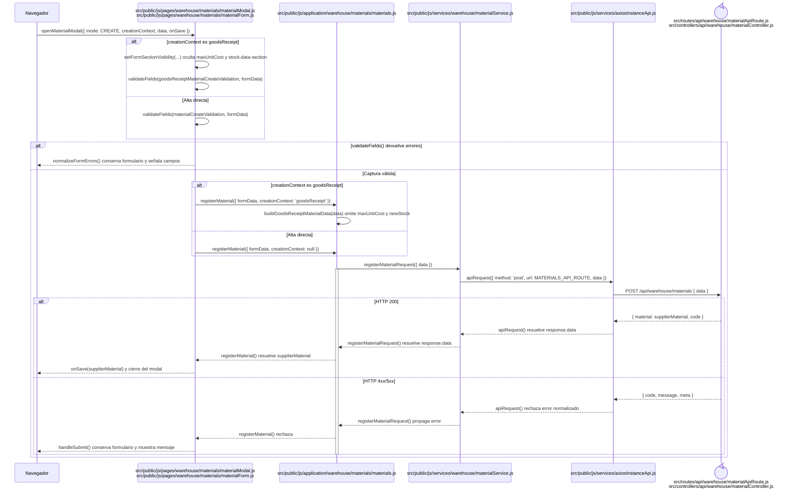

# `CU-ALM-02` — Crear material

**Patrones:** `FE-P02`.

```mermaid
sequenceDiagram
    participant Browser as Navegador
    participant View as src/public/js/pages/warehouse/materials/materialModal.js<br/>src/public/js/pages/warehouse/materials/materialForm.js
    participant Application as src/public/js/application/warehouse/materials/materials.js
    participant Request as src/public/js/services/warehouse/materialService.js
    participant HTTP as src/public/js/services/axiosInstanceApi.js
    participant Transport@{ "type": "control" } as src/routes/api/warehouse/materialApiRoute.js<br/>src/controllers/api/warehouse/materialController.js

    Browser->>View: openMaterialModal({ mode: CREATE, creationContext, data, onSave })
    alt creationContext es goodsReceipt
        View->>View: setFormSectionVisibility(...) oculta maxUnitCost y stock-data-section
        View->>View: validateFields(goodsReceiptMaterialCreateValidation, formData)
    else Alta directa
        View->>View: validateFields(materialCreateValidation, formData)
    end
    alt validateFields() devuelve errores
        View-->>Browser: normalizeFormErrors() conserva formulario y señala campos
    else Captura válida
        alt creationContext es goodsReceipt
            View->>Application: registerMaterial({ formData, creationContext: 'goodsReceipt' })
            Application->>Application: buildGoodsReceiptMaterialData(data) omite maxUnitCost y newStock
        else Alta directa
            View->>Application: registerMaterial({ formData, creationContext: null })
        end
        Application->>Request: registerMaterialRequest({ data })
        activate Application
        Request->>HTTP: apiRequest({ method: 'post', url: MATERIALS_API_ROUTE, data })
        HTTP->>Transport: POST /api/warehouse/materials { data }
        alt HTTP 200
            Transport-->>HTTP: { material: supplierMaterial, code }
            HTTP-->>Request: apiRequest() resuelve response.data
            Request-->>Application: registerMaterialRequest() resuelve response.data
            Application-->>View: registerMaterial() resuelve supplierMaterial
            View-->>Browser: onSave(supplierMaterial) y cierre del modal
        else HTTP 4xx/5xx
            Transport-->>HTTP: { code, message, meta }
            HTTP-->>Request: apiRequest() rechaza error normalizado
            Request-->>Application: registerMaterialRequest() propaga error
            Application-->>View: registerMaterial() rechaza
            View-->>Browser: handleSubmit() conserva formulario y muestra mensaje
        end
        deactivate Application
    end
```
