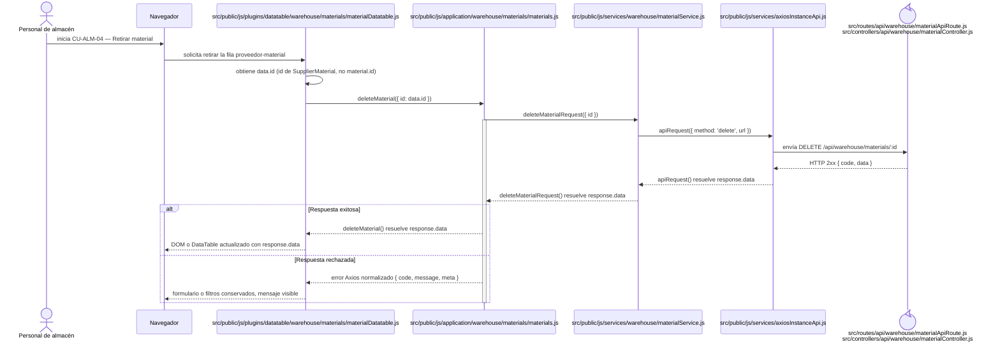

# `CU-ALM-04` — Retirar material

**Patrones:** `FE-P02`.

```mermaid
sequenceDiagram
    actor Initiator as Personal de almacén
    participant Browser as Navegador
    participant View as src/public/js/plugins/datatable/warehouse/materials/materialDatatable.js
    participant Application as src/public/js/application/warehouse/materials/materials.js
    participant Request as src/public/js/services/warehouse/materialService.js
    participant HTTP as src/public/js/services/axiosInstanceApi.js
    participant Transport@{ "type": "control" } as src/routes/api/warehouse/materialApiRoute.js<br/>src/controllers/api/warehouse/materialController.js

    Initiator->>Browser: inicia CU-ALM-04 — Retirar material
    Browser->>View: solicita retirar la fila proveedor-material
    View->>View: obtiene data.id (id de SupplierMaterial, no material.id)
    View->>Application: deleteMaterial({ id: data.id })
    Application->>Request: deleteMaterialRequest({ id })
    activate Application
    Request->>HTTP: apiRequest({ method: 'delete', url })
    HTTP->>Transport: envía DELETE /api/warehouse/materials/:id
    Transport-->>HTTP: HTTP 2xx { code, data }
    HTTP-->>Request: apiRequest() resuelve response.data
    Request-->>Application: deleteMaterialRequest() resuelve response.data
    alt Respuesta exitosa
        Application-->>View: deleteMaterial() resuelve response.data
        View-->>Browser: DOM o DataTable actualizado con response.data
    else Respuesta rechazada
        Application-->>View: error Axios normalizado { code, message, meta }
        View-->>Browser: formulario o filtros conservados, mensaje visible
    end
    deactivate Application
```
