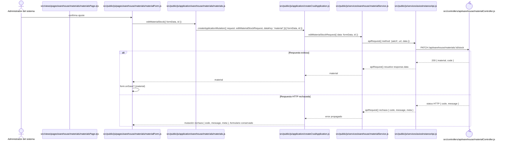

# `CU-ALM-05` — Ajustar existencia de material

**Patrones:** `FE-P02`.

```mermaid
sequenceDiagram
    actor User as Administrador del sistema
    participant EJS as src/views/pages/warehouse/materials/materialsPage.ejs
    participant Form as src/public/js/pages/warehouse/materials/materialForm.js
    participant App as src/public/js/application/warehouse/materials/materials.js
    participant Factory as src/public/js/application/createCrudApplication.js
    participant Request as src/public/js/services/warehouse/materialService.js
    participant HTTP as src/public/js/services/axiosInstanceApi.js
    participant API@{ "type": "control" } as src/controllers/api/warehouse/materialController.js

    User->>Form: confirma ajuste
    Form->>App: editMaterialStock({ formData, id })
    App->>Factory: createApplicationMutation({ request: editMaterialStockRequest, dataKey: 'material' })({ formData, id })
    Factory->>Request: editMaterialStockRequest({ data: formData, id })
    Request->>HTTP: apiRequest({ method: 'patch', url, data })
    HTTP->>API: PATCH /api/warehouse/materials/:id/stock
    alt Respuesta exitosa
        API-->>HTTP: 200 { material, code }
        HTTP-->>Request: apiRequest() resuelve response.data
        Request-->>Factory: material
        Factory-->>Form: material
        Form->>Form: form.onSave?.(material)
    else Respuesta HTTP rechazada
        API-->>HTTP: status HTTP { code, message }
        HTTP-->>Request: apiRequest() rechaza { code, message, meta }
        Request-->>Factory: error propagado
        Factory-->>Form: mutación rechaza { code, message, meta }, formulario conservado
    end
```

