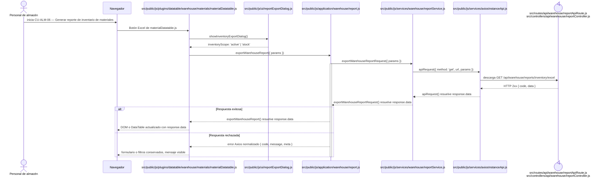

# `CU-ALM-06` — Generar reporte de inventario de materiales

**Patrones:** `FE-P08`.

```mermaid
sequenceDiagram
    actor Initiator as Personal de almacén
    participant Browser as Navegador
    participant View as src/public/js/plugins/datatable/warehouse/materials/materialDatatable.js
    participant Dialog as src/public/js/ui/reportExportDialog.js
    participant Application as src/public/js/application/warehouse/report.js
    participant Request as src/public/js/services/warehouse/reportService.js
    participant HTTP as src/public/js/services/axiosInstanceApi.js
    participant Transport@{ "type": "control" } as src/routes/api/warehouse/reportApiRoute.js<br/>src/controllers/api/warehouse/reportController.js

    Initiator->>Browser: inicia CU-ALM-06 — Generar reporte de inventario de materiales
    Browser->>View: Botón Excel de materialDatatable.js
    View->>Dialog: showInventoryExportDialog()
    Dialog-->>View: inventoryScope: 'active' | 'stock'
    View->>Application: exportWarehouseReport({ params })
    Application->>Request: exportWarehouseReportRequest({ params })
    activate Application
    Request->>HTTP: apiRequest({ method: 'get', url, params })
    HTTP->>Transport: descarga GET /api/warehouse/reports/inventory/excel
    Transport-->>HTTP: HTTP 2xx { code, data }
    HTTP-->>Request: apiRequest() resuelve response.data
    Request-->>Application: exportWarehouseReportRequest() resuelve response.data
    alt Respuesta exitosa
        Application-->>View: exportWarehouseReport() resuelve response.data
        View-->>Browser: DOM o DataTable actualizado con response.data
    else Respuesta rechazada
        Application-->>View: error Axios normalizado { code, message, meta }
        View-->>Browser: formulario o filtros conservados, mensaje visible
    end
    deactivate Application
```

