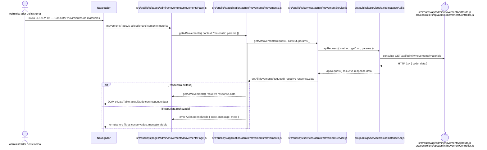

# `CU-ALM-07` — Consultar movimientos de materiales

**Patrones:** `FE-P07`.

```mermaid
sequenceDiagram
    actor Initiator as Administrador del sistema
    participant Browser as Navegador
    participant View as src/public/js/pages/admin/movements/movementsPage.js
    participant Application as src/public/js/application/admin/movements/movements.js
    participant Request as src/public/js/services/admin/movementService.js
    participant HTTP as src/public/js/services/axiosInstanceApi.js
    participant Transport@{ "type": "control" } as src/routes/api/admin/movementApiRoute.js<br/>src/controllers/api/admin/movementController.js

    Initiator->>Browser: inicia CU-ALM-07 — Consultar movimientos de materiales
    Browser->>View: movementsPage.js selecciona el contexto material
    View->>Application: getAllMovements({ context: 'materials', params })
    Application->>Request: getAllMovementsRequest({ context, params })
    activate Application
    Request->>HTTP: apiRequest({ method: 'get', url, params })
    HTTP->>Transport: consultar GET /api/admin/movements/materials
    Transport-->>HTTP: HTTP 2xx { code, data }
    HTTP-->>Request: apiRequest() resuelve response.data
    Request-->>Application: getAllMovementsRequest() resuelve response.data
    alt Respuesta exitosa
        Application-->>View: getAllMovements() resuelve response.data
        View-->>Browser: DOM o DataTable actualizado con response.data
    else Respuesta rechazada
        Application-->>View: error Axios normalizado { code, message, meta }
        View-->>Browser: formulario o filtros conservados, mensaje visible
    end
    deactivate Application
```

