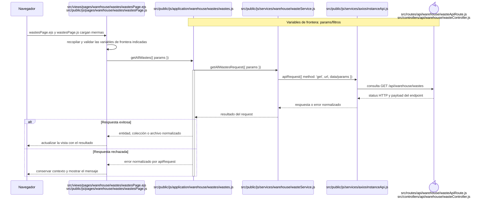

# `CU-ALM-09` — Consultar mermas

**Patrones:** `FE-P02`.

```mermaid
sequenceDiagram
    participant Browser as Navegador
    participant View as src/views/pages/warehouse/wastes/wastesPage.ejs<br/>src/public/js/pages/warehouse/wastes/wastesPage.js
    participant Application as src/public/js/application/warehouse/wastes/wastes.js
    participant Request as src/public/js/services/warehouse/wasteService.js
    participant HTTP as src/public/js/services/axiosInstanceApi.js
    participant Transport@{ "type": "control" } as src/routes/api/warehouse/wasteApiRoute.js<br/>src/controllers/api/warehouse/wasteController.js
    Note over Application,Transport: Variables de frontera: params/filtros

    Browser->>View: wastesPage.ejs y wastesPage.js cargan mermas
    View->>View: recopilar y validar las variables de frontera indicadas
    View->>Application: getAllWastes({ params })
    Application->>Request: getAllWastesRequest({ params })
    activate Application
    Request->>HTTP: apiRequest({ method: 'get', url, data/params })
    HTTP->>Transport: consulta GET /api/warehouse/wastes
    Transport-->>HTTP: status HTTP y payload del endpoint
    HTTP-->>Request: respuesta o error normalizado
    Request-->>Application: resultado del request
    alt Respuesta exitosa
        Application-->>View: entidad, colección o archivo normalizado
        View-->>Browser: actualizar la vista con el resultado
    else Respuesta rechazada
        Application-->>View: error normalizado por apiRequest
        View-->>Browser: conservar contexto y mostrar el mensaje
    end
    deactivate Application
```

