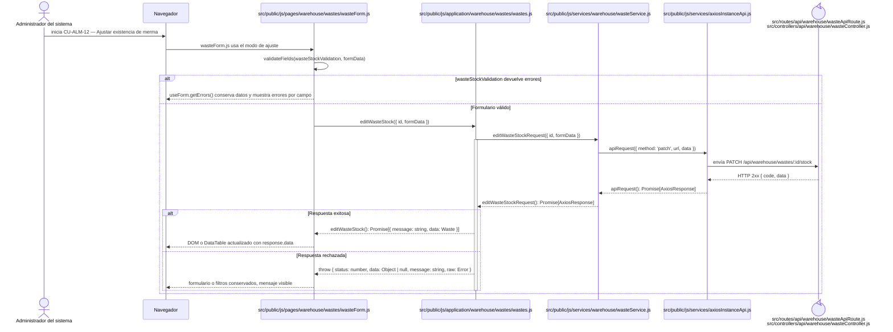

# `CU-ALM-12` — Ajustar existencia de merma

**Patrones:** `FE-P02`.

```mermaid
sequenceDiagram
    actor Initiator as Administrador del sistema
    participant Browser as Navegador
    participant View as src/public/js/pages/warehouse/wastes/wasteForm.js
    participant Application as src/public/js/application/warehouse/wastes/wastes.js
    participant Request as src/public/js/services/warehouse/wasteService.js
    participant HTTP as src/public/js/services/axiosInstanceApi.js
    participant Transport@{ "type": "control" } as src/routes/api/warehouse/wasteApiRoute.js<br/>src/controllers/api/warehouse/wasteController.js

    Initiator->>Browser: inicia CU-ALM-12 — Ajustar existencia de merma
    Browser->>View: wasteForm.js usa el modo de ajuste
    View->>View: validateFields(wasteStockValidation, formData)
    alt wasteStockValidation devuelve errores
        View-->>Browser: useForm.getErrors() conserva datos y muestra errores por campo
    else Formulario válido
        View->>Application: editWasteStock({ id, formData })
        Application->>Request: editWasteStockRequest({ id, formData })
        activate Application
        Request->>HTTP: apiRequest({ method: 'patch', url, data })
        HTTP->>Transport: envía PATCH /api/warehouse/wastes/:id/stock
        Transport-->>HTTP: HTTP 2xx { code, data }
        HTTP-->>Request: apiRequest(): Promise[AxiosResponse]
        Request-->>Application: editWasteStockRequest(): Promise[AxiosResponse]
        alt Respuesta exitosa
            Application-->>View: editWasteStock(): Promise[{ message: string, data: Waste }]
            View-->>Browser: DOM o DataTable actualizado con response.data
        else Respuesta rechazada
            Application-->>View: throw { status: number, data: Object | null, message: string, raw: Error }
            View-->>Browser: formulario o filtros conservados, mensaje visible
        end
        deactivate Application
    end
```
