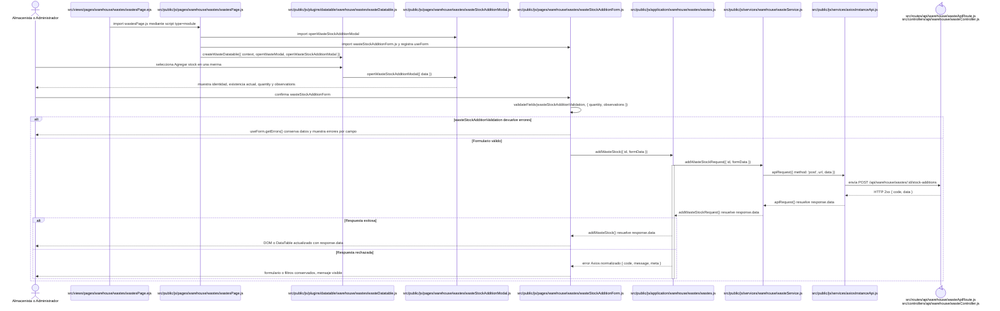

# `CU-ALM-13` — Agregar existencia de merma

**Patrones:** `FE-P02`.

```mermaid
sequenceDiagram
    actor User as Almacenista o Administrador
    participant EJS as src/views/pages/warehouse/wastes/wastesPage.ejs
    participant Page as src/public/js/pages/warehouse/wastes/wastesPage.js
    participant Table as src/public/js/plugins/datatable/warehouse/wastes/wasteDatatable.js
    participant Modal as src/public/js/pages/warehouse/wastes/wasteStockAdditionModal.js
    participant Form as src/public/js/pages/warehouse/wastes/wasteStockAdditionForm.js
    participant Application as src/public/js/application/warehouse/wastes/wastes.js
    participant Request as src/public/js/services/warehouse/wasteService.js
    participant HTTP as src/public/js/services/axiosInstanceApi.js
    participant Transport@{ "type": "control" } as src/routes/api/warehouse/wasteApiRoute.js<br/>src/controllers/api/warehouse/wasteController.js

    EJS->>Page: import wastesPage.js mediante script type=module
    Page->>Modal: import openWasteStockAdditionModal
    Page->>Form: import wasteStockAdditionForm.js y registra useForm
    Page->>Table: createWasteDatatable({ context, openWasteModal, openWasteStockAdditionModal })
    User->>Table: selecciona Agregar stock en una merma
    Table->>Modal: openWasteStockAdditionModal({ data })
    Modal-->>User: muestra identidad, existencia actual, quantity y observations
    User->>Form: confirma wasteStockAdditionForm
    Form->>Form: validateFields(wasteStockAdditionValidation, { quantity, observations })
    alt wasteStockAdditionValidation devuelve errores
        Form-->>User: useForm.getErrors() conserva datos y muestra errores por campo
    else Formulario válido
        Form->>Application: addWasteStock({ id, formData })
        Application->>Request: addWasteStockRequest({ id, formData })
        activate Application
        Request->>HTTP: apiRequest({ method: 'post', url, data })
        HTTP->>Transport: envía POST /api/warehouse/wastes/:id/stock-additions
        Transport-->>HTTP: HTTP 2xx { code, data }
        HTTP-->>Request: apiRequest() resuelve response.data
        Request-->>Application: addWasteStockRequest() resuelve response.data
        alt Respuesta exitosa
            Application-->>Form: addWasteStock() resuelve response.data
            Form-->>User: DOM o DataTable actualizado con response.data
        else Respuesta rechazada
            Application-->>Form: error Axios normalizado { code, message, meta }
            Form-->>User: formulario o filtros conservados, mensaje visible
        end
        deactivate Application
    end
```
