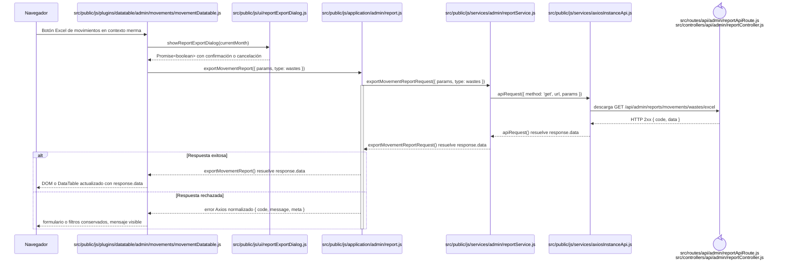

# `CU-ALM-16` — Generar reporte de movimientos de mermas

**Patrones:** `FE-P08`.

```mermaid
sequenceDiagram
    participant Browser as Navegador
    participant View as src/public/js/plugins/datatable/admin/movements/movementDatatable.js
    participant Dialog as src/public/js/ui/reportExportDialog.js
    participant Application as src/public/js/application/admin/report.js
    participant Request as src/public/js/services/admin/reportService.js
    participant HTTP as src/public/js/services/axiosInstanceApi.js
    participant Transport@{ "type": "control" } as src/routes/api/admin/reportApiRoute.js<br/>src/controllers/api/admin/reportController.js

    Browser->>View: Botón Excel de movimientos en contexto merma
    View->>Dialog: showReportExportDialog(currentMonth)
    Dialog-->>View: Promise<boolean> con confirmación o cancelación
    View->>Application: exportMovementReport({ params, type: wastes })
    Application->>Request: exportMovementReportRequest({ params, type: wastes })
    activate Application
    Request->>HTTP: apiRequest({ method: 'get', url, params })
    HTTP->>Transport: descarga GET /api/admin/reports/movements/wastes/excel
    Transport-->>HTTP: HTTP 2xx { code, data }
    HTTP-->>Request: apiRequest() resuelve response.data
    Request-->>Application: exportMovementReportRequest() resuelve response.data
    alt Respuesta exitosa
        Application-->>View: exportMovementReport() resuelve response.data
        View-->>Browser: DOM o DataTable actualizado con response.data
    else Respuesta rechazada
        Application-->>View: error Axios normalizado { code, message, meta }
        View-->>Browser: formulario o filtros conservados, mensaje visible
    end
    deactivate Application
```
