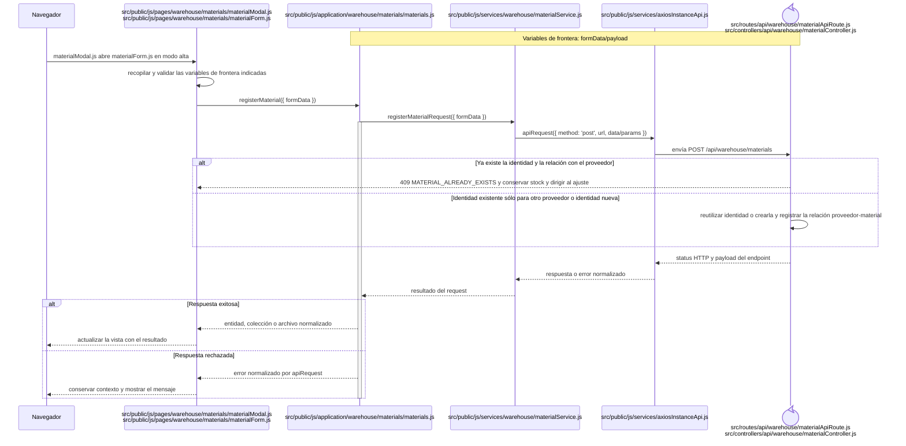

# `CU-CAT-02` — Crear material

**Patrones:** `FE-P02`.

```mermaid
sequenceDiagram
    participant Browser as Navegador
    participant View as src/public/js/pages/warehouse/materials/materialModal.js<br/>src/public/js/pages/warehouse/materials/materialForm.js
    participant Application as src/public/js/application/warehouse/materials/materials.js
    participant Request as src/public/js/services/warehouse/materialService.js
    participant HTTP as src/public/js/services/axiosInstanceApi.js
    participant Transport@{ "type": "control" } as src/routes/api/warehouse/materialApiRoute.js<br/>src/controllers/api/warehouse/materialController.js
    Note over Application,Transport: Variables de frontera: formData/payload

    Browser->>View: materialModal.js abre materialForm.js en modo alta
    View->>View: recopilar y validar las variables de frontera indicadas
    View->>Application: registerMaterial({ formData })
    Application->>Request: registerMaterialRequest({ formData })
    activate Application
    Request->>HTTP: apiRequest({ method: 'post', url, data/params })
    HTTP->>Transport: envía POST /api/warehouse/materials
    alt Ya existe la identidad y la relación con el proveedor
        Transport-->>View: 409 MATERIAL_ALREADY_EXISTS y conservar stock y dirigir al ajuste
    else Identidad existente sólo para otro proveedor o identidad nueva
        Transport->>Transport: reutilizar identidad o crearla y registrar la relación proveedor-material
    end
    Transport-->>HTTP: status HTTP y payload del endpoint
    HTTP-->>Request: respuesta o error normalizado
    Request-->>Application: resultado del request
    alt Respuesta exitosa
        Application-->>View: entidad, colección o archivo normalizado
        View-->>Browser: actualizar la vista con el resultado
    else Respuesta rechazada
        Application-->>View: error normalizado por apiRequest
        View-->>Browser: conservar contexto y mostrar el mensaje
    end
    deactivate Application
```

