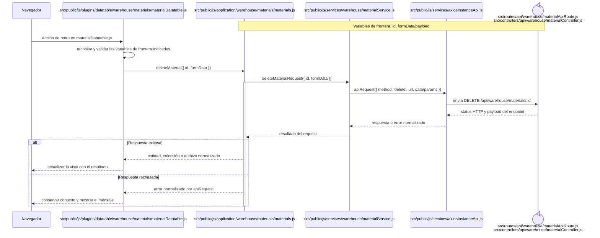

# `CU-CAT-04` — Retirar material

**Patrones:** `FE-P02`.

```mermaid
sequenceDiagram
    participant Browser as Navegador
    participant View as src/public/js/plugins/datatable/warehouse/materials/materialDatatable.js
    participant Application as src/public/js/application/warehouse/materials/materials.js
    participant Request as src/public/js/services/warehouse/materialService.js
    participant HTTP as src/public/js/services/axiosInstanceApi.js
    participant Transport@{ "type": "control" } as src/routes/api/warehouse/materialApiRoute.js<br/>src/controllers/api/warehouse/materialController.js
    Note over Application,Transport: Variables de frontera: id, formData/payload

    Browser->>View: Acción de retiro en materialDatatable.js
    View->>View: recopilar y validar las variables de frontera indicadas
    View->>Application: deleteMaterial({ id, formData })
    Application->>Request: deleteMaterialRequest({ id, formData })
    activate Application
    Request->>HTTP: apiRequest({ method: 'delete', url, data/params })
    HTTP->>Transport: envía DELETE /api/warehouse/materials/:id
    Transport-->>HTTP: status HTTP y payload del endpoint
    HTTP-->>Request: respuesta o error normalizado
    Request-->>Application: resultado del request
    alt Respuesta exitosa
        Application-->>View: entidad, colección o archivo normalizado
        View-->>Browser: actualizar la vista con el resultado
    else Respuesta rechazada
        Application-->>View: error normalizado por apiRequest
        View-->>Browser: conservar contexto y mostrar el mensaje
    end
    deactivate Application
```

