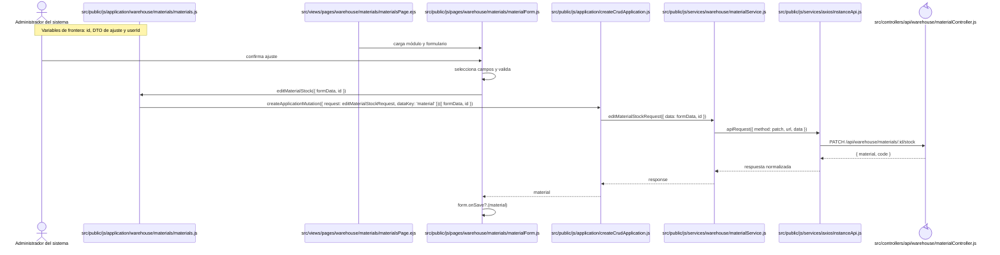

# `CU-CAT-05` — Ajustar existencia de material

**Patrones:** `FE-P02`.

```mermaid
sequenceDiagram
    Note over User,App: Variables de frontera: id, DTO de ajuste y userId
    actor User as Administrador del sistema
    participant EJS as src/views/pages/warehouse/materials/materialsPage.ejs
    participant Form as src/public/js/pages/warehouse/materials/materialForm.js
    participant App as src/public/js/application/warehouse/materials/materials.js
    participant Factory as src/public/js/application/createCrudApplication.js
    participant Request as src/public/js/services/warehouse/materialService.js
    participant HTTP as src/public/js/services/axiosInstanceApi.js
    participant API@{ "type": "control" } as src/controllers/api/warehouse/materialController.js

    EJS->>Form: carga módulo y formulario
    User->>Form: confirma ajuste
    Form->>Form: selecciona campos y valida
    Form->>App: editMaterialStock({ formData, id })
    App->>Factory: createApplicationMutation({ request: editMaterialStockRequest, dataKey: 'material' })({ formData, id })
    Factory->>Request: editMaterialStockRequest({ data: formData, id })
    Request->>HTTP: apiRequest({ method: patch, url, data })
    HTTP->>API: PATCH /api/warehouse/materials/:id/stock
    API-->>HTTP: { material, code }
    HTTP-->>Request: respuesta normalizada
    Request-->>Factory: response
    Factory-->>Form: material
    Form->>Form: form.onSave?.(material)
```

