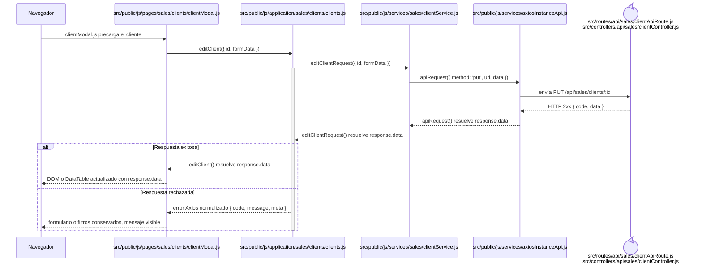

# `CU-CAT-07` — Editar cliente

**Patrones:** `FE-P02`.

```mermaid
sequenceDiagram
    participant Browser as Navegador
    participant View as src/public/js/pages/sales/clients/clientModal.js
    participant Application as src/public/js/application/sales/clients/clients.js
    participant Request as src/public/js/services/sales/clientService.js
    participant HTTP as src/public/js/services/axiosInstanceApi.js
    participant Transport@{ "type": "control" } as src/routes/api/sales/clientApiRoute.js<br/>src/controllers/api/sales/clientController.js

    Browser->>View: clientModal.js precarga el cliente
    View->>Application: editClient({ id, formData })
    Application->>Request: editClientRequest({ id, formData })
    activate Application
    Request->>HTTP: apiRequest({ method: 'put', url, data })
    HTTP->>Transport: envía PUT /api/sales/clients/:id
    Transport-->>HTTP: HTTP 2xx { code, data }
    HTTP-->>Request: apiRequest() resuelve response.data
    Request-->>Application: editClientRequest() resuelve response.data
    alt Respuesta exitosa
        Application-->>View: editClient() resuelve response.data
        View-->>Browser: DOM o DataTable actualizado con response.data
    else Respuesta rechazada
        Application-->>View: error Axios normalizado { code, message, meta }
        View-->>Browser: formulario o filtros conservados, mensaje visible
    end
    deactivate Application
```

