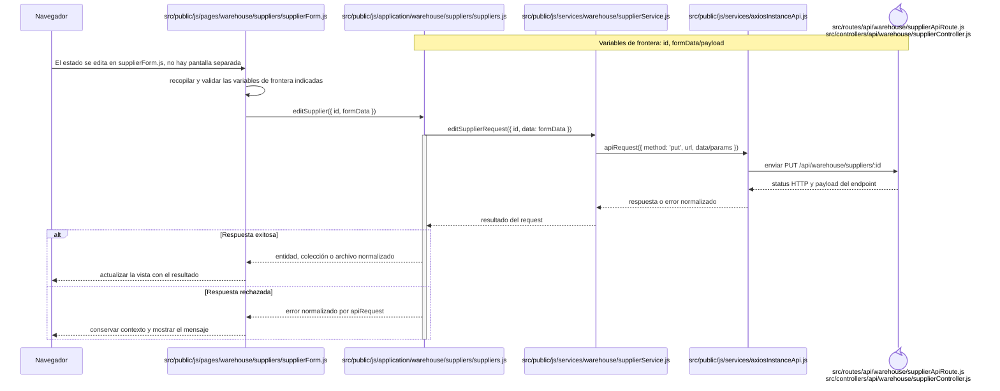

# `CU-CAT-13` — Cambiar estado de proveedor

**Patrones:** `FE-P02`.

```mermaid
sequenceDiagram
    participant Browser as Navegador
    participant View as src/public/js/pages/warehouse/suppliers/supplierForm.js
    participant Application as src/public/js/application/warehouse/suppliers/suppliers.js
    participant Request as src/public/js/services/warehouse/supplierService.js
    participant HTTP as src/public/js/services/axiosInstanceApi.js
    participant Transport@{ "type": "control" } as src/routes/api/warehouse/supplierApiRoute.js<br/>src/controllers/api/warehouse/supplierController.js
    Note over Application,Transport: Variables de frontera: id, formData/payload

    Browser->>View: El estado se edita en supplierForm.js, no hay pantalla separada
    View->>View: recopilar y validar las variables de frontera indicadas
    View->>Application: editSupplier({ id, formData })
    Application->>Request: editSupplierRequest({ id, data: formData })
    activate Application
    Request->>HTTP: apiRequest({ method: 'put', url, data/params })
    HTTP->>Transport: enviar PUT /api/warehouse/suppliers/:id
    Transport-->>HTTP: status HTTP y payload del endpoint
    HTTP-->>Request: respuesta o error normalizado
    Request-->>Application: resultado del request
    alt Respuesta exitosa
        Application-->>View: entidad, colección o archivo normalizado
        View-->>Browser: actualizar la vista con el resultado
    else Respuesta rechazada
        Application-->>View: error normalizado por apiRequest
        View-->>Browser: conservar contexto y mostrar el mensaje
    end
    deactivate Application
```

