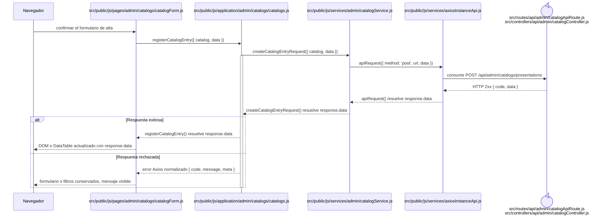

# `CU-CAT-16` — Crear presentación

**Patrones:** `FE-P03`.

```mermaid
sequenceDiagram
    participant Browser as Navegador
    participant View as src/public/js/pages/admin/catalogs/catalogForm.js
    participant Application as src/public/js/application/admin/catalogs/catalogs.js
    participant Request as src/public/js/services/admin/catalogService.js
    participant HTTP as src/public/js/services/axiosInstanceApi.js
    participant Transport@{ "type": "control" } as src/routes/api/admin/catalogApiRoute.js<br/>src/controllers/api/admin/catalogController.js

    Browser->>View: confirmar el formulario de alta
    View->>Application: registerCatalogEntry({ catalog, data })
    Application->>Request: createCatalogEntryRequest({ catalog, data })
    activate Application
    Request->>HTTP: apiRequest({ method: 'post', url, data })
    HTTP->>Transport: consume POST /api/admin/catalogs/presentations
    Transport-->>HTTP: HTTP 2xx { code, data }
    HTTP-->>Request: apiRequest() resuelve response.data
    Request-->>Application: createCatalogEntryRequest() resuelve response.data
    alt Respuesta exitosa
        Application-->>View: registerCatalogEntry() resuelve response.data
        View-->>Browser: DOM o DataTable actualizado con response.data
    else Respuesta rechazada
        Application-->>View: error Axios normalizado { code, message, meta }
        View-->>Browser: formulario o filtros conservados, mensaje visible
    end
    deactivate Application
```

