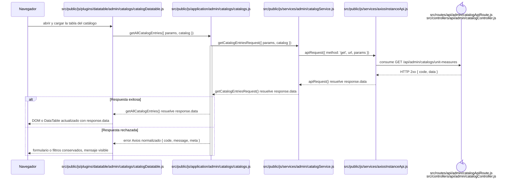

# `CU-CAT-18` — Consultar unidad de medida

**Patrones:** `FE-P03`.

```mermaid
sequenceDiagram
    participant Browser as Navegador
    participant View as src/public/js/plugins/datatable/admin/catalogs/catalogDatatable.js
    participant Application as src/public/js/application/admin/catalogs/catalogs.js
    participant Request as src/public/js/services/admin/catalogService.js
    participant HTTP as src/public/js/services/axiosInstanceApi.js
    participant Transport@{ "type": "control" } as src/routes/api/admin/catalogApiRoute.js<br/>src/controllers/api/admin/catalogController.js

    Browser->>View: abrir y cargar la tabla del catálogo
    View->>Application: getAllCatalogEntries({ params, catalog })
    Application->>Request: getCatalogEntriesRequest({ params, catalog })
    activate Application
    Request->>HTTP: apiRequest({ method: 'get', url, params })
    HTTP->>Transport: consume GET /api/admin/catalogs/unit-measures
    Transport-->>HTTP: HTTP 2xx { code, data }
    HTTP-->>Request: apiRequest() resuelve response.data
    Request-->>Application: getCatalogEntriesRequest() resuelve response.data
    alt Respuesta exitosa
        Application-->>View: getAllCatalogEntries() resuelve response.data
        View-->>Browser: DOM o DataTable actualizado con response.data
    else Respuesta rechazada
        Application-->>View: error Axios normalizado { code, message, meta }
        View-->>Browser: formulario o filtros conservados, mensaje visible
    end
    deactivate Application
```

