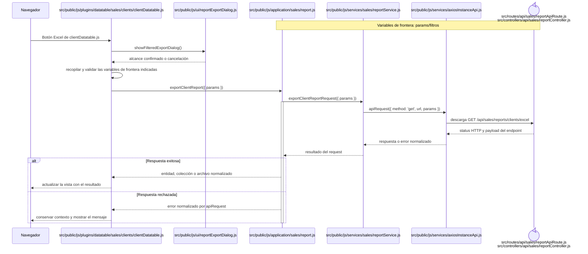

# `CU-CAT-18` — Generar reporte de clientes

**Patrones:** `FE-P08`.

```mermaid
sequenceDiagram
    participant Browser as Navegador
    participant View as src/public/js/plugins/datatable/sales/clients/clientDatatable.js
    participant Dialog as src/public/js/ui/reportExportDialog.js
    participant Application as src/public/js/application/sales/report.js
    participant Request as src/public/js/services/sales/reportService.js
    participant HTTP as src/public/js/services/axiosInstanceApi.js
    participant Transport@{ "type": "control" } as src/routes/api/sales/reportApiRoute.js<br/>src/controllers/api/sales/reportController.js
    Note over Application,Transport: Variables de frontera: params/filtros

    Browser->>View: Botón Excel de clientDatatable.js
    View->>Dialog: showFilteredExportDialog()
    Dialog-->>View: alcance confirmado o cancelación
    View->>View: recopilar y validar las variables de frontera indicadas
    View->>Application: exportClientReport({ params })
    Application->>Request: exportClientReportRequest({ params })
    activate Application
    Request->>HTTP: apiRequest({ method: 'get', url, params })
    HTTP->>Transport: descarga GET /api/sales/reports/clients/excel
    Transport-->>HTTP: status HTTP y payload del endpoint
    HTTP-->>Request: respuesta o error normalizado
    Request-->>Application: resultado del request
    alt Respuesta exitosa
        Application-->>View: entidad, colección o archivo normalizado
        View-->>Browser: actualizar la vista con el resultado
    else Respuesta rechazada
        Application-->>View: error normalizado por apiRequest
        View-->>Browser: conservar contexto y mostrar el mensaje
    end
    deactivate Application
```

