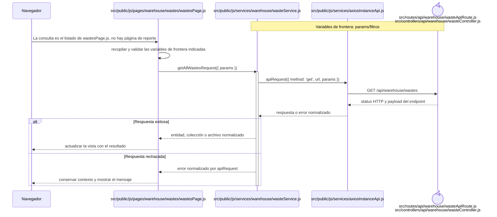

# `CU-CAT-23` — Consultar inventario de mermas

**Patrones:** `FE-P07`.

```mermaid
sequenceDiagram
    participant Browser as Navegador
    participant View as src/public/js/pages/warehouse/wastes/wastesPage.js
    participant Request as src/public/js/services/warehouse/wasteService.js
    participant HTTP as src/public/js/services/axiosInstanceApi.js
    participant Transport@{ "type": "control" } as src/routes/api/warehouse/wasteApiRoute.js<br/>src/controllers/api/warehouse/wasteController.js
    Note over Request,Transport: Variables de frontera: params/filtros

    Browser->>View: La consulta es el listado de wastesPage.js, no hay página de reporte
    View->>View: recopilar y validar las variables de frontera indicadas
    View->>Request: getAllWastesRequest({ params })
    activate Request
    Request->>HTTP: apiRequest({ method: 'get', url, params })
    HTTP->>Transport: GET /api/warehouse/wastes
    Transport-->>HTTP: status HTTP y payload del endpoint
    HTTP-->>Request: respuesta o error normalizado
    alt Respuesta exitosa
        Request-->>View: entidad, colección o archivo normalizado
        View-->>Browser: actualizar la vista con el resultado
    else Respuesta rechazada
        Request-->>View: error normalizado por apiRequest
        View-->>Browser: conservar contexto y mostrar el mensaje
    end
    deactivate Request
```

