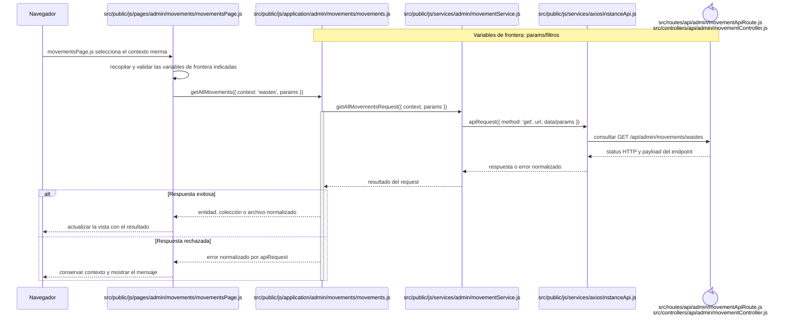

# `CU-CAT-25` — Consultar movimientos de mermas

**Patrones:** `FE-P07`.

```mermaid
sequenceDiagram
    participant Browser as Navegador
    participant View as src/public/js/pages/admin/movements/movementsPage.js
    participant Application as src/public/js/application/admin/movements/movements.js
    participant Request as src/public/js/services/admin/movementService.js
    participant HTTP as src/public/js/services/axiosInstanceApi.js
    participant Transport@{ "type": "control" } as src/routes/api/admin/movementApiRoute.js<br/>src/controllers/api/admin/movementController.js
    Note over Application,Transport: Variables de frontera: params/filtros

    Browser->>View: movementsPage.js selecciona el contexto merma
    View->>View: recopilar y validar las variables de frontera indicadas
    View->>Application: getAllMovements({ context: 'wastes', params })
    Application->>Request: getAllMovementsRequest({ context, params })
    activate Application
    Request->>HTTP: apiRequest({ method: 'get', url, data/params })
    HTTP->>Transport: consultar GET /api/admin/movements/wastes
    Transport-->>HTTP: status HTTP y payload del endpoint
    HTTP-->>Request: respuesta o error normalizado
    Request-->>Application: resultado del request
    alt Respuesta exitosa
        Application-->>View: entidad, colección o archivo normalizado
        View-->>Browser: actualizar la vista con el resultado
    else Respuesta rechazada
        Application-->>View: error normalizado por apiRequest
        View-->>Browser: conservar contexto y mostrar el mensaje
    end
    deactivate Application
```

