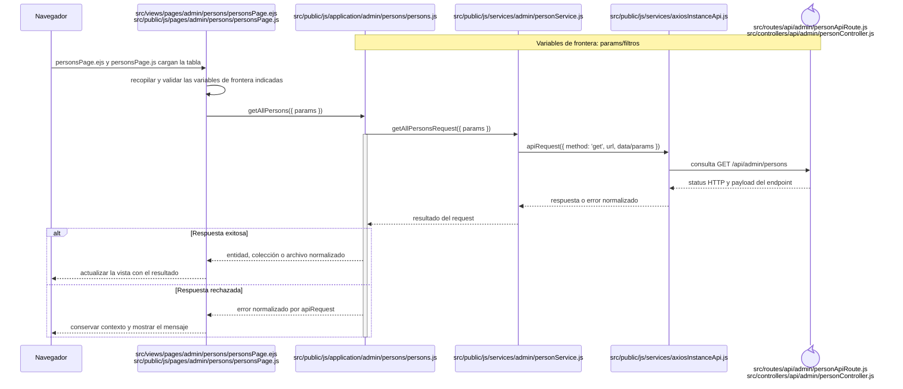
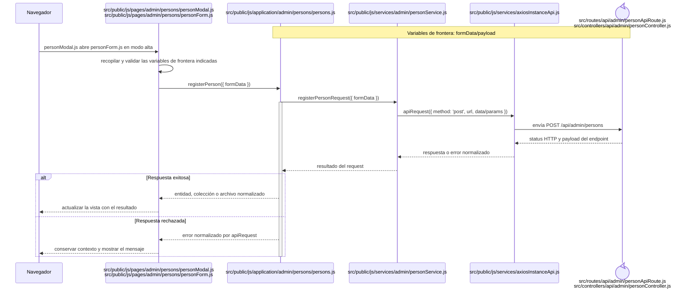
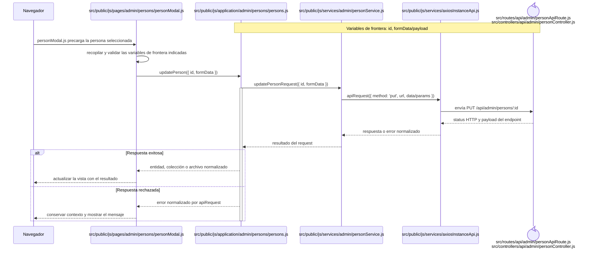
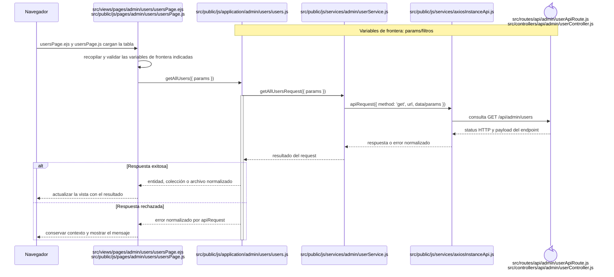
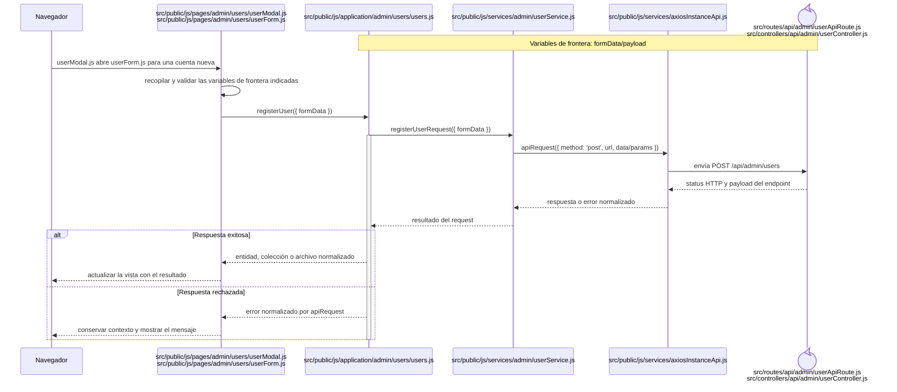
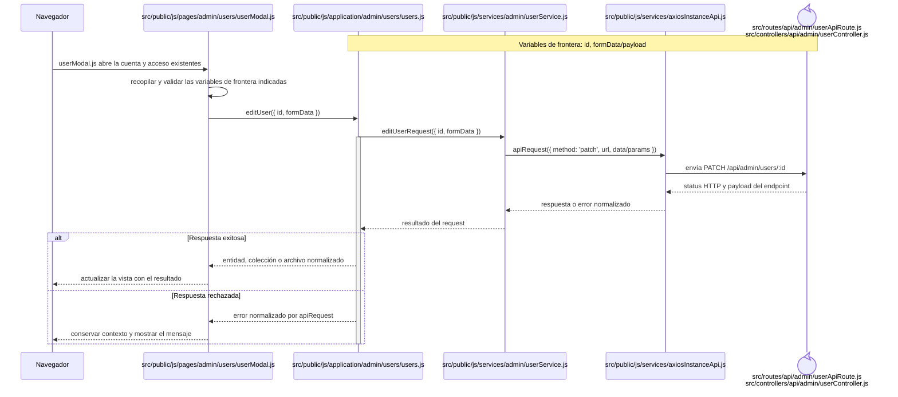
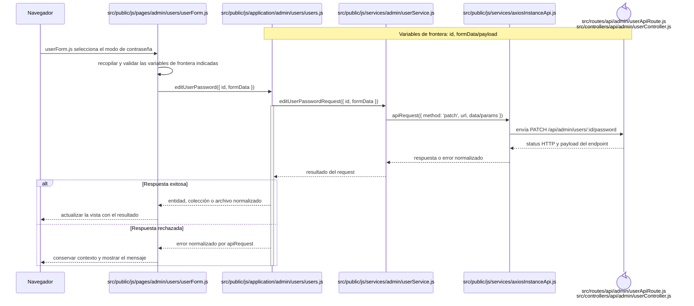
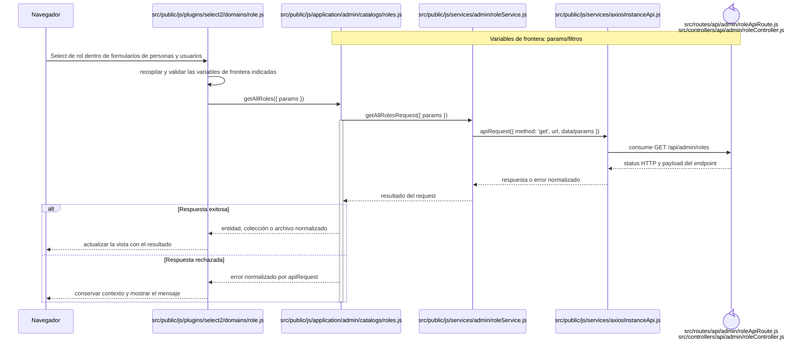
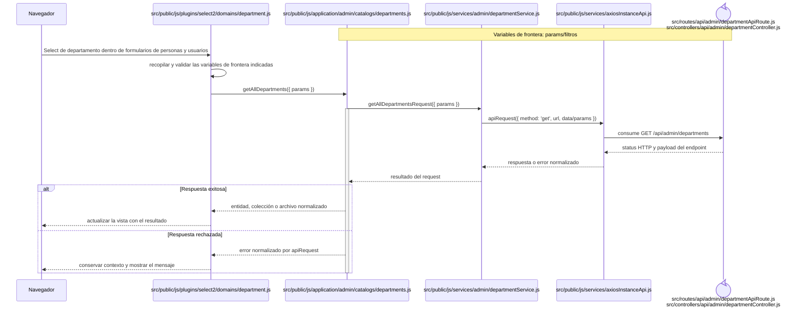

# Secuencias del código frontend: Identidad y acceso

Este capítulo forma parte del [catálogo de secuencias del código frontend](index.md) y conserva los recorridos aplicados del grupo `IDA`. Las reglas comunes de lectura, trazabilidad y mantenimiento se declaran en el índice de la colección.

## `CU-IDA-01`

**Patrones:** `FE-P02`.

## `CU-IDA-02`

**Patrones:** `FE-P02`.

## `CU-IDA-03`

**Patrones:** `FE-P02`.

## `CU-IDA-04`

**Patrones:** `FE-P02`.

## `CU-IDA-05`

**Patrones:** `FE-P02`.

## `CU-IDA-06`

**Patrones:** `FE-P02`.

## `CU-IDA-07`

**Patrones:** `FE-P02`.

## `CU-IDA-08`

**Patrones:** `FE-P03`.

## `CU-IDA-09`

**Patrones:** `FE-P03`.

