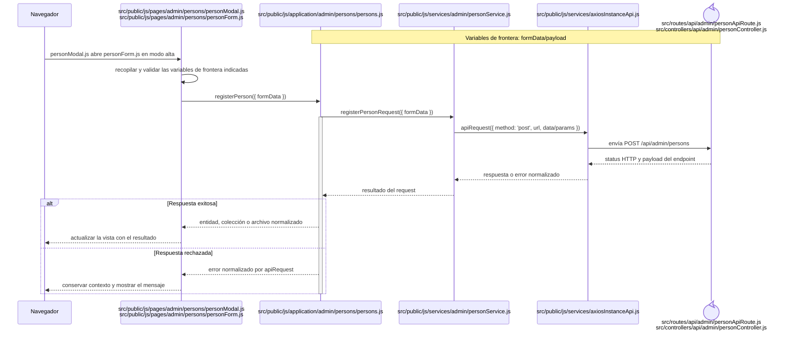

# `CU-IDA-02` — Crear persona

**Patrones:** `FE-P02`.

```mermaid
sequenceDiagram
    participant Browser as Navegador
    participant View as src/public/js/pages/admin/persons/personModal.js<br/>src/public/js/pages/admin/persons/personForm.js
    participant Application as src/public/js/application/admin/persons/persons.js
    participant Request as src/public/js/services/admin/personService.js
    participant HTTP as src/public/js/services/axiosInstanceApi.js
    participant Transport@{ "type": "control" } as src/routes/api/admin/personApiRoute.js<br/>src/controllers/api/admin/personController.js
    Note over Application,Transport: Variables de frontera: formData/payload

    Browser->>View: personModal.js abre personForm.js en modo alta
    View->>View: recopilar y validar las variables de frontera indicadas
    View->>Application: registerPerson({ formData })
    Application->>Request: registerPersonRequest({ formData })
    activate Application
    Request->>HTTP: apiRequest({ method: 'post', url, data/params })
    HTTP->>Transport: envía POST /api/admin/persons
    Transport-->>HTTP: status HTTP y payload del endpoint
    HTTP-->>Request: respuesta o error normalizado
    Request-->>Application: resultado del request
    alt Respuesta exitosa
        Application-->>View: entidad, colección o archivo normalizado
        View-->>Browser: actualizar la vista con el resultado
    else Respuesta rechazada
        Application-->>View: error normalizado por apiRequest
        View-->>Browser: conservar contexto y mostrar el mensaje
    end
    deactivate Application
```

