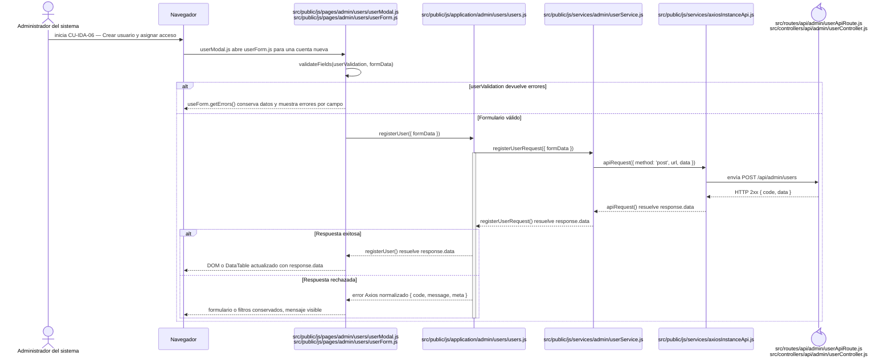

# `CU-IDA-06` — Crear usuario y asignar acceso

**Patrones:** `FE-P02`.

```mermaid
sequenceDiagram
    actor Initiator as Administrador del sistema
    participant Browser as Navegador
    participant View as src/public/js/pages/admin/users/userModal.js<br/>src/public/js/pages/admin/users/userForm.js
    participant Application as src/public/js/application/admin/users/users.js
    participant Request as src/public/js/services/admin/userService.js
    participant HTTP as src/public/js/services/axiosInstanceApi.js
    participant Transport@{ "type": "control" } as src/routes/api/admin/userApiRoute.js<br/>src/controllers/api/admin/userController.js

    Initiator->>Browser: inicia CU-IDA-06 — Crear usuario y asignar acceso
    Browser->>View: userModal.js abre userForm.js para una cuenta nueva
    View->>View: validateFields(userValidation, formData)
    alt userValidation devuelve errores
        View-->>Browser: useForm.getErrors() conserva datos y muestra errores por campo
    else Formulario válido
        View->>Application: registerUser({ formData })
        Application->>Request: registerUserRequest({ formData })
        activate Application
        Request->>HTTP: apiRequest({ method: 'post', url, data })
        HTTP->>Transport: envía POST /api/admin/users
        Transport-->>HTTP: HTTP 2xx { code, data }
        HTTP-->>Request: apiRequest() resuelve response.data
        Request-->>Application: registerUserRequest() resuelve response.data
        alt Respuesta exitosa
            Application-->>View: registerUser() resuelve response.data
            View-->>Browser: DOM o DataTable actualizado con response.data
        else Respuesta rechazada
            Application-->>View: error Axios normalizado { code, message, meta }
            View-->>Browser: formulario o filtros conservados, mensaje visible
        end
        deactivate Application
    end
```

