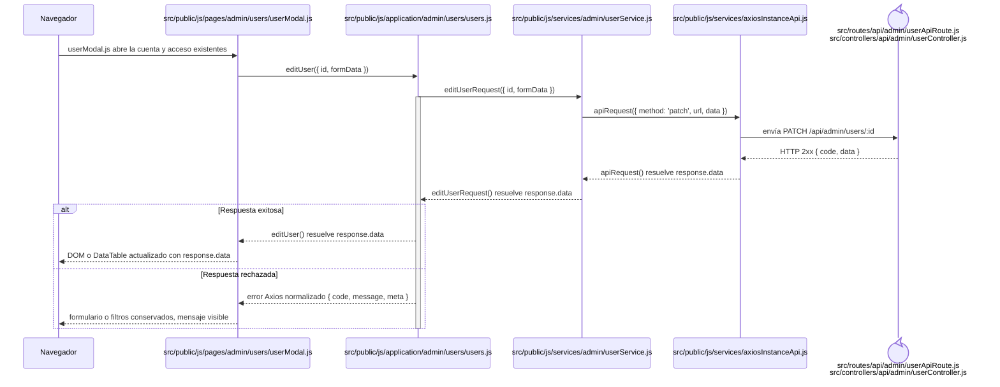

# `CU-IDA-07` — Editar usuario y acceso

**Patrones:** `FE-P02`.

```mermaid
sequenceDiagram
    participant Browser as Navegador
    participant View as src/public/js/pages/admin/users/userModal.js
    participant Application as src/public/js/application/admin/users/users.js
    participant Request as src/public/js/services/admin/userService.js
    participant HTTP as src/public/js/services/axiosInstanceApi.js
    participant Transport@{ "type": "control" } as src/routes/api/admin/userApiRoute.js<br/>src/controllers/api/admin/userController.js

    Browser->>View: userModal.js abre la cuenta y acceso existentes
    View->>Application: editUser({ id, formData })
    Application->>Request: editUserRequest({ id, formData })
    activate Application
    Request->>HTTP: apiRequest({ method: 'patch', url, data })
    HTTP->>Transport: envía PATCH /api/admin/users/:id
    Transport-->>HTTP: HTTP 2xx { code, data }
    HTTP-->>Request: apiRequest() resuelve response.data
    Request-->>Application: editUserRequest() resuelve response.data
    alt Respuesta exitosa
        Application-->>View: editUser() resuelve response.data
        View-->>Browser: DOM o DataTable actualizado con response.data
    else Respuesta rechazada
        Application-->>View: error Axios normalizado { code, message, meta }
        View-->>Browser: formulario o filtros conservados, mensaje visible
    end
    deactivate Application
```

