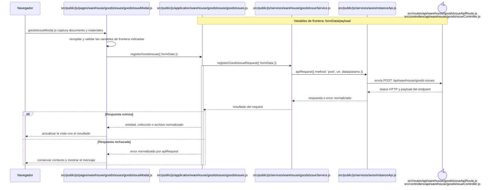
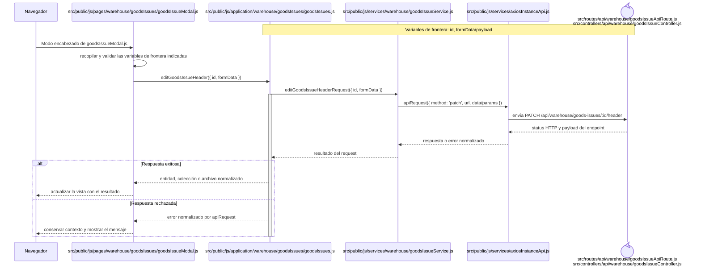
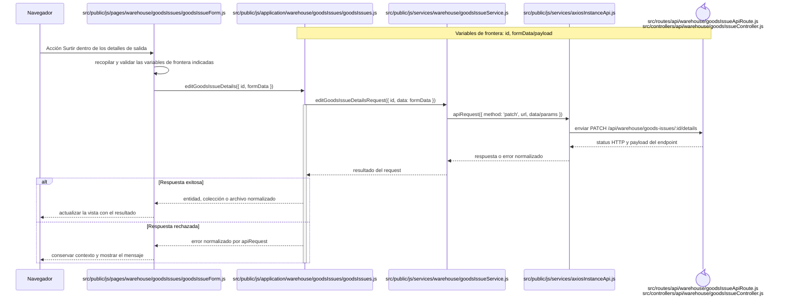
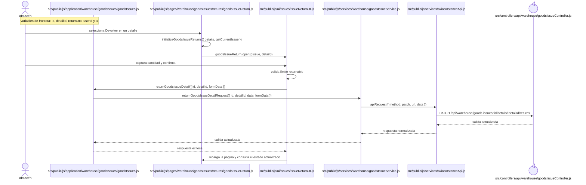
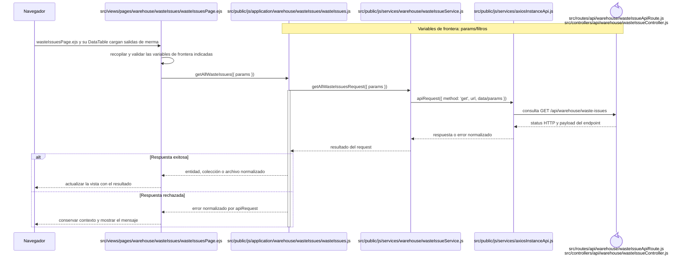
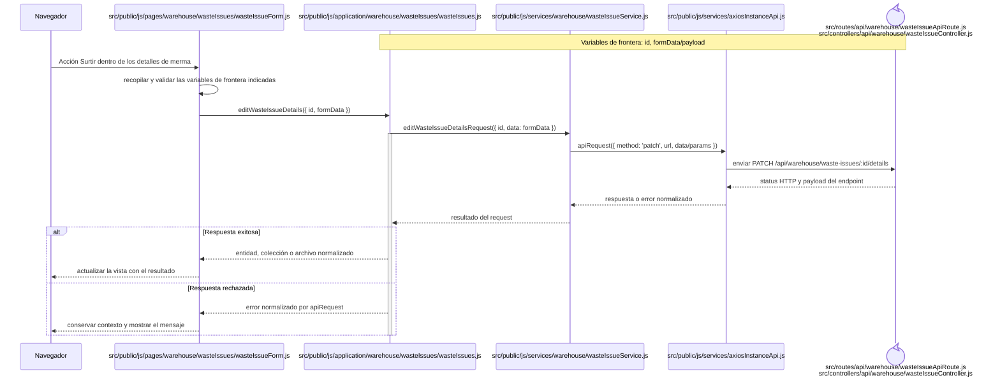
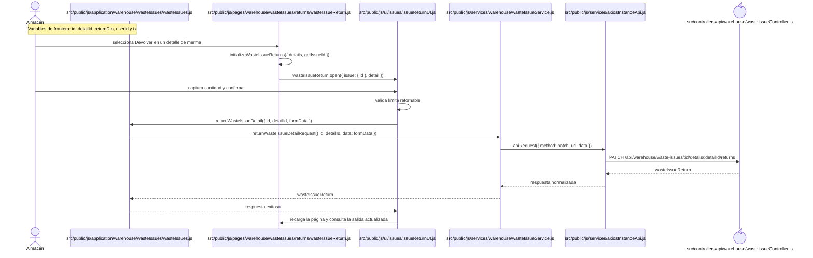

# Secuencias del código frontend: Salidas

Este capítulo forma parte del [catálogo de secuencias del código frontend](index.md) y conserva los recorridos aplicados del grupo `SAL`. Las reglas comunes de lectura, trazabilidad y mantenimiento se declaran en el índice de la colección.

## `CU-SAL-01`

**Patrones:** `FE-P05`.

## `CU-SAL-02`

**Patrones:** `FE-P05`.

## `CU-SAL-03`

**Patrones:** `FE-P05`.

## `CU-SAL-04`

**Patrones:** `FE-P05`.

## `CU-SAL-05`

**Patrones:** `FE-P05`.

## `CU-SAL-06`

**Patrones:** `FE-P05`, `FE-P06`.

## `CU-SAL-07`

**Patrones:** `FE-P05`.

## `CU-SAL-08`

**Patrones:** `FE-P05`.

## `CU-SAL-09`

**Patrones:** `FE-P05`.

## `CU-SAL-10`

**Patrones:** `FE-P05`.

## `CU-SAL-11`

**Patrones:** `FE-P05`.

## `CU-SAL-12`

**Patrones:** `FE-P05`, `FE-P06`.

