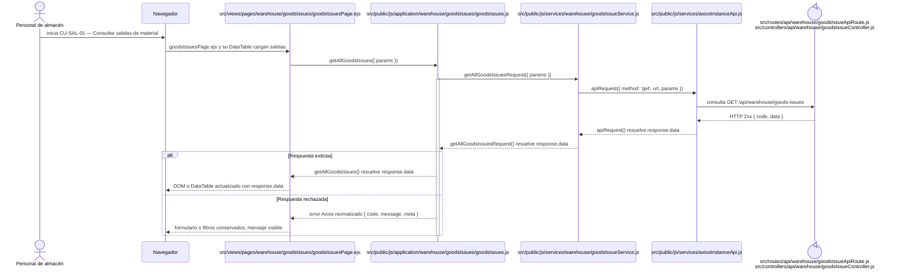

# `CU-SAL-01` — Consultar salidas de material

**Patrones:** `FE-P05`.

```mermaid
sequenceDiagram
    actor Initiator as Personal de almacén
    participant Browser as Navegador
    participant View as src/views/pages/warehouse/goodsIssues/goodsIssuesPage.ejs
    participant Application as src/public/js/application/warehouse/goodsIssues/goodsIssues.js
    participant Request as src/public/js/services/warehouse/goodsIssueService.js
    participant HTTP as src/public/js/services/axiosInstanceApi.js
    participant Transport@{ "type": "control" } as src/routes/api/warehouse/goodsIssueApiRoute.js<br/>src/controllers/api/warehouse/goodsIssueController.js

    Initiator->>Browser: inicia CU-SAL-01 — Consultar salidas de material
    Browser->>View: goodsIssuesPage.ejs y su DataTable cargan salidas
    View->>Application: getAllGoodsIssues({ params })
    Application->>Request: getAllGoodsIssuesRequest({ params })
    activate Application
    Request->>HTTP: apiRequest({ method: 'get', url, params })
    HTTP->>Transport: consulta GET /api/warehouse/goods-issues
    Transport-->>HTTP: HTTP 2xx { code, data }
    HTTP-->>Request: apiRequest() resuelve response.data
    Request-->>Application: getAllGoodsIssuesRequest() resuelve response.data
    alt Respuesta exitosa
        Application-->>View: getAllGoodsIssues() resuelve response.data
        View-->>Browser: DOM o DataTable actualizado con response.data
    else Respuesta rechazada
        Application-->>View: error Axios normalizado { code, message, meta }
        View-->>Browser: formulario o filtros conservados, mensaje visible
    end
    deactivate Application
```

