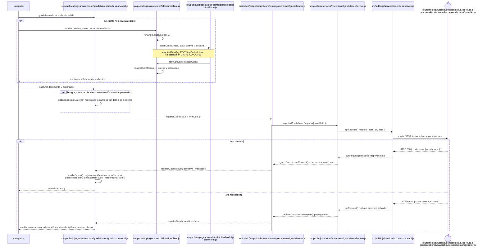

# `CU-SAL-02` — Crear salida de material

**Patrones:** `FE-P05`.

```mermaid
sequenceDiagram
    participant Browser as Navegador
    participant View as src/public/js/pages/warehouse/goodsIssues/goodsIssueModal.js
    participant ClientSelect as src/public/js/plugins/select2/domains/client.js
    participant ClientModal as src/public/js/pages/sales/clients/clientModal.js<br/>clientForm.js
    participant Application as src/public/js/application/warehouse/goodsIssues/goodsIssues.js
    participant Request as src/public/js/services/warehouse/goodsIssueService.js
    participant HTTP as src/public/js/services/axiosInstanceApi.js
    participant Transport@{ "type": "control" } as src/routes/api/warehouse/goodsIssueApiRoute.js<br/>src/controllers/api/warehouse/goodsIssueController.js

    Browser->>View: goodsIssueModal.js abre la salida
    opt El cliente no está catalogado
        Browser->>ClientSelect: escribir nombre y seleccionar Nuevo cliente
        ClientSelect->>ClientSelect: runAfterSelect2Close(...)
        ClientSelect->>ClientModal: openClientModal({ data: { name }, onSave })
        Note over ClientModal,ClientSelect: registerClient() y POST /api/sales/clients<br/>se detallan en DIA-FE-CU-CAT-06
        ClientModal->>ClientSelect: form.onSave(createdClient)
        ClientSelect->>ClientSelect: toggleClientOption(...) agrega y selecciona
        ClientSelect-->>Browser: continuar salida sin abrir /clientes
    end
    Browser->>View: capturar documento y materiales
    alt Se agrega otra vez la misma combinación material-proveedor
        View->>View: addGoodsIssueMaterial() reemplaza la cantidad del detalle coincidente
    end
    View->>Application: registerGoodsIssue({ formData })
    Application->>Request: registerGoodsIssueRequest({ formData })
    activate Application
    Request->>HTTP: apiRequest({ method: 'post', url, data })
    HTTP->>Transport: envía POST /api/warehouse/goods-issues
    alt Alta resuelta
        Transport-->>HTTP: HTTP 200 { code, data: { goodsIssue } }
        HTTP-->>Request: apiRequest() resuelve response.data
        Request-->>Application: registerGoodsIssueRequest() resuelve response.data
        Application-->>View: registerGoodsIssue() devuelve { message }
        View->>View: handleSubmit(...) ejecuta notifications.showSuccess,<br/>closeModal(form) y reloadMainTable({ resetPaging: true })
        View-->>Browser: modal cerrado y #table recargada
    else Alta rechazada
        Transport-->>HTTP: HTTP error { code, message, meta }
        HTTP-->>Request: apiRequest() rechaza error normalizado
        Request-->>Application: registerGoodsIssueRequest() propaga error
        Application-->>View: registerGoodsIssue() rechaza
        View-->>Browser: useForm conserva goodsIssueForm y handleApiError muestra el error
    end
    deactivate Application
```
